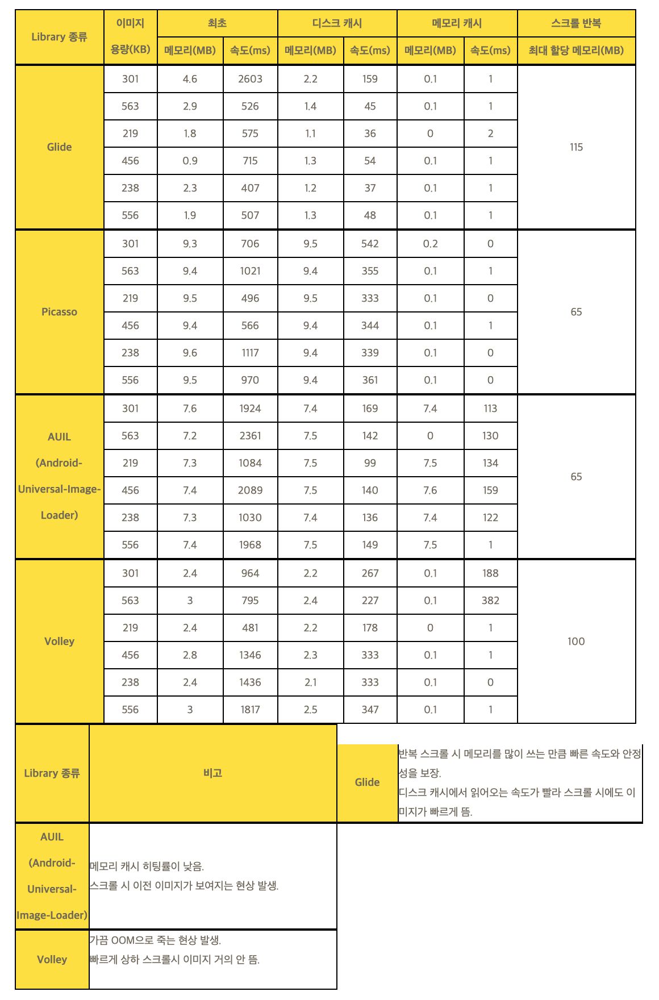

## 📌 안드로이드 이미지 로딩 라이브러리


### ✔ ImageView 사용 

1. 안드로이드 앱 안의 drawable폴더의 리소스를 보여주는 경우
2. 안드로이드 디바이스 안에 저장되어있는 사진을 보여주는 경우(갤러리 혹은 기타 내부 사진)
3. 이미지 URL을 로드해서 보여주고자 하는 경우

- 1,2번의 경우는 안드로이드 기기 내부의 리소스를 불러오는 작업이므로 예외사항도 적고 실제 구현도 복잡하지 않습니다.
그러나 3번처럼 이미지의 URL인 경우 http클라이언트를 이용해서 ImageView에 보여주어야 하는경우는 고려해야할 사항이 많습니다.   
    => 로딩 실패처리, 재시도처리, Out of Memory, 캐시,병렬처리, 디코딩, 이미지재활용 등등

 
> 💡 요약하면, 이미지 로딩을 구현할 때는 HTTP 통신을 안정되게 구현하고, 비트맵으로 디코딩하면서 메모리가 넘치거나 새지 않도록 주의해야 한다. 하지만, 네트워크 호출과 디코딩은 단순히 백그라운드 스레드에서 동작하는 것만으로는 충분하지 않고 더 적극적으로 병렬성을 활용해야 한다. 화면 회전, 전환, 스크롤 때 반복적인 요청이 가지 않도록 이미지를 캐시하고, 불필요해진 요청은 빠른 시점에 취소해서 더 나은 UI 반응을 제공하면서 자원을 절약해야 한다. 이 과제들을 모두 해결하려다 보면 처리 흐름은 복잡해지고, 비슷한 코드가 반복되기 쉽다.
그래서 우리는 이러한 문제들을 미리 다 해결해둔 이미지 로딩 라이브러리를 사용하는 이다.


### 1. [Universal Image Loader(UIL)](https://github.com/nostra13/Android-Universal-Image-Loader)

- 아래 3개의 이미지 로딩 라이브러리 이전에 가장 많이 쓰이던 라이브러.
- 가장 많이 쓰였기 때문에 기능이나 오류에 관련된 자료들을 쉽게 찾아볼 수 있음.
- 여러가지 Custom하게 변경할수있도록 많은 옵션을 제공합니다.

    #### ✔ Example Code
    ```java
    DisplayImageOptions options = new DisplayImageOptions.Builder() 
                                                        .cacheInMemory() 
                                                        .cacheOnDisc() 
                                                        ... 
                                                        .build(); 
    ImageLoader.getInstance().displayImage(imageUrl, imageView, options);
    ```


<br><br>


### 2. [Picasso](http://square.github.io/picasso/)

- UIL 이후에 최근에 가장 널리 쓰이고있는 이미지 로딩 라이브러리.
- Okhttp, Retrofit 등등의 유명한 라이브러리를 만든 회사인 Square에서 만들었음.
- 별다른 설정 작업 없이 직관적으로 함수를 호출해 사용할 수 있으므로 편리.

    #### ✔ Example Code

    ```java
    Picasso.with(context).load(imageUrl).resize(30, 30).into(imageView);
    ```


<br><br>


### 3. [Glide](https://github.com/bumptech/glide)

- Google에서 개발해서 밀고있던 volly이후에 2014년에 공개된 라이브러리입니다.
- Bump앱을 구글이 인수하면서 bump앱에서 사용하던 이미지 라이브러리를 공개한것이 이 Glide입니다다.
- 기존의 Picasso에서 사용하는 함수 방식과 거의 비슷합니다(일부 함수를 빼고는 거의 똑같다고 봐도 좋습니다.)
- 다른 이미지 로딩 라이브러리에는 없는 썸네일 보기, GIF 로딩, 동영상 스틸 보기 기능까지 지원합니다.

### 3-1. Gilde 사용방법

#### 1) Gradle 추가

```java
implementation 'com.github.bumptech.glide:glide:4.9.0'
annotationProcessor 'com.github.bumptech.glide:compiler:4.9.0'
```


#### 2) 사용법

```java
Glide.with(this).load("http://www.selphone.co.kr/homepage/img/team/3.jpg").into(imageView);
```


#### 3) 유용한 함수

- override()   
: 지정한 이미지의 크기만큼만 불러올수 있습니다. 이를 통해 이미지 로딩 속도를 최적화 할수있습니다.
  #### ✔ Example Code

    ```java
    Glide.with(this)
        .load("이미지 url...")
        .override(이미지 사이즈) // ex) override(600, 200)
        .into(imageView);
    ```


- placeholder()   
: 이미지를 로딩하는동안 처음에 보여줄 placeholder이미지를 지정할 수 있습니다.
  #### ✔ Example Code

    ```java
    Glide.with(this)
        .load("이미지 url...")
        .placeholder(로딩 이미지) // ex) placeholder(R.drawable.loading)
        .into(imageView)
    ```  
  
- error()   
: 이미지로딩에 실패했을경우 실패 이미지를 지정할 수 있습니다.
  #### ✔ Example Code

    ```java
    Glide.with(this)
        .load("이미지 url...")
        .error(실패 이미지) // ex) error(R.drawable.error)
        .into(imageView)
    ```  

- asGif()   
: 정적인 이미지 뿐만 아니라 GIF도 로딩할수 있습니다.
  #### ✔ Example Code

    ```java
    Glide.with(this)
        .load("이미지(GIF) url...")
        .into(imageView)
        .asGif()
    ```
  
- thumbnail()   
  : 지정한 % 비율 만큼 미리 이미지를 가져와서 보여줍니다. 0.1f로 지정했다면 실제 이미지 크기중 10%만 먼저 가져와서 흐릿하게 보여줍니다.


<br><br>


### 4. [Fresco](http://frescolib.org/index.html)

- facebook에서 공개한 이미지 라이브러리입니다.
- 4개의 라이브러리 중에서 가장 최근에 공개됨. (2015.03)
- 다만, 비교적 최근에 공개된 라이브러리라서 레퍼런스도 적고 Fresco의 ImageView를 사용해아 한다는 것이 단점.   
     
    #### ✔ Example Code
    
    - layout
        ```xml
        <LinearLayout
        xmlns:android="http://schemas.android.com/apk/res/android"
        xmlns:fresco="http://schemas.android.com/apk/res-auto">
        
        <com.facebook.drawee.view.SimpleDraweeView
        android:id="@+id/my_image_view"
        android:layout_width="200dip"
        android:layout_height="200dip"
        fresco:placeholderImage="@drawable/my_drawable" />
        
        </LinearLayout>
        ```
    
    - view
        ```java
        Fresco.initialize(this);
        setContentView(R.layout.activity_main);
        
        SimpleDraweeView simpleDraweeView = (SimpleDraweeView)findViewById(R.id.my_image_view);
        simpleDraweeView.setImageURI(Uri.parse("http://www.url.com/image.png"));
        ```


<br><br>


### ✔ 다른 라이브러리들과의 성능 비교



- 메모리, 속도 값은 총 6장의 이미지를 리스트뷰에 띄우는 방식으로 3회 진행하여 평균값으로 계산.
- 반복 스크롤 부분은 50장 정도의 이미지를 리스트뷰에 띄웠고 메모리를 정리하기 직전 최대 사용량을 구한 것.


## ✨ Reference ✨

- [https://gun0912.tistory.com/17](https://gun0912.tistory.com/17)
- [https://velog.io/@rjsdnqkr1/Glide-%EB%9D%BC%EC%9D%B4%EB%B8%8C%EB%9F%AC%EB%A6%AC-%EC%82%AC%EC%9A%A9%ED%95%98%EA%B8%B0-yuk1fmwzo1](https://velog.io/@rjsdnqkr1/Glide-%EB%9D%BC%EC%9D%B4%EB%B8%8C%EB%9F%AC%EB%A6%AC-%EC%82%AC%EC%9A%A9%ED%95%98%EA%B8%B0-yuk1fmwzo1)
