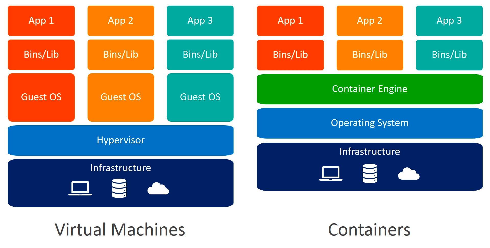

## 📍 도커란?
- 다양한 데이터 또는 프로그램을 각각 독립된 환경에 격리시키는 기능을 제공하는 소프트웨어
- 컨테이너를 다루는 기능을 제공하는 소프트웨어
- 도커의 경우 리눅스 운영체제에서 사용하는 것을 전제로 만들어졌기 때문에 반드시 리눅스 운영체제가 필요함. 내부 컨테이너가 실행되는 환경도 리눅스.
- `도커 엔진(Docker Engine)` : 도커 소프트웨어의 본체. 도커 엔진이 있어야 컨테이너를 생성하고 실행시킬 수 있음.
- `이미지(image)` : 운영체제 배포에 널리 쓰이던 iso 파일과 같이 컨테이너의 환경을 image file로 담을 수 있음. 컨테이너 생성을 위해 반드시 필요.

 

## 📍 도커와 같은 소프트웨어를 사용해 데이터나 프로그램을 독립된 환경에 격리해야 하는 이유 
- 소프트웨어는 거의 단일 프로그램이 아니라 여러 개의 프로그램으로 구성된 경우가 많음. 이 경우, 특정한 폴더나 디렉토리를 공유하게 되거나 같은 경로에 설정 정보를 저장하게 됨.
  만약 하나의 프로그램을 일련의 이유로 업데이트하게 되면, 여러 개의 프로그램에 동시에 영향이 끼치게 되는 경우가 존재함.
- 위와 같이 공유하는 프로그램, 파일, 라이브러리 등을 한개의 프로그램만을 위해 수정하게 되면 오류가 발생할 가능성이 있으므로
  프로그램별로 독립된 환경을 구축하여 격리시키는 것은 위와 같은 오류를 방지할 수 있음.
- 도커 컨테이너를 사용해 프로그램을 격리하면 여러 프로그램이 한 서버에 실행되면서 발생하는 문제 대부분을 해결할 수 있음.
  또한, 완전히 독립된 환경이므로 여러 컨테이너에서 같은 프로그램을 실행할 수 있으며, 버전은 상관 없음.

 

### 📍 컨테이너 vs 가상화

- 가상화(Virtualization) 기술은 메인보드, CPU, Memory 등 하드웨어의 물리적인 부품을 소프트웨어로 구현한 것이다. 
  그러므로 운영체제 종류에 구애받지 않고 생성이 가능하며, 소프트웨어 사용도 비교적 도커보다 자유롭다.    
  ex) VMware, VirtualBox
- 하지만 컨테이너(Container)는 운영체제의 일부 기능을 호스트 컴퓨터에 의존하기 때문에 물리 서버에도 리눅스 기능이 필요하며, 컨테이너의 내용도 리눅스 운영체제가 되어야 한다.   
  ex) Docker

 

### 💎 Reference
- [https://dydtjr1128.gitbook.io/understanding-docker/1.start-docker/1-starting-docker](https://dydtjr1128.gitbook.io/understanding-docker/1.start-docker/1-starting-docker)
