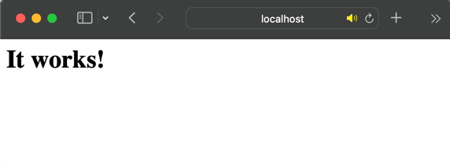

## 📍 컨테이너와 호스트 사이에 파일 복사
- 컨테이너 >> 호스트, 호스트 >> 컨테이너로 파일을 복사하는 방법 (양방향 모두 가능)

```shell
# 컨테이너로 파일을 복사하는 커멘드 (호스트 -> 컨테이너)
$ docker cp [호스트 경로] 컨테이너_이름:컨테이너_경로

# 호스트로 파일을 복사하는 커맨드 (컨테이너 -> 호스트)
$ docker cp 컨테이너_이름:컨테이너_경로 호스트_경로

# 일반 파일 복사 명령어 (컨테이너 내부)
$ docker cp 원본_경로 복사할_경로
```

### 예시 실습

#### 1. 실습에 쓰일 html 파일 생성
```html
<!-- index.html -->
<html>
	<meta charset="utf-8"/>
	<body>
		<div> 안녕하세요 ! </div>
	</body>
</html>
```


#### 2. 아파치 컨테이너 생성
```shell
$ docker run --name apa000ex19 -d -p 8089:80 httpd
Unable to find image 'httpd:latest' locally
latest: Pulling from library/httpd
b85a868b505f: Pull complete 
f05e6391d558: Pull complete 
95901502a360: Pull complete 
2ea5a609d7db: Pull complete 
3974bb700c53: Pull complete 
Digest: sha256:886f273536ebef2239ef7dc42e6486544fbace3e36e5a42735cfdc410e36d33c
Status: Downloaded newer image for httpd:latest
d81d2398364a6eb4ac9c1f77bb0896b6ca080779cf1a50a71ec616c7d442001a

$ docker ps
CONTAINER ID   IMAGE     COMMAND              CREATED          STATUS          PORTS                  NAMES
d81d2398364a   httpd     "httpd-foreground"   47 seconds ago   Up 45 seconds   0.0.0.0:8089->80/tcp   apa000ex19

```

#### 3. `localhost:8089` 접속해 컨테이너 정상 기동 확인


#### 4. 예시 html 파일을 container로 복사
```shell
# MAC 현재 경로가 index.html 파일이 있는 디렉토리였습니다. (절대경로 뿐만 아니라 상대경로도 cp 명령어 수행에 전혀 문제가 없음)
$ docker cp ./index.html apa000ex19:/usr/local/apache2/htdocs

```

#### 5. 복사 후 다시 `localhost:8089` 접속


#### 6. 컨테이너에 복사한 파일을 다시 호스트로 복사
```shell
$ docker cp apa000ex19:/usr/local/apache2/htdocs/index.html /Users/jingni/docs

# 정상 복사 확인
$ ll /Users/jingni/docs          
total 8
drwxr-xr-x  21 jingni  staff   672B  6 11 02:19 TIL
-rw-r--r--   1 jingni  staff    90B  7  2 16:16 index.html
```

<br>

## 📍 볼륨 마운트

> 데이터 퍼시스턴시 (Data persistency)
- 데이터를 옮기는 작업 대신 처음부터 외부에 데이터를 두고 이 데이터에 접근해 사용하는 것
- 데이터를 보관하는 장소는 먀운트된 스토리지 영역

> 볼륨이란 ? 
- 스토리지의 한 영역을 분할한 것

> 마운트란 ? 
- 대상을 연결해 운영체제 또는 소프트웨어의 관리 하에 두는 일 ex) USB 연결
   
1. 바인드 마운트
    - 도커가 설치된 컴퓨터의 문서 폴더 또는 바탕화면 폴더 등 도커 엔진에서 관리하지 않는 영역의 기존 디렉터리를 컨테이너에 마운트하는 방식.   
      디렉터리가 아닌 파일 단위로도 마운트가 가능해 컨테이너와 파일을 연동하는데 많이 사용됨.
    - LAMP 스택을 실무에 활용할 때는 필수적
    - 폴더 속에 파일을 직접 두거나 열어볼 수 있기 때문에 자주 사용하는 파일을 두는 데 사용함.
   
2. 볼륨 마운트
    - 운영체제와 무관하게 똑같은 방식으로 파일을 다룰 수 있다.
    - 도커 엔진이 관리하는 영역 내에 만들어진 볼륨을 컽네이너에 디스크 형태로 마운트함.
    - 이름만으로 관리가 가능하므로 다루기 쉽지만 볼륨에 비해 직접 조작하기가 어려워
     **임시 목적의 사용**이나 **자주 쓰이지는 않지만 지우면 안되는 파일을 보관**하는 목적으로 많이 사용함.
    
3. 두 가지 마운트 방식의 차이점
   - 볼륨 마운트는 도커 엔진의 관리 하에 있으므로 사용자가 파일 위치를 신경 쓸 필요가 없다. 
     운영체제에 따라 명령어가 달라지는 등의 의존성 문제도 일어나지 않는다. (환경에 따라 경로가 바뀌는 일이 없다.)
     익숙해지면 손쉽게 사용할 수 있어 도커 제작사에서는 볼륨 마운트 사용을 권장한다.
   - 하지만 볼륨 마운트는 도커 컨테이너를 경유하지 않고 직접 볼륨에 접근할 방법이 없고 볼륨을 강제로 수정하려고 하면 볼륨 자체가 깨질 수 있다. 백업이 복잡하다.
   - 바인드 마운트는 도커가 관리하지 않는 영역 어디라도 파일을 둘 수 있으며, 기존과 동일한 방식으로 파일을 사용할 수 있으므로 다른 소프트웨어를 사용해 쉽게 편집할 수 있다.
     또한, 도커 엔진과 무관하게 파일을 다룰 수 있다.
   - 그러므로 파일을 직접 편집해야 할 일이 많다면 바인드 마운트를 사용하고, 그렇지 않다면 볼륨 마운트를 사용하면 된다.   
    
    

4. 임시 메모리 (tmpfs) 마운트
- 임시 메모리 마운트는 디스크가 아닌 주 메모리 영역을 마운트한다.    
  디스크보다 훨씬 빠른 속도로 읽고 쓰기가 가능하기 때문에 접근 속도를 높일 목적으로 사용하지만 도커 엔진이 정지되거나 호스트가 재부팅하면 소멸한다.
  
<br>

## 📍 스토리지 영역을 만드는 방법
```shell
# 볼륨 생성 (볼륨 마운트)
$ docker volume create [볼륨_이름]

# 지정한 볼륨 삭제
$ docker volume rm [볼륨_이름]

# 볼륨의 상세 정보 출력
$ docker volume inspect

# 볼륨의 목록 출력
$ docker volume ls

# 현재 마운트 되지 않은 볼륨을 모두 삭제
$ docker volume prune

## 스토리지를 마운트하는 커맨드
# 바인드 마운트
$ docker run (생략) -v 스토리지_실제_경로:컨테이너_마운트_경로 (생략)
# 볼륨 마운트
$ docker run (생략) -v 볼륨_이름:컨테이너_마운트_경로 (생략)
```

### 바인드 마운트 실습 예제
#### 1. 디렉터리 생성 및 볼륨 지정해 컨테이너 생성하기
```shell
# 볼륨으로 쓰일 디렉터리를 호스트에 생성한다.
$ mkdir docker_practice

$ ll
total 80
drwxr-xr-x   2 jingni  staff    64B  7  2 18:30 docker_practice

# -v 옵션으로 volume을 지정한다.
$ docker run --name apa000ex20 -d -p 8090:80 -v /[directory_path]/docker_practice:/usr/local/apache2/htdocs httpd
4addd5ddf4a9da28b90cee2ab4ff046ef44453697960beaf295858d66da73e34

```
#### 2. container 동작 확인


```shell
# 생성한 디렉토리 안으로 예시 html 파일을 넣어준다.
$ cp ./index.html ./docker_practice 
```

#### 3. html 파일 적용 확인 (간단하게 기존 html 파일 수정함.)


### 볼륨 마운트 실습 예제
```shell
# 볼륨 생성
$ docker volume create apa000vol1
apa000vol1

# 볼륨 생성 확인
$ docker volume ls
DRIVER    VOLUME NAME
local     apa000vol1

# 볼륨 상세 정보 확인
$ docker volume inspect apa000vol1
[
    {
        "CreatedAt": "2022-07-02T09:43:36Z",
        "Driver": "local",
        "Labels": {},
        "Mountpoint": "/var/lib/docker/volumes/apa000vol1/_data",
        "Name": "apa000vol1",
        "Options": {},
        "Scope": "local"
    }
]

# 컨테이너 생성 및 기동
$ docker run --name apa000ex21 -d -p 8081:80 -v apa000vol1:/usr/local/apache2/htdocs httpd
423da1f4fc96070bb4edcfd0d93c7c169b701ccc4e996d27199d8218e1ba580d

# 컨테이너에 제대로 마운트 되었는지 확인
$ docker container inspect apa000ex21
[
    {
        "Id": "423da1f4fc96070bb4edcfd0d93c7c169b701ccc4e996d27199d8218e1ba580d",
        "Created": "2022-07-02T09:43:36.538768497Z",
        "Path": "httpd-foreground",
        "Args": [],
        ...
        "Mounts": [
            {
                "Type": "volume",
                "Name": "apa000vol1",
                "Source": "/var/lib/docker/volumes/apa000vol1/_data",
                "Destination": "/usr/local/apache2/htdocs",
                "Driver": "local",
                "Mode": "z",
                "RW": true,
                "Propagation": ""
            }
        ],
        ...
    }
]

# 볼륨 삭제 (컨테이너에 이미 마운트된 후에는 삭제되지 않음)
$ docker volume rm apa000vol1
Error response from daemon: remove apa000vol1: volume is in use - [423da1f4fc96070bb4edcfd0d93c7c169b701ccc4e996d27199d8218e1ba580d]

# 마운트되지 않은 볼륨 전체 삭제
$ docker volume prune
WARNING! This will remove all local volumes not used by at least one container.
Are you sure you want to continue? [y/N] y
Deleted Volumes:
033f00fe789ac7f12ee15013fb69cdadb0c35dbb14a62148032c6d277af58bb4
...
b00186ce2ab5024f35548b7bb28edbf4e87c25c2a06eaf13615136b4dbfd753e

Total reclaimed space: 455.9MB

```
<br>