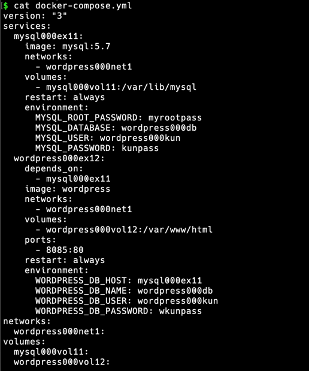

## 📍 도커 컴포즈란?
- 시스템 구축과 관련된 명령어를 하나의 텍스트 파일(정의 파일, Compose File)에 기재해 
  명령어 한번에 시스템 전체를 실행하고 종료와 폐기까지 한번에 하도록 도와주는 도구
- 시스템 구축에 필요한 설정을 YAML(YAML Ain’t a Markup Language) 포맷으로 기재한 정의 파일을 이용해
  전체 시스템을 일괄 실행(run) 또는 종료 및 삭제(down) 할 수 있는 도구
- 도커 컴포즈를 사용하면 여러 개의 명령어를 하나의 정의 파일로 합쳐 실행할 수 있다.
  
### 구조
- 정의 파일(compose file) : 컨테이너나 볼륨을 어떠한 설정으로 만들지에 대한 항목뿐만 아니라 시스템에 대한 모든 정보가 기재됨. 
  작성 내용은 도커 명령어와 비슷하지만 다름.
    - `up` 명령어
        - docker run 커맨드와 비슷
        - 정의 파일에 기재된 내용대로 이미지를 내려받고 컨테이너를 생성 및 실행.
        - 정의 파일에는 네트워크나 볼륨에 대한 정의도 기재할 수 있어서 주변 환경을 한꺼번에 생성 가능함.
    - `down` 명령어
        - 컨테이너와 네트워크를 정지 및 삭제.
        - 볼륨과 이미지는 삭제하지 않음
        - 컨테이너와 네트워크 삭제 없이 종료만 하고 싶다면 stop 커맨드를 사용.
    
- Docker compose vs Dockerfile script vs K8s
    - Docker compose는 docker run 명령어를 여러 개 모아놓은 것과 같으며, 컨테이너와 주변 환경(네트워크, 볼륨 등) 을 한번에 생성할 수 있다.
    - Dockerfile script는 컨테이너가 아닌 이미지를 만들기 위한 도구로, 네트워크나 볼륨같은 컨테이너 주변 환경들은 생성이 불가능하다.
    - k8s는 도커 컨테이너를 관리하는 도구로 도커 컴포즈와 혼동하기 쉬우나 사용 목적 자체가 다르다. 도커 컴포즈로 컨테이너 관리는 불가능하다.

<br>

## 📍 도커 컴포즈의 설치와 사용법

- 도커 컴포즈는 도커 엔진과 별개의 소프트웨어이나 도커 컴포즈로 생성한 컨테이너를 도커 엔진으로 똑같이 관리할 수 있음.
- Window, MacOS의 도커 데스크톱은 도커 컴포즈가 함께 설치되지만, 리눅스에서는 도커 컴포즈와 python3 런타임 및 필요 도구(python3, python3-pip package)를 설치해야 함
    ```shell
    # python 관련 package install (debian 계열 Linux 기준 명령어)
    $ sudo apt install -y python3 python3-pip
    $ sudo pip3 install docker-compose
    ```
- 도커 컴포즈 사용법
    1. 호스트 컴퓨터에 폴더를 만들고 이 폴더에 YAML 파일을 배치함
    2. 정의 파일의 이름은 미리 정해진 docker-compose.yml 이라는 이름을 사용해야 함
       (다른 이름을 사용할 때는 인자로 이름을 지정해줘야 함)
    3. 파일은 호스트 컴퓨터에 배치되지만 명령어는 똑같이 도커 엔진에 전달됨. 즉, 도커 컴포즈가 명령어를 대신 입력해주는 구조.
    4. 만들어진 컨테이너도 동일하게 도커 엔진 위에서 동작함
    5. 정의 파일은 한 폴더에 하나만 있을 수 있음 
        - 여러 개의 정의 파일을 사용하려면 그 개수만큼 폴더를 만들어야 함
        - 이미지 파일이나 HTML 파일도 컴포즈가 사용할 폴더에 함께 둠
    
- 도커 컴포즈에서는 컨테이너가 모인 것을 서비스라고 부르며, 보통 공식 문서에서는 컨테이너와 서비스 두 용어가 혼용되고 있음.

<br>

## 📍 도커 컴포즈 파일을 작성하는 법
- 도커 컴포즈는 정의 파일(compose file)을 그대로 실행하는 역할을 수행하므로 정의 파일이 반드시 필요하다.

> ex1) apa000ex2 컨테이너를 실행하는 명령어와 아파치 컨테이너의 컴포즈 파일
  ```shell
  $ docker run —name apa000ex2 -d -p 8080:80 httpd
  ```

  ```yaml
   version: "3"
  
   services:
      apa000ex2:
        image: httpd
        ports:
          -8080:80
        restart: always
  ```
> ex2) apa000ex2 컨테이너를 실행하는 명령어와 아파치 컨테이너의 컴포즈 파일 
  ```shell
  $ docker run --name wordpress000ex12 -dit --net=wordpress000net1 -p 8085:80 -e WORDPRESS_DB_HOST=mysql000ex11 -e WORDPRESS_DB_NAME=wordpress000db -e WORDPRESS_DB_USER=wordpress000kun -e WORDPRESS_DB_PASSWORD=wkunpass wordpress
  ```

  ```yaml
   version: "3"
  
   services:
     wordpress000ex12:
       depends_on:
         - mysql000ex11
       image: wordpress
       networks:
         - wordpress000net1
       ports:
         - 8080:80
       restart: always
       environment:
         WORDPRESS_DB_HOST=mysql000ex11
         WORDPRESS_DB_NAME=wordpress000db
         WORDPRESS_DB_USER=wordpress000kun
         WORDPRESS_DB_PASSWORD=wkunpas
  ```

- 정의 파일은 YAML 형식을 따름 (파일 확장자는 .yml)
- 파일 이름은 기본적으로 docker-compose.yml로 지정 (다른 이름을 사용할 경우 -f 옵션을 사용해야 지정 가능)

### 컴포즈 파일을 작성하는 방법
- YAML 형식에서는 공백에 따라 의미가 달라지므로 탭은 의미가 없다.
- **‘주 항목 → 이름 추가 → 설정’** 순서로 작성
    - 주 항목
        - services, networks, volumes 등등
      
    - 주 항목 아래에 이름 추가 (공백으로 들여쓰기 필요)
        - 컨테이너 이름, 네트워크 이름, 볼륨 이름
        - 이름 뒤에는 반드시 **콜론(:)**을 붙여야 함
        - 해당 줄에 이어서 컨테이너 설정을 기재하려면 콜론 뒤로 공백이 하나 있어야 함
    - 설정
        - 기재할 내용이 한 가지라면 콜론 뒤에 이어서 작성 **(사이에 공백 필수)**
        - 내용이 여러 개라면 줄을 바꿔 하이픈(-)을 앞에 적고 들여쓰기를 맞춰야 함
        - 하이픈을 앞에 적은 행은 다시 공백을 넣어 들여 써줘야 함

### 컴포즈 파일 (YAML 형식)의 작성 요령
- 첫 줄에 도커 컴포즈 버전을 기재
- 주 항목 services, networks, volumes 아래에 설정 내용을 기재
- 항목 간의 상하 관계는 공백을 사용한 들여쓰기로 나타낸다.
- 들여쓰기는 같은 수의 배수만큼의 공백을 사용한다.
- 이름은 주 항목 아래에 들여쓰기한 다음 기재한다.
- 컨테이너 설정 내용은 이름 아래에 들여쓰기한 다음 기재한다.
- 여러 항목을 기재하려면 줄 앞에 ‘-’를 붙인다.
- 이름 뒤에는 콜론(:)을 붙인다.
- 콜론 뒤에는 반드시 공백이 와야 한다(바로 줄바꿈하는 경우는 예외)
- `#` 뒤의 내용은 주석으로 간주된다.
- 문자열은 작은따옴표(’) 또는 큰따옴표(”)로 감싸 작성한다.
  
### 컴포즈 파일의 항목

 | 항목 | docker run 커맨드의 해당 옵션 또는 인자 | 내용 |
 | --- | --- | --- |
 | version | - | 도커 컴포즈의 버전을 기재한다. |
 | services | - | 컨테이너를 정의한다. **(컨테이너의 집합체를 주로 서비스라고 한다.)** |
 | image | 이미지 인자 | 사용할 이미지를 지정 |
 | networks | —net | 접속할 네트워크를 지정 |
 | volumes | -v, —mount | 스토리지 마운트(볼륨)를 설정 |
 | ports | -p | 포트 설정 |
 | environment | -e | 환경변수 설정 |
 | depends_on | 없음 | 다른 서비스에 대한 의존관계를 정의 |
 | restart | 없음 | 컨테이너 종료 시 재시작 여부를 설정 |
        
- depends_on은 다른 서비스에 대한 의존관계를 나타냄 
    - 컨테이너를 생성하는 순서나 연동 여부를 정의
    - ex. penguin 컨테이너의 정의에 ‘depends_on: -namgeuk” 내용이 포함됐다면 namgeuk 컨테이너를 생성한 다음에 penguin 컨테이너를 만듦
          : 워드프레스처럼 MySQL 컨테이너가 먼저 있어야 하는 경우에 컨테이너 생성 순서를 지정
      
- restart는 컨테이너 종료 시 재시작 여부를 설정함
  
    | 설정값 | 내용 |
    | --- | --- |
    | no | 재시작하지 않는다. |
    | always | 항상 재시작한다. |
    | on-failure | 프로세스가 0 외의 상태로 종료됐다면 재시작한다. |
    | unless-stopped | 종료 시 재시작하지 않음. 그 외에는 재시작한다. |

### 실습 예제
    1. docker-compose.yml 파일 생성 (com_folder 안에)
    2. 주 항목 작성
    3. 이름 작성
    4. MySQL 컨테이너의 정의 작성
    5. 워드 프레스 컨테이너의 정의 작성
    6. 파일 저장



<br>

## 📍 도커 컴포즈 실행
- 도커 컴포즈는 `docker-compose` 명령을 사용
- -f 옵션을 통해 compose file 경로 지정
- `docker-compose up` : 컴포즈 파일에 정의된 컨테이너 및 네트워크와 같은 주변 환경 생성
    - `$ docker-compose -f [정의_파일_경로] up [옵션]`
    
     | 옵션 | 내용 |
     | --- | --- |
     | -d | 백그라운드로 실행 |
     | —-no-color | 화면 출력 내용을 흑백으로 함 |
     | —-no-deps | 링크된 서비스를 실행하지 않음 |
     | —-force-recreate | 설정 또는 이미지가 변경되지 않더라도 컨테이너를 재생성 |
     | —-no-create | 컨테이너가 이미 존재할 경우 다시 생성하지 않음 |
     | —-no-build | 이미지가 없어도 이미지를 빌드하지 않음 |
     | —-build | 컨테이너를 실행하기 전에 이미지를 빌드 |
     | —-absort-on-container-exit | 컨테이너가 하나라도 종료되면 모든 컨테이너를 종료 |
     | -t, —timeout | 컨테이너를 종료할 떄의 타임아웃 설정, 기본은 10초 |
     | —-remove-orphans | 컴포즈 파일에 정의되지 않은 서비스의 컨테이너를 삭제 |
     | —-scale | 컨테이너의 수를 변경 |
  
- `docker-compose down` : 생성 된 컨테이너와 네트워크를 종료하고 삭제
    - `$ docker-compose -f [컴포즈_파일_경로] down [옵션]`
    
    | 옵션 | 내용 |
    | --- | --- |
    | —-rmi 종류 | 삭제 시에 이미지도 삭제한다. 종류를 all로 지정하면 사용했던 모든 이미지가 삭제된다. local로 지정하면 커스텀 태그가 없는 이미지만 삭제한다. |
    | -v, —volumes | volumes 항목에 기재된 볼륨을 삭제한다. 단, external로 지정된 볼륨은 삭제되지 않는다. |
    | —-remove-orphans | 컴포즈 파일에 정의되지 않은 서비스의 컨테이너도 삭제한다. |
  
- `docker-compose stop` : 컨테이너를 종료
    - `$ docker-compose -f [컴포즈_파일_경로] stop [옵션]`
    
- `docker-compose [명령어] -d`
  - -d 옵션을 붙이고 경로 정의 없이 도커 컴포즈 명령어를 실행하면 현재 작업 디렉터리를 컴포즈용 폴더로 사용할 수 있다.
    
- --scale 옵션
  - 같은 구성의 컨테이너를 여러 세트 만들고 싶은 경우 사용할 수 있는 옵션.

### 실습 예제
  ```shell
  $ docker-compose up -d 
    Creating network "com_folder_wordpress000net1" with the default driver
    Creating volume "com_folder_mysql000vol11" with default driver
    Creating volume "com_folder_wordpress000vol12" with default driver
    Pulling mysql000ex11 (mysql:5.7)...
    5.7: Pulling from library/mysql
    66fb34780033: Pull complete
    4b7eaab7220f: Pull complete
    ...
    f8575f2324da: Pull complete
    b4c26cf54614: Pull complete
    Digest: sha256:4279d155f8cab19149c6078b20d53976f1498e31d6f848ac83e11323909b41f1
    Status: Downloaded newer image for mysql:5.7
    Pulling wordpress000ex12 (wordpress:)...
    latest: Pulling from library/wordpress
    b85a868b505f: Already exists
    78fdfd2598e0: Pull complete
    26769c8659f4: Pull complete
    0bd105fadbe3: Pull complete
    cec5cceb91d7: Pull complete
    ca31293bb368: Pull complete
    ...
    b6a172e68ef0: Pull complete
    d251d6673035: Pull complete
    62b30aea4447: Pull complete
    9b5a3cabe1fe: Pull complete
    df30812aac94: Pull complete
    Digest: sha256:1134d9db6eccc6fdca73176e5ffed7b5516638a9ed36169d21e2692495e8fe2f
    Status: Downloaded newer image for wordpress:latest
    Creating com_folder_mysql000ex11_1 ... done
    Creating com_folder_wordpress000ex12_1 ... done

  $ docker ps
    CONTAINER ID   IMAGE       COMMAND                  CREATED          STATUS         PORTS                  NAMES
    477023ba29c6   wordpress   "docker-entrypoint.s…"   4 seconds ago    Up 3 seconds   0.0.0.0:8085->80/tcp   com_folder_wordpress000ex12_1
    3aaa8e52d2eb   mysql:5.7   "docker-entrypoint.s…"   11 seconds ago   Up 3 seconds   3306/tcp, 33060/tcp    com_folder_mysql000ex11_1

  $ docker network ls
    NETWORK ID     NAME                          DRIVER    SCOPE
    19e014ef7475   bridge                        bridge    local # pre_defined network 
    c6c78f97b7fb   com_folder_wordpress000net1   bridge    local
    94cf1f2451f9   host                          host      local # pre_defined network 
    28a2d696c023   none                          null      local # pre_defined network 

  $ docker volume ls
    DRIVER    VOLUME NAME
    local     com_folder_mysql000vol11
    local     com_folder_wordpress000vol12
    
  $ docker-compose stop   
    [+] Running 2/2
     ⠿ Container com_folder_mysql000ex11_1      Stopped                                                                                                          1.8s
     ⠿ Container com_folder_wordpress000ex12_1  Stopped
     
  $ docker ps -a
    CONTAINER ID   IMAGE            COMMAND                  CREATED         STATUS                       PORTS                  NAMES
    477023ba29c6   wordpress        "docker-entrypoint.s…"   6 minutes ago   Exited (0) 20 seconds ago                           com_folder_wordpress000ex12_1
    3aaa8e52d2eb   mysql:5.7        "docker-entrypoint.s…"   6 minutes ago   Exited (0) 19 seconds ago                           com_folder_mysql000ex11_1
  
  $ docker-compose down
    Removing com_folder_wordpress000ex12_1 ... done
    Removing com_folder_mysql000ex11_1     ... done
    Removing network com_folder_wordpress000net1 ## 네트워크만 삭제됨. 볼륨과 이미지는 그대로.
    
  $ docker ps -a
  CONTAINER ID   IMAGE            COMMAND                  CREATED      STATUS                        PORTS                  NAMES

  ```