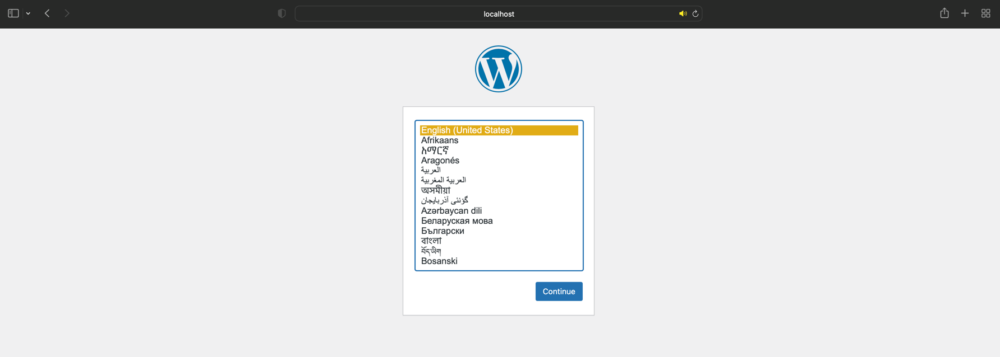
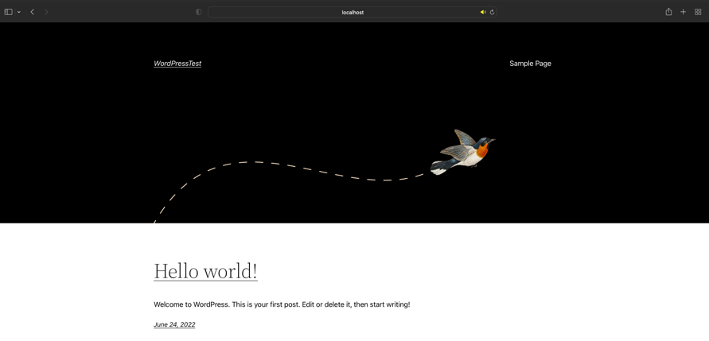
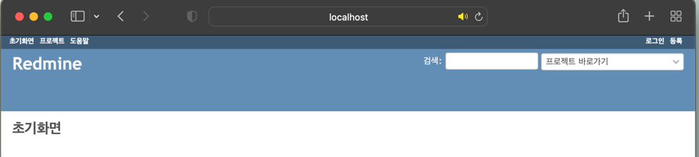

## 📍 도커 네트워크 생성/삭제
- docker network create [network name]
    - 도커 네트워크를 생성하는 명령어
    
- docker network rm [network_name]
    - 도커 네트워크를 삭제하는 명령어
    
<br>

## 📍 Wordpress & MySQL 컨테이너 생성과 연동

```shell
$ docker network create wordpress000net1
765faced5e4bda03a643381cafdae59936c4edad4c3fd3dada2cfca0e8984f55

$ docker run --name mysql000ex11 -dit --net=wordpress000net1 -e MYSQL_ROOT_PASSWORD=myrootpass -e MYSQL_DATABASE=wordpress000db -e MYSQL_USER=wordpress000kun -e MYSQL_PASSWORD=wkunpass mysql --character-set-server=utf8mb4 --collation-server=utf8mb4_unicode_ci --default-authentication-plugin=mysql_native_password
Unable to find image 'mysql:latest' locally
latest: Pulling from library/mysql
824b15f81d65: Pull complete 
c559dd1913db: Pull complete 
...
5a172dc2c4c7: Pull complete 
d800b83bd024: Pull complete 
b20e07df03fa: Pull complete 
22e8ad187ab6: Pull complete 
Digest: sha256:bed914af3f2dea400c4bc83136d6b3a8cf7edcf96f5c08bbbdec8a10cc021a5d
Status: Downloaded newer image for mysql:latest
61ef7cdca5a5b8acb325f823606b693f337e8e394a168256754268692908c2a5

$ docker run --name wordpress000ex12 -dit --net=wordpress000net1 -p 8085:80 -e WORDPRESS_DB_HOST=mysql000ex11 -e WORDPRESS_DB_NAME=wordpress000db -e WORDPRESS_DB_USER=wordpress000kun -e WORDPRESS_DB_PASSWORD=wkunpass wordpress 
Unable to find image 'wordpress:latest' locally
latest: Pulling from library/wordpress
b85a868b505f: Pull complete 
78fdfd2598e0: Pull complete 
26769c8659f4: Pull complete 
0bd105fadbe3: Pull complete 
cec5cceb91d7: Pull complete 
ca31293bb368: Pull complete 
... 
62b30aea4447: Pull complete 
9b5a3cabe1fe: Pull complete 
df30812aac94: Pull complete 
Digest: sha256:51229c98cc467a6e112aa30886a037e7aac7b04e424b39ef3f9c606aa8a51904
Status: Downloaded newer image for wordpress:latest
083088d87cfeaed8ea4d2251051785ecd1704669c5fc181e125f72c2e3ccaeb8

$ docker ps
CONTAINER ID   IMAGE       COMMAND                  CREATED              STATUS              PORTS                  NAMES
083088d87cfe   wordpress   "docker-entrypoint.s…"   About a minute ago   Up About a minute   0.0.0.0:8085->80/tcp   wordpress000ex12
61ef7cdca5a5   mysql       "docker-entrypoint.s…"   3 minutes ago        Up 3 minutes        3306/tcp, 33060/tcp    mysql000ex11
```
- wordpress 접속 및 테스트 (`http://localhost:8085`)





```shell
$ docker stop wordpress000ex12 mysql000ex11
wordpress000ex12
mysql000ex11

$ docker rm 08 61
08
61

$ docker ps
CONTAINER ID   IMAGE     COMMAND   CREATED   STATUS    PORTS     NAMES

$ docker rmi wordpress mysql
Untagged: wordpress:latest
Untagged: wordpress@sha256:51229c98cc467a6e112aa30886a037e7aac7b04e424b39ef3f9c606aa8a51904
Deleted: sha256:8d2a3b437bc804e0ff45b0f0e153b807ab808184de9e9d3678830515197da2a4
Deleted: sha256:79430b137ea3f28e6ff5ac3cef2e2da0e23437023b73babe83a901c0272ca638
Deleted: sha256:47e4be1294453c97a6fa67f68583c0b8b068fd668d52345b3a97cb5a755ad3e9
Deleted: sha256:d6c1bc2b3c9fb06b4883769079baa9a42f97ae3b55e09fb34dcf68de4e61048a
...
Deleted: sha256:535f3bd0a7e476fc38d884fb477108bd2f9de773521468a913578f6edcc531d5
Deleted: sha256:89658e31d9ca51384f48b28db141f4dc6b986a066f2f06b4b9904f523d280a4a
Deleted: sha256:5fe550058560cd6a9d3a5edc667087211c9b019a125baee2b2e21e2497515bbe
Deleted: sha256:7d0c5842511b27725d807428c08ab79f64e19690f6c47796b741f9ab9801b6cf
Deleted: sha256:2cfe90f4544c1e1219de69c573574e52b9cb5d4754ba2b72ccd6843ff15bf9cc
Deleted: sha256:0771a0b014c1f82f213d301e2c534009a0a2292ceab52e7725a045b4419af57d
Deleted: sha256:08249ce7456a1c0613eafe868aed936a284ed9f1d6144f7d2d08c514974a2af9
Untagged: mysql:latest
Untagged: mysql@sha256:bed914af3f2dea400c4bc83136d6b3a8cf7edcf96f5c08bbbdec8a10cc021a5d
Deleted: sha256:968083d5be3605e3b447838e3688ba43cfc297f9a6dec9c708389cfcfc36a080
...

$ docker image ls
REPOSITORY   TAG       IMAGE ID   CREATED   SIZE
```

<br>

## 📍 LAMP 스택
- Apache + PHP + MySQL + Linux 를 합친 조합을 일컫는 말
- 리눅스 + 웹 서버 + 프로그래밍 언어 런타임 + 데이터베이스 조합

<br>

## 📍 레드마인 & MariaDB 컨테이너 생성 및 연동
- 레드마인은 Jira와 비슷한 기능의 오픈소스 소프트웨어
- 협업 시 업무 분담의 편리성과 프로젝트 관리 용이성을 위해 많이 사용한다.

```shell
$ docker network create redmine000net2
4d1e5a02888f942c910d4f1889f8a5a8591ab05c49b44cbc9d8f8c43facc9e31

$ docker run --name mysql000ex13 -dit --net redmine000net2 -e MYSQL_ROOT_PASSWORD=myrootpass -e MYSQL_DATABASE=redmine000db -e MYSQL_USER=redmine000kun -e MYSQL_PASSWORD=rkunpass mysql --character-set-server=utf8mb4 --collation-server=utf8mb4_unicode_ci --default-authentication-plugin=mysql_native_password
Unable to find image 'mysql:latest' locally
latest: Pulling from library/mysql
824b15f81d65: Pull complete 
c559dd1913db: Pull complete 
...
5a172dc2c4c7: Pull complete 
d800b83bd024: Pull complete 
b20e07df03fa: Pull complete 
22e8ad187ab6: Pull complete 
Digest: sha256:bed914af3f2dea400c4bc83136d6b3a8cf7edcf96f5c08bbbdec8a10cc021a5d
Status: Downloaded newer image for mysql:latest
aa4810e5008b975f14b48cd42c7b3407eda8500a8bbf26585f38d7f8a3a31f8f

$ docker run -dit --name redmine000ex14 --network redmine000net2 -p 8086:3000 -e REDMINE_DB_MYSQL=mysql000ex13 -e REDMINE_DB_DATABASE=redmine000db -e REDMINE_DB_USERNAME=redmine000kun -e REDMINE_DB_PASSWORD=rkunpass redmine
Unable to find image 'redmine:latest' locally
latest: Pulling from library/redmine
b85a868b505f: Pull complete 
2b32e2eb2b46: Pull complete 
1beb6afb9303: Pull complete 
...
17978dcb3d35: Pull complete 
196398837382: Pull complete 
2f0e4700edde: Pull complete 
0a3358ba8543: Pull complete 
Digest: sha256:295cdbc43d440360ab947bcab8770d98521adad29dceba52d6d3e7898f149060
Status: Downloaded newer image for redmine:latest
c4a652b5ac214ff99843f2640eb3032ad05e1e5f4ae5651cdaee0444c78e4f0a

$ docker ps
CONTAINER ID   IMAGE     COMMAND                  CREATED         STATUS         PORTS                    NAMES
89f50c1090b8   redmine   "/docker-entrypoint.…"   3 seconds ago   Up 2 seconds   0.0.0.0:8086->3000/tcp   redmine000ex14
aa4810e5008b   mysql     "docker-entrypoint.s…"   7 minutes ago   Up 7 minutes   3306/tcp, 33060/tcp      mysql000ex13
```
- redmine 초기 화면 접속 및 테스트 (`http://localhost:8086`)



```shell
$ docker stop f9 aa
f9
aa  

$ docker rm f9 aa
f9
aa

$ docker ps
CONTAINER ID   IMAGE     COMMAND   CREATED   STATUS    PORTS     NAMES

$ docker image ls
REPOSITORY   TAG       IMAGE ID       CREATED        SIZE
redmine      latest    746ef52020b2   17 hours ago   595MB
mysql        latest    968083d5be36   40 hours ago   524MB

$ docker rmi redmine mysql
Untagged: redmine:latest
Untagged: redmine@sha256:295cdbc43d440360ab947bcab8770d98521adad29dceba52d6d3e7898f149060
Deleted: sha256:746ef52020b219887a0961f86151ccb2554d2ce29143f5c48e03cbb9d68c8608
Deleted: sha256:44f5814939460f0bcf07edb686bdb05c571cb1c0efb75533531fa782338e7bf1
...
Deleted: sha256:04da9678e0bfbe37f354d19dd8081603e6d971cc0f78a0b6fe704642cd4d8f4d
Deleted: sha256:24d82f08cd188369b65622492e1cf3cf8964209b20a9f2467d9c4241bf8d83e4
Deleted: sha256:08249ce7456a1c0613eafe868aed936a284ed9f1d6144f7d2d08c514974a2af9
Untagged: mysql:latest
Untagged: mysql@sha256:bed914af3f2dea400c4bc83136d6b3a8cf7edcf96f5c08bbbdec8a10cc021a5d
...
Deleted: sha256:9fcadff984b617da680bcaff608819d28c550a111552e081d447d58064dbd697
Deleted: sha256:6711a10388f48ae0bfed91f7a72a24944d5c8c76be2d69667fd9d22848a417e6
Deleted: sha256:213f68209a99da399858ec3ca9a4e3d331b7cded5c43bbc27e3adaa916caa9c8
Deleted: sha256:893dd0d26de3f7c4ca8a19ccf3dd75b27f259d105e059c37ad1eaadbbe21f52f
Deleted: sha256:6890009cd8a84c97eb3ccda36e7744db60b83299ee55d9afd0503bbe7158d61d
Deleted: sha256:12cbeae4614778898f69759c898f4128f6e9c894e4895ee12297f4a63ac0b387

$ docker image ls
REPOSITORY   TAG       IMAGE ID   CREATED   SIZE
```

<br>