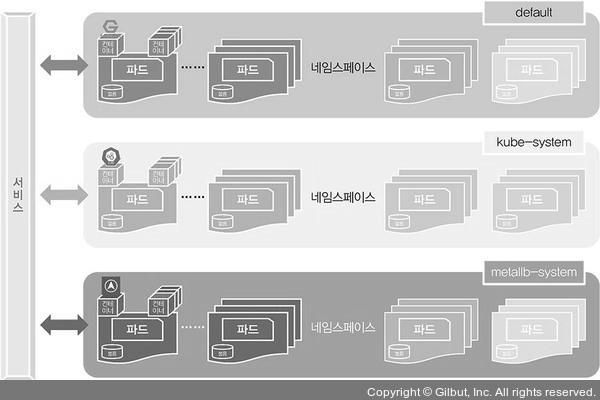
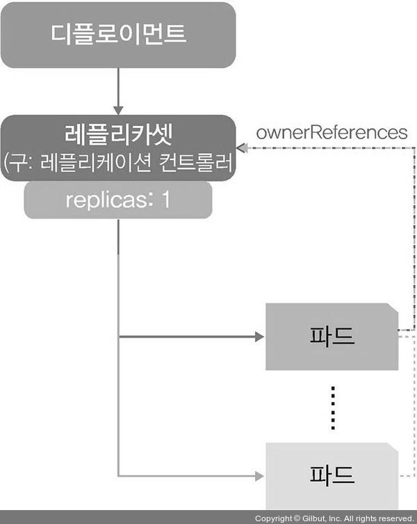
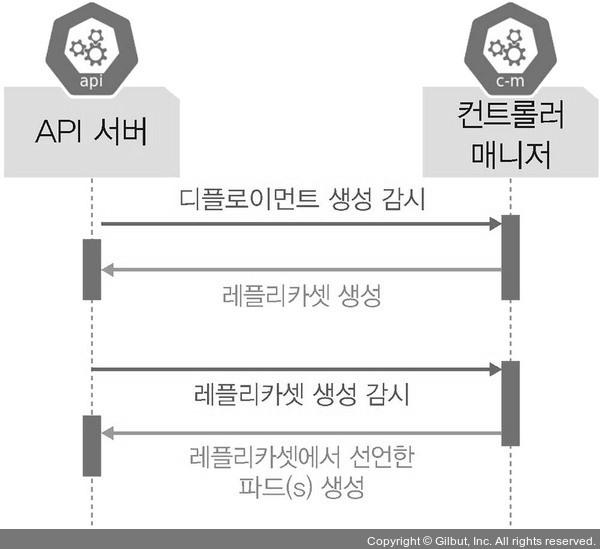
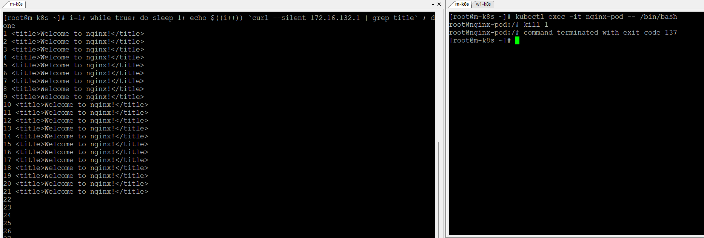
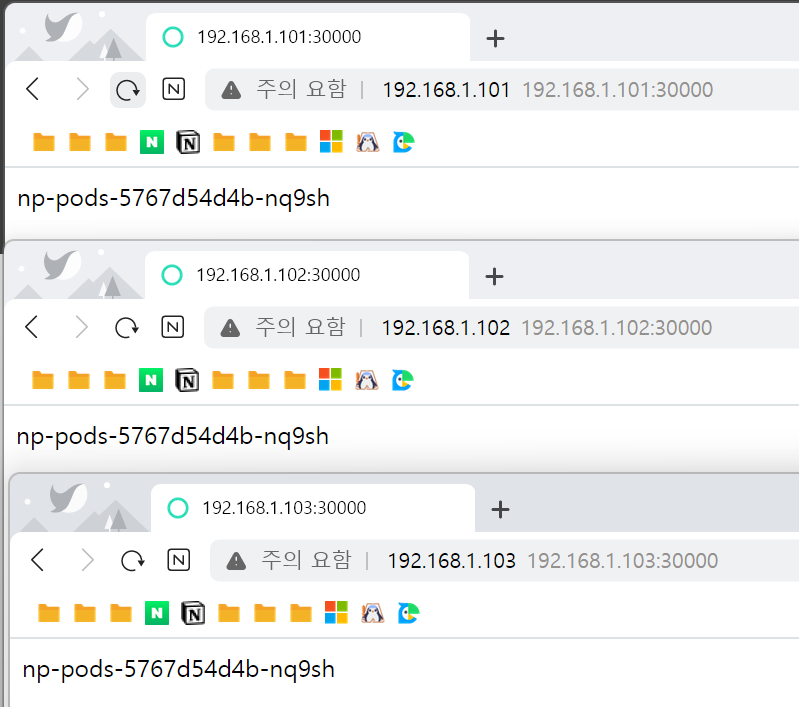
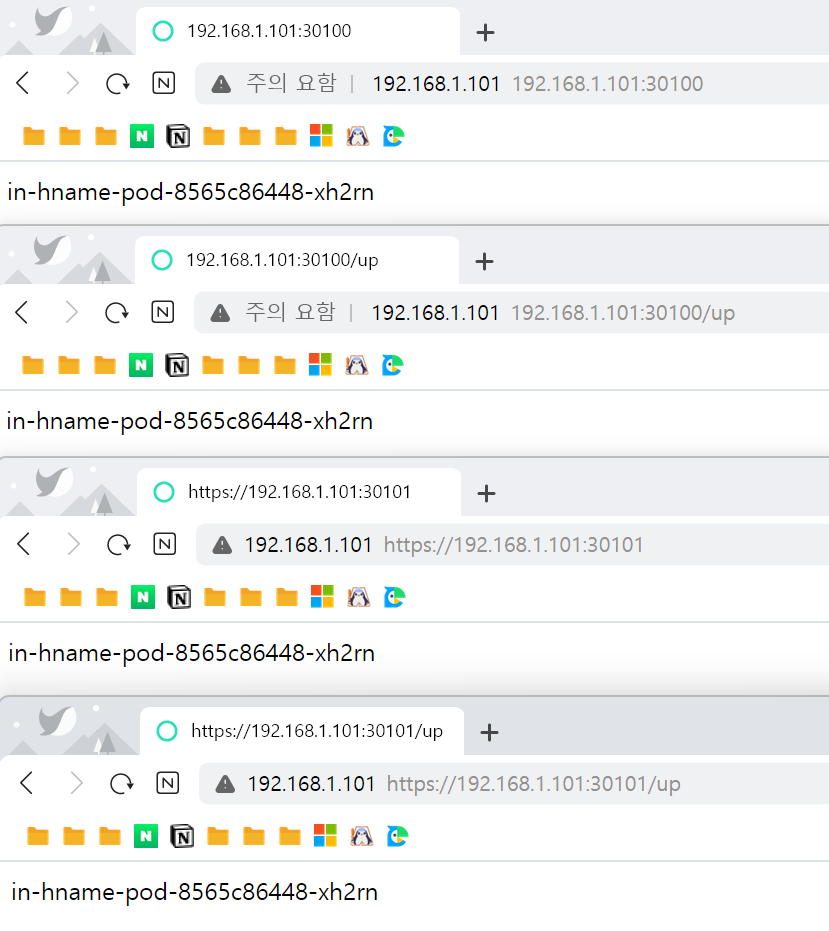

## 📍 쿠버네티스 기본 사용법

### 파드 생성
```shell
## m-k8s (master node) 에서 실행
# kubectl run 명령어로 쉽게 파드 생성 가능
$ kubectl run nginx-pod --image=nginx
pod/nginx-pod created
[root@m-k8s ~]# kubectl get pods
NAME        READY   STATUS              RESTARTS   AGE
nginx-pod   0/1     ContainerCreating   0          8s

# kubectl create 명령어로도 파드 생성 손쉽게 가능
# run으로 생성 시 단일 파드로 생성, create deployment로 실행 시 디플로이먼트 내 파드로 생성됨.
$ kubectl create deployment dpy-nginx --image=nginx
deployment.apps/dpy-nginx created

# 위에서 정의한 dpy-nginx라는 이름을 제외한 나머지는 무작위 생성
$ kubectl get pods -o wide
NAME                       READY   STATUS    RESTARTS   AGE   IP               NODE     NOMINATED NODE   READINESS GATES
dpy-nginx-c8d778df-7f8pr   1/1     Running   0          67s   172.16.221.129   w1-k8s   <none>           <none>
nginx-pod                  1/1     Running   0          2m    172.16.132.1     w3-k8s   <none>           <none>

```

<br>

### 오브젝트
쿠버네티스를 사용하는 관점에서 파드와 디플로이먼트는 스펙(spec)과 상태(status) 등의 값을 가지고 있습니다. 이러한 값을 가지고 있는 파드와 디플로이먼트를 개별 속성을 포함해 부르는 단위를 오브젝트(Object)라고 합니다. 쿠버네티스는 여러 유형의 오브젝트를 제공하는데, 먼저 기본 오브젝트부터 살펴보겠습니다.



<기본 오브젝트의 종류>

• 파드(Pod): 쿠버네티스에서 실행되는 최소 단위, 즉 웹 서비스를 구동하는 데 필요한 최소 단위입니다. 독립적인 공간과 사용 가능한 IP를 가지고 있습니다. 하나의 파드는 1개 이상의 컨테이너를 갖고 있기 때문에 여러 기능을 묶어 하나의 목적으로 사용할 수도 있습니다. 그러나 범용으로 사용할 때는 대부분 1개의 파드에 1개의 컨테이너를 적용합니다(차이가 조금 있으나 우선 1개라고 이해하겠습니다. 자세한 것은 4장에서 다룹니다).

• 네임스페이스(Namespaces): 쿠버네티스 클러스터에서 사용되는 리소스들을 구분해 관리하는 그룹입니다. 예를 들어 3장에서는 3가지 네임스페이스를 사용합니다. 특별히 지정하지 않으면 기본으로 할당되는 default, 쿠버네티스 시스템에서 사용되는 kube-system, 온프레미스에서 쿠버네티스를 사용할 경우 외부에서 쿠버네티스 클러스터 내부로 접속하게 도와주는 컨테이너들이 속해 있는 metallb-system이 있습니다.

• 볼륨(Volume): 파드가 생성될 때 파드에서 사용할 수 있는 디렉터리를 제공합니다. 기본적으로 파드는 영속되는 개념이 아니라 제공되는 디렉터리도 임시로 사용합니다. 하지만 파드가 사라지더라도 저장과 보존이 가능한 디렉터리를 볼륨 오브젝트를 통해 생성하고 사용할 수 있습니다.

• 서비스(Service): 파드는 클러스터 내에서 유동적이기 때문에 접속 정보가 고정일 수 없습니다. 따라서 파드 접속을 안정적으로 유지하도록 서비스를 통해 내/외부로 연결됩니다. 그래서 서비스는 새로 파드가 생성될 때 부여되는 새로운 IP를 기존에 제공하던 기능과 연결해 줍니다. 쉽게 설명하면 쿠버네티스 외부에서 쿠버네티스 내부로 접속할 때 내부가 어떤 구조로 돼 있는지, 파드가 살았는지 죽었는지 신경 쓰지 않아도 이를 논리적으로 연결하는 것이 서비스입니다. 기존 인프라에서 로드밸런서, 게이트웨이와 비슷한 역할을 합니다. 서비스라는 이름 때문에 처음에 개념을 이해하기가 매우 어렵습니다. 따라서 ‘3.3 쿠버네티스 연결을 담당하는 서비스’에서 집중적으로 다루겠습니다.

<br>

### 디플로이먼트


기본 오브젝트만으로도 쿠버네티스를 사용할 수 있습니다. 하지만 한계가 있어서 이를 좀 더 효율적으로 작동하도록 기능들을 조합하고 추가해 구현한 것이 디플로이먼트(Deployment)입니다. 이외에도 데몬셋(DaemonSet), 컨피그맵(ConfigMap), 레플리카셋(ReplicaSet), PV(PersistentVolume), PVC(PersistentVolumeClaim), 스테이트풀셋(StatefulSet) 등이 있으며, 앞으로도 요구 사항에 따라 목적에 맞는 오브젝트들이 추가될 것입니다.

쿠버네티스에서 가장 많이 쓰이는 디플로이먼트 오브젝트는 파드에 기반을 두고 있으며, 레플리카셋 오브젝트를 합쳐 놓은 형태입니다. 참고로 레플리카셋은 레플리케이션컨트롤러(ReplicationController)가 발전한 형태지만, 현재는 레플리카셋만 알면 됩니다. 레플리카셋에 관한 자세한 설명은 ‘3.2.3 레플리카셋으로 파드 수 관리하기’를 참고하기 바랍니다.
실제로 API 서버와 컨트롤러 매니저는 단순히 파드가 생성되는 것을 감시하는 것이 아니라 디플로이먼트처럼 레플리카셋을 포함하는 오브젝트의 생성을 감시합니다.



이처럼 쿠버네티스의 오브젝트는 다소 복잡하고 아직도 진화하고 있기 때문에 한 번에 모든 것을 이해하기는 매우 어렵습니다. 따라서 이 책의 모든 과정을 따라 해 보고 처음부터 다시 읽어보기를 권장합니다. 또한 쿠버네티스의 오브젝트는 생태계 변화에 따라 계속 변화하므로 모든 것을 외울 필요는 없습니다. 필요한 부분을 찾아 읽어보고 적재적소에 필요한 오브젝트를 사용하는 것이 현명합니다.

```shell
## m-k8s (master node) 에서 실행
# 디플로이먼트 생성
$ kubectl create deployment dpy-hname --image=sysnet4admin/echo-hname
deployment.apps/dpy-hname created

# 생성 확인
$ kubectl get pods
NAME                        READY   STATUS    RESTARTS   AGE
dpy-hname-59778b9bb-ffnp8   1/1     Running   0          56s
dpy-nginx-c8d778df-7f8pr    1/1     Running   0          11m
nginx-pod                   1/1     Running   0          12m

# 디플로이먼트 삭제
$ kubectl delete deployment dpy-hname
deployment.apps "dpy-hname" deleted

# 삭제 확인
$ kubectl get pods
NAME                        READY   STATUS        RESTARTS   AGE
dpy-hname-59778b9bb-ffnp8   0/1     Terminating   0          61s
dpy-nginx-c8d778df-7f8pr    1/1     Running       0          11m
nginx-pod                   1/1     Running       0          12m

$ kubectl get pods
NAME                       READY   STATUS    RESTARTS   AGE
dpy-nginx-c8d778df-7f8pr   1/1     Running   0          12m
nginx-pod                  1/1     Running   0          13m

```
<br>

### 레플리카셋으로 파드 수 관리
- 예를 들어 파드를 3개 만들겠다고 레플리카셋에 선언하면 컨트롤러 매니저와 스케줄러가 워커 노드에 파드 3개를 만들도록 선언합니다. 그러나 레플리카셋은 파드 수를 보장하는 기능만 제공하기 때문에 롤링 업데이트 기능 등이 추가된 디플로이먼트를 사용해 파드 수를 관리하기를 권장합니다.
- 레플리카셋은 파드의 개수를 지정한 대로 맞춰주는 역할을 합니다.

```shell

[root@m-k8s ~]# kubectl get pods
NAME                       READY   STATUS    RESTARTS   AGE
dpy-nginx-c8d778df-7f8pr   1/1     Running   0          146m
nginx-pod                  1/1     Running   0          147m

[root@m-k8s ~]# kubectl scale pod nginx-pod --replicas=3
Error from server (NotFound): the server could not find the requested resource

[root@m-k8s ~]# kubectl scale deployment dpy-nginx --replicas=3
deployment.apps/dpy-nginx scaled

[root@m-k8s ~]# kubectl get pods
NAME                       READY   STATUS    RESTARTS   AGE
dpy-nginx-c8d778df-5xhs5   1/1     Running   0          15s
dpy-nginx-c8d778df-7f8pr   1/1     Running   0          148m
dpy-nginx-c8d778df-jt9qh   1/1     Running   0          15s
nginx-pod                  1/1     Running   0          149m

[root@m-k8s ~]# kubectl delete deployment dpy-nginx
deployment.apps "dpy-nginx" deleted

[root@m-k8s ~]# kubectl get pods
NAME                       READY   STATUS        RESTARTS   AGE
dpy-nginx-c8d778df-jt9qh   0/1     Terminating   0          43s
nginx-pod                  1/1     Running       0          149m

```

<br>

### 스펙을 지정해 오브젝트 생성하기
- kubectl create deployment 명령으로 디플로이먼트를 생성하긴 했지만, 1개의 파드만 만들어졌을 뿐입니다. 디플로이먼트를 생성하면서 한꺼번에 여러 개의 파드를 만들 순 없을까요? create에서는 replicas 옵션을 사용할 수 없고, scale은 이미 만들어진 디플로이먼트에서만 사용할 수 있습니다.
- 이런 설정을 적용하려면 필요한 내용을 파일로 작성해야 합니다. 이때 작성하는 파일을 오브젝트 스펙(spec)이라고 합니다. 오브젝트 스펙은 일반적으로 야믈(YAML) 문법으로 작성합니다. 최근 상용과 오픈 소스 기술들은 스펙과 상태 값을 주로 야믈로 작성하므로 야믈 문법에 익숙해지는 것이 좋습니다.

```shell
[root@m-k8s ~]# kubectl create -f ~/_Book_k8sInfra/ch3/3.2.4/echo-hname.yaml
deployment.apps/echo-hname created

[root@m-k8s ~]# kubectl get pods
NAME                        READY   STATUS    RESTARTS   AGE
echo-hname-7894b67f-7hzxt   1/1     Running   0          90s
echo-hname-7894b67f-8d46c   1/1     Running   0          90s
echo-hname-7894b67f-pxtjc   1/1     Running   0          90s
nginx-pod                   1/1     Running   0          153m

[root@m-k8s ~]# sed -i 's/replicas: 3/replicas: 6/' ~/_Book_k8sInfra/ch3/3.2.4/echo-hname.yaml

[root@m-k8s ~]# cat ~/_Book_k8sInfra/ch3/3.2.4/echo-hname.yaml | grep replicas
  replicas: 6
  
[root@m-k8s ~]# kubectl create -f ~/_Book_k8sInfra/ch3/3.2.4/echo-hname.yaml
Error from server (AlreadyExists): error when creating "/root/_Book_k8sInfra/ch3/3.2.4/echo-hname.yaml": deployments.apps "echo-hname" already exists

```

<br>

### apply로 오브젝트 생성하고 관리하기
- run은 파드를 간단하게 생성하는 매우 편리한 방법입니다. 하지만 run으로는 단일 파드만을 생성할 수 있습니다. 
- 따라서 run을 모든 상황에 적용해 사용하기는 어렵습니다. 
- 그렇다고 create로 디플로이먼트를 생성하면 앞에서 확인한 것처럼 파일의 변경 사항을 바로 적용할 수 없다는 단점이 있습니다. 
- 이런 경우를 위해 쿠버네티스는 apply라는 명령어를 제공합니다. 그러면 apply로 오브젝트를 관리해 봅시다.

```shell
[root@m-k8s ~]# kubectl apply -f ~/_Book_k8sInfra/ch3/3.2.4/echo-hname.yaml
Warning: kubectl apply should be used on resource created by either kubectl create --save-config or kubectl apply
deployment.apps/echo-hname configured

[root@m-k8s ~]# kubectl get pods
NAME                        READY   STATUS    RESTARTS   AGE
echo-hname-7894b67f-76gjt   1/1     Running   0          7s
echo-hname-7894b67f-7hzxt   1/1     Running   0          3m44s
echo-hname-7894b67f-8d46c   1/1     Running   0          3m44s
echo-hname-7894b67f-crlr2   1/1     Running   0          7s
echo-hname-7894b67f-dsxz5   1/1     Running   0          7s
echo-hname-7894b67f-pxtjc   1/1     Running   0          3m44s
nginx-pod                   1/1     Running   0          155m

```

<br>

### 파드의 컨테이너 자동 복구 방법
- 쿠버네티스는 거의 모든 부분이 자동 복구되도록 설계됐습니다. 특히 파드의 자동 복구 기술을 셀프 힐링(Self-Healing)이라고 하는데, 제대로 작동하지 않는 컨테이너를 다시 시작하거나 교체해 파드가 정상적으로 작동하게 합니다(울버린과 데드풀의 자가 치유 능력인 힐링팩터처럼 말이죠). 그럼 셀프 힐링 기능을 체감할 수 있는 테스트를 진행해 보겠습니다.

```shell
[root@m-k8s ~]# kubectl get pods -o wide
NAME                        READY   STATUS    RESTARTS   AGE     IP               NODE     NOMINATED NODE   READINESS GATES
echo-hname-7894b67f-76gjt   1/1     Running   0          61s     172.16.103.135   w2-k8s   <none>           <none>
echo-hname-7894b67f-7hzxt   1/1     Running   0          4m38s   172.16.132.3     w3-k8s   <none>           <none>
echo-hname-7894b67f-8d46c   1/1     Running   0          4m38s   172.16.103.134   w2-k8s   <none>           <none>
echo-hname-7894b67f-crlr2   1/1     Running   0          61s     172.16.221.131   w1-k8s   <none>           <none>
echo-hname-7894b67f-dsxz5   1/1     Running   0          61s     172.16.132.4     w3-k8s   <none>           <none>
echo-hname-7894b67f-pxtjc   1/1     Running   0          4m38s   172.16.221.130   w1-k8s   <none>           <none>
nginx-pod                   1/1     Running   0          156m    172.16.132.1     w3-k8s   <none>           <none>
[root@m-k8s ~]# kubectl exec -it nginx-pod -- /bin/bash
root@nginx-pod:/# cat /run/nginx.pid
1
root@nginx-pod:/# ls -l /run/nginx.pid
-rw-r--r--. 1 root root 2 Aug 12 19:07 /run/nginx.pid

## 탭 하나 더 실행해서 다음 명령어 실행
[root@m-k8s ~]# i=1; while true; do sleep 1; echo $((i++)) `curl --silent 172.16.132.1 | grep title` ; done

root@nginx-pod:/# kill 1
root@nginx-pod:/# command terminated with exit code 137

```


<br>

### 파드의 동작 보증 기능

```shell

[root@m-k8s ~]# kubectl get pods
NAME                        READY   STATUS    RESTARTS   AGE
echo-hname-7894b67f-76gjt   1/1     Running   0          10m
echo-hname-7894b67f-7hzxt   1/1     Running   0          14m
echo-hname-7894b67f-8d46c   1/1     Running   0          14m
echo-hname-7894b67f-crlr2   1/1     Running   0          10m
echo-hname-7894b67f-dsxz5   1/1     Running   0          10m
echo-hname-7894b67f-pxtjc   1/1     Running   0          14m
nginx-pod                   1/1     Running   2          165m (delete)

[root@m-k8s ~]# kubectl delete pods nginx-pod
pod "nginx-pod" deleted

[root@m-k8s ~]# kubectl get pods
NAME                        READY   STATUS    RESTARTS   AGE
echo-hname-7894b67f-76gjt   1/1     Running   0          11m (delete)
echo-hname-7894b67f-7hzxt   1/1     Running   0          14m
echo-hname-7894b67f-8d46c   1/1     Running   0          14m
echo-hname-7894b67f-crlr2   1/1     Running   0          11m
echo-hname-7894b67f-dsxz5   1/1     Running   0          11m
echo-hname-7894b67f-pxtjc   1/1     Running   0          14m

[root@m-k8s ~]# kubectl delete pods echo-hname-7894b67f-76gjt
pod "echo-hname-7894b67f-76gjt" deleted

[root@m-k8s ~]# kubectl get pods
NAME                        READY   STATUS    RESTARTS   AGE
echo-hname-7894b67f-7hzxt   1/1     Running   0          15m
echo-hname-7894b67f-8d46c   1/1     Running   0          15m
echo-hname-7894b67f-crlr2   1/1     Running   0          11m
echo-hname-7894b67f-dsxz5   1/1     Running   0          11m
echo-hname-7894b67f-nb6jz   1/1     Running   0          13s (new!)
echo-hname-7894b67f-pxtjc   1/1     Running   0          15m

```

<br>

### 노드 자원 보호하기
- 여러 가지 상황에서도 쿠버네티스는 파드를 안정적으로 작동하도록 관리한다는 것을 알았습니다. 그렇다면 노드는 어떤 식으로 관리할까요? 우선 노드의 목적을 명확히 해야 합니다. 노드는 쿠버네티스 스케줄러에서 파드를 할당받고 처리하는 역할을 합니다.
그런데 최근에 몇 차례 문제가 생긴 노드에 파드를 할당하면 문제가 생길 가능성이 높습니다. 하지만 어쩔 수 없이 해당 노드를 사용해야 한다면 어떻게 할까요? 이런 경우에는 영향도가 적은 파드를 할당해 일정 기간 사용하면서 모니터링해야 합니다. 즉, 노드에 문제가 생기더라도 파드의 문제를 최소화해야 합니다. 하지만 쿠버네티스는 모든 노드에 균등하게 파드를 할당하려고 합니다. 그렇다면 어떻게 문제가 생길 가능성이 있는 노드라는 것을 쿠버네티스에 알려줄까요?

```shell

[root@m-k8s ~]# kubectl apply -f ~/_Book_k8sInfra/ch3/3.2.8/echo-hname.yaml
deployment.apps/echo-hname configured

[root@m-k8s ~]# kubectl scale deployment echo-hname --replicas=9
deployment.apps/echo-hname scaled

[root@m-k8s ~]# kubectl get pods \
> -o=custom-columns=NAME:.metadata.name,IP:.status.podIP,STATUS:.status.phase,NODE:.spec.nodeName
NAME                        IP               STATUS    NODE
echo-hname-7894b67f-7hzxt   172.16.132.3     Running   w3-k8s
echo-hname-7894b67f-8d46c   172.16.103.134   Running   w2-k8s
echo-hname-7894b67f-dd96b   172.16.103.137   Running   w2-k8s
echo-hname-7894b67f-k9mmx   172.16.221.132   Running   w1-k8s
echo-hname-7894b67f-pxtjc   172.16.221.130   Running   w1-k8s
echo-hname-7894b67f-qk5vr   172.16.221.133   Running   w1-k8s
echo-hname-7894b67f-qrgfc   172.16.103.138   Running   w2-k8s
echo-hname-7894b67f-shf68   172.16.132.6     Running   w3-k8s
echo-hname-7894b67f-z2bp2   172.16.132.5     Running   w3-k8s

[root@m-k8s ~]# kubectl scale deployment echo-hname --replicas=3
deployment.apps/echo-hname scaled


[root@m-k8s ~]# kubectl get pods -o=custom-columns=NAME:.metadata.name,IP:.status.podIP,STATUS:.status.phase,NODE:.spec.nodeName
NAME                        IP               STATUS    NODE
echo-hname-7894b67f-7hzxt   172.16.132.3     Running   w3-k8s
echo-hname-7894b67f-8d46c   172.16.103.134   Running   w2-k8s
echo-hname-7894b67f-pxtjc   172.16.221.130   Running   w1-k8s

[root@m-k8s ~]# kubectl cordon w3-k8s
node/w3-k8s cordoned

[root@m-k8s ~]# kubectl get nodes
NAME     STATUS                     ROLES    AGE     VERSION
m-k8s    Ready                      master   5h2m    v1.18.4
w1-k8s   Ready                      <none>   4h58m   v1.18.4
w2-k8s   Ready                      <none>   4h54m   v1.18.4
w3-k8s   Ready,SchedulingDisabled   <none>   4h50m   v1.18.4

[root@m-k8s ~]# kubectl scale deployment echo-hname --replicas=9
deployment.apps/echo-hname scaled

[root@m-k8s ~]# kubectl get pods -o=custom-columns=NAME:.metadata.name,IP:.status.podIP,STATUS:.status.phase,NODE:.spec.nodeName
NAME                        IP               STATUS    NODE
echo-hname-7894b67f-7hzxt   172.16.132.3     Running   w3-k8s
echo-hname-7894b67f-8d46c   172.16.103.134   Running   w2-k8s
echo-hname-7894b67f-9mp9q   172.16.103.139   Running   w2-k8s
echo-hname-7894b67f-bzpf8   172.16.221.136   Running   w1-k8s
echo-hname-7894b67f-fjcs9   172.16.103.140   Running   w2-k8s
echo-hname-7894b67f-k5r2d   172.16.221.135   Running   w1-k8s
echo-hname-7894b67f-pcsbz   172.16.103.141   Running   w2-k8s
echo-hname-7894b67f-pxtjc   172.16.221.130   Running   w1-k8s
echo-hname-7894b67f-wmgdq   172.16.221.134   Running   w1-k8s

[root@m-k8s ~]# kubectl scale deployment echo-hname --replicas=3
deployment.apps/echo-hname scaled

[root@m-k8s ~]# kubectl get pods -o=custom-columns=NAME:.metadata.name,IP:.status.podIP,STATUS:.status.phase,NODE:.spec.nodeName
NAME                        IP               STATUS    NODE
echo-hname-7894b67f-7hzxt   172.16.132.3     Running   w3-k8s
echo-hname-7894b67f-8d46c   172.16.103.134   Running   w2-k8s
echo-hname-7894b67f-pxtjc   172.16.221.130   Running   w1-k8s

[root@m-k8s ~]# kubectl uncordon w3-k8s
node/w3-k8s uncordoned

[root@m-k8s ~]# kubectl get nodes
NAME     STATUS   ROLES    AGE     VERSION
m-k8s    Ready    master   5h4m    v1.18.4
w1-k8s   Ready    <none>   5h1m    v1.18.4
w2-k8s   Ready    <none>   4h56m   v1.18.4
w3-k8s   Ready    <none>   4h52m   v1.18.4

```

<br>

### 노드 유지보수하기
- 쿠버네티스를 사용하다 보면 정기 또는 비정기적인 유지보수를 위해 노드를 꺼야 하는 상황이 발생합니다. 이런 경우를 대비해 쿠버네티스는 drain 기능을 제공합니다. drain은 지정된 노드의 파드를 전부 다른 곳으로 이동시켜 해당 노드를 유지보수할 수 있게 합니다. drain 기능을 어떻게 사용하는지 살펴보겠습니다.

```shell

[root@m-k8s ~]# kubectl drain w3-k8s
node/w3-k8s cordoned
error: unable to drain node "w3-k8s", aborting command...

There are pending nodes to be drained:
 w3-k8s
error: cannot delete DaemonSet-managed Pods (use --ignore-daemonsets to ignore): kube-system/calico-node-chdrn, kube-system/kube-proxy-mjtk2

[root@m-k8s ~]# kubectl drain w3-k8s --ignore-daemonsets
node/w3-k8s already cordoned
WARNING: ignoring DaemonSet-managed Pods: kube-system/calico-node-chdrn, kube-system/kube-proxy-mjtk2
evicting pod default/echo-hname-7894b67f-7hzxt
pod/echo-hname-7894b67f-7hzxt evicted
node/w3-k8s evicted

[root@m-k8s ~]# kubectl get nodes
NAME     STATUS                     ROLES    AGE     VERSION
m-k8s    Ready                      master   5h5m    v1.18.4
w1-k8s   Ready                      <none>   5h2m    v1.18.4
w2-k8s   Ready                      <none>   4h58m   v1.18.4
w3-k8s   Ready,SchedulingDisabled   <none>   4h54m   v1.18.4

[root@m-k8s ~]# kubectl uncordon w3-k8s
node/w3-k8s uncordoned

[root@m-k8s ~]# kubectl get nodes
NAME     STATUS   ROLES    AGE     VERSION
m-k8s    Ready    master   5h6m    v1.18.4
w1-k8s   Ready    <none>   5h3m    v1.18.4
w2-k8s   Ready    <none>   4h58m   v1.18.4
w3-k8s   Ready    <none>   4h54m   v1.18.4

[root@m-k8s ~]# kubectl delete -f ~/_Book_k8sInfra/ch3/3.2.8/echo-hname.yaml
deployment.apps "echo-hname" deleted

[root@m-k8s ~]# kubectl get pods
No resources found in default namespace.

```

<br>

### 파드 업데이트하고 복구하기
- 파드를 운영하다 보면 컨테이너에 새로운 기능을 추가하거나 치명적인 버그가 발생해 버전을 업데이트해야 할 때가 있습니다. 
- 또는 업데이트하는 도중 문제가 발생해 다시 기존 버전으로 복구해야 하는 일도 발생합니다. 
- 이런 일은 어떻게 처리하는지 확인해 봅시다.

```shell
[root@m-k8s ~]# kubectl apply -f ~/_Book_k8sInfra/ch3/3.2.10/rollout-nginx.yaml --record
deployment.apps/rollout-nginx created

[root@m-k8s ~]# kubectl rollout history deployment rollout-nginx
deployment.apps/rollout-nginx
REVISION  CHANGE-CAUSE
1         kubectl apply --filename=/root/_Book_k8sInfra/ch3/3.2.10/rollout-nginx.yaml --record=true

root@m-k8s ~]# kubectl get pods -o=custom-columns=NAME:.metadata.name,IP:.status.podIP,STATUS:.status.phase,NODE:.spec.nodeName
NAME                             IP               STATUS    NODE
rollout-nginx-64dd56c7b5-4xm96   172.16.103.142   Running   w2-k8s
rollout-nginx-64dd56c7b5-6vqw7   172.16.221.138   Running   w1-k8s
rollout-nginx-64dd56c7b5-x8p86   172.16.132.7     Running   w3-k8s

[root@m-k8s ~]# curl -I --silent 172.16.103.142 | grep Server
Server: nginx/1.15.12

[root@m-k8s ~]# kubectl set image deployment rollout-nginx nginx=nginx:1.16.0 --record
deployment.apps/rollout-nginx image updated

[root@m-k8s ~]# kubectl get pods -o=custom-columns=NAME:.metadata.name,IP:.status.podIP,STATUS:.status.phase,NODE:.spec.nodeName
NAME                             IP               STATUS    NODE
rollout-nginx-64dd56c7b5-6vqw7   172.16.221.139   Running   w1-k8s
rollout-nginx-8566d57f75-94g79   172.16.132.8     Running   w3-k8s
rollout-nginx-8566d57f75-pf69k   172.16.103.143   Running   w2-k8s
rollout-nginx-8566d57f75-rb2lv   <none>           Pending   w1-k8s

[root@m-k8s ~]# kubectl rollout status deployment rollout-nginx
deployment "rollout-nginx" successfully rolled out

[root@m-k8s ~]# kubectl rollout history deployment rollout-nginx
deployment.apps/rollout-nginx
REVISION  CHANGE-CAUSE
1         kubectl apply --filename=/root/_Book_k8sInfra/ch3/3.2.10/rollout-nginx.yaml --record=true
2         kubectl set image deployment rollout-nginx nginx=nginx:1.16.0 --record=true

[root@m-k8s ~]# curl -I --silent 172.16.132.8 | grep Server
Server: nginx/1.16.0

```

<br>

## 📍 쿠버네티스 연결을 담당하는 서비스

### 노드 포트

```shell
[root@m-k8s ~]# kubectl create deployment np-pods --image=sysnet4admin/echo-hname
deployment.apps/np-pods created

[root@m-k8s ~]# kubectl get pods
NAME                             READY   STATUS    RESTARTS   AGE
np-pods-5767d54d4b-nq9sh         1/1     Running   0          8s
rollout-nginx-8566d57f75-94g79   1/1     Running   0          6m13s
rollout-nginx-8566d57f75-pf69k   1/1     Running   0          5m35s
rollout-nginx-8566d57f75-rb2lv   1/1     Running   0          5m3s

[root@m-k8s ~]# kubectl create -f ~/_Book_k8sInfra/ch3/3.3.1/nodeport.yaml
service/np-svc created

[root@m-k8s ~]# kubectl get services
NAME         TYPE        CLUSTER-IP       EXTERNAL-IP   PORT(S)        AGE
kubernetes   ClusterIP   10.96.0.1        <none>        443/TCP        5h17m
np-svc       NodePort    10.100.248.191   <none>        80:30000/TCP   11s

[root@m-k8s ~]# kubectl get nodes -o wide
NAME     STATUS   ROLES    AGE     VERSION   INTERNAL-IP     EXTERNAL-IP   OS-IMAGE                KERNEL-VERSION                CONTAINER-RUNTIME
m-k8s    Ready    master   5h17m   v1.18.4   192.168.1.10    <none>        CentOS Linux 7 (Core)   3.10.0-1127.19.1.el7.x86_64   docker://1.13.1
w1-k8s   Ready    <none>   5h13m   v1.18.4   192.168.1.101   <none>        CentOS Linux 7 (Core)   3.10.0-1127.19.1.el7.x86_64   docker://1.13.1
w2-k8s   Ready    <none>   5h9m    v1.18.4   192.168.1.102   <none>        CentOS Linux 7 (Core)   3.10.0-1127.19.1.el7.x86_64   docker://1.13.1
w3-k8s   Ready    <none>   5h5m    v1.18.4   192.168.1.103   <none>        CentOS Linux 7 (Core)   3.10.0-1127.19.1.el7.x86_64   docker://1.13.1
```



<br>

### 인그레스

```shell
[root@m-k8s ~]# kubectl create deployment in-hname-pod --image=sysnet4admin/echo-hname
deployment.apps/in-hname-pod created

[root@m-k8s ~]# kubectl create deployment in-ip-pod --image=sysnet4admin/echo-ip
deployment.apps/in-ip-pod created

[root@m-k8s ~]# kubectl get pods
NAME                            READY   STATUS    RESTARTS   AGE
in-hname-pod-8565c86448-xh2rn   1/1     Running   0          78s
in-ip-pod-76bf6989d-fxn8j       1/1     Running   0          41s

[root@m-k8s ~]# kubectl apply -f ~/_Book_k8sInfra/ch3/3.3.2/ingress-nginx.yaml
namespace/ingress-nginx created
configmap/nginx-configuration created
configmap/tcp-services created
configmap/udp-services created
serviceaccount/nginx-ingress-serviceaccount created
clusterrole.rbac.authorization.k8s.io/nginx-ingress-clusterrole created
role.rbac.authorization.k8s.io/nginx-ingress-role created
rolebinding.rbac.authorization.k8s.io/nginx-ingress-role-nisa-binding created
clusterrolebinding.rbac.authorization.k8s.io/nginx-ingress-clusterrole-nisa-binding created
deployment.apps/nginx-ingress-controller created

[root@m-k8s ~]# kubectl apply -f ~/_Book_k8sInfra/ch3/3.3.2/ingress-config.yaml
ingress.networking.k8s.io/ingress-nginx created

[root@m-k8s ~]# kubectl get pods -n ingress-nginx
NAME                                        READY   STATUS              RESTARTS   AGE
nginx-ingress-controller-5bb8fb4bb6-2h5f9   0/1     ContainerCreating   0          44s

[root@m-k8s ~]# kubectl get pods
NAME                            READY   STATUS    RESTARTS   AGE
in-hname-pod-8565c86448-xh2rn   1/1     Running   0          2m44s
in-ip-pod-76bf6989d-fxn8j       1/1     Running   0          2m7s

[root@m-k8s ~]# kubectl get ingress
NAME            CLASS    HOSTS   ADDRESS   PORTS   AGE
ingress-nginx   <none>   *                 80      43s

[root@m-k8s ~]# kubectl get ingress -o yaml
apiVersion: v1
items:
- apiVersion: extensions/v1beta1
  kind: Ingress
  metadata:
    annotations:
      kubectl.kubernetes.io/last-applied-configuration: |
        {"apiVersion":"networking.k8s.io/v1beta1","kind":"Ingress","metadata":{"annotations":{"nginx.ingress.kubernetes.io/rewrite-target":"/"},"name":"ingress-nginx","namespace":"default"},"spec":{"rules":[{"http":{"paths":[{"backend":{"serviceName":"hname-svc-default","servicePort":80},"path":null},{"backend":{"serviceName":"ip-svc","servicePort":80},"path":"/ip"},{"backend":{"serviceName":"your-svc","servicePort":80},"path":"/your-directory"}]}}]}}
      nginx.ingress.kubernetes.io/rewrite-target: /
    creationTimestamp: "2022-08-12T22:19:57Z"
    generation: 1
    managedFields:
    - apiVersion: networking.k8s.io/v1beta1
      fieldsType: FieldsV1
      fieldsV1:
        f:metadata:
          f:annotations:
            .: {}
            f:kubectl.kubernetes.io/last-applied-configuration: {}
            f:nginx.ingress.kubernetes.io/rewrite-target: {}
        f:spec:
          f:rules: {}
      manager: kubectl
      operation: Update
      time: "2022-08-12T22:19:57Z"
    name: ingress-nginx
    namespace: default
    resourceVersion: "50548"
    selfLink: /apis/extensions/v1beta1/namespaces/default/ingresses/ingress-nginx
    uid: 346fd184-7374-478e-8e4d-4b97652c211e
  spec:
    rules:
    - http:
        paths:
        - backend:
            serviceName: hname-svc-default
            servicePort: 80
          pathType: ImplementationSpecific
        - backend:
            serviceName: ip-svc
            servicePort: 80
          path: /ip
          pathType: ImplementationSpecific
        - backend:
            serviceName: your-svc
            servicePort: 80
          path: /your-directory
          pathType: ImplementationSpecific
  status:
    loadBalancer: {}
kind: List
metadata:
  resourceVersion: ""
  selfLink: ""
  
[root@m-k8s ~]# kubectl apply -f ~/_Book_k8sInfra/ch3/3.3.2/ingress.yaml
service/nginx-ingress-controller created

[root@m-k8s ~]# kubectl expose deployment in-hname-pod --name=hname-svc-default --port=80,443
service/hname-svc-default exposed

[root@m-k8s ~]# kubectl expose deployment in-ip-pod --name=ip-svc --port=40,443
service/ip-svc exposed

[root@m-k8s ~]# kubectl get services
NAME                TYPE        CLUSTER-IP       EXTERNAL-IP   PORT(S)          AGE
hname-svc-default   ClusterIP   10.109.22.142    <none>        80/TCP,443/TCP   74s
ip-svc              ClusterIP   10.111.168.222   <none>        40/TCP,443/TCP   52s
kubernetes          ClusterIP   10.96.0.1        <none>        443/TCP          5h28m

## 실습 컨테이너 정리
[root@m-k8s ~]# kubectl delete deployment in-hname-pod
deployment.apps "in-hname-pod" deleted

[root@m-k8s ~]# kubectl delete deployment in-ip-pod
deployment.apps "in-ip-pod" deleted

[root@m-k8s ~]# kubectl delete services hname-svc-default
service "hname-svc-default" deleted

[root@m-k8s ~]# kubectl delete services ip-svc
service "ip-svc" deleted
[root@m-k8s ~]# kubectl delete -f ~/_Book_k8sInfra/ch3/3.3.2/ingress-nginx.yaml
namespace "ingress-nginx" deleted
configmap "nginx-configuration" deleted
configmap "tcp-services" deleted
configmap "udp-services" deleted
...

[root@m-k8s ~]# kubectl delete -f ~/_Book_k8sInfra/ch3/3.3.2/ingress-config.yaml
ingress.networking.k8s.io "ingress-nginx" deleted

[root@m-k8s ~]# kubectl get pods
No resources found in default namespace.

```



<br>

### 로드밸런서
```shell
[root@m-k8s ~]# kubectl create deployment lb-hname-pod --image=sysnet4admin/echo-hname
deployment.apps/lb-hname-pod created

[root@m-k8s ~]# kubectl scale deployment lb-hname-pod --replicas=3
deployment.apps/lb-hname-pod scaled

[root@m-k8s ~]# kubectl create deployment lb-ip-pod --image=sysnet4admin/echo-ip
deployment.apps/lb-ip-pod created

[root@m-k8s ~]# kubectl scale deployment lb-ip-pod --replicas=3
deployment.apps/lb-ip-pod scaled

[root@m-k8s ~]# kubectl get pods
NAME                            READY   STATUS    RESTARTS   AGE
lb-hname-pod-795c75578f-572mr   1/1     Running   0          2m7s
lb-hname-pod-795c75578f-5nk5r   1/1     Running   0          105s
lb-hname-pod-795c75578f-kq759   1/1     Running   0          105s
lb-ip-pod-7867cb8b9c-2dfr8      1/1     Running   0          41s
lb-ip-pod-7867cb8b9c-jdfqk      1/1     Running   0          51s
lb-ip-pod-7867cb8b9c-zv979      1/1     Running   0          41s

[root@m-k8s ~]# kubectl apply -f ~/_Book_k8sInfra/ch3/3.3.4/metallb.yaml
namespace/metallb-system created
podsecuritypolicy.policy/speaker created
serviceaccount/controller created
serviceaccount/speaker created
clusterrole.rbac.authorization.k8s.io/metallb-system:controller created
clusterrole.rbac.authorization.k8s.io/metallb-system:speaker created
role.rbac.authorization.k8s.io/config-watcher created
clusterrolebinding.rbac.authorization.k8s.io/metallb-system:controller created
clusterrolebinding.rbac.authorization.k8s.io/metallb-system:speaker created
rolebinding.rbac.authorization.k8s.io/config-watcher created
daemonset.apps/speaker created
deployment.apps/controller created

[root@m-k8s ~]# kubectl get pods -n metallb-system -o wide
NAME                          READY   STATUS              RESTARTS   AGE   IP              NODE     NOMINATED NODE   READINESS GATES
controller-5f98465b6b-94n4k   0/1     ContainerCreating   0          22s   <none>          w1-k8s   <none>           <none>
speaker-2tjfv                 0/1     ContainerCreating   0          22s   192.168.1.103   w3-k8s   <none>           <none>
speaker-n8rhk                 0/1     ContainerCreating   0          22s   192.168.1.102   w2-k8s   <none>           <none>
speaker-qqs5n                 0/1     ContainerCreating   0          22s   192.168.1.10    m-k8s    <none>           <none>
speaker-sch8m                 0/1     ContainerCreating   0          22s   192.168.1.101   w1-k8s   <none>           <none>

[root@m-k8s ~]# kubectl apply -f ~/_Book_k8sInfra/ch3/3.3.4/metallb-l2config.yaml
configmap/config created

[root@m-k8s ~]# kubectl get configmap -n metallb-system
NAME     DATA   AGE
config   1      37s

[root@m-k8s ~]# kubectl get configmap -n metallb-system -o yaml
apiVersion: v1
items:
- apiVersion: v1
  data:
    config: |
      address-pools:
      - name: nginx-ip-range
        protocol: layer2
        addresses:
        - 192.168.1.11-192.168.1.13
  kind: ConfigMap
  metadata:
    annotations:
      kubectl.kubernetes.io/last-applied-configuration: |
        {"apiVersion":"v1","data":{"config":"address-pools:\n- name: nginx-ip-range\n  protocol: layer2\n  addresses:\n  - 192.168.1.11-192.168.1.13\n"},"kind":"ConfigMap","metadata":{"annotations":{},"name":"config","namespace":"metallb-system"}}
    creationTimestamp: "2022-08-12T22:36:03Z"
    managedFields:
    - apiVersion: v1
      fieldsType: FieldsV1
      fieldsV1:
        f:data:
          .: {}
          f:config: {}
        f:metadata:
          f:annotations:
            .: {}
            f:kubectl.kubernetes.io/last-applied-configuration: {}
      manager: kubectl
      operation: Update
      time: "2022-08-12T22:36:03Z"
    name: config
    namespace: metallb-system
    resourceVersion: "53313"
    selfLink: /api/v1/namespaces/metallb-system/configmaps/config
    uid: 81b0eca6-3234-465c-9721-d3f1a6c5a2d1
kind: List
metadata:
  resourceVersion: ""
  selfLink: ""

[root@m-k8s ~]# kubectl expose deployment lb-hname-pod --type=LoadBalancer --name=lb-hname-svc --port=80
service/lb-hname-svc exposed

[root@m-k8s ~]# kubectl expose deployment lb-ip-pod --type=LoadBalancer --name=lb-ip-svc --port=80      service/lb-ip-svc exposed
service/lb-ip-svc exposed

[root@m-k8s ~]# kubectl get services
NAME           TYPE           CLUSTER-IP       EXTERNAL-IP    PORT(S)        AGE
kubernetes     ClusterIP      10.96.0.1        <none>         443/TCP        5h47m
lb-hname-svc   LoadBalancer   10.101.110.71    192.168.1.11   80:32334/TCP   22s
lb-ip-svc      LoadBalancer   10.105.56.155    192.168.1.12   80:32645/TCP   4s

# Window Powershell에서 실행하면 로드밸런서 기능이 정상적으로 작동하는지 확인할 수 있음.
PS C:\Users\2jjin> $i=0; while($true)
>> {
>>   % { $i++; write-host -NoNewline "$i $_" }
>>   (Invoke-RestMethod "http://192.168.1.11")-replace '\n', " "
>> }

[root@m-k8s ~]# kubectl delete deployment lb-hname-pod
deployment.apps "lb-hname-pod" deleted

[root@m-k8s ~]# kubectl delete deployment lb-ip-pod
deployment.apps "lb-ip-pod" deleted

[root@m-k8s ~]# kubectl delete service lb-hname-svc
service "lb-hname-svc" deleted

[root@m-k8s ~]# kubectl delete service lb-ip-svc
service "lb-ip-svc" deleted

```

<br>

### HPA
```shell
[root@m-k8s ~]# kubectl create deployment hpa-hname-pods --image=sysnet4admin/echo-hname
deployment.apps/hpa-hname-pods created

[root@m-k8s ~]# kubectl expose deployment hpa-hname-pods --type=LoadBalancer --name=hpa-hname-svc --port=80
service/hpa-hname-svc exposed

[root@m-k8s ~]# kubectl get services
NAME            TYPE           CLUSTER-IP      EXTERNAL-IP    PORT(S)        AGE
hpa-hname-svc   LoadBalancer   10.107.105.16   192.168.1.11   80:32699/TCP   7s
kubernetes      ClusterIP      10.96.0.1       <none>         443/TCP        5h55m

[root@m-k8s ~]# kubectl top pods
Error from server (NotFound): the server could not find the requested resource (get services http:heapster:)

[root@m-k8s ~]# kubectl create -f ~/_Book_k8sInfra/ch3/3.3.5/metrics-server.yaml
clusterrole.rbac.authorization.k8s.io/system:aggregated-metrics-reader created
clusterrolebinding.rbac.authorization.k8s.io/metrics-server:system:auth-delegator created
rolebinding.rbac.authorization.k8s.io/metrics-server-auth-reader created
apiservice.apiregistration.k8s.io/v1beta1.metrics.k8s.io created
serviceaccount/metrics-server created
deployment.apps/metrics-server created
service/metrics-server created
clusterrole.rbac.authorization.k8s.io/system:metrics-server created
clusterrolebinding.rbac.authorization.k8s.io/system:metrics-server created
[root@m-k8s ~]# kubectl top pods
Error from server (ServiceUnavailable): the server is currently unable to handle the request (get pods.metrics.k8s.io)

[root@m-k8s ~]# kubectl top pods
NAME                              CPU(cores)   MEMORY(bytes)
hpa-hname-pods-75f874d48c-62v54   0m           1Mi
```

<br>