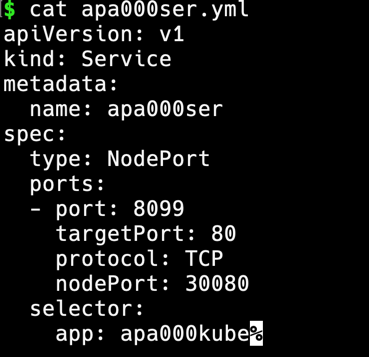

## 📍 쿠버네티스란?
- 쿠버네티스란?
    - 컨테이너 오케스트레이션 도구
    - 여러 대의 컨테이너를 관리해야 할 경우 번거로운 컨테이너의 생성이나 관리의 수고를 덜어주는 도구.
- 컨테이너 오케스트레이션이란?
    - 시스템 전체를 통괄하고 여러 개의 컨테이너를 관리하는 일을 함.
    
=> 즉 쿠버네티스는 여러 개의 컨테이너(= 서버)를 관리하는 도구

<br>

## 📍 마스터 노드와 워커 노드


1. 마스터 노드
    - 컨테이너를 실행하지는 않으며 워커 노드에서 실행되는 컨테이너를 관리하는 역할 수행
    - 컨테이너 엔진이 설치되지 않음.
    - 마스터 노드에는 컨테이너 등의 상태를 관리하기 위해 `etcd`라는 데이터베이스가 설치된다.
    - 마스터 노드를 설정하는 관리자의 컴퓨터에는 `kubectl`을 설치한다. `kubectl`을 설치해야 마스터 노드에 로그인해 초기 설정을 진행하거나 추후 조정이 가능하다.
    - 마스터 노드는 컨트롤 플레인을 통해 워커 노드를 관리한다.
    
    > 마스터 노드 측 컨트롤 플레인의 구성
    - `kube-apiserver` : 외부와 통신하는 프로세스, kubectl로부터 명령을 전달받아 실행한다.
    - `kube-controller-manager` : 컨트롤러를 통합 관리, 실행한다.
    - `kube-scheduler` : 파드를 워커 노드에 할당한다.
    - `cloud-controller-manager` : 클라우드 서비스와 연동해 서비스를 생성한다.
    - `etcd` : 클러스터 관련 정보 전반을 관리하는 데이터베이스.
    
2. 워커 노드
    - 실제 서버에 해당하는 부분, 컨테이너가 실제 동작하는 서버
    - 컨테이너 엔진이 설치됨.
    
    > 워커 노드의 구성
    - `kube-let` : 마스터 노드에 있는 kube-scheduler와 연동하며 워커 노드에 파드를 배치하고 실행한다. 또 실행 중인 파드의 상태를 정기적으로 모니터링하며 kube-scheduler에 통지한다.
    - `kube-proxy` : 네트워크 통신의 라우팅 메커니즘.
    
- `클러스터` : **마스터 노드 + 워커 노드**로 구성된 쿠버네티스 시스템. 사람이 개입하지 않아도 마스터 노드에 설정된 내용에 따라 워커 노드가 관리되며 자율적으로 동작함.
- 쿠버네티스는 컨테이너 엔진과는 별개의 소프트웨어로, 쿠버네티스 소프트웨어와 CNI(가상 네트워크 드라이버)를 설치해야 한다.
- 쿠버네티스의 기능은 어디까지나 **자동으로 상태를 유지하는 것**으로, 컨테이너를 삭제하고 싶다면 삭제 명령어를 입력하는 것이 아니라 파일에서 **바람직한 상태**를 수정해야 함.
    - 쿠버네티스는 정의된 **바람직한 상태**를 유지한다는 것을 항상 인지할 것.

<br>

### 💡 로드 밸런서와 클라우드 컴퓨팅
- 로드 밸런싱 : 한 대의 서버에 모든 요청이 집중되지 않도록 여러 대의 서버를 갖추고 요청을 각 서버에 분산하는 것.
- 대부분의 시스템은 요청이 많은 시기와 그렇지 않은 시기가 있는데, 이 사이에서 밸런싱을 맞춰주는 기술이 도커와 쿠버네티스다.
- 이렇게 서버를 쉽게 늘리거나 줄일 수 있는 구조를 **확장성이 좋다**고 표현하며. 쿠버네티스가 주목을 받는 이유는 바로 이 확장성이 뛰어나기 때문이다.

<br>

### 💡 etcd의 역할
- 도커 컴포즈와 쿠버네티스는 많은 차이점이 있지만 그 중에서도 가장 큰 차이점은 쿠버네티스의 정의 파일이 데이터베이스로 관리된다는 점이다.
- 쿠버네티스가 정의 파일을 읽어들이면 그 내용은 etcd에 저장된다. 파드는 이 정보를 근거로 관리되며, 도커 컴포즈와 또 다른 점은 쿠버네티스의 정의 파일은 커멘드로도 수정이 가능하다.
- 만일 쿠버네티스가 정의 파일을 읽어들인 후 커멘드로 직접 컨테이너를 수정하면, 갖고 있는 정의 파일과 etcd에 저장된 정의 파일의 정보가 일치하지 않게 되므로 주의해야 한다.

<br>

## 📍 쿠버네티스의 구성과 관련 용어

### 1. Pod (파드)
- 컨테이너 + 볼륨
- 기본적으로는 파드 하나가 컨테이너 하나이지만 컨테이너가 여러 개인 파드도 있을 수 있음.
- 볼륨은 없는 경우도 있다.

### 2. Service
- 파드를 모은 것. 여기서 말하는 서비스는 여러 개의 파드를 이끄는 반장이라고 생각하면 됨.
- 서비스는 파드가 여러 개의 워커 노드(물리적 서버)에 걸쳐 동작하더라도 이들을 모두 관리함.
- 서비스의 역할은 로드 밸런서(부하 분산장치). 각 서비스는 자동적으로 고정된 IP 주소 (Cluster IP)를 부여받으며, 이 주소로 들어오는 모든 통신을 서비스가 적절히 분배해 처리해주는 구조.
- 서비스가 분배하는 통신은 한 워커 노드에 국한되기 때문에, 여러 워터 노드 간의 분배는 실제 로드 밸런서 또는 인그레스가 담당한다. 이들은 별도의 노드에서 동작하거나 물리적 전용 하드웨어다.

### 3. Replicaset (레플리카세트)
- 파드의 수를 관리
- 장애 등의 이유로 파드가 종료됐을 때, 모자란 파드를 보충하거나 정의 파일에 정의된 파드의 수가 감소하면 그만큼 파드의 수를 실제로 감소시킨다.
- 레플리카(Replica) : 레플리카세트가 관리하는 동일한 구성의 파드. 흔히 복제품으로 이해함.
- 파드의 수를 조정하는 것을 레플리카의 수를 조정한다고 하거나, 파드의 수를 결정하는 것도 레플리카의 수를 결정한다고 표현하기도 함.

### 4. Deployment
- 레플리카세트는 원하는 대로 다루기가 여러워 단독으로 쓰이는 경우는 드물며, 디플로이먼트와 함께 쓰일 때가 많다.
- 디플로이먼트는 파드의 디플로이(배포)를 관리하는 요소로, 파드가 사용하는 이미지 등 파드에 대한 정보를 갖고있다. 레플리카세트보다 우위에 있는 요소다.

### 5. 그 밖의 쿠버네티스 리소스
- 파드, 서비스, 디플로이먼트, 레플리카세트 등을 리소스라고 하며, 쿠버네티스의 리소스들은 총 50여개 정도 있다.
- [기타 리소스들은 공식 문서 참조](https://kubernetes.io/docs/reference/kubectl/)

<br>

## 📍 쿠버네티스 설치 및 사용법
- 쿠버네티스는 [클라우드 네이티브 컴퓨팅 재단](https://www.cncf.io/)이라는 단체에서 제정한 표준.
- 쿠버네티스는 오픈소스이기 때문에 호환성이 검증된 소프트웨어나 서비스에는 Certified Kubernetes 인증을 부여해 [공식 웹 사이트](https://www.cncf.io/certification/software-conformance/)에서 소개하고 있다.
- 도커 데스크톱에서 제공되는 쿠버네티스와 Minicube를 사용하면 본래에는 대규모 시스템이어야 쿠버네티스를 구축할 수 있지만, 컴퓨터 하나로도 마스터 노드와 워커 노드를 모두 구축할 수 있다.
- 보통의 쿠버네티스를 적용한 현장은 **안정성이 생명인** 시스템이거나 **사용량이 많은** 시스쳄이 대부분이다.

### 도커 데스크톱에서 kubernetes 설치 방법
1. Docker desktop 실행 > Preferences > Kubernetes > Enable Kubernetes 클릭

   
2. Apply & Restart 클릭 시 Download Start & Finish


3. 설치가 완료되면 하단에 아이콘이 활성화 되면서 Kubernetes Running 상태로 변경됨.   


<br>

## 📍 매니페스트 파일 (정의 파일) 작성
### 1. 매니페스트 파일이란?
- 파드나 서비스에 대한 설정이 담긴 파일을 쿠버네티스에서는 Manifest file(매니페스트 파일)이라고 한다.
- 매니페스트 파일은 yaml 또는 json 형식으로 기재한다.
- 도커 컴포즈 파일과 다르게 쿠버네티스에서는 매니페스트 파일의 이름이 지정되어 있지 않다.
    
### 2. 매니페스트 파일 작성 방법
- 매니페스트 파일은 리소스 단위로 작성한다.
- 디플로이먼트 항목(레플리카세트 + 파드 포함)과 서비스 항목 이렇게 두 개의 리소스를 생성.
- 매니페스트 파일은 리소스 단위로 분할해 작성해도 되고, 한 파일에 합쳐 작성할 수도 있다. 한 파일로 작성할 때는 각 리소스를 "---"로 구분한다.
- 매니페스트 파일에는 메타데이터(metadata)와 스펙(spec)을 기재한다. 메타데이터에는 리소스의 이름이나 레이블을 기재하고, 스펙은 리소스의 내용을 정의한다.
- 파드나 서비스같은 리소스에는 원하는 레이블을 붙일 수 있다. 레이블은 키-값 쌍의 형태로 메타데이터로 설정한다. 레이블을 부여하면 셀렉터 기능을 사용해 특정 레이블이 부여된 파드만을 배포하는 등 특정 파트를 선택해 설정할 수 있다.

### 3. 매니페스트 파일 작성 실습
1. Deployment manifest file example

   
2. Pod manifest file example

   
3. Service manifest file example


<br>

## 📍 쿠버네티스 명령어
	
| 명령어 | 내용 |
| --- | --- |
| create | 리소스를 생성 |
| edit | 리소스를 편집 |
| delete | 리소스를 삭제 |
| get	| 리소스 상태 출력 (목록 보여줌)| 
| set	| 리소스의 값 설정 | 
| apply	| 리소스의 변경 사항 반영. (원하는 상태 적용) 보통 -f 옵션으로 파일과 함께 사용|
| describe	| 리소스의 상태를 자세하게 보여줌. |
| diff	| 바람직한 상태와 현재 상태의 차이 확인 |
| scale	| 레플리카의 수 변경 |
| exec	| 컨테이너에 명령어를 실행. 컨테이너에 접근할 때 주로 사용. | 
| logs	| 컨테이너의 로그 출력 |
| cluster-info	| 클러스터의 상세 정보 출력 |
| top	| CPU, Memory, Storage 등의 시스템 자원 확인 가능 |
| config	| kubectl 설정을 관리합니다.| 

<br>

## 📍 쿠버네티스 실습

```shell
# yml 파일은 위의 manifest example file 참고
# deployment manifest file 읽어 들여 resource 에 반영
$ kubectl apply -f ./apa000dep.yml
deployment.apps/apa000dep created

# 생성된 파드 리스트 확인 (정의한 replica 개수에 따라 자동 생성)
$ kubectl get pods
NAME                        READY   STATUS    RESTARTS   AGE
apa000dep-8bbf8f7b7-2257h   1/1     Running   0          116s
apa000dep-8bbf8f7b7-fd6tr   1/1     Running   0          116s
apa000dep-8bbf8f7b7-qjj29   1/1     Running   0          116s

# Service manifest file 읽어 들여 resource에 반영
$ kubectl apply -f ./apa000ser.yml
service/apa000ser created

# 제대로 서비스가 생성됐는지 확인
$ kubectl get services
NAME         TYPE        CLUSTER-IP       EXTERNAL-IP   PORT(S)          AGE
apa000ser    NodePort    10.107.247.118   <none>        8099:30080/TCP   15s
kubernetes   ClusterIP   10.96.0.1        <none>        443/TCP          47m

```

- 서비스가 잘 생성되었다면 `localhost:30080` 에서 아파치 초기 화면 확인


```shell
# deployment manifest 파일 수정하여 pod의 개수 늘리기

# 복사해놓은 원본에서의 replicas 
$ cat apa000dep.yml.original | grep -i replicas
  replicas: 3
  
# 변경해놓은 replicas (3 >> 5)
$ cat apa000dep.yml | grep -i replicas
  replicas: 5
 
# 적용 전 pod 개수 확인
$ kubectl get pods
NAME                        READY   STATUS    RESTARTS   AGE
apa000dep-8bbf8f7b7-2257h   1/1     Running   0          12m
apa000dep-8bbf8f7b7-fd6tr   1/1     Running   0          12m
apa000dep-8bbf8f7b7-qjj29   1/1     Running   0          12m

# 변경된 manifest file 적용
$ kubectl apply -f ./apa000dep.yml
deployment.apps/apa000dep configured

# resource 변경 적용 후
$ kubectl get pods                
NAME                        READY   STATUS              RESTARTS   AGE
apa000dep-8bbf8f7b7-2257h   1/1     Running             0          12m
apa000dep-8bbf8f7b7-2wnmt   1/1     ContainerCreating   0          2s
apa000dep-8bbf8f7b7-fd6tr   1/1     Running             0          12m
apa000dep-8bbf8f7b7-g4n9g   1/1     ContainerCreating   0          2s
apa000dep-8bbf8f7b7-qjj29   1/1     Running             0          12m

# 매니페스트 파일로 아파치 > nginx로 변경

# 변경 전 매니페스트 파일
$ cat apa000dep.yml.original | grep -i image
        image: httpd

#변경 후 매니페스트 파일
$ cat apa000dep.yml | grep -i image
        image: nginx

# 적용
$ kubectl apply -f ./apa000dep.yml
deployment.apps/apa000dep configured

```

- `localhost:30080` 에서 nginx 초기 화면으로 바뀐 것 확인


```shell
# 수동으로 파드를 삭제한 후 자동 복구되는지 확인
$ kubectl get pods
NAME                         READY   STATUS    RESTARTS   AGE
apa000dep-6c786f8cc9-c629b   1/1     Running   0          3m47s
apa000dep-6c786f8cc9-qn5wl   1/1     Running   0          3m47s
apa000dep-6c786f8cc9-s8q8p   1/1     Running   0          3m47s
apa000dep-6c786f8cc9-wfcdq   1/1     Running   0          3m34s
apa000dep-6c786f8cc9-zzb9l   1/1     Running   0          3m36s

$ kubectl delete pod apa000dep-6c786f8cc9-c629b
pod "apa000dep-6c786f8cc9-c629b" deleted

# 상태를 유지하려는 특성이 있어 다른 name을 가진 pod가 하나 추가 생성된 것 확인 가능
$ kubectl get pods
NAME                         READY   STATUS    RESTARTS   AGE
apa000dep-6c786f8cc9-4wl95   1/1     Running   0          9s  [ new ! ]
apa000dep-6c786f8cc9-qn5wl   1/1     Running   0          4m9s
apa000dep-6c786f8cc9-s8q8p   1/1     Running   0          4m9s
apa000dep-6c786f8cc9-wfcdq   1/1     Running   0          3m56s
apa000dep-6c786f8cc9-zzb9l   1/1     Running   0          3m58s

# 실습 정리
# deployment 삭제
$ kubectl get deployment           
NAME        READY   UP-TO-DATE   AVAILABLE   AGE
apa000dep   5/5     5            5           21m

$ kubectl delete -f ./apa000dep.yml
deployment.apps "apa000dep" deleted

$ kubectl get deployment           
No resources found in default namespace.

# service 삭제
$ kubectl get service   
NAME         TYPE        CLUSTER-IP       EXTERNAL-IP   PORT(S)          AGE
apa000ser    NodePort    10.107.247.118   <none>        8099:30080/TCP   17m
kubernetes   ClusterIP   10.96.0.1        <none>        443/TCP          64m

$ kubectl delete -f ./apa000ser.yml 
service "apa000ser" deleted

$ kubectl get service              
NAME         TYPE        CLUSTER-IP   EXTERNAL-IP   PORT(S)   AGE
kubernetes   ClusterIP   10.96.0.1    <none>        443/TCP   64m
```
<br>

### 💎 Reference
- [https://www.redhat.com/ko/topics/containers/kubernetes-architecture](https://www.redhat.com/ko/topics/containers/kubernetes-architecture)
- 쿠버네티스 공식 Docs Link
  - [https://kubernetes.io/docs/home/](https://kubernetes.io/docs/home/)