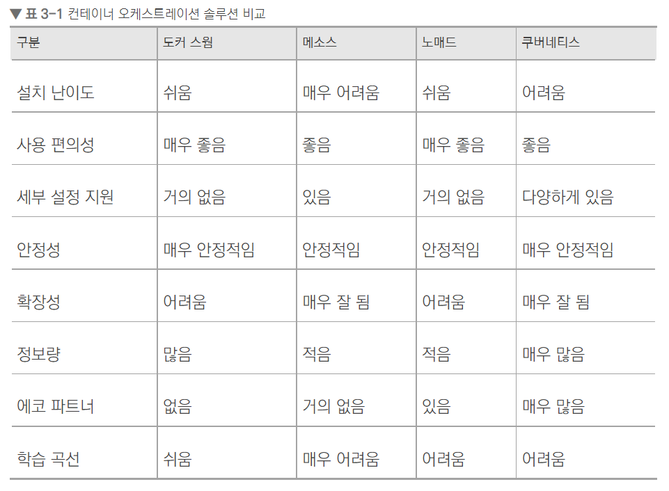
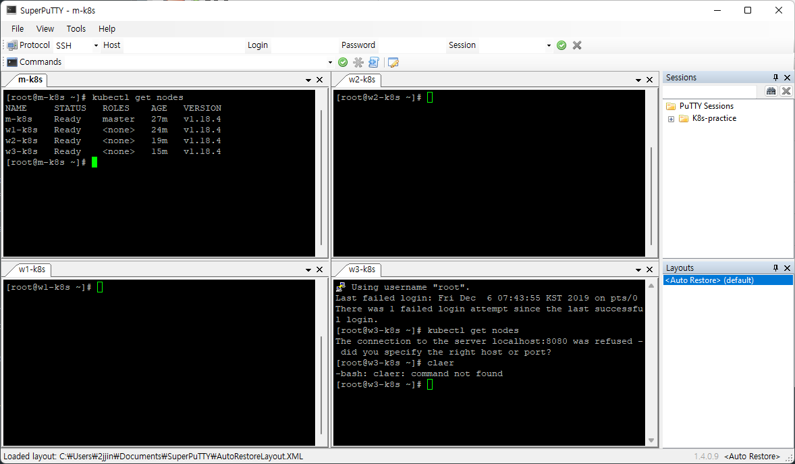
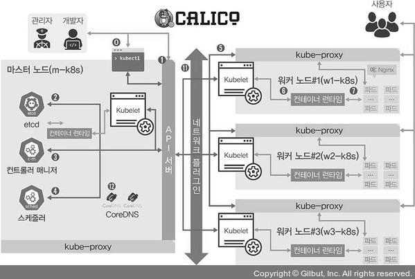
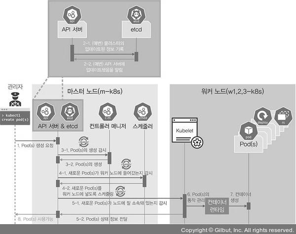
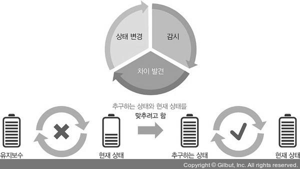

## 📍 컨테이너 오케스트레이션 솔루션
1. 도커 스웜 (Docker Swarm)
    - 도커와 함께 간단하게 설치할 수 있고 사용하기도 용이하다.
    - 기능이 다양하지 않아 대규모 환경에서는 잘 사용하지 않으며 주로 소규모 환경에서 사용한다.
2. 메소스 (Mesos)
    - 아파치(Apache)의 오픈 소스 프로젝트로 역사와 전통이 있는 클러스터 도구.
    - 이미 다양한 글로벌 회사에서 사용하고 있는 검증된 솔루션이나 기능을 충분히 사용하려면 분산 관리 시스템과 연동해야 한다.
3. 노매드 (Nomad)
    - 베이그런트를 만든 해시코프(HashiCorp)사의 컨테이너 오케스트레이션.
    - 베이그런트처럼 간단한 구성으로 컨테이너 오케스트레이션 환경을 제공하지만 도커 스웜과 마찬가지로 기능이 부족하고 복잡.
    - 해시코프의 다른 소프트웨어와의 연동이 원할하므로 이런 도구에 대한 사용 성숙도가 높은 조직이라면 도입 고려.

4. 쿠버네티스 (K8s)
    - 시작하는 데 어려움이 있지만, 쉽게 사용할 수 있도록 도와주는 도구들이 있어서 설치가 쉬워지고 있음.
    - 지속적으로 계속 발전되고 있어서 컨테이너 오케스트레이션을 넘어 IT 인프라 자체를 컨테이너화하고, 컨테이너화된 인프라 제품군을 쿠버네티스 위에서 동작할 수 있게 함.
    - 거의 모든 벤더와 오픈 소스 진영 모두에서 쿠버네티스를 지원하고 그에 맞게 통합 개발하고 있으므로 컨테이너 오케이스트레이션을 학습하거나 도입하려고 한다면 쿠버네티스를 우선적으로 고려해야 함.



## 📍 쿠버네티스 구성 방법
1. 퍼블릭 클라우드 업체에서 제공하는 관리형 쿠버네티스 사용.
   ex) EKS(Amazon Elastic Kubernetes Service), AKS(Azure Kubernetes Services), GKE(Google Kubernetes Engine) 등.
2. 수세의 Rancher, 레드햇의 OpenShift와 같은 플랫폼에서 제공하는 설치형 쿠버네티스 사용. 하지만 유료라 접근성 떨어짐.
3. 사용하는 시스템에 쿠버네티스 클러스터를 자동으로 구성해주는 솔루션(구성형 쿠버네티스) 사용.
   ex) kubeadm, kops(Kubernetes Operations), KRIB(Kubernetes Rebar Integrated Bootstrap), kubespray 등
   (kubeadm이 가장 보편적. 사용자가 변경하기도 수월하고, 온프레미스(On-Premises)와 클라우드를 모두 지원하며, 배우기도 쉬움)

<br>

## 📍 쿠버네티스 실습 환경 구성


- 베이그런트를 활용하여 쿠버네티스 기본 환경 구성
- 책 및 Github 참고자료 활용

```shell

## 쿠버네티스 구성 요소 확인. 모든 네임스페이스에서 파드를 수집해 목록을 출력함.
$ kubectl get pods --all-namespaces
NAMESPACE     NAME                                      READY   STATUS    RESTARTS   AGE
kube-system   calico-kube-controllers-99c9b6f64-v49jj   1/1     Running   0          40m
kube-system   calico-node-chdrn                         1/1     Running   0          28m
kube-system   calico-node-h66j9                         1/1     Running   0          37m
kube-system   calico-node-lcnwl                         1/1     Running   0          40m
kube-system   calico-node-mtgb6                         1/1     Running   0          32m
kube-system   coredns-66bff467f8-49t78                  1/1     Running   0          40m
kube-system   coredns-66bff467f8-fjdmg                  1/1     Running   0          40m
kube-system   etcd-m-k8s                                1/1     Running   0          40m
kube-system   kube-apiserver-m-k8s                      1/1     Running   0          40m
kube-system   kube-controller-manager-m-k8s             1/1     Running   0          40m
kube-system   kube-proxy-8vkjc                          1/1     Running   0          37m
kube-system   kube-proxy-mjtk2                          1/1     Running   0          28m
kube-system   kube-proxy-q7cb5                          1/1     Running   0          32m
kube-system   kube-proxy-t4kxs                          1/1     Running   0          40m
kube-system   kube-scheduler-m-k8s                      1/1     Running   0          40m

```



### 마스터 노드
1. kubectl
    - 쿠버네티스 클러스터에 명령을 내리는 역할을 합니다.
    - 다른 구성 요소들과 다르게 바로 실행되는 명령 형태인 바이너리(binary)로 배포되기 때문에 마스터 노드에 있을 필요는 없습니다. 하지만 통상적으로 API 서버와 주로 통신하므로 이 책에서는 API 서버가 위치한 마스터 노드에 구성했습니다.

2. API 서버
    - 쿠버네티스 클러스터의 중심 역할을 하는 통로입니다.
    - 주로 상태 값을 저장하는 etcd와 통신하지만, 그 밖의 요소들 또한 API 서버를 중심에 두고 통신하므로 API 서버의 역할이 매우 중요합니다. 회사에 비유하면 모든 직원과 상황을 관리하고 목표를 설정하는 관리자에 해당합니다.

3. etcd (etc + distributed)
    - 구성 요소들의 상태 값이 모두 저장되는 곳입니다.
    - 회사의 관리자가 모든 보고 내용을 기록하는 노트라고 생각하면 됩니다.
    - 실제로 etcd 외의 다른 구성 요소는 상태 값을 관리하지 않습니다. 그러므로 etcd의 정보만 백업돼 있다면 긴급한 장애 상황에서도 쿠버네티스 클러스터는 복구할 수 있습니다. 또한 etcd는 분산 저장이 가능한 key-value 저장소이므로, 복제해 여러 곳에 저장해 두면 하나의 etcd에서 장애가 나더라도 시스템의 가용성을 확보할 수 있습니다. 이와 같은 멀티 마스터 노드 형태는 부록에서 kubespray로 구성해 보겠습니다.

4. 컨트롤러 매니저
    - 컨트롤러 매니저는 쿠버네티스 클러스터의 오브젝트 상태를 관리합니다.
    - 예를 들어 워커 노드에서 통신이 되지 않는 경우, 상태 체크와 복구는 컨트롤러 매니저에 속한 노드 컨트롤러에서 이루어집니다. 다른 예로 레플리카셋 컨트롤러는 레플리카셋에 요청받은 파드 개수대로 파드를 생성합니다. 뒤에 나오는 서비스와 파드를 연결하는 역할을 하는 엔드포인트 컨트롤러 또한 컨트롤러 매니저입니다. 이와 같이 다양한 상태 값을 관리하는 주체들이 컨트롤러 매니저에 소속돼 각자의 역할을 수행합니다. 여기서 나온 오브젝트에 관해서는 ‘3.2.2 오브젝트란’에서 자세히 다룹니다.

5. 스케줄러
    - 노드의 상태와 자원, 레이블, 요구 조건 등을 고려해 파드를 어떤 워커 노드에 생성할 것인지를 결정하고 할당합니다.
    - 스케줄러라는 이름에 걸맞게 파드를 조건에 맞는 워커 노드에 지정하고, 파드가 워커 노드에 할당되는 일정을 관리하는 역할을 담당합니다.

### 워커 노드

1. kubelet
    - 파드의 구성 내용(PodSpec)을 받아서 컨테이너 런타임으로 전달하고, 파드 안의 컨테이너들이 정상적으로 작동하는지 모니터링합니다.

2. 컨테이너 런타임(CRI, Container Runtime Interface)
    - 파드를 이루는 컨테이너의 실행을 담당합니다.
    - 파드 안에서 다양한 종류의 컨테이너가 문제 없이 작동하게 만드는 표준 인터페이스입니다. 자세한 내용은 ‘부록 D 컨테이너 깊게 들여다보기’를 참고하기 바랍니다.

3. 파드(Pod)
    - 한 개 이상의 컨테이너로 단일 목적의 일을 하기 위해서 모인 단위입니다.
    - 즉, 웹 서버 역할을 할 수도 있고 로그나 데이터를 분석할 수도 있습니다. 여기서 중요한 것은 파드는 언제라도 죽을 수 있는 존재라는 점입니다. 이것이 쿠버네티스를 처음 배울 때 가장 이해하기 어려운 부분입니다. 가상 머신은 언제라도 죽을 수 있다고 가정하고 디자인하지 않지만, 파드는 언제라도 죽을 수 있다고 가정하고 설계됐기 때문에 쿠버네티스는 여러 대안을 디자인했습니다. 어려운 내용이므로 여러 가지 테스트를 통해 여러분이 이해하도록 돕겠습니다.

### 파드가 배포된 이후 사용자가 배포된 파드에 접속하는 과정
1. kube-proxy
    - 쿠버네티스 클러스터는 파드가 위치한 노드에 kube-proxy를 통해 파드가 통신할 수 있는 네트워크를 설정합니다.
    - 이 때 실제 통신은 br_netfilter와 iptables로 관리합니다. 두 기능은 Vagrantfile에서 호출하는 config.sh 코드를 설명할 때 다뤘습니다.

2. 파드
    - 이미 배포된 파드에 접속하고 필요한 내용을 전달받습니다.
    - 이 때 대부분 사용자는 파드가 어느 워커 노드에 위치하는지 신경 쓰지 않아도 됩니다.

<br>

## 📍 파드의 생명주기로 알아보는 쿠버네티스 구성 요소



- 쿠버네티스의 가장 큰 장점은 쿠버네티스의 구성 요소마다 하는 일이 명확하게 구분돼 각자의 역할만 충실하게 수행하면 클러스터 시스템이 안정적으로 운영된다는 점. 
  이렇게 각자의 역할이 명확하게 나뉘어진 것은 마이크로서비스 아키텍처(MSA) 구조와도 밀접하게 연관되며, 역할이 나뉘어 있어서 문제가 발생했을 때 어느 부분에서 문제가 발생했는지 디버깅하기 쉽다.

1. kubectl을 통해 API 서버에 파드 생성을 요청.

2. (업데이트가 있을 때마다 매번) API 서버에 전달된 내용이 있으면 API 서버는 etcd에 전달된 내용을 모두 기록해 클러스터의 상태 값을 최신으로 유지.
   따라서 각 요소가 상태를 업데이트할 때마다 모두 API 서버를 통해 etcd에 기록.

3. API 서버에 파드 생성이 요청된 것을 컨트롤러 매니저가 인지하면 컨트롤러 매니저는 파드를 생성하고, 이 상태를 API 서버에 전달. (파드만 생성됨.)

4. API 서버에 파드가 생성됐다는 정보를 스케줄러가 인지 후, 스케줄러는 생성된 파드를 어떤 워커 노드에 적용할지 조건을 고려해 결정하고 해당 워커 노드에 파드를 띄우도록 요청함.

5. API 서버에 전달된 정보대로 지정한 워커 노드에 파드가 속해 있는지 스케줄러가 kubelet으로 확인.

6. kubelet에서 컨테이너 런타임으로 파드 생성을 요청.

7. 파드 생성 및 사용 가능 상태 (Running)가 됨.

- 쿠버네티스는 작업을 순서대로 진행하는 워크플로(workflow, 작업 절차) 구조가 아니라 선언적인(declarative) 시스템 구조.   
  즉, 각 요소가 추구하는 상태(desired status)를 선언하면 현재 상태(current status)와 맞는지 점검하고 그것에 맞추려고 노력하는 구조다.
- 따라서 추구하는 상태를 API 서버에 선언하면 다른 요소들이 API 서버에 와서 현재 상태와 비교하고 그에 맞게 상태를 변경하려고 한다. 
  여기서 API는 현재 상태 값을 가지고 있는데, 이것을 보존하기 위해 etcd가 필요한 것. API 서버와 etcd는 거의 한몸처럼 움직이도록 설계되었으며, 워커 노드는 워크플로 구조에 따라 설계됨.
- 쿠버네티스가 kubelet과 컨테이너 런타임을 통해 파드를 새로 생성하고 제거해야 하는 구조여서 선언적인 방식으로 구조화하기에는 어려움이 있음. 
  또한 명령이 절차적으로 전달되는 방식은 시스템의 성능을 높이는 데 효율적이지만, 마스터 노드는 이미 생성된 파드들을 유기적으로 연결하므로 쿠버네티스 클러스터를 안정적으로 유지하려면 선언적인 시스템이 더 낫다.



<br>

## 📍 쿠버네티스 구성 요소의 기능 검증

### kubectl
```shell
## m-k8s (master node) 에서 실행
# 마스터 노드에서 실행할 때에는 kubectl이 클러스터에 대한 정보를 알고 있기 때문에 명령어 실행 가능
$ kubectl get nodes
NAME     STATUS   ROLES    AGE   VERSION
m-k8s    Ready    master   58m   v1.18.4
w1-k8s   Ready    <none>   55m   v1.18.4
w2-k8s   Ready    <none>   50m   v1.18.4
w3-k8s   Ready    <none>   46m   v1.18.4

## w2-k8s (worker node) 에서 실행
# 워커 노드에서 실행시에는 쿠버네티스의 클러스터 정보를 가지고 있지 않으므로 명령어 실행 불가
# 클러스터 정보를 마스터 노드에서 받아와 실행하면 명령어 실행 가능
$ kubectl get nodes
The connection to the server localhost:8080 was refused - did you specify the right host or port?

# 구성정보를 master node에서 copy
$ scp root@192.168.1.10:/etc/kubernetes/admin.conf .
...
admin.conf                                                            100% 5448     3.6MB/s   00:00

# 명령어 다시 실행. --kubeconfig 옵션 및 config 파일을 정의하여 명령어 실행.
$ kubectl get nodes --kubeconfig admin.conf
NAME     STATUS   ROLES    AGE   VERSION
m-k8s    Ready    master   64m   v1.18.4
w1-k8s   Ready    <none>   60m   v1.18.4
w2-k8s   Ready    <none>   56m   v1.18.4
w3-k8s   Ready    <none>   52m   v1.18.4
```

### kubelet
- 파드의 생성과 상태 관리 및 복구를 담당
-
```shell
## m-k8s (master node) 에서 실행
# nginx 파드 배포
$ kubectl create -f ~/_Book_k8sInfra/ch3/3.1.6/nginx-pod.yaml
pod/nginx-pod created

# 파드가 정상적으로 배포되었는지 확인
$ kubectl get pod
NAME        READY   STATUS              RESTARTS   AGE
nginx-pod   0/1     ContainerCreating   0          6s     (before)
nginx-pod   1/1     Running             0          2m46s  (after)


# 파드가 배포된 워커 노드 확인. -o (output) / wide (출력 정보 많이 표시)
$ kubectl get pods -o wide
NAME        READY   STATUS              RESTARTS   AGE      IP                NODE     NOMINATED NODE   READINESS GATES
nginx-pod   0/1     ContainerCreating   0          14s      <none>            w2-k8s   <none>           <none>          (before)
nginx-pod   1/1     Running             0          2m48s    172.16.103.129    w2-k8s   <none>           <none>          (after)

## 강제로 kubelet에 문제를 발생시킨 후 kubelet에 문제 발생 시 파드 관리가 정상적인지 확인
# kubelet daemon stop
## w2-k8s (worker node) 에서 실행
$ systemctl stop kubelet

## m-k8s (master node) 에서 실행
# pod 삭제 시도 (삭제 잘 안돼서 ctrl+c로 중지)
$ kubectl delete pod nginx-pod
pod "nginx-pod" deleted
^C

# pod 상태 확인
$ kubectl get pod
NAME        READY   STATUS        RESTARTS   AGE
nginx-pod   1/1     Terminating   0          7m48s

## w2-k8s (worker node) 에서 실행
# daemon 다시 실행
$ systemctl start kubelet

## m-k8s (master node) 에서 실행
# 파드 목록 안뜨는 것 확인
$ kubectl get pod
No resources found in default namespace.
```

### kube-proxy
- 파드의 통신 담당

```shell

## m-k8s (master node) 에서 실행
# 다시 nginx 파드 생성
$ kubectl create -f ~/_Book_k8sInfra/ch3/3.1.6/nginx-pod.yaml
pod/nginx-pod created

$ kubectl get pod
NAME        READY   STATUS    RESTARTS   AGE
nginx-pod   1/1     Running   0          12s

$ kubectl get pods -o wide
NAME        READY   STATUS    RESTARTS   AGE   IP               NODE     NOMINATED NODE   READINESS GATES
nginx-pod   1/1     Running   0          7s    172.16.103.130   w2-k8s   <none>           <none>

$ curl 172.16.103.130
<!DOCTYPE html>
<html>
...
<body>
<h1>Welcome to nginx!</h1>
<p>If you see this page, the nginx web server is successfully installed and
working. Further configuration is required.</p>

<p>For online documentation and support please refer to
<a href="http://nginx.org/">nginx.org</a>.<br/>
Commercial support is available at
<a href="http://nginx.com/">nginx.com</a>.</p>

<p><em>Thank you for using nginx.</em></p>
</body>
</html>

## w2-k8s (worker node) 에서 실행
# 네트워크 관련 모듈 제거 및 네트워크 재실행 (kube-proxy에 의도적인 문제 발생시킴)
$ modprobe -r br_netfilter
$ systemctl restart network


## m-k8s (master node) 에서 실행
# 파드에서 정보를 받아오지 못해 curl 명령어가 실행되지 않으나 여전히 get pods 명령어 결과값은 같음.
# 실제로는 kube-proxy가 이용하는 br_netfilter에 문제가 생겨 서버와의 통신이 제대로 이루어지지 않는 상태.
$ curl 172.16.103.130
^C
$ kubectl get pods -o wide
NAME        READY   STATUS    RESTARTS   AGE   IP               NODE     NOMINATED NODE   READINESS GATES
nginx-pod   1/1     Running   0          10m   172.16.103.130   w2-k8s   <none>           <none>

## w2-k8s (worker node) 에서 실행
# 삭제했던 br_netfilter를 다시 커널에 적재하고 시스템 reboot
$ modprobe br_netfilter
$ reboot

## m-k8s (master node) 에서 실행
# RESTARTS가 0 --> 1로 증가한 것 확인 가능. curl 명령어도 다시 결과 확인 가능.
$ kubectl get pods -o wide
NAME        READY   STATUS    RESTARTS   AGE   IP               NODE     NOMINATED NODE   READINESS GATES
nginx-pod   1/1     Running   1          11m   172.16.103.131   w2-k8s   <none>           <none>

$ curl 172.16.103.131
<!DOCTYPE html>
<html>
...
<body>
<h1>Welcome to nginx!</h1>
<p>If you see this page, the nginx web server is successfully installed and
working. Further configuration is required.</p>

<p>For online documentation and support please refer to
<a href="http://nginx.org/">nginx.org</a>.<br/>
Commercial support is available at
<a href="http://nginx.com/">nginx.com</a>.</p>

<p><em>Thank you for using nginx.</em></p>
</body>
</html>

$ kubectl delete -f ~/_Book_k8sInfra/ch3/3.1.6/nginx-pod.yaml
pod "nginx-pod" deleted

```

<br>