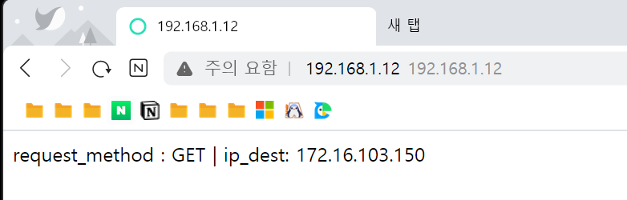
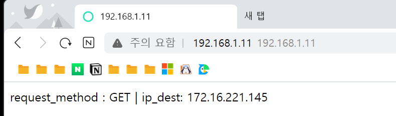

## 📍 컨테이너 인프라 환경에서의 CI/CD

1. CI/CD 비교
- CI (Continuous Integration)
  - 코드를 커밋하고 빌드했을 때 정상적으로 작동하는지 반복적으로 검증해 애플리케이션의 신뢰성을 높이는 작업
- CD (Continuous Deployment)
  - 신뢰할 수 있는 애플리케이션을 실제 상용 환경(Production) 에 자동으로 배포하는 것

<br>

2. CI/CD 도구 비교
   1. 팀시티(Teamcity)
      - jetbrains에서 만든 CI/CD 도구, 코틀린을 기반으로 만든 스크립트 언어로 작업 구성 가능.
   2. 깃허브 액션(Github action)
      - 깃허브에서 지원하는 워크플로 기반의 CI/CD 도구. 깃허브 퍼블릭 저장소의 경우 깃허브 액션 무료 사용 가능. (한 달에 2000분 제한 시간 존재)
   3. 뱀부(Bamboo)
      - Atlassian에서 만든 CI/CD 도구. 유료. 다른 아틀라시안 협업 도구와의 연계성이 좋음.
   4. 젠킨스(Jenkins)
      - 오픈 소스 CI/CD 도구. 제일 범용적으로 사용하고 있으며, 사용자가 직접 UI에서 작업을 구성하거나 작업 순서를 코드로 정의할 수 있음.
      - 특정 언어나 환경에 구애받지 않고 무난하게 사용 가능.
   
<br>

## 📍 배포 간편화 도구 알아보기
1. kubectl (큐브시티엘)
   - 쿠버네티스에 기본으로 포함된 커멘드라인 도구. 추가 설치 없이 바로 사용 가능
   - 개별적인 오브젝트 관리나 배포시 사용하는 것이 좋음.
   
2. kustomize (커스터마이즈)
   - 오브젝트를 사용자의 의도에 따라 유동적으로 배포 가능.
   - 운영 중인 환경에서 배포시 가변적인 요소를 적용하는 데 적합.
   
3. Helm (헬름)
   - 쿠버네티스 사용자의 70%이상이 사용할 정도로 범용적인 도구.
   - 오브젝트 배포에 필요한 사양이 이미 정의된 차트라는 패키지를 활용.
   - 온라인에 헬름 차트 저장소가 존재하기 때문에 패키지를 검색하고 내려받아 상요하기 매우 간편함.
   - 매니페스트의 일부가 아닌 모든 내용을 설정할 수 있는 값을 제공해 필요에 따라 사용자 환경에 맞는 설정값으로 변경 가능함.

## 📍 커스터마이즈로 배포 간편화 하기
1. 커스터마이즈의 작동 원리
   - 커스터마이즈는 야믈 파일에 정의된 값을 사용자가 원하는 값으로 변경할 수 있음.
   - 커스터마이즈는 kustomize 명령어를 통해 일부 항목을 쉽게 변경할수 있도록 함.

2. [실습] 커스터마이즈로 MetalLB 한번에 만들기

```shell

### kustomize 설치 스크립트 실행
[root@m-k8s 5.2.2]# ./kustomize-install.sh
  % Total    % Received % Xferd  Average Speed   Time    Time     Time  Current
                                 Dload  Upload   Total   Spent    Left  Speed
  0     0    0     0    0     0      0      0 --:--:-- --:--:-- --:--:--     0
100 12.4M  100 12.4M    0     0   474k      0  0:00:26  0:00:26 --:--:--  611k
kustomize install successfully

### 커스터마이즈로 변경될 작업을 정의해 kustomization.yaml 파일 생성
[root@m-k8s 5.2.2]# kustomize create --namespace=metallb-system --resources namespace.yaml,metallb.yaml,metallb-l2config.yaml
[root@m-k8s 5.2.2]# ls
kustomization.yaml  kustomize-install.sh  metallb-l2config.yaml  metallb.yaml  namespace.yaml

### 생성된 kustomization.yaml 파일 확인
[root@m-k8s 5.2.2]# cat kustomization.yaml
apiVersion: kustomize.config.k8s.io/v1beta1
kind: Kustomization
resources:
- namespace.yaml
- metallb.yaml
- metallb-l2config.yaml
namespace: metallb-system

### 설치된 이미지를 안정적인 버전으로 유지하기 위해 명령어로 이미지 태그 지정
[root@m-k8s 5.2.2]# kustomize edit set image metallb/controller:v0.8.2
[root@m-k8s 5.2.2]# kustomize edit set image metallb/speaker:v0.8.2

### 태그 지정 확인
[root@m-k8s 5.2.2]# cat kustomization.yaml
apiVersion: kustomize.config.k8s.io/v1beta1
kind: Kustomization
resources:
- namespace.yaml
- metallb.yaml
- metallb-l2config.yaml
namespace: metallb-system
images:
- name: metallb/controller
  newTag: v0.8.2
- name: metallb/speaker
  newTag: v0.8.2

# kubectl apply에 바로 인자로 전달해 배포.
# 결과는 unchanged지만 정상적으로 배포된 것 확인됨.
[root@m-k8s 5.2.2]# kustomize build | kubectl apply -f -
namespace/metallb-system unchanged
serviceaccount/controller unchanged
serviceaccount/speaker unchanged
podsecuritypolicy.policy/speaker unchanged
role.rbac.authorization.k8s.io/config-watcher unchanged
clusterrole.rbac.authorization.k8s.io/metallb-system:controller unchanged
clusterrole.rbac.authorization.k8s.io/metallb-system:speaker unchanged
rolebinding.rbac.authorization.k8s.io/config-watcher unchanged
clusterrolebinding.rbac.authorization.k8s.io/metallb-system:controller unchanged
clusterrolebinding.rbac.authorization.k8s.io/metallb-system:speaker unchanged
configmap/config unchanged
deployment.apps/controller unchanged
daemonset.apps/speaker unchanged

[root@m-k8s 5.2.2]# kubectl get pods -n metallb-system
NAME                          READY   STATUS    RESTARTS   AGE
controller-5f98465b6b-94n4k   1/1     Running   0          40d
speaker-2tjfv                 1/1     Running   0          40d
speaker-n8rhk                 1/1     Running   0          40d
speaker-qqs5n                 1/1     Running   0          40d
speaker-sch8m                 1/1     Running   0          40d

### 태그가 제대로 적용되었는지 확인
[root@m-k8s 5.2.2]# kubectl describe pods -n metallb-system | grep Image:
    Image:         metallb/controller:v0.8.2
    Image:         metallb/speaker:v0.8.2
    Image:         metallb/speaker:v0.8.2
    Image:         metallb/speaker:v0.8.2
    Image:         metallb/speaker:v0.8.2

# 디플로이먼트 배포 후 확인
[root@m-k8s 5.2.2]# kubectl create deployment echo-ip --image=sysnet4admin/echo-ip
deployment.apps/echo-ip created
[root@m-k8s 5.2.2]# kubectl expose deployment echo-ip --type=LoadBalancer --port=80
service/echo-ip exposed
[root@m-k8s 5.2.2]# kubectl get service echo-ip
NAME      TYPE           CLUSTER-IP     EXTERNAL-IP    PORT(S)        AGE
echo-ip   LoadBalancer   10.97.20.243   192.168.1.12   80:30630/TCP   8s

### 실습 내용 정리 (배포했던 오브젝트 삭제)
[root@m-k8s 5.2.2]# kustomize build | kubectl delete -f -
namespace "metallb-system" deleted
serviceaccount "controller" deleted
serviceaccount "speaker" deleted
podsecuritypolicy.policy "speaker" deleted
role.rbac.authorization.k8s.io "config-watcher" deleted
clusterrole.rbac.authorization.k8s.io "metallb-system:controller" deleted
clusterrole.rbac.authorization.k8s.io "metallb-system:speaker" deleted
rolebinding.rbac.authorization.k8s.io "config-watcher" deleted
clusterrolebinding.rbac.authorization.k8s.io "metallb-system:controller" deleted
clusterrolebinding.rbac.authorization.k8s.io "metallb-system:speaker" deleted
configmap "config" deleted
deployment.apps "controller" deleted
daemonset.apps "speaker" deleted

```
### 실습 결과 화면



<br>

## 📍 헬름으로 배포 간편화 하기
1. 헬름의 작동 원리
   - 헬름은 쿠버네티스 패키지를 관리하는 쿠버네티스 전용 패키지 매니저.
   - 가장 중요한 사용 목적은 설치에 필요한 의존성 파일들을 관리하고 간편하게 설치할 수 있도록 도와줌.

2. 패키지 매니저의 역할과 기능, 장점
   1. 역할
      - 패키지의 손쉬운 설치와 관리
   2. 기능
      - `패키지 검색` : 설정한 저장소에서 패키지를 검색하는 기능 제공.
      - `패키지 관리` : 저장소에서 패키지 정보 확인, 시스템에 패키지 설치/삭제/업그레이드/되돌리기 가능
      - `패키지 의존성 관리` : 패키지를 설치할 때 의존하는 소프트웨어를 같이 설치 / 같이 삭제 가능.
      - `패키지 보안 관리` : 디지털 인증서와 패키지에 고유하게 발행되는 체크섬이라는 값으로 해당 패키지의 소프트웨어나 의존성 변조 검사 가능.
   3. 장점
      - 커스터마이즈에서 변경할 수 없는 값을 환경에 맞게 변경 가능
      - 차트를 생성하여 패키지를 여러 사용자와 공유할 수도 있고, 요구 조건 별로 리소스를 편집하거나 변수를 넘겨 처리하는 패키지를 생성할 수 있음.
        - `차트(chart)` : 다양한 요구 조건을 처리할 수 있는 패키지
      - 배포한 애플리케이션을 업그레이드하거나 되돌릴 수 있는 기능, 삭제할 수 있는 기능 제공

3. 헬름 저장소
   - [아티팩트허브](https://artifacthub.io/)
   - 설치할 패키지에 대한 경로만을 제공하므로 주의.

4. [실습] 헬름으로 MetalLB 한 번에 만들기

```shell

### 헬름 설치
[root@m-k8s 5.2.2]# export DESIRED_VERSION=v3.2.1; ~/_Book_k8sInfra/ch5/5.2.3/helm-install.sh
Downloading https://get.helm.sh/helm-v3.2.1-linux-amd64.tar.gz
Verifying checksum... Done.
Preparing to install helm into /usr/local/bin
helm installed into /usr/local/bin/helm

### 저장소 등록
[root@m-k8s 5.2.2]# helm repo add edu https://iac-source.github.io/helm-charts
"edu" has been added to your repositories

### 저장소 등록 확인
[root@m-k8s 5.2.2]# helm repo list
NAME    URL
edu     https://iac-source.github.io/helm-charts

### 최신 차트 정보 동기화
[root@m-k8s 5.2.2]# helm repo update
Hang tight while we grab the latest from your chart repositories...
...Successfully got an update from the "edu" chart repository
Update Complete. ⎈ Happy Helming!⎈

### 
# MetalLB 설치 명령어 수행
# --namespace: 헬름차트를 통해 생성되는 애플리케이션이 위치할 네임스페이스 지정
# --create-namespace: 네임스페이스 옵션으로 지정된 네임스페이스가 존재하지 않을 경우 새로 생성
# --set : 헬름에서 사용할 변수를 명령 인자로 전달
###
[root@m-k8s 5.2.2]# helm install metallb edu/metallb \
> --namespace=metallb-system \
> --create-namespace \
> --set controller.tag=v0.8.3 \
> --set speaker.tag=v0.8.3 \
> --set configmap.ipRange=192.168.1.11-192.168.1.29
NAME: metallb
LAST DEPLOYED: Thu Sep 22 22:58:39 2022
NAMESPACE: metallb-system
STATUS: deployed
REVISION: 1
TEST SUITE: None
NOTES:
MetalLB load-balancer is successfully installed.
1. IP Address range 192.168.1.11-192.168.1.29 is available.
2. You can create a LoadBalancer service with following command below.
kubectl expose deployment [deployment-name] --type=LoadBalancer --name=[LoadBalancer-name] --port=[external port]

### MetalLB 정상 설치 확인, 배포 상태 확인
[root@m-k8s 5.2.2]# kubectl get pods -n metallb-system
NAME                          READY   STATUS    RESTARTS   AGE
controller-85478cc585-stktl   1/1     Running   0          2m59s
speaker-25pt4                 1/1     Running   0          2m59s
speaker-hjrbc                 1/1     Running   0          2m59s
speaker-m7wbv                 1/1     Running   0          2m59s
speaker-xdppf                 1/1     Running   0          2m59s

[root@m-k8s 5.2.2]# kubectl get configmap -n metallb-system
NAME     DATA   AGE
config   1      2m34s

### 설정한 --set 태그가 적용되었는지 확인
[root@m-k8s 5.2.2]# kubectl describe pods -n metallb-system | grep Image:
    Image:         metallb/controller:v0.8.3
    Image:         metallb/speaker:v0.8.3
    Image:         metallb/speaker:v0.8.3
    Image:         metallb/speaker:v0.8.3
    Image:         metallb/speaker:v0.8.3

### 디플로이먼트 배포 후 ip 할당 확인
[root@m-k8s 5.2.2]# kubectl create deployment echo-ip --image=sysnet4admin/echo-ip
deployment.apps/echo-ip created
[root@m-k8s 5.2.2]# kubectl expose deployment echo-ip --type=LoadBalancer --port=80
service/echo-ip exposed
[root@m-k8s 5.2.2]# kubectl get service echo-ip
NAME      TYPE           CLUSTER-IP     EXTERNAL-IP    PORT(S)        AGE
echo-ip   LoadBalancer   10.99.149.19   192.168.1.11   80:31998/TCP   9s

### 실습 서비스 정리
[root@m-k8s 5.2.2]# kubectl delete service echo-ip
service "echo-ip" deleted
[root@m-k8s 5.2.2]# kubectl delete deployment echo-ip
deployment.apps "echo-ip" deleted

```

### 실습 결과 화면


<br>


