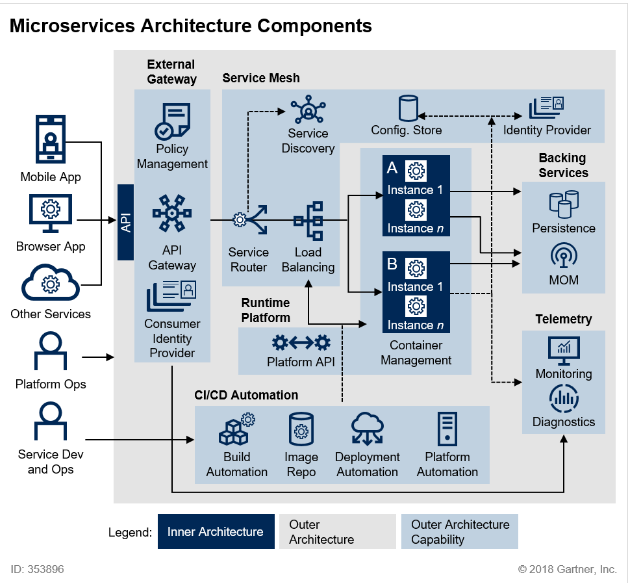

## 📍 컨테이너 인프라 환경이란?

### 1. 모놀리식 아키텍쳐 (Monolithic Architecture)
- 하나의 큰 목적이 있는 서비스 또는 애플리케이션에 여러 기능이 통합돼 있는 구조를 의미
- 소프트웨어가 하나의 결합된 코드로 구성되기 때문에 초기 단계에서 설계하기 용이하며 개발이 좀 더 단순하고 코드 관리가 간편하다.
- 하지만 수정이 많아질 경우, 연관된 다른 서비스에 영향을 미칠 가능성이 커지며, 기능이 점점 추가될수록 서비스 간의 관계가 매우 복잡해질 수 있다.
- 만약 하나의 서비스에 에러가 발생할 경우 전체 서비스에 영향을 미칠 수 있음.

 

### 2. 마이크로서비스 아키텍쳐 (MSA, Microservices Architecture)
- 시스템 전체가 하나의 목적을 지향하는 바는 모놀리식 아키텍쳐와 동일하나 개별 기능을 하는 작은 서비스를 각각 개발해 연결하는 데에서 큰 차이를 보임.
- 보안, 인증 등과 관련된 기능이 독립된 서비스를 구성하고 있으며 다른 서비스들도 독립적으로 동작할 수 있는 완결된 구조로 되어있음.
- 이러한 구조는 개발된 서비스를 재사용하기 쉽고, 향후 서비스가 변경됐을 때 다른 서비스에 영향을 미칠 가능성이 줄어들며 사용량의 변화에 따라 특정 서비스만을 확장하기도 쉽다.
- 하지만, 복잡도가 높으며 각 서비스가 서로 유기적으로 통신하는 구조로 설계되기 때문에 네트워크를 통한 호출 횟수가 증가해 성능에 영향을 줄 수 있다.
- 각 서비스는 `API 게이트웨이`와 REST API를 이용한 통신 방식으로 사용자의 요청을 전달하며, 서비스 개수는 고정된 것이 아니기 때문에 어떤 서비스가 등록돼 있는지를 파악하기 위해 `서비스 디스커버리`를 사용한다.
- 또한, 서비스의 내부 통신을 이벤트로 일원화하고 이를 효과적으로 관리하기 위해 별도로 `이벤트 버스`를 서비스로 구성한다.

### 3. 컨테이너 인프라 환경에 적합한 아키텍쳐
- 컨테이너 인프라 환경은 특히 MSA로 구현하기에 적합하다.
- 컨테이너를 서비스 단위로 포장해 손쉽게 배포하고 확장할 수 있으며, 도입, 설계, 운용비용을 감소시킬 수 있고 생산성을 향상시킬 수 있다.

 

## 📍 컨테이너 인프라 환경을 지원하는 도구

### 1. 도커 (Docker)
- 컨테이너 환경에서 독립적으로 애플리케이션을 실행할 수 있도록 컨테이너를 만들고 관리하는 것을 도와주는 컨테이너 도구
### 2. 쿠버네티스 (K8s)
- 컨테이너 관리 도구. 컨테이너의 자동 배포, 컨테이너 대한 동작 보증, 부하에 따른 동적 확장 등의 기능 제공
### 3. 젠킨스 (Jenkins)
- CI(Continuous Integration, 지속적 통합), CD(Continuous Deployment, 지속적 배포)를 지원.
- 개발한 프로그램의 빌드, 테스트, 패키지화, 배포 단계를 모두 자동화해 개발 단계를 표준화한다.
### 4. 프로메테우스(Prometheus)와 그라파나(Grafana)
- 프로메테우스는 상태 데이터를 수집하고, 그라파나는 프로메테우스로 수집한 데이터를 관리자가 보기 좋게 시각화한다.
- 효율적으로 모니터링 하는 방법으로 프로메테우스와 그라파나의 조합을 많이 사용한다.

## 💎 Reference
- [https://blog.lgcns.com/1278](https://blog.lgcns.com/1278)