## 📍 젠킨스 설치 및 설정하기

1. [실습] 헬름으로 젠킨스 설치하기
```shell

### 이미지 레지스트리 구성 확인
[root@m-k8s 4.4.2]# docker ps -f name=registry
CONTAINER ID        IMAGE               COMMAND                  CREATED             STATUS              PORTS                             NAMES
f755f493925f        registry:2          "/entrypoint.sh /e..."   5 minutes ago       Up 5 minutes        5000/tcp, 0.0.0.0:8443->443/tcp   registry

### PV 생성을 위한 NFS Directory 생성
[root@m-k8s ~]# cd _Book_k8sInfra/ch5/5.3.1
[root@m-k8s 5.3.1]# ./nfs-exporter.sh jenkins
Created symlink from /etc/systemd/system/multi-user.target.wants/nfs-server.service to /usr/lib/systemd/system/nfs-server.service.


[root@m-k8s 5.3.1]# ls -n /nfs_shared
total 0
drwxr-xr-x. 2 0 0 6 Sep 23 00:49 jenkins

### NFS 디렉터리에 대한 접근 ID를 1000번으로 설정
### 젠킨스 컨트롤러 이미지에서 기본적으로 사용하는 유저,그룹ID가 1000번이기 때문에 다음과 같이 설정.
[root@m-k8s 5.3.1]# chown 1000:1000 /nfs_shared/jenkins

[root@m-k8s 5.3.1]# ls -n /nfs_shared
total 0
drwxr-xr-x. 2 1000 1000 6 Sep 23 00:49 jenkins

### pv, pvc 구성
[root@m-k8s 5.3.1]# kubectl apply -f ~/_Book_k8sInfra/ch5/5.3.1/jenkins-volume.yaml
persistentvolume/jenkins created
persistentvolumeclaim/jenkins created

### 구성 확인
[root@m-k8s 5.3.1]# kubectl get pv jenkins
NAME      CAPACITY   ACCESS MODES   RECLAIM POLICY   STATUS   CLAIM             STORAGECLASS   REASON   AGE
jenkins   10Gi       RWX            Retain           Bound    default/jenkins                           9s

### 젠킨스 설치
[root@m-k8s 5.3.1]# ~/_Book_k8sInfra/ch5/5.3.1/jenkins-install.sh
NAME: jenkins
LAST DEPLOYED: Fri Sep 23 01:20:20 2022
NAMESPACE: default
STATUS: deployed
REVISION: 1
NOTES:
1. Get your 'admin' user password by running:
  printf $(kubectl get secret --namespace default jenkins -o jsonpath="{.data.jenkins-admin-password}" | base64 --decode);echo
2. Get the Jenkins URL to visit by running these commands in the same shell:
  NOTE: It may take a few minutes for the LoadBalancer IP to be available.
        You can watch the status of by running 'kubectl get svc --namespace default -w jenkins'
  export SERVICE_IP=$(kubectl get svc --namespace default jenkins --template "{{ range (index .status.loadBalancer.ingress 0) }}{{ . }}{{ end }}")
  echo http://$SERVICE_IP:80/login

3. Login with the password from step 1 and the username: admin

4. Use Jenkins Configuration as Code by specifying configScripts in your values.yaml file, see documentation: http:///configuration-as-code and examples: https://github.com/jenkinsci/configuration-as-code-plugin/tree/master/demos

For more information on running Jenkins on Kubernetes, visit:
https://cloud.google.com/solutions/jenkins-on-container-engine
For more information about Jenkins Configuration as Code, visit:
https://jenkins.io/projects/jcasc/

### 디플로이먼트 정상 배포 확인
[root@m-k8s 5.3.1]# kubectl get deployment
NAME             READY   UP-TO-DATE   AVAILABLE   AGE
hpa-hname-pods   1/1     1            1           40d
jenkins          1/1     1            1           17m

```

1. 마스터노드에 젠킨스 파드가 배포될수 있었던 이유?
- 테인트(taints)와 톨러레이션(tolerations) 혼합 사용 때문에
- 매우 특별하게 관리되어야 하는 노드에 테인트를 설정해, 쉽게 접근하지 못하도록 설정.
- 이 테인트에 접근하기 위해서는 톨러레이션이라는 키가 있어야 함.
- 그러므로 마스터 노드에 테인트를 설정해 특별한 목적으로 사용되는 노드라는걸 명시한 것.
- 보통 GPU, DB 전용 노드 등의 특수 목적으로 주로 사용됨.

2. 젠킨스 구조 살펴보기
   1. 젠킨스 에이전트 (jenkins-agent)
      - 필요 시에 생성되고 작업을 마치면 삭제되는 임시적인 구조
      - 젠킨스 에이전트 작업 내용들은 삭제 전에 젠킨스 컨트롤러에 저장돼야 하며, 이를 위해 젠킨스 에이전트 서비스가 항상 동작하고 있어야 한다.
      - 젠킨스 컨트롤러가 단독으로 설치할 경우엔 컨트롤러가 설치된 서버에서 젠킨스 자체 시스템 관리, CI/CD 설정, 빌드 등의 작업을 모두 젠킨스 컨트롤러 단일 노드에서 수행한다.
      - 하지만 이 경우 컨트롤러-에이전트 구조로 설치된 것이므로 컨트롤러는 젠킨스 관리 및 설정을 담당하고 실제 빌드는 에이전트 노드에서 이루어진다.
      ```shell
         ### 서비스 상태 확인
         [root@m-k8s 5.3.1]# kubectl get services
         NAME            TYPE           CLUSTER-IP      EXTERNAL-IP    PORT(S)        AGE
         jenkins         LoadBalancer   10.104.43.230   192.168.1.11   80:31983/TCP   22m
         jenkins-agent   ClusterIP      10.96.37.247    <none>         50000/TCP      22m
         kubernetes      ClusterIP      10.96.0.1       <none>         443/TCP        40d
      ```
### 실습 수행 결과 
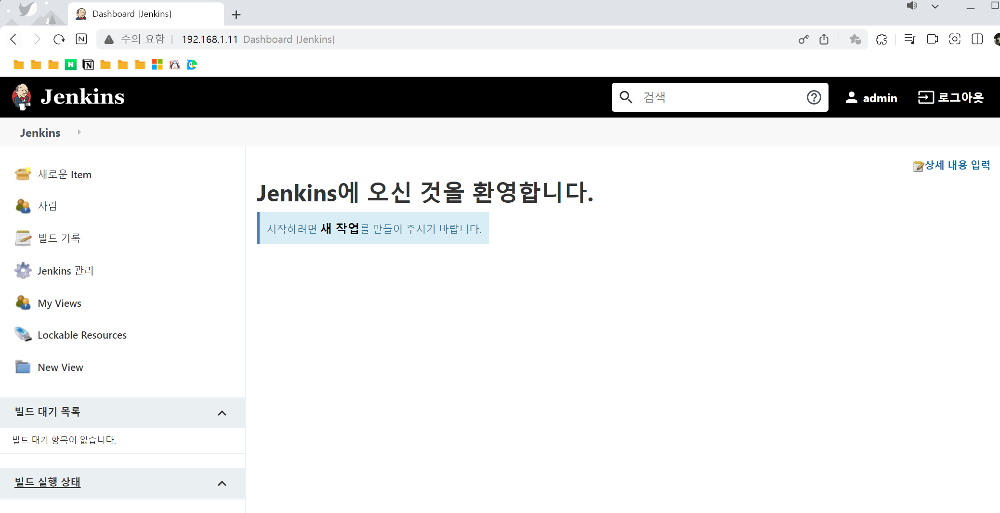

<br>

## 📍 젠킨스 컨트롤러 설정하기
1. 젠킨스 플러그인 관리하기
   - 젠킨스 관리 > 플러그인 관리
   - 호환 가능한 모든 플러그인 업데이트 수행

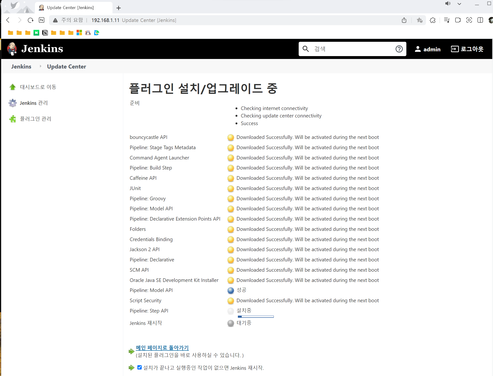

<br>

## 📍 젠킨스 에이전트 설정하기
1. jenkins 서비스 계정을 위한 권한 설정하기
    - cluster-admin 역할을 부여해야 젠킨스 에이전트 파드 내부에서 쿠버네티스 오브젝트에 제약 없이 접근 가능
    - `RBAC(Roll-Based Access Control, 역할 기반 접근 제어)` : 서비스 어카운트에 cluster-admin 역할을 부여하고 이를 권한이 필요한 서비스 어카운트인 jenkins에 묶어주는 것.(binding 해주는 것)
   
    ```shell
    
    ### 현재 계정 확인
    [root@m-k8s 5.3.1]# kubectl get serviceaccounts
    NAME      SECRETS   AGE
    default   1         41d
    jenkins   1         112m

    ### jenkins에 쿠버네티스 클러스터에 대한 admin 권한 부여
    [root@m-k8s 5.3.1]# kubectl create clusterrolebinding jenkins-cluster-admin \
    > --clusterrole=cluster-admin --serviceaccount=default:jenkins
    clusterrolebinding.rbac.authorization.k8s.io/jenkins-cluster-admin created
   ```     
<br>

## 📍 젠킨스 플러그인을 통해 구현되는 GitOps
1. 젠킨스가 제공하는 플러그인 종류
   1. Platforms : 웹 애플리케이션이 아닌 다른 플랫폼에서 작동하는 애플리케이션 빌드를 위한 플러그인
   2. User Interface : 젠킨스의 기본 UI이외의 확장 UI를 적용하기 위한 플러그인 카테고리
   3. Administration : LDAP, 젠킨스 클러스터 관리 등 젠킨스 자체 관리에 필요한 플러그인 종류
   4. Source Code management : 깃허브 및 깃랩과 같은 소스 코드 저장소의 연결이나 관리를 위한 플러그인 카테고리
   5. Build Management : CI/CD 단계에서 추가적으로 사용할 수 있는 플러그인 종류
   
- 플러그인들을 조합하면 단일 플러그인으로 만들지 못하는 기능을 생성할 수 있음.

2. GitOps의 이점
   - 깃허브 저장소의 내용과 실제 상용 및 운영 환경의 내용을 동일하게 가져갈 수 있음. 이를 통해 깃허브로 모든 내용을 단일화해 관리하고 히스토리 관리가 가능해 문제 해결 시간이 짧아진다.
   - 배포를 표준화해 자동 배포가 가능해진다. 배포 과정을 미리 정의해 깃허브 저장소에 변경된 내용을 선언만 하면 모든 배포가 자동으로 진행된다.
   - 휴먼 에러를 주릴 수 있다. 모든 배포 과정은 자동화되므로 사람마다 다르게 행동해 발생하는 실수를 방지할 수 있다.

3. [실습] 쿠버네티스 환경에 적합한 선언적인 배포 환경 만들기
- 깃허브 저장소 만들기 --> [저장소 링크](https://github.com/leejieuns2/GitOps_test.git)
```shell

### git 초기화
[root@m-k8s gitops]# git init

### git config 설정
[root@m-k8s gitops]# git config --global user.name "username"
[root@m-k8s gitops]# git config --global user.email "email-address"
[root@m-k8s gitops]# git config --global credential.helper "store --file ~/.git-cred"
[root@m-k8s gitops]# git remote add origin https://github.com/leejieuns2/GitOps_test.git

### 파일 카피, Git-URL string 실제 repository URL로 대체
[root@m-k8s gitops]# cp ~/_Book_k8sInfra/ch5/5.5.1/* /gitops
[root@m-k8s gitops]# sed -i 's,Git-URL,https://github.com/leejieuns2/GitOps_test.git,g' Jenkinsfile

### 코드 add, git config 내용 확인
[root@m-k8s gitops]# git add .
[root@m-k8s gitops]# git config --list

### 코드 푸시
[root@m-k8s gitops]# git branch -M main
[root@m-k8s gitops]# git push -u origin main
Username for 'https://github.com': {username}
Password for 'https://leejieuns2@github.com': {token_info}
Counting objects: 5, done.
Delta compression using up to 2 threads.
Compressing objects: 100% (4/4), done.
Writing objects: 100% (5/5), 683 bytes | 0 bytes/s, done.
Total 5 (delta 0), reused 0 (delta 0)
To https://github.com/leejieuns2/GitOps_test.git
 * [new branch]      main -> main
Branch main set up to track remote branch main from origin.

```
- git repository 생성
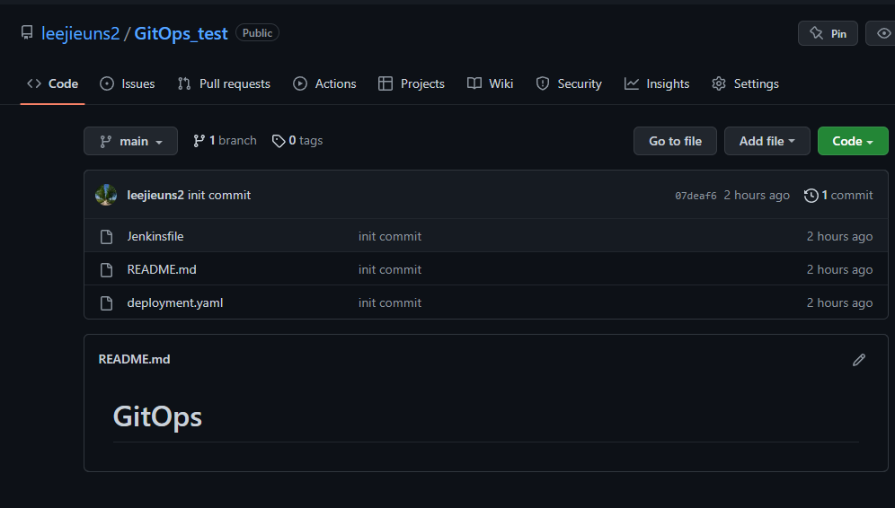

- 자격 증명 정보 생성 (젠킨스 홈 > 젠킨스 관리 > Manage Credentials)
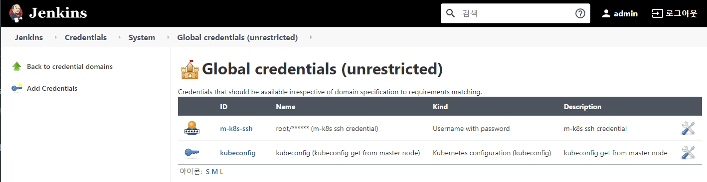

- 젠킨스 item 생성 (젠킨스 홈 > 새로운 item)
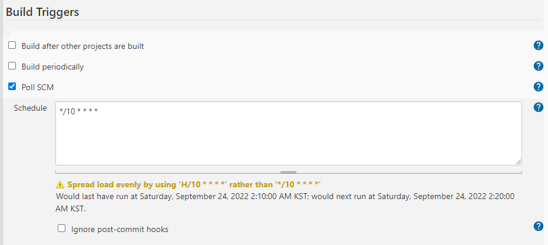
  - Poll SCM은 주기적으로 깃허브 저장소의 변경을 인식하여 자동 배포를 도와줌.
  - 스케줄은 크론 표현식으로 작성하며 위의 그림의 스케줄은 10분마다 변화가 있는지 체크하도록 설정하는 것.
  - 젠킨스에서는 `H/* * * * *` 와 같이 1분에 한번씩 실행하는 것을 권장하지만, 부하가 없는 시점에 실행돼 정확한 시점을 보장할 수 없어 임의 조정.

- item 생성 후 10분 대기해 정상 배포되는지 확인
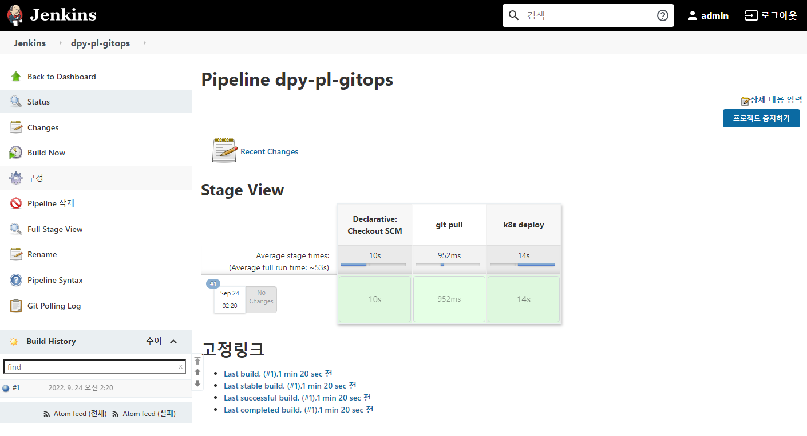

- deployment.yaml 수정 후 깃허브 저장소에 푸시
```shell
### deployment 정상 배포 확인
[root@m-k8s gitops]# kubectl get deployments
NAME             READY   UP-TO-DATE   AVAILABLE   AGE
gitops-nginx     2/2     2            2           2m19s
jenkins          1/1     1            1           25h

### deployment.yaml 내용 일부 변경
[root@m-k8s gitops]# sed -i 's/replicas: 2/replicas: 5/' deployment.yaml
[root@m-k8s gitops]# cat deployment.yaml
apiVersion: apps/v1
kind: Deployment
metadata:
  labels:
    app: gitops-nginx
  name: gitops-nginx
spec:
  replicas: 5   ---> 변경됨.
  selector:
    matchLabels:
      app: gitops-nginx
  template:
    metadata:
      labels:
        app: gitops-nginx
    spec:
      containers:
      - image: nginx
        name: nginx
        
### git add, commit, push
[root@m-k8s gitops]# git add . ; git commit -m "change replicas count" ; git push -u origin main
[main 908a32b] change replicas count
 1 file changed, 1 insertion(+), 1 deletion(-)
Counting objects: 5, done.
Delta compression using up to 2 threads.
Compressing objects: 100% (3/3), done.
Writing objects: 100% (3/3), 284 bytes | 0 bytes/s, done.
...
Branch main set up to track remote branch main from origin.

```
- 변경 내용 자동 배포 결과


<br>

## 📍 슬랙을 통해 변경사항 알리기
1. 젠킨스가 슬랙으로 메세지를 보낼 수 있는 슬랙 채널 생성
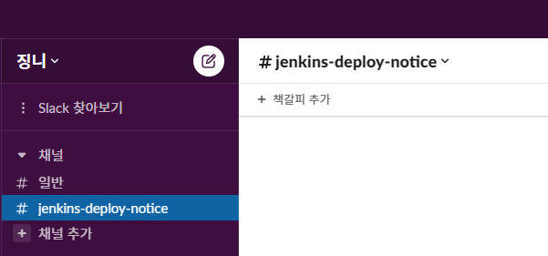

2. 슬랙 채널에 젠킨스가 보내는 메세지를 전달할 수 있는 Jenkins CI 앱을 추가해 젠킨스에서 슬랙 채널 연동을 위한 토큰과 워크스페이스 도메인 주소값 확인
3. 슬랙에서 발급한 토큰 젠킨스 자격 증명에 등록
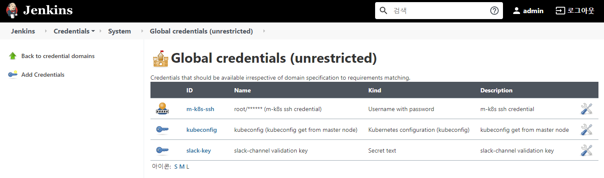
4. 젠킨스에서 슬랙으로 메세지를 보내기 위해 슬랙 알람 플러그인 설치, 시스템 설정 메뉴에 토큰과 워크스페이스 도메인 주소를 입력해 연동 작업 마침.
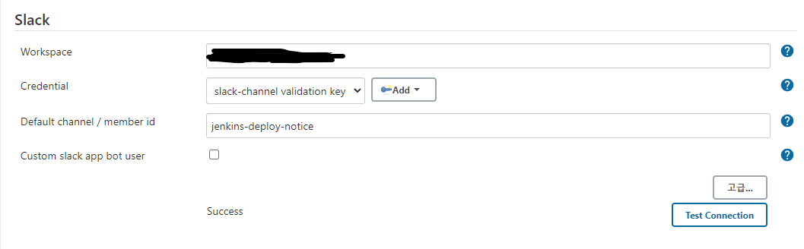

```shell

### slack 연동 관련 Jenkinsfile로 덮어쓰기
[root@m-k8s gitops]# cp ~/_Book_k8sInfra/ch5/5.5.2/Jenkinsfile /gitops/
cp: overwrite ‘/gitops/Jenkinsfile’? y

### URL 변경 및 변경 확인
[root@m-k8s gitops]#sed -i 's,Git-URL,https://github.com/leejieuns2/GitOps_test.git,g' Jenkinsfile
[root@m-k8s gitops]# cat Jenkinsfile
pipeline {
  agent any
  stages {
    stage('deploy start') {
      steps {
        slackSend(message: "Deploy ${env.BUILD_NUMBER} Started"
        , color: 'good', tokenCredentialId: 'slack-key')
      }
    }
    stage('git pull') {
      steps {
        // https://github.com/leejieuns2/GitOps_test.git will replace by sed command before RUN
        git url: 'https://github.com/leejieuns2/GitOps_test.git', branch: 'main'
      }
    }
    stage('k8s deploy'){
      steps {
        kubernetesDeploy(kubeconfigId: 'kubeconfig',
                         configs: '*.yaml')
      }
    }
    stage('deploy end') {
      steps {
        slackSend(message: """${env.JOB_NAME} #${env.BUILD_NUMBER} End
        """, color: 'good', tokenCredentialId: 'slack-key')
      }
    }
  }
}

### 변경사항 git 적용
[root@m-k8s gitops]#git add . ; git commit -m "add slack notification" ; git push -u origin main
[main 65e67c4] add slack notification
 1 file changed, 13 insertions(+), 1 deletion(-)
Counting objects: 5, done.
Delta compression using up to 2 threads.
Compressing objects: 100% (3/3), done.
Writing objects: 100% (3/3), 531 bytes | 0 bytes/s, done.
...
Branch main set up to track remote branch main from origin.

```

5. 정상 배포 확인, 슬랙 연동 확인
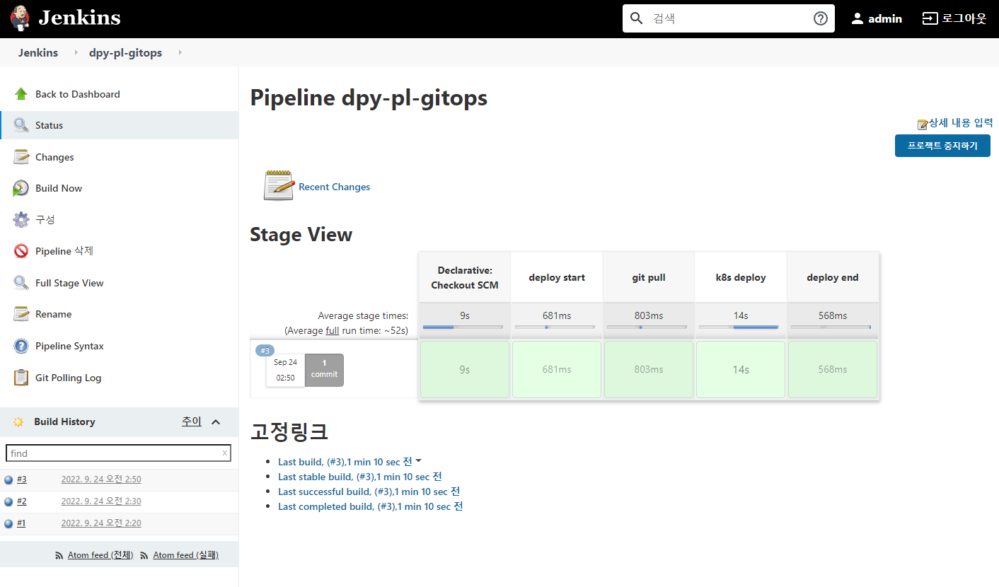
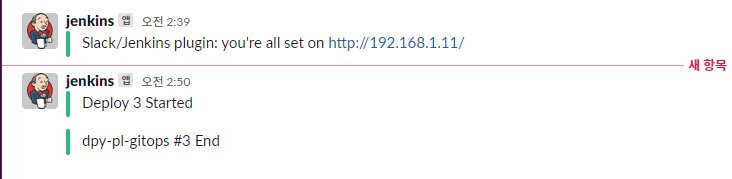

<br>

## 📍 배포 변경 사항을 자동으로 비교하기
- 젠킨스 플러그인 "Last Changes" 를 설치해 배포에 관련된 메세지만 받는 것이 아니라 코드의 변경도 확인 가능

```shell
### 변경사항 덮어쓰기
[root@m-k8s gitops]# cp ~/_Book_k8sInfra/ch5/5.5.3/Jenkinsfile /gitops/
cp: overwrite ‘/gitops/Jenkinsfile’? y

### URL 변경
[root@m-k8s gitops]# sed -i 's,Git-URL,https://github.com/leejieuns2/GitOps_test.git,g' Jenkinsfile

### 변경사항 git repository에 적용
[root@m-k8s gitops]# git add . ; git commit -m "add last changes" ; git push -u origin main
[main 67e28ae] add last changes
 1 file changed, 10 insertions(+), 3 deletions(-)
Counting objects: 5, done.
Delta compression using up to 2 threads.
Compressing objects: 100% (3/3), done.
...
Branch main set up to track remote branch main from origin.
```

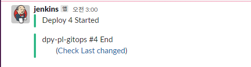