## 📍 Grafana로 모니터링 데이터 시각화하기
1. 헬름으로 그라파나 설치하기
```shell
[root@m-k8s 6.4.1]# ll
total 16
-rwx------. 1 root root  270 Aug 13 01:53 grafana-install.sh
-rwx------. 1 root root 1160 Aug 13 01:53 grafana-preconfig.sh
-rw-r--r--. 1 root root  397 Aug 13 01:53 grafana-volume.yaml
-rwx------. 1 root root  352 Aug 13 01:53 nfs-exporter.sh

[root@m-k8s 6.4.1]# ./grafana-preconfig.sh
[Step 1/4] Task [Check helm status]
[Step 1/4] ok
[Step 2/4] Task [Check MetalLB status]
[Step 2/4] ok
[Step 3/4] Task [Create NFS directory for grafana]
/nfs_shared/grafana created
[Step 3/4] Successfully completed
[Step 4/4] Task [Create PV,PVC for grafana]
persistentvolume/grafana created
persistentvolumeclaim/grafana created
[Step 4/4] Successfully completed

[root@m-k8s 6.4.1]# ./grafana-install.sh
NAME: grafana
LAST DEPLOYED: Sat Oct  8 18:55:15 2022
NAMESPACE: default
STATUS: deployed
REVISION: 1
NOTES:
1. Get your 'admin' user password by running:

   kubectl get secret --namespace default grafana -o jsonpath="{.data.admin-password}" | base64 --decode ; echo

2. The Grafana server can be accessed via port 80 on the following DNS name from within your cluster:

   grafana.default.svc.cluster.local

   Get the Grafana URL to visit by running these commands in the same shell:
NOTE: It may take a few minutes for the LoadBalancer IP to be available.
        You can watch the status of by running 'kubectl get svc --namespace default -w grafana'
     export SERVICE_IP=$(kubectl get svc --namespace default grafana -o jsonpath='{.status.loadBalancer.ingress[0].ip}')
     http://$SERVICE_IP:80

3. Login with the password from step 1 and the username: admin

### Grafana 설치 확인
[root@m-k8s 6.4.1]# kubectl get service grafana
NAME      TYPE           CLUSTER-IP      EXTERNAL-IP    PORT(S)        AGE
grafana   LoadBalancer   10.100.233.26   192.168.1.13   80:30873/TCP   75s

[root@m-k8s 6.4.1]# kubectl get pods
NAME                                             READY   STATUS    RESTARTS   AGE
grafana-86b96cd9c6-z8v59                         1/1     Running   0          85s
...

```
### 설치 완료 화면
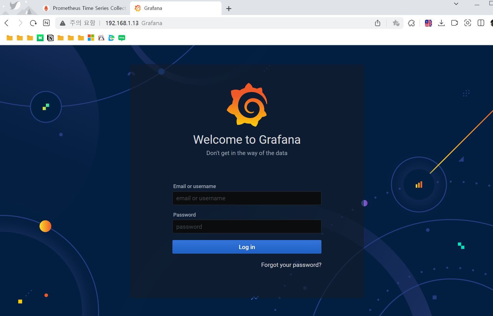

2. 프로메테우스를 데이터 소스로 구성하기
- Configuration >> Add DataSources
- Name : `Default (Prometheus)` / URL : `prometheus-server.default.svc.cluster.local` (CoreDNS)


<br>

## 📍 노드 메트릭 데이터 시각화하기
1. Node CPU 사용률
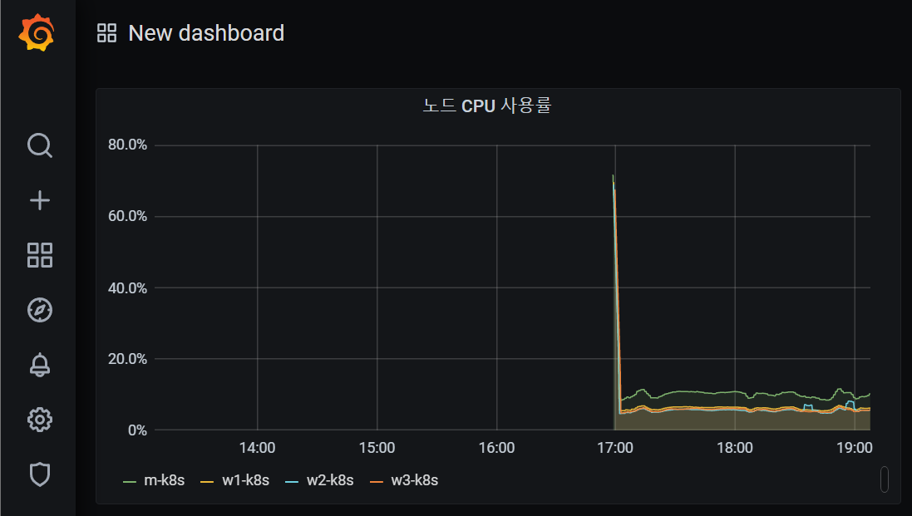
2. Node Memory 사용량
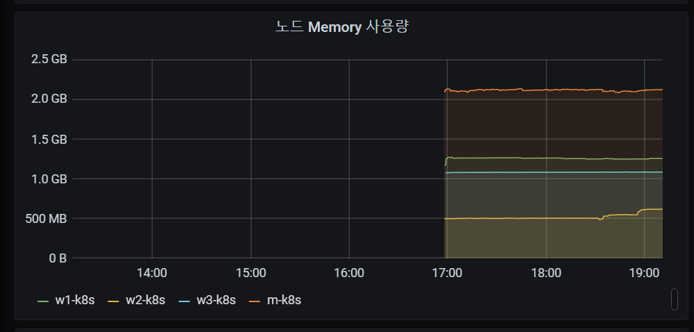
3. 노드 네트워크 평균 송신/수신 트래픽 패널
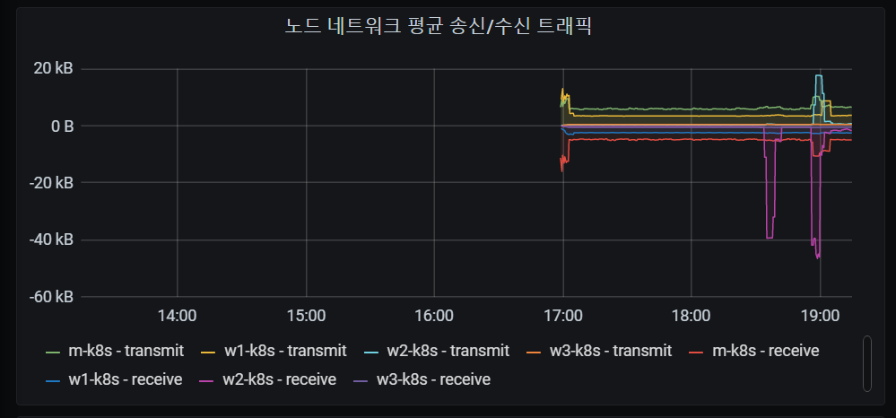
4. 노드 상태
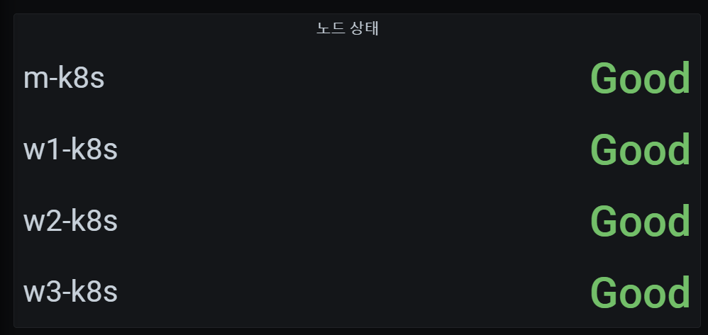
5. 아코디언 메뉴 생성 (Cluster Metrics)
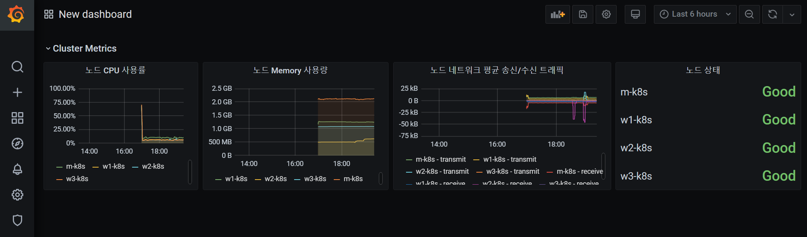

<br>

## 📍 파드 메트릭 데이터 시각화하기
1. 변수 추가 (Dashboard Setting > Variables > add variable)
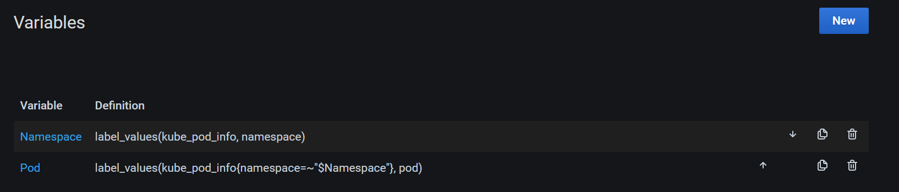
2. 파드 매트릭을 시각화하기 위한 패널 추가
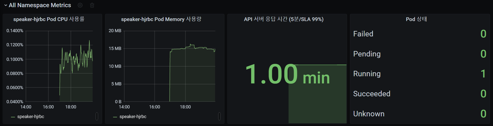

<br>

## 📍 좀 더 견고한 모니터링 환경 만들기
1. 슬랙 웹후크 연결 (설정 및 관리 > 앱 관리 > webhook 추가)
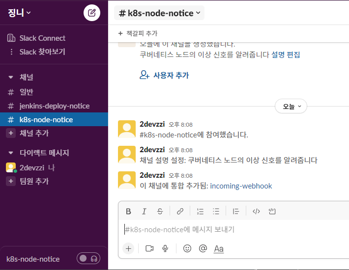

2. 얼럿매니저 구성하기 
```shell
## yaml 파일 수정
[root@m-k8s 6.5.1]# mkdir /webhook
[root@m-k8s 6.5.1]# cp alert-notifier.yaml /webhook

[root@m-k8s 6.5.1]# sed -i \ 's,Slack-URL, API-URL,g' /webhook/alert-notifier.yaml

[root@m-k8s 6.5.1]# cat /webhook/alert-notifier.yaml
apiVersion: v1
kind: ConfigMap
metadata:
  annotations:
    meta.helm.sh/release-name: prometheus
    meta.helm.sh/release-namespace: default
  labels:
    app: prometheus
    app.kubernetes.io/managed-by: Helm
    chart: prometheus-11.6.0
    component: alertmanager
    heritage: Helm
    release: prometheus
  name: prometheus-notifier-config
  namespace: default
data:
  alertmanager.yml: |
    global:
      slack_api_url:  API_URL
    receivers:
    - name: slack-notifier
      slack_configs:
      - channel: #monitoring
        send_resolved: true
        title: '[{{.Status | toUpper}}] {{ .CommonLabels.alertname }}'
        text: >-
          *Description:* {{ .CommonAnnotations.description }}
    route:
      group_wait: 10s
      group_interval: 1m
      repeat_interval: 5m
      receiver: slack-notifier

## yaml 파일 적용
[root@m-k8s 6.5.1]# kubectl apply -f /webhook/alert-notifier.yaml
configmap/prometheus-notifier-config created
[root@m-k8s 6.5.1]# kubectl get configmap prometheus-notifier-config
NAME                         DATA   AGE
prometheus-notifier-config   1      15s

### alertmanager 설치
[root@m-k8s 6.5.1]# ./prometheus-alertmanager-preconfig.sh
[Step 1/4] Task [Check helm status]
[Step 1/4] ok
[Step 2/4] Task [Check MetalLB status]
[Step 2/4] ok
[Step 3/4] Task [Create NFS directory for alertmanager]
[Step 3/4] Successfully completed
[Step 4/4] Task [Create PV,PVC for alertmanager]
persistentvolume/prometheus-alertmanager created
persistentvolumeclaim/prometheus-alertmanager created
[Step 4/4] Successfully completed

[root@m-k8s 6.5.1]# ./prometheus-alertmanager-install.sh
Release "prometheus" has been upgraded. Happy Helming!
NAME: prometheus
LAST DEPLOYED: Sat Oct  8 20:14:18 2022
NAMESPACE: default
STATUS: deployed
REVISION: 2
TEST SUITE: None
NOTES:
The Prometheus server can be accessed via port 80 on the following DNS name from within your cluster:
prometheus-server.default.svc.cluster.local
...

## 설치 확인
[root@m-k8s 6.5.1]# kubectl get service prometheus-alertmanager
NAME                      TYPE           CLUSTER-IP       EXTERNAL-IP    PORT(S)        AGE
prometheus-alertmanager   LoadBalancer   10.103.138.119   192.168.1.14   80:32088/TCP   20m

```
### Prometheus Alarts 확인 (서버 중지 전)
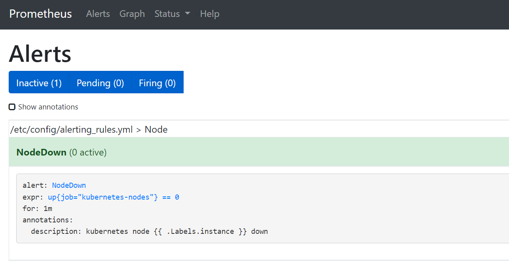
### Prometheus Alert 확인 (서버 중지 후)
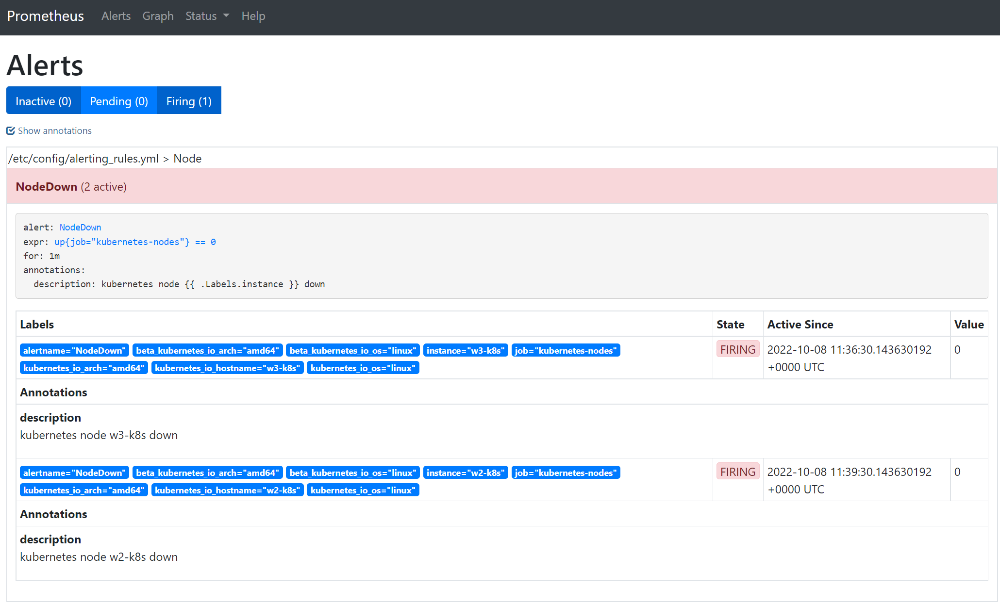
### 슬랙 메세지 전달 확인
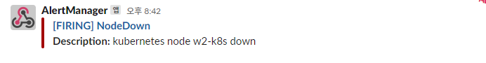

<br>