## 📍 프로메테우스 아키텍쳐
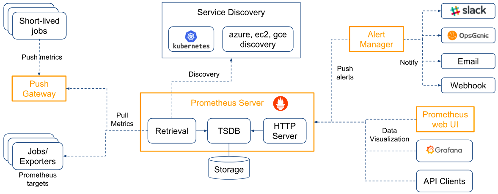

## 📍 프로메테우스로 모니터링 데이터 수집과 통합하기
1. 프로메테우스 오브젝트
   1. 프로메테우스 서버 (prometheus-server)
      - 프로메테우스의 주요 기능을 수행하는 요소
      - 노드 익스포터 외 여러 대상에서 공개된 메트릭을 수집해 오는 수집기, 수집한 시계열 메트릭 데이터를 저장하는 시계열 데이터베이스, 저장된 데이터를 질의하거나 수집 대상의 상태를 확인할 수 있는 웹UI.
      - 프로메테우스는 서비스 디스커버리(service discovery)라는 독특한 방법으로 수집 대상을 찾음.
      
   2. 노드 익스포터 (node-exporter)
      - 노드의 시스템 메트릭 정보를 HTTP로 공개하는 역할
      - 설치된 노드에서 특정 파일들을 읽고, 이를 프로메테우스 서버가 수집할 수 있는 메트릭 데이터로 변환한 후에 노드 익스포터에서 HTTP 서버로 공개함.
      
   3. 쿠버 스테이트 메트릭 (kube-state-metrics)
      - API 서버로 쿠버네티스 클러스터의 여러 메트릭 데이터를 수집한 후, 이를 프로메테우스 서버가 수집할 수 있는 메트릭 데이터로 변환해 공개하는 역할
      - 쿠버 스테이트 메트릭을 통해 프로메테우스가 쿠버네티스 클러스터의 여러 정보를 손쉽게 획득할 수 있음.
      
   4. 얼럿매니저 (alertmanager)
      - 프로메테우스에 정보(alert) 규칙을 설정하고, 경보 이벤트가 발생하면 설정된 경보 메시지를 대상에게 전달하는 기능 제공.
      - 프로메테우스에 설치하면 프로메테우스 서버에서 주기적으로 경보를 보낼 대상을 감시해 시스템을 안정적으로 운영할 수 있게 한다.
      
   5. 푸시게이트웨이 (pushgateway)
      - 배치와 스케줄 작업시 수행되는 일회성 작업들의 상태를 저장하고 모아서 프로메테우스가 주기적으로 가져갈 수 있도록 공개.
      - 일반적으로 짧은 시간 동안 실행되고 종료되는 배치성 프로그램의 메트릭을 저장하거나 외부망에서 접근할 수 없는 내부 시스템의 메트릭을 프록시 형태로 제공하는 용도로 사용
      
<br>

## 📍 헬름으로 프로메테우스 설치하기

```shell

[root@m-k8s ~]# cd ~/_Book_k8sInfra/ch6/6.2.1
[root@m-k8s 6.2.1]# ll
total 16
-rwx------. 1 root root  352 Aug 13 01:53 nfs-exporter.sh
-rwx------. 1 root root  564 Aug 13 01:53 prometheus-install.sh
-rwx------. 1 root root 1229 Aug 13 01:53 prometheus-server-preconfig.sh
-rw-r--r--. 1 root root  427 Aug 13 01:53 prometheus-server-volume.yaml

# 설치에 필요한 사전 구성 실행
[root@m-k8s 6.2.1]# ./prometheus-server-preconfig.sh
[Step 1/4] Task [Check helm status]
[Step 1/4] ok
[Step 2/4] Task [Check MetalLB status]
[Step 2/4] ok
[Step 3/4] Task [Create NFS directory for prometheus-server]
/nfs_shared/prometheus/server created
[Step 3/4] Successfully completed
[Step 4/4] Task [Create PV,PVC for prometheus-server]
persistentvolume/prometheus-server created
persistentvolumeclaim/prometheus-server created
[Step 4/4] Successfully completed

# 프로메테우스 설치 스크립트 실행
[root@m-k8s 6.2.1]# ./prometheus-install.sh
NAME: prometheus
LAST DEPLOYED: Sat Oct  8 01:30:36 2022
NAMESPACE: default
STATUS: deployed
REVISION: 1
TEST SUITE: None
NOTES:
The Prometheus server can be accessed via port 80 on the following DNS name from within your cluster:
prometheus-server.default.svc.cluster.local


Get the Prometheus server URL by running these commands in the same shell:
  NOTE: It may take a few minutes for the LoadBalancer IP to be available.
        You can watch the status of by running 'kubectl get svc --namespace default -w prometheus-server'

  export SERVICE_IP=$(kubectl get svc --namespace default prometheus-server -o jsonpath='{.status.loadBalancer.ingress[0].ip}')
  echo http://$SERVICE_IP:80


#################################################################################
######   WARNING: Pod Security Policy has been moved to a global property.  #####
######            use .Values.podSecurityPolicy.enabled with pod-based      #####
######            annotations                                               #####
######            (e.g. .Values.nodeExporter.podSecurityPolicy.annotations) #####
#################################################################################


For more information on running Prometheus, visit:
https://prometheus.io/

###
# prometheus-server가 계속 pending 상태에 머물러있는 에러가 발생했었는데
# 첫번째 원인은 worker node vm을 다 start시키지 않아서 발생했고,
# 이미 시도중이던 prometheus install을 제대로 제거하지 않아서 발생했다.
# kubectl describe pods 명령어를 실행하면 log를 확인할 수 있어 어느 부분에서 문제가 발생했는지 쉽게 확인할 수 있다.
###

[root@m-k8s 6.2.1]# kubectl get pods --selector=app=prometheus
NAME                                             READY   STATUS    RESTARTS   AGE
prometheus-kube-state-metrics-7bc49db5c5-8rwc4   1/1     Running   0          20m
prometheus-node-exporter-9gkd8                   1/1     Running   0          20m
prometheus-node-exporter-bfbdd                   1/1     Running   0          20m
prometheus-node-exporter-t9fhq                   1/1     Running   0          20m
prometheus-node-exporter-vq2tn                   1/1     Running   0          20m
prometheus-server-6d77896bb4-nhfd8               2/2     Running   0          20m

[root@m-k8s 6.2.1]# kubectl get service
NAME                            TYPE           CLUSTER-IP       EXTERNAL-IP    PORT(S)        AGE
jenkins                         LoadBalancer   10.104.43.230    192.168.1.11   80:31983/TCP   15d
jenkins-agent                   ClusterIP      10.96.37.247     <none>         50000/TCP      15d
kubernetes                      ClusterIP      10.96.0.1        <none>         443/TCP        56d
prometheus-kube-state-metrics   ClusterIP      10.109.118.163   <none>         8080/TCP       20m
prometheus-node-exporter        ClusterIP      None             <none>         9100/TCP       20m
prometheus-server               LoadBalancer   10.105.177.84    192.168.1.12   80:31321/TCP   20m

```
### Prometheus 정상 설치된 화면
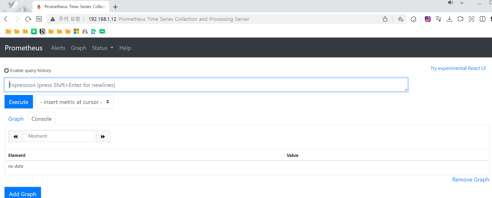

<br>

## 📍 프로메테우스의 웹 UI 다루기
1. Alert
   - 프로메테우스 서버에 등록된 경보 규칙과 경보 발생 여부 확인 가능
   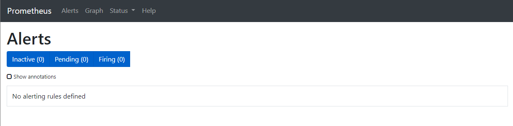

2. Graph
   - 프로메테우스의 웹 UI에서 제공하는 가장 중요한 내용을 처리하는 페이지
   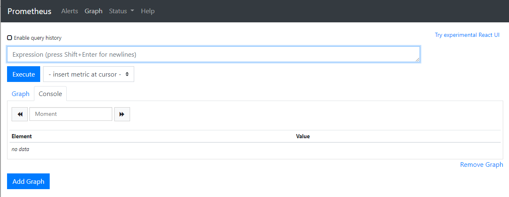

3. Status
   - 각종 status 확인 가능
   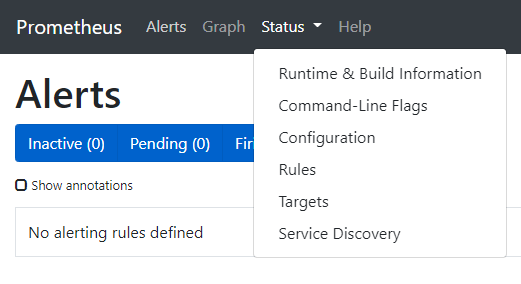

<br>

## 📍 [실습] 서비스 디스커버리로 수집 대상 가져오기
- 서비스 디스커버리로 프로메테우스에서 서버가 수집 대상을 자동으로 인식하고 필요한 정보를 수집한다.
- 이 덕분에 쿠버네티스는 사용자가 에이전트에 추가로 입력할 필요 없이 자동으로 메트릭을 수집할 수 있다.
- 쿠버네티스 API 서버에 직접 연결돼 메트릭을 수집하는 cAdvisor와 API 서버가 경로를 알려 주어 메트릭을 수집할 수 있는 Agent 이렇게 두 가지 경로로 나뉨.

<br>

## 📍 cAdvisor로 메트릭 수집하고 확인하기
### nginx deployment 배포 후 수집했을 때
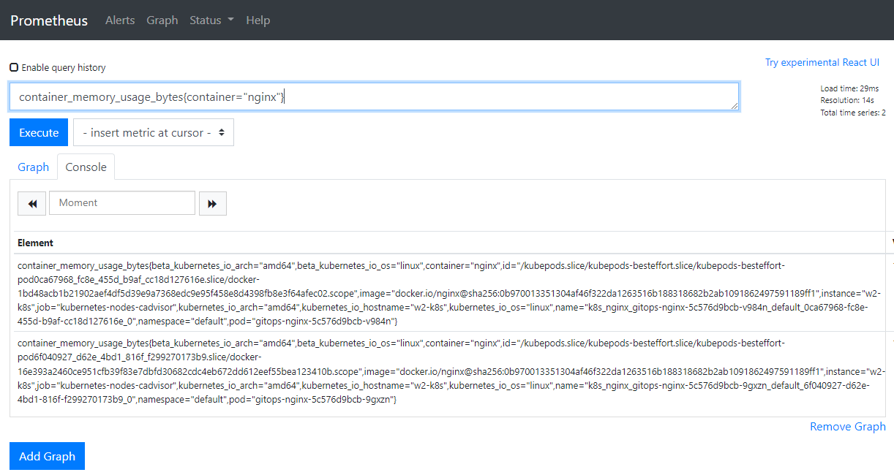
### nginx deployment 삭제 후 수집했을 때
<br>

## 📍 [실습] 익스포터로 메트릭 수집하고 확인하기
1. 사전 준비 작업
   - API 서버에 등록돼 경로를 알 수 있도록 해야 함.
   - 익스포터가 데이터를 프로메테우스 타입으로 노출해야 함.
```shell
[root@m-k8s 6.2.3]# kubectl apply -f nginx-status-annot.yaml
deployment.apps/nginx created


[root@m-k8s 6.2.3]# kubectl get deployments
NAME                            READY   UP-TO-DATE   AVAILABLE   AGE
jenkins                         1/1     1            1           15d
nginx                           1/1     1            1           67s (new!)
prometheus-kube-state-metrics   1/1     1            1           112m
prometheus-server               1/1     1            1           112m

## deployment 배포로는 메트릭을 수집할 수 없고 메트릭을 공개해야 하기 때문에
## 이미 만들어 둔 익스포터를 사용해 메트릭을 공개한 후 메트릭 수집을 시작함.

[root@m-k8s 6.2.3]# kubectl apply -f nginx-status-metrics.yaml
deployment.apps/nginx configured

```
### 정상적으로 nginx deployment에서 메트릭 수집 확인
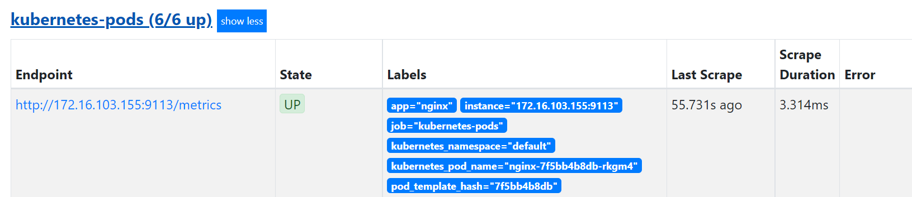

<br>

## 📍 노드 익스포터로 쿠버네티스 노드 메트릭 수집하기
### node_cpu_seconds_total 결과
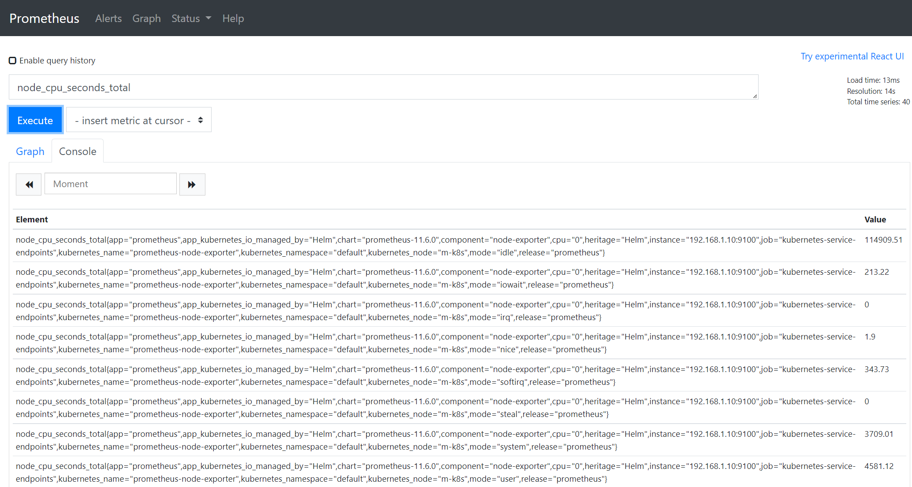
### node_memory_MemAvailable_bytes 결과
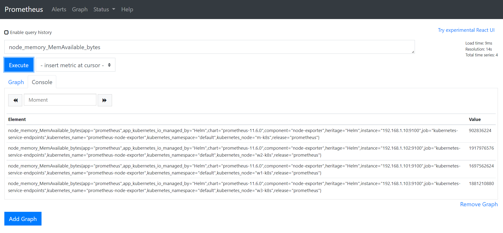

<br>

## 📍 쿠버 스테이트 메트릭으로 쿠버네티스 클러스터 메트릭 수집하기
### kube_pod_container_status_restarts 결과
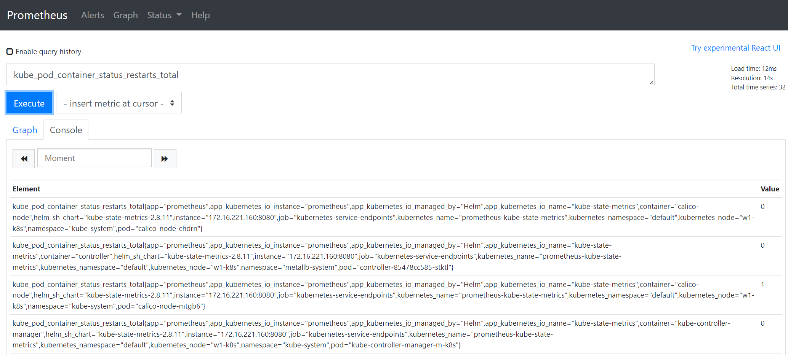
### kube_service_created 결과
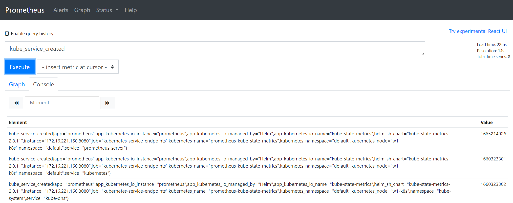

<br>

## 📍 PromQL로 메트릭 데이터 추출하기
### rate 함수로 변화율 확인하기
  - rate(node_cpu_seconds_total{mode="idle",kubernetes_node="w2-k8s"}[5m])
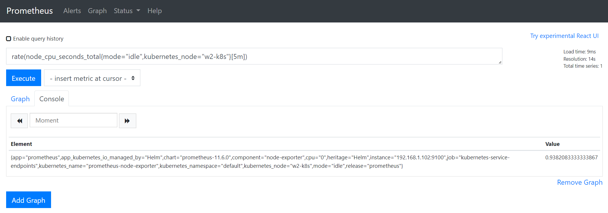

### graph로 확인하기


### 💎 Reference
- [https://minglebros.github.io/kubernetes/kubernetes-prometheus/](https://minglebros.github.io/kubernetes/kubernetes-prometheus/)