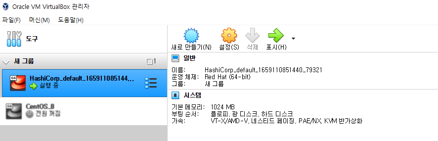
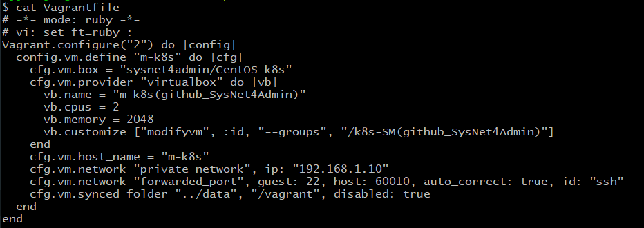
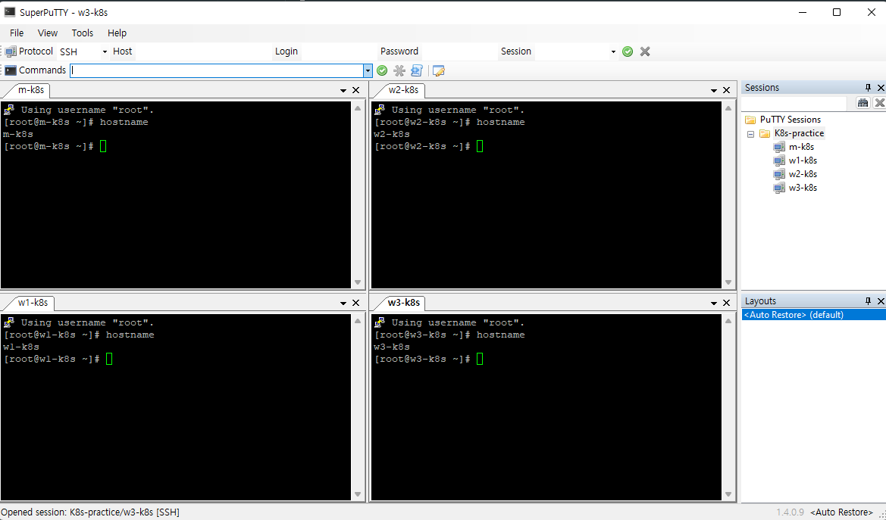

## 📍 베이그런트 설치 및 환경 구성하기
1. 베이그런트란?
- 가상 머신 기반 개발 환경을 관리하는 도구

<br>

2. 환경 구성하기 전 설치해야 할 것
- [Virtual Box](https://www.virtualbox.org/wiki/Downloads) or [Vmware Workstation Player](https://www.vmware.com/products/workstation-player/workstation-player-evaluation.html) 등의 가상화 소프트웨어
  (참고로 Oracle Virtual box는 오픈소스로 제공되지만, Vmware는 라이선스가 필요한 유료 버전(Pro)가 따로 존재한다. 위의 링크는 무료로 사용할 수 있는 Player 링크다.)
- [Vagrant (베이그런트)](https://www.vagrantup.com/downloads)
- 더하여 Mac OS에서도 가상 머신 환경을 구축할 수 있지만 개인적으로 여러 가지 시도해본 결과 가상 머신 환경에 한해서는 Window 환경이 익숙하고 편리해 Window 환경에서 구성하려고 한다.

<br>

## 📍 베이그런트 구성하고 테스트하기
1. CMD를 실행하고 베이그런트 설치 디렉터리로 이동하어 베이그런트 초기화를 진행한다.


<br>

2. 자주 사용하는 베이그런트 명령어 정리
  - `vagrant init` : 프로비저닝을 위한 기초 파일 생성
  - `vagrant up` : Vagrant file을 읽어 들여 프로비저닝을 진행
  - `vagrant halt` : 베이그런트에서 다루는 가상 머신 종료
  - `vagrant destroy` : 베이그런트에서 관리하는 가상 머신 삭제
  - `vagrant ssh` : 베이그런트에서 관리하는 가상 머신에 ssh로 접속
  - `vagrant provision` : 베이그런트에서 관리하는 가상 머신에 변경된 설정 적용

<br>

3. 베이그런트 초기화 명령으로 생성된 Vagrantfile을 열고 파일에서 `config.vm.box = "base"` 라는 내용이 있는지 확인.
   (아래 내용은 git bash shell로 window 환경에서 진행한 내용입니다. 개인적으로 cmd 명령어보다는 bash shell 명령어가 편해서...)

```shell
# 베이그런트 설치 디렉토리로 이동
$ pwd
/c/HashiCorp

# Vagrantfile_practice_1 있는지 확인
$ ls
Vagrant/  Vagrantfile_practice_1

# config.vm.box="base" 내용 있는지 확인
$ cat Vagrantfile_practice_1 | grep -i "config.vm.box"
  config.vm.box = "base"
  # config.vm.box_check_update = false

# 아무것도 변경하지 않은 채 명령어를 실행하면 에러 발생함. 베이그런트가 이미지를 찾지 못해 발생되는 에러.
$ vagrant up
Bringing machine 'default' up with 'virtualbox' provider...
==> default: Box 'base' could not be found. Attempting to find and install...
    default: Box Provider: virtualbox
    default: Box Version: >= 0
==> default: Box file was not detected as metadata. Adding it directly...
==> default: Adding box 'base' (v0) for provider: virtualbox
    default: Downloading: base
    default:
An error occurred while downloading the remote file. The error
message, if any, is reproduced below. Please fix this error and try
again.

Couldn't open file C:/HashiCorp/base

```

<br>

4. [가상 이미지 다운로드](https://app.vagrantup.com/sysnet4admin/boxes/CentOS-k8s) 및 적용

```shell
$ vagrant up
Bringing machine 'default' up with 'virtualbox' provider...
==> default: Box 'sysnet4admin/CentOS-k8s' could not be found. Attempting to find and install...
    default: Box Provider: virtualbox
    default: Box Version: >= 0
==> default: Loading metadata for box 'sysnet4admin/CentOS-k8s'
    default: URL: https://vagrantcloud.com/sysnet4admin/CentOS-k8s
==> default: Adding box 'sysnet4admin/CentOS-k8s' (v0.7.4) for provider: virtualbox
    default: Downloading: https://vagrantcloud.com/sysnet4admin/boxes/CentOS-k8s/versions/0.7.4/providers/virtualbox.box
    default:
==> default: Successfully added box 'sysnet4admin/CentOS-k8s' (v0.7.4) for 'virtualbox'!
==> default: Importing base box 'sysnet4admin/CentOS-k8s'...
==> default: Matching MAC address for NAT networking...
==> default: Checking if box 'sysnet4admin/CentOS-k8s' version '0.7.4' is up to date...
==> default: Setting the name of the VM: HashiCorp_default_1659110851440_79321
Vagrant is currently configured to create VirtualBox synced folders with
the `SharedFoldersEnableSymlinksCreate` option enabled. If the Vagrant
guest is not trusted, you may want to disable this option. For more
information on this option, please refer to the VirtualBox manual:

  https://www.virtualbox.org/manual/ch04.html#sharedfolders

This option can be disabled globally with an environment variable:

  VAGRANT_DISABLE_VBOXSYMLINKCREATE=1

or on a per folder basis within the Vagrantfile_practice_1:

  config.vm.synced_folder '/host/path', '/guest/path', SharedFoldersEnableSymlinksCreate: false
==> default: Clearing any previously set network interfaces...
==> default: Preparing network interfaces based on configuration...
    default: Adapter 1: nat
==> default: Forwarding ports...
    default: 22 (guest) => 2222 (host) (adapter 1)
==> default: Booting VM...
==> default: Waiting for machine to boot. This may take a few minutes...
    default: SSH address: 127.0.0.1:2222
    default: SSH username: vagrant
    default: SSH auth method: private key
    default:
    default: Vagrant insecure key detected. Vagrant will automatically replace
    default: this with a newly generated keypair for better security.
    default:
    default: Inserting generated public key within guest...
    default: Removing insecure key from the guest if it's present...
... (중략)
```

5. virtual box에서 가상 머신이 제대로 생성되었는지 확인


6. Vagrant ssh 명령어를 통해 가상머신 접근
```shell
$ vagrant ssh
[vagrant@k8s ~]$ cat /etc/os-release
NAME="CentOS Linux"
VERSION="7 (Core)"
ID="centos"
ID_LIKE="rhel fedora"
VERSION_ID="7"
PRETTY_NAME="CentOS Linux 7 (Core)"
ANSI_COLOR="0;31"
CPE_NAME="cpe:/o:centos:centos:7"
HOME_URL="https://www.centos.org/"
BUG_REPORT_URL="https://bugs.centos.org/"

CENTOS_MANTISBT_PROJECT="CentOS-7"
CENTOS_MANTISBT_PROJECT_VERSION="7"
REDHAT_SUPPORT_PRODUCT="centos"
REDHAT_SUPPORT_PRODUCT_VERSION="7"
```

7. 가상 머신 강제 종료 및 삭제
```shell
# -f 옵션 사용 시 실행중인 가상 머신도 삭제가 가능함.
$ vagrant destroy -f
==> default: Forcing shutdown of VM...
==> default: Destroying VM and associated drives...

```

8. Vagrantfile 수정해 가상 머신에 필요한 설정을 자동으로 구성하기
- 오타 주의

```shell
$ vagrant up
Bringing machine 'm-k8s' up with 'virtualbox' provider...
==> m-k8s: Importing base box 'sysnet4admin/CentOS-k8s'...
==> m-k8s: Matching MAC address for NAT networking...
==> m-k8s: Checking if box 'sysnet4admin/CentOS-k8s' version '0.7.4' is up to date...
==> m-k8s: Setting the name of the VM: m-k8s(github_SysNet4Admin)
==> m-k8s: Clearing any previously set network interfaces...
==> m-k8s: Preparing network interfaces based on configuration...
    m-k8s: Adapter 1: nat
    m-k8s: Adapter 2: hostonly
==> m-k8s: Forwarding ports...
    m-k8s: 22 (guest) => 60010 (host) (adapter 1)
...(중략)

# 설정값으로 넣은 IP도 잘 설정됐는지 확인
$ vagrant ssh
[vagrant@m-k8s ~]$ ip a show eth1
3: eth1: <BROADCAST,MULTICAST,UP,LOWER_UP> mtu 1500 qdisc pfifo_fast state UP group default qlen 1000
    link/ether 08:00:27:c1:ee:47 brd ff:ff:ff:ff:ff:ff
    inet 192.168.1.10/24 brd 192.168.1.255 scope global noprefixroute eth1
       valid_lft forever preferred_lft forever
    inet6 fe80::a00:27ff:fec1:ee47/64 scope link
       valid_lft forever preferred_lft forever

```


9. 가상 머신에 추가 패키지 설치하기
```shell
# 기존 Vagrantfile에 provision 추가
$ cat Vagrantfile_practice_1 | grep -i "cfg.vm.provision"
    cfg.vm.provision "shell", path: "install_pkg.sh" # add provisioning script

# install_pkg.sh 생성 및 스크립트 작성
$ cat install_pkg.sh
#!/usr/bin/env bash
# install packages
yum install -y epel-release
yum install -y vim-enhanced

# provision 구문 실행
$ vagrant provision
==> m-k8s: Running provisioner: shell...
    m-k8s: Running: C:/Users/2jjin/AppData/Local/Temp/vagrant-shell20220730-18908-1koz35.sh
    m-k8s: Loaded plugins: fastestmirror
    m-k8s: Determining fastest mirrors
    m-k8s:  * base: mirror.kakao.com
    m-k8s:  * extras: mirror.kakao.com
    m-k8s:  * updates: mirror.kakao.com
    m-k8s: Resolving Dependencies
    m-k8s: --> Running transaction check
    m-k8s: ---> Package epel-release.noarch 0:7-11 will be installed
    m-k8s: --> Finished Dependency Resolution
    m-k8s:
    m-k8s: Dependencies Resolved
...(중략)

# 가상머신 접속해 package 정상 설치 확인
$ vagrant ssh
[vagrant@m-k8s ~]$ yum repolist
Loaded plugins: fastestmirror
Determining fastest mirrors
 * base: mirror.kakao.com
 * epel: ftp.riken.jp
 * extras: mirror.kakao.com
 * updates: mirror.kakao.com
repo id                             repo name                                                          status
base/7/x86_64                       CentOS-7 - Base                                                    10,072
epel/x86_64                         Extra Packages for Enterprise Linux 7 - x86_64                     13,758 (패키지 다운로드 확인)
extras/7/x86_64                     CentOS-7 - Extras                                                     512
updates/7/x86_64                    CentOS-7 - Updates                                                  4,088
repolist: 28,430

# 문법 하이라이트 적용 확인 (vim-enhanced)
[vagrant@m-k8s ~]$ vi .bashrc

# 확인 후 가상머신 삭제
$ vagrant destroy -f
==> m-k8s: Forcing shutdown of VM...
==> m-k8s: Destroying VM and associated drives...

```

10. 가상 머신 추가로 구성하기
- [구성 파일 및 스크립트 링크](https://github.com/sysnet4admin/_Book_k8sInfra)
- 똑같은 가상 머신을 Vagrant를 이용해 3개 생성하는 방법
```shell
$ vagrant up
Bringing machine 'm-k8s' up with 'virtualbox' provider...
Bringing machine 'w1-k8s' up with 'virtualbox' provider...
Bringing machine 'w2-k8s' up with 'virtualbox' provider...
Bringing machine 'w3-k8s' up with 'virtualbox' provider...
==> m-k8s: Importing base box 'sysnet4admin/CentOS-k8s'...
==> m-k8s: Matching MAC address for NAT networking...
==> m-k8s: Checking if box 'sysnet4admin/CentOS-k8s' version '0.7.4' is up to date...
==> m-k8s: Setting the name of the VM: m-k8s(github_SysNet4Admin)
==> m-k8s: Clearing any previously set network interfaces...
==> m-k8s: Preparing network interfaces based on configuration...
    m-k8s: Adapter 1: nat
...(중략)

# 첫번째 가상머신 접근
$ vagrant ssh m-k8s
[vagrant@m-k8s ~]$ 
# shell script 업로드 확인
[vagrant@m-k8s ~]$ ls
ping_2_nds.sh

# shell script 실행해서 ping test
[vagrant@m-k8s ~]$ ./ping_2_nds.sh
PING 192.168.1.101 (192.168.1.101) 56(84) bytes of data.
64 bytes from 192.168.1.101: icmp_seq=1 ttl=64 time=0.646 ms
64 bytes from 192.168.1.101: icmp_seq=2 ttl=64 time=0.838 ms
64 bytes from 192.168.1.101: icmp_seq=3 ttl=64 time=0.753 ms

--- 192.168.1.101 ping statistics ---
3 packets transmitted, 3 received, 0% packet loss, time 2002ms
rtt min/avg/max/mdev = 0.646/0.745/0.838/0.084 ms
PING 192.168.1.102 (192.168.1.102) 56(84) bytes of data.
64 bytes from 192.168.1.102: icmp_seq=1 ttl=64 time=1.46 ms
64 bytes from 192.168.1.102: icmp_seq=2 ttl=64 time=0.849 ms
64 bytes from 192.168.1.102: icmp_seq=3 ttl=64 time=0.777 ms

--- 192.168.1.102 ping statistics ---
3 packets transmitted, 3 received, 0% packet loss, time 2004ms
rtt min/avg/max/mdev = 0.777/1.031/1.469/0.312 ms
PING 192.168.1.103 (192.168.1.103) 56(84) bytes of data.
64 bytes from 192.168.1.103: icmp_seq=1 ttl=64 time=0.621 ms
64 bytes from 192.168.1.103: icmp_seq=2 ttl=64 time=0.815 ms
64 bytes from 192.168.1.103: icmp_seq=3 ttl=64 time=0.824 ms

--- 192.168.1.103 ping statistics ---
3 packets transmitted, 3 received, 0% packet loss, time 2002ms
rtt min/avg/max/mdev = 0.621/0.753/0.824/0.096 ms

```
- 최종적으로 설정한 값들이 적용되어 네트워크가 잘 되는지 확인하기 위해 SuperPutty 를 통해 4개의 가상머신에 접속
