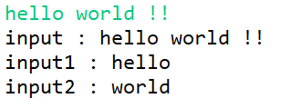

# 📌 자바 입력방법 비교 (Scanner, BufferedReader)

## 1. Scanner

###  ✔ Example code
   ```java
    import java.util.Scanner;
    
    public class Practice {
        public static void main(String[] args) {
            Scanner scan = new Scanner(System.in);
            String input = scan.next();
            String inputLine = scan.nextLine();
            ...
        }
    }
   ```

- java.util 패키지를 import해야 사용이 가능하다.
- Scanner 객체를 선언한 후 Scanner 클래스의 내장 함수를 사용해 바이트 단위로 입력값을 받아온다.
- next() : 공백 이전까지의 문자를 입력받는다.
- nextLine() : 개행 전까지의 문자열 전체를 입력받는다. (한 줄씩 입력받음)
   

<br>

> 장점

- 선언 방식이 비교적 쉽고 간단하다.
- String 뿐만 아니라 int, double, float 등의 다양한 자료형으로 입력값을 저장할 수 있다.
  ( nextInt(), nextDouble(), nextFloat() 등의 Scanner 내장 함수를 사용할 수 있어 편리)


> 단점

- 버퍼 길이가 1024로 한정적이다.
- 한번에 많은 입력값을 저장하는데엔 많은 시간이 소요돼 비효율적이다.


<br><br>


## 2-1. BufferedReader

###  ✔ Example code
  
    ```java
    import java.io.BufferedReader;
    import java.io.IOException;
    import java.io.InputStreamReader;
    
    public class Practice {
    
        public static void main(String[] args) throws IOException {
    
            BufferedReader br = new BufferedReader(new InputStreamReader(System.in));
            String input = br.readLine();
            ...
        }
    }
    ```

- java.io 패키지를 import해야 사용 가능하다.
- BufferedReader 객체를 생성하고, 객체의 매개변수로 InputStreamReader 객체를 받아 사용한다.
- BufferedReader 클래스의 내장 함수인 readLine()을 호출하여 줄 단위로 입력값을 받아온다.


<br>


> 장점

- 버퍼의 길이가 8192로, Scanner에 비해 압도적으로 크다.
- 많은 데이터를 한번에 받아오고자 할 때 성능 상 효율적이다.


###  ✔ 효율적인 이유?
- BufferedReader 클래스가 기본 입출력 스트림에 버퍼 기능을 추가한 스트림(Buffered Stream) 을 사용해 입력받기 때문이다. 이 때문에 입력된 데이터가 바로 프로그램으로 전달되지 않고 중간에 버퍼링이 된 후에 전달되며, 이는 시스템의 데이터처리의 효율성을 높여준다.


> 단점

- Scanner보다 사용 방식이 복잡하다.
- 입력값을 무조건 String으로만 받으며, 다른 자료형을 사용하고 싶을 때에는 무조건 데이터 타입을 추가 변환 or 파싱 해주어야 사용할 수 있다.
- Scanner와 달리 자체적으로 IOException 처리를 별도로 해주어야 한다.
- 개행(Enter)를 기준으로 입력을 받기 때문에, 공백을 기준으로 값을 입력받는 경우 별도의 파싱이 필요하다.

  (2-2. StringTokenizer 참고)


<br><br>


## 2-2. StringTokenizer

###  ✔ Example code

  ```java
  import java.io.BufferedReader;
  import java.io.IOException;
  import java.io.InputStreamReader;
  import java.util.StringTokenizer;
  
  public class Practice {
  
      public static void main(String[] args) throws IOException {
  
          BufferedReader br = new BufferedReader(new InputStreamReader(System.in));
          String input = br.readLine();
          
          StringTokenizer st = new StringTokenizer(input);
          String input1 = st.nextToken();
          String input2 = st.nextToken();
          
          System.out.println("input : " + input);
          System.out.println("input1 : " + input1);
          System.out.println("input2 : " + input2);
      }
  }
  ```

- java.util 패키지를 import 해야 사용할 수 있다.
- StringTokenizer 클래스는 2-1. BufferedReader와 같이 쓰이며, String.split()과 비슷한 기능을 가지고 있다.
- BufferedReader로 한 줄을 입력받았을 때, 만약 공백을 기준으로 입력값을 나누고 싶으면 StringTokenizer를 사용하여 파싱하면 된다. nextToken() 함수를 사용하여 String으로 다음 공백 전 문자열을 저장할 수 있다.


<br>

###  ✔ Example Result

  

- 위의 예시 코드를 실행한 결과로써, BufferedReader로 "hello world !!" 전체를 input 변수에 저장한 뒤, 이것을 StringTokenizer로 공백을 기준으로 파싱해 출력한 것이다.
- 사진에서 알 수 있는 것처럼, nextToken() 함수를 사용해 공백을 기준으로 입력값을 나누어 저장할 수 있으며, "!!" 은 문자열이 잘린 것을 보다 효과적으로 알 수 있는 부분이다.