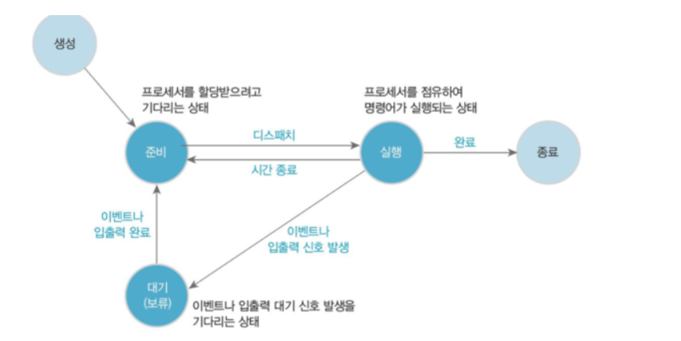
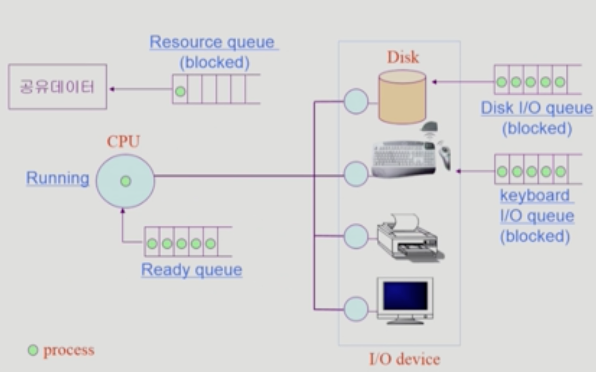
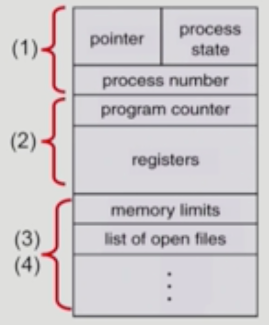
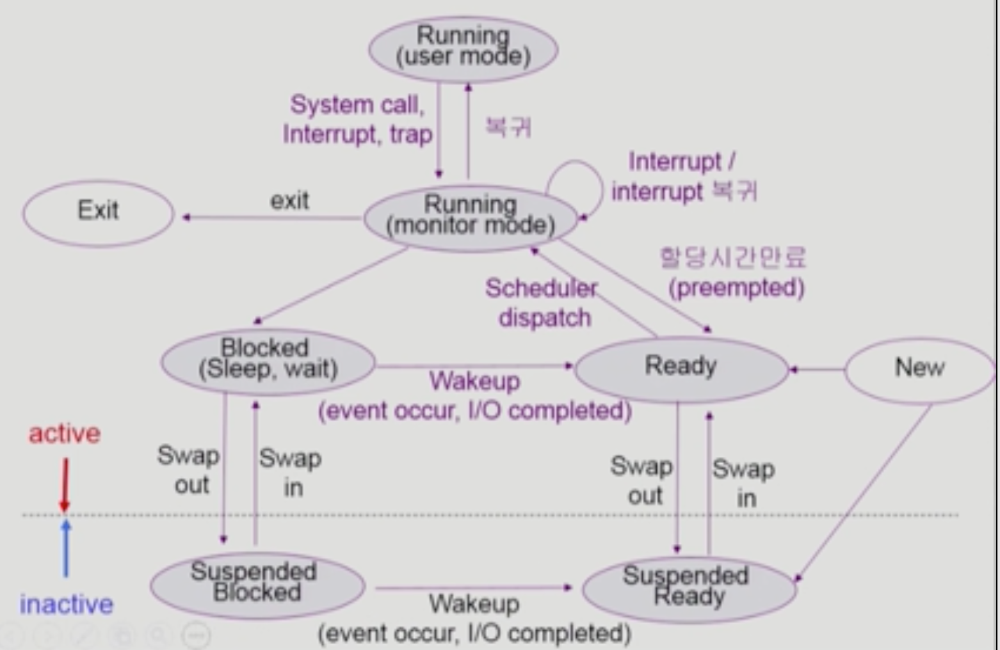

# Chapter 3. Process

### 💡 프로세스의 개념

- 프로세스는 실행중인 프로그램을 의미한다. (Process is a program in execution)
- 프로세스의 문맥(context)
  - CPU의 수행 상태를 나타내는 하드웨어 문맥.
    - Program Counter
    - 각종 Register
  - 프로세스의 주소 공간
    - code, data, stack
  - 프로세스 관련
    - PCB (Process Control Block)
    - Kernel stack

 

### 💡 프로세스의 상태

- 프로세스는 상태가 변경되면서 수행된다.

1. Running
   - CPU를 잡고 Instruction을 수행중인 상태
       
2. Ready
   - CPU를 기다리는 상태 (메모리 등 다른 조건을 모두 만족하고)
       
3. Blocked (wait, sleep)
    - CPU를 주어도 당장 instruction을 수행할 수 없는 상태
    - Process 자신이 요청한 event (ex. I/O) 가 즉시 만족되지 않아 이를 기다리는 상태
     ex) 디스크에서 파일을 얽어와야 하는 경우
    - 자신이 요청한 event가 만족되면 Ready로 상태가 변경됨.
       
4. New
   - 프로세스가 생성중인 상태
       
5. Terminated
   - 수행(execution)이 끝난 상태
    
6. Suspended (Stopped) -> 중기 스케쥴러로 인해 발생한 상태
    - CPU에서 뿐만 아니라 외부적인 이유로 프로세스의 수행이 정지된 상태
    - 프로세스는 통째로 디스크에 swap out 된다.
        ex) 사용자가 프로그램을 일시 정지 시킨 경우 (break key) 시스템이 여러 이유로 프로세스를 잠시 중단시킴
            (메모리에 너무 많은 프로세스가 올라와 있을 때)
    - 외부에서 다시 시해주어야 Active 상태로 변경됨.

 

### 💡 프로세스 상태도

- CPU는 여러 프로세스가 공유하기 때문에 계속 Ready Queue에서 Process가 대기하고 있다가 점유하는 방식으로 작동함.
- Disk 또한 Disk I/O Queue에 들어있는 Process 를 Disk Controller의 지휘 아래 순차적으로 처리하게 된다.
- Interrupt가 걸려 CPU가 OS에게 넘어가게 되면, OS는 상태 변경을 진행한다.

 

### 💡 PCB (Process Controll Block)
- 운영체제가 각 프로세스를 관리하기 위해 프로세스당 유지하는 정보
- 다음의 구성 요소를 가진다. (구조체로 유지)

    
 
    1. OS가 관리상 사용하는 정보
        - Process State, Process ID
        - Scheduling Information, priority
        
    2. CPU 수행 관련 하드웨어 값
        - Program counter, registers
      
    3. 메모리 관련
        - Code, data, stack의 메모리 위치 정보
      
    4. 파일 관련
        - Open file descriptors,,,
        - 그 외 리소스 관련 정보들

 

### 💡 문맥 교환 (Context Switch)
- CPU를 한 프로세스에서 다른 프로세스로 넘겨주는 과정
- CPU가 다른 프로세스에서 넘어갈 때 운영체제는 다음을 수행
    - CPU를 내어주는 프로세스의 상태를 그 프로세스의 PCBdp wjwkd
    - CPU를 새롭게 얻는 프로세스의 상태를 PCB에서 읽어옴.
    
- System call이나 Interrupt 발생시 반드시 context switch가 일어나는 것은 아님.      
    <1> 사용자 프로세스 A(user mode) -- interrupt or system call --> ISR or system call 함수 (kernel mode) -- 문맥교환 없이 user mode 복귀 --> 샤용자 프로세스 A (user mode)
  
    <2> 사용자 프로세스 A(user mode) -- timer interrupt or I/O 요청 system call --> kernel mode -- context switch 발생 --> 사용자 프로세스 B (user mode)   
    => <1>의 경우에도 CPU 수행 정보 등 context의 일부를 PCB에 save 해야 하지만, 문맥교환을 해야하는 <2>의 경우 훨씬 그 부담이 큼. (ex. cache memory flush)

 

### 💡 프로세스를 스케줄링하기 위한 큐
1. Job Queue
    - 현재 시스템 내에 있는 모든 프로세스의 집합
    - Ready Queue, Device Queue가 모두 Job Queue 내에 포함되어 있음.
2. Ready Queue
    - 현재 메모리 내에 있으면서 CPU를 잡아서 실행되기를 기다리는 프로세스의 집합
3. Device Queue
    - I/O device의 처리를 기다리는 프로세스의 집합
- 프로세스들은 각 큐들을 오가며 수행된다.

 

### 💡 스케쥴러 (Scheduler)
1. Long-term scheduler (Job scheduler or 장기 스케쥴러)
    - 시작 프로세스 중 어떤 것들을 ready queue로 보낼 지 결정
    - 프로세스에 memory 및 각종 자원을 주는 문제를 다루는 스케쥴러
    - degree of Multiprogramming(메모리에 프로그램이 몇 개 올라가 있는가?) 을 제어
    - time sharing system에는 보통 장기 스케쥴러가 존재하지 않음. (무조건 ready 상태)
    
2. Short-term scheduler (CPU scheduler or 단기 스케쥴러)
    - 어떤 프로세스를 다음 번에 running 시킬지 결정
    - 프로세스에 CPU를 주는 문제
    - 짧은 시간 단위로 스케쥴러가 이루어짐. 그러므로 충분히 빨라야 함 (millisecond 단위)
    
3. Medium-term scheduler (Swapper or 중기 스케쥴러)
    - 여유 공간 마련을 위해 프로세스를 통째로 메모리에서 디스크로 쫒아냄
    - 프로세스에게서 memory를 뺏는 문제
    - 중기 스케쥴러가 CPU 사용에서는 효율적 역할을 수행함.
    - degree of Multiprogramming(메모리에 프로그램이 몇 개 올라가 있는가?) 을 제어
    
 

   

 

    
## ✨ Reference ✨
[https://velog.io/@junu0516/%ED%94%84%EB%A1%9C%EC%84%B8%EC%8A%A4%EC%99%80-%EC%8A%A4%EB%A0%88%EB%93%9C](https://velog.io/@junu0516/%ED%94%84%EB%A1%9C%EC%84%B8%EC%8A%A4%EC%99%80-%EC%8A%A4%EB%A0%88%EB%93%9C)

