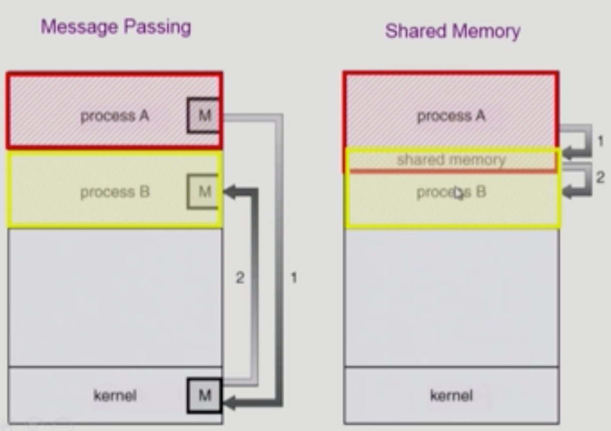

# Chapter 4. Process Management

### 💡 프로세스 생성 (Process Creation)

- 부모 프로세스(Parent Process)가 자식 프로세스(Children Process)를 생성한다.
  (프로세스가 또 다른 프로세스를 만드는 구조. **복제 생성**)
- 프로세스의 트리(계층 구조)가 형성된다.
- 프로세스는 자원을 필요로 한다. 이 때, **자원은 운영체제(OS)로부터 받거나 부모와 공유**한다.
- 자원의 공유
    - 부모와 자식이 모든 자원을 공유하는 모델
    - 일부를 공유하는 모델 (모든 자원을 공유하는 것보다 더 효율적임) ex) Linux
    - 전혀 공유하지 않는 모델
- 수행 (Execution)
    - 부모와 자식은 공존하며 수행되는 모델
    - 자식이 종료(terminate)될 때까지 부모가 기다리는(wait = blocked) 모델
- 주소 공간(Address space)
    - 자식은 부모의 공간(문맥)을 복사함 (binary and OS data) -> Code, Data, Stack 전부 복사하는 것.
    - PC(Program Counter) Register도 그대로 복사함.
    - 자식은 그 공간에 새로운 프로그램을 올림
    
    > Copy-on-Write(COW)
    - Write가 발생했을 때 Copy가 실행되는 것.
    - 내용이 변경되었을 경우에만 Copy를 진행하고 그 전까지는 공유만 하는 것을 의미함.
    

- 유닉스의 예
    - fork() 시스템 콜이 새로운 프로세스를 생성
        - 부모를 그대로 복사 (OS data except PID + binary)
        - 주소 공간 할당
        - 시스템 콜이 호출되는 것이므로 OS가 해당 작업(프로세스 생성)을 대신 수행하는 개념으로 이해해야 함.
    - fork 다음에 이어지는 exec() 시스템 콜을 통해 새로운 프로그램을 메모리에 올림.움
    
< 프로세스의 생성과정 정리 >
1. 부모 프로세스의 복제 (부모 프로세스가 자식 프로세스를 생성) --> `fork()`
2. 새로운 프로세스를 주소 공간에 덮어씌움. --> `exec()`

<br>

### 💡 프로세스 종료 (Process Termination)
- 프로세스가 마지막 명령을 수행한 후 운영체제에게 이를 알려줌 (Exit)
    - 자식이 부모에게 output data를 보냄 (via wait)
    - 프로세스의 각종 자원들이 운영체제에게 반납됨.
    - 프로세스에서는 무조건 자식 프로세스가 먼저 종료되고 부모 프로세스가 종료되어야 함.
    
- 부모 프로세스가 자식의 수행을 종료시킴 (abort - 강제 종료)
    - 자식이 할당 자원의 한계치를 넘어섬
    - 자식에게 할당된 태스크가 더 이상 필요하지 않음
    - 부모가 종료(exit)하는 경우
        - 운영체제는 부모 프로세스가 종료하는 경우 자식이 더 이상 수행되도록 두지 않는다.
        - 강제 종료 시에도 자식 프로세스가 먼저 종료된 후 부모 프로세스가 종료되기 때문에 단계적인 종료가 발생함.

<br>

### 💡 `fork()` System Call
- A process is created by the `fork()` system call
    - creates a new address space that is a duplicate of the caller
    
```shell
    int main() {
        int pid;
        pid = fork(); 
        # fork() 함수가 실행되면 하나의 프로세스가 더 생성된다고 이해하는 것이 쉬움.
        if(pid == 0) {
            printf("\nHello, I am child!\n");
        } eise if (pid > 0) {
            printf("\nHello, I am parent!\n");
        }
    }
```
<br>

### 💡 `exec()` System Call
- A process can execute a different program by the `exec()` system call.
    - replaces the memory image of the caller with a new program.

```shell
    int main() {
        int pid;
        pid = fork(); 
        # fork() 함수가 실행되면 하나의 프로세스가 더 생성된다고 이해하는 것이 쉬움.
        if(pid == 0) {  
            # this is child
            printf("\nHello, I am child! Now I'll run date \n");
            execlp("/bin/date", "/bin/date", (char *) 0);
        } eise if (pid > 0) {   
            # this is parent
            printf("\nHello, I am parent!\n");
        }
    }
```

<br>

### 💡 `wait()` System Call
> 자식이 종료(terminate)될 때까지 부모가 기다리는(wait = blocked) 모델
- 프로세스 A가 wait() 시스템 콜을 호출하면
    - 커널은 child가 종료될 대까지 프로세스 A를 sleep 시킨다. (block 상태)
    - child process가 종료되면 커널은 프로세스 A를 Rodnsek. (ready 상태)
  
- 대표적인 예 )
    - 리눅스에서 Program 이름을 Command Line에 치면 실행되는 형태.
    - 종료 될 때까지 다른 프로그램 실행 불가.
    - 쉘 프롬프트의 자식 프로세스로 실행되기 때문에 자식 프로세스가 끝나야 다시 프롬프트 라인이 보임.
  
  ```shell
  main {
    int childPID;
    S1;
    childPID = fork();
    # 0이면 자식 프로세스를 위한 코드 생성
    if(childPID == 0) {
    } else {
      # 부모 프로세스인 경우 wait() 실행
      # 자식 프로세스가 종료될 때까지 기다리는 모델
      wait();
    }
    S2;
  }
  ```

<br>

### 💡 `exit()` System Call
- 프로세스의 종료
  1. 자발적 종료
     - 마지막 statement 수행 후 exit() 시스템 콜을 통해 중료 수행됨.
     - 프로그램에 명시적으로 적어주지 않아도 main 함수가 리턴되는 위치에 컴파일러가 넣어줌.
  2. 비자발적 종료
     - 부모 프로세스가 자식 프로세스를 강제 종료시킴
        - 자식 프로세스가 한계치를 넘어서는 자원 요청
        - 자식에게 할당된 Task가 더 이상 필요하지 않음
        - 키보드로 kill, break 등을 친 경우
        - 부모가 종료되는 경우 (부모 프로세스가 종료되기 전에 자식들이 먼저 종료되어야 하므로)
  
<br>

## < 요약 >
### 💡 프로세스와 관련된 시스템 콜
1. fork()
   - Create a child (copy)
   - 부모 프로세스에서 복제하여 자식 프로세스 생성
2. exec()
   - overlay new image
   - 새로운 프로그램으로 덮어씌우는 시스템 콜
3. wait()
   - sleep until child is done
   - 자식 프로세스가 종료될 때까지 대기
4. exit()
   - frees all the resources, notify parent
   - 모든 자원을 반납하고 부모 프로세스에게 종료되었다고 알림.

<br>

### 💡 프로세스 간 협력
1. 독립적 프로세스 (Independent Process)
   - 프로세스는 각자의 주소 공간을 가지고 수행되므로 원칙적으로 하나의 프로세스는 다른 프로세스의 수행에 영향을 미치지 못함.
   - 경우에 따라서는 프로세스가 협력을 해야만 서로 효율적으로 실행되기도 함.

2. 협력 프로세스 (Cooperating Process)
   - 프로세스 협력 메커니즘을 통해 하나의 프로세스가 다른 프로세스의 수행에 영향을 미칠 수 있음

3. 프로세스 간 협력 메커니즘 (IPC : Interprocess Communication)
   1. 메세지를 전달하는 방법
      - Message passing
        - 커널을 통해 메시지 전달.
        - 프로세스 A가 프로세스 B에게 메세지를 전달함으로써 프로세스 B가 작업을 수행하는 것. 중간 커널이 메신저 역할을 해줌.
   2. 주소 공간을 공유하는 방법
      - shared memory
        - 서로 다른 프로세스 간에도 일부 주소 공간을 공유하게 하는 shared memory 메커니즘이 있음.
  
    > Thread
   - Thread는 사실상 하나의 프로세스이므로 프로세스간 협력으로 보기는 어렵지만 동일한 process를 구성하는 thread들 간에는 주소 공간을 공유하므로 협력이 가능.

<br>

### 💡 Message Passing
- Message System
  - 프로세스 사이에 공유 변수 (Shared variable)를 일체 사용하지 않고 통신하는 시스템
  - Communication 방법에 관계 없이 운영체제 커널이 메세지를 전달하는 통신을 진행.
  
- Direct Communication
  - 통신하려는 프로세스의 이름을 명시적으로 표시
  ### Process P [Send Q.message]  -----------> Process Q [Receive P.message]
  
- Indirect Communication
  - mailbox(or port)를 통해 메세지를 간접 전달
  - mailbox 역시 커널 안에 존재하는 것.
  ### Process P [Send M.message]  ------ Mailbox M -----> Process Q [Receive M.message]

<br>

### 💡 Interprocess Communication



- 각각 주소공간이 따로 있지만, 일부의 shared 공간을 같이 사용하는 형태
- kernel에 명령을 보내 shared 공간을 쓴다는 것을 알려야 사용 가능함.

