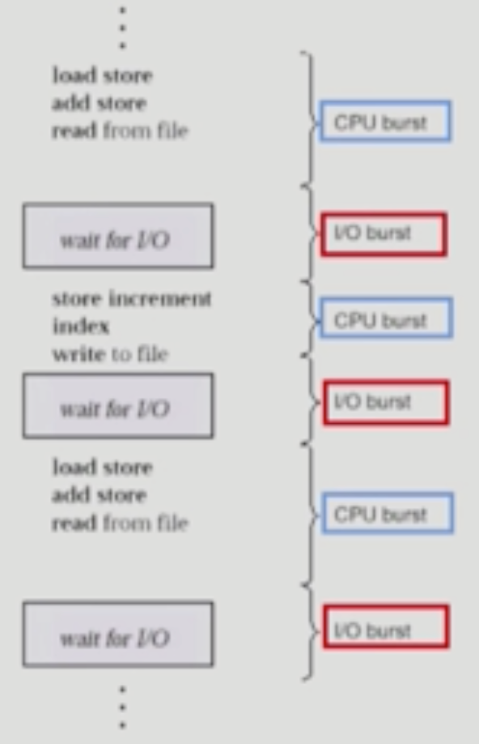
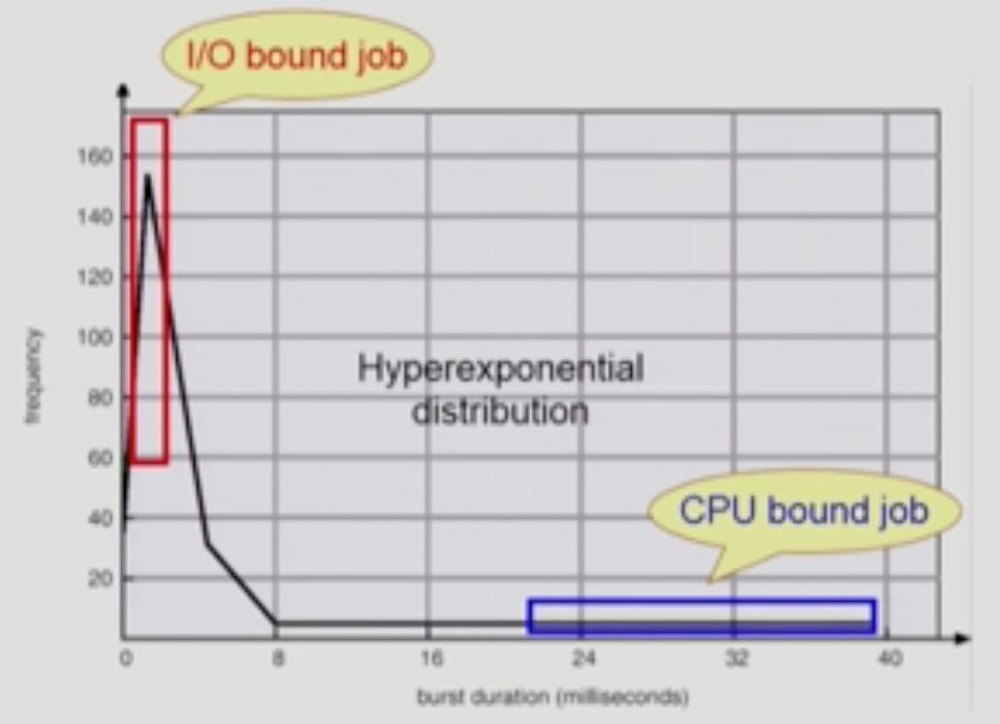
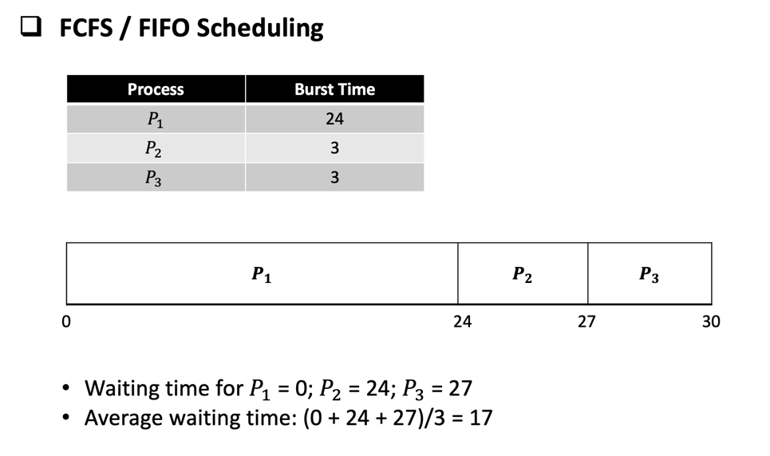
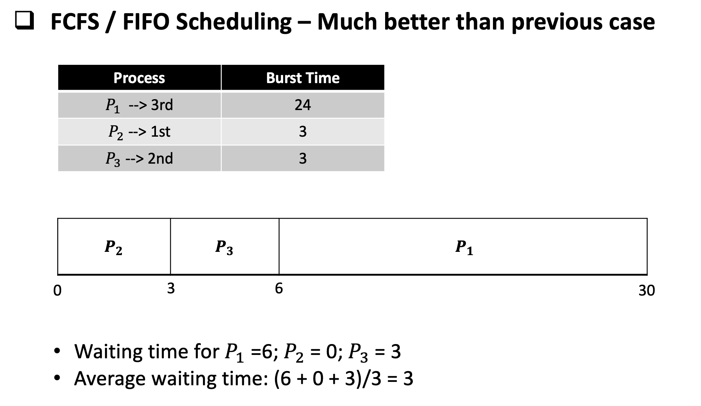
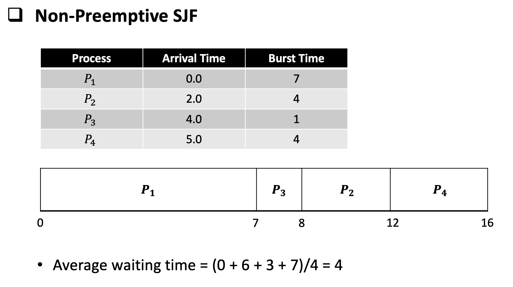
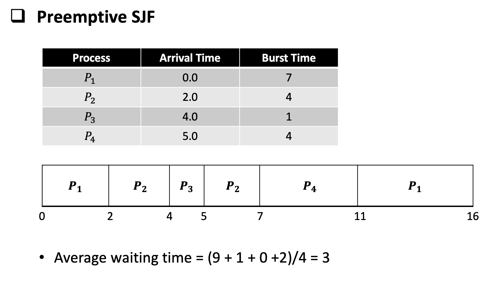
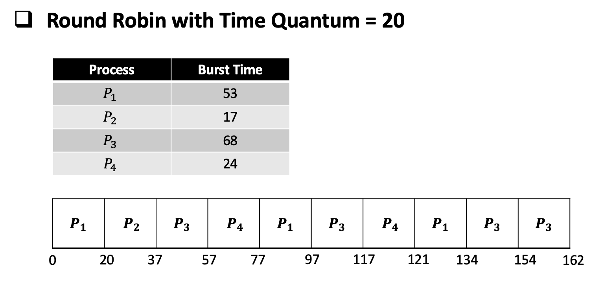
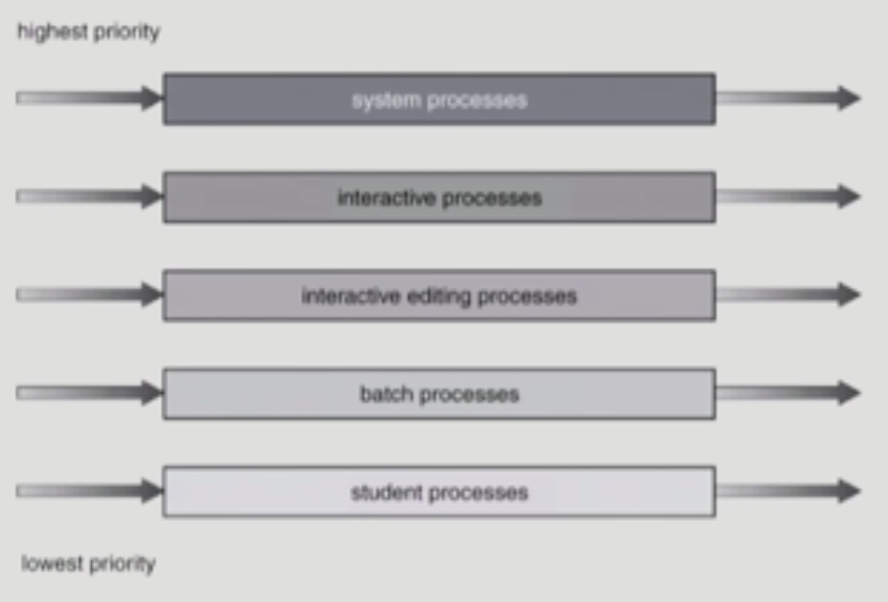

# Chapter 5. CPU Scheduling

### 💡 CPU and I/O Bursts in Program Execution

- 명령어 실행 도중 I/O 작업으로 넘어가면 wait이 발생하게 됨.
- CPU만 연속적으로 사용하는 CPU burst 상태와 I/O만 연속되어 발생하는 I/O Burst 상태가 반복되게 됨.
- 주로 사람이 연결되어 있는 프로그램에서 주로 반복되는 형태가 많이 발생함 (interactive한 job)
- 프로그램의 종류에 따라 빈도나 유형이 각각 다름.

 

### 💡 CPU-burst time의 분포

- 여러 종류의 job(=process)이 섞여 있기 때문에 CPU 스케쥴링이 필요하다.
    - 중간에 I/O가 많으면 CPU bust time이 적음. (= I/O bound job) -> 반대가 CPU bound job
    - CPU를 많이 사용하는 것은 CPU bound job이라고 보는게 맞고, 유
      I/O bound job은 I/O가 빈번하기 때문에 스위칭이 잦아 CPU 사용률이 많아 보이는 것. (frequency가 높은 이유)
    - interactive job에게 적절한 response 제공 필요
    - CPU와 I/O 장치 등 시스템 자원을 골고루, 효율적으로 사용해야 함. -> CPU Scheduling이 필요한 이유

 

## < 요약 >
### 💡 프로세스의 특성 분류
1. I/O-bound process
   - CPU를 잡고 계산하는 시간보다 I/O에 많은 시간이 필요한 job (= 유저와의 interaction이 잦은 작업)
2. CPU-bound process
   - 계산 위주의 job

 

### 💡 CPU Scheduler & Dispatcher
1. CPU Scheduler
   - Ready 상태의 프로세스 중에서 이번에 CPU를 줄 프로세스를 고른다.
   - OS의 특정적인 기능 (code)를 Scheduler라고 부르는 것.
  
2. Dispatcher
   - CPU의 제어권을 CPU Scheduler에 의해 선택된 프로세스에게 넘긴다.
   - 이 과정을 context switch(문맥 교환)라고 한다.
  
3. CPU 스케쥴링이 필요한 경우
   - 프로세스에게 다음과 같은 상태 변화가 있는 경우 스케쥴링이 필요하다.
  1. Running -> Blocked (예 : I/O 를 요청하는 System call)
  2. Running -> Ready (예 : 할당시간만료로 timer interrupt)
  3. Blocked -> Ready (예 : I/O 완료 후 인터럽트)
  4. Terminate

  ** 1,4에서의 스케쥴링은 nonpreemptive (강제 x, 자진 반납) ===> 비선점형 스케쥴링   
  ** 1,4번을 제외한 스케쥴링은 preemptive (강제로 문맥교환 발생) ===> 선점형 스케쥴링

 

---------

 

# Chapter 5. CPU Scheduling (2)

### 💡 Scheduling Criteria - Performance Index(스케쥴링 성능 척도)

< 시스템 입장에서의 성능 척도 >
1. CPU Utilization (이용률)
    - Keep the CPU as busy as possible
    - CPU가 놀지 않고 일한 시간의 비율
    
2. Throughput (처리량)
    - \# of processes that complete their execution per time unit
    - 주어진 시간 동안 몇개의 작업을 처리했는지에 대한 비율
    
< 프로그램 입장에서의 성능 척도 >
3. Turnaround Time (소요 시간, 평균 시간) = 총 처리 시간
    - amount of time to execute a particular process
    - CPU를 쓰기 시작해서 I/O 처리를 위해 종료할 때까지 (뺏길 때까지) 걸린 시간 (CPU burst time)

4. Waiting Time (대기 시간)
    - amount of time a process has been waiting in the ready queue
    - CPU를 쓰기까지의 순서를 기다리는 시간
    - waiting time은 여러 차례 발생하는 대기 시간을 합친 시간을 의미함 (response time과 조금 다름)
    - 스케쥴링 알고리즘은 단지 프로세스가 준비 큐에서 대기하는 시간의 양에만 영향을 줌.
    
5. Response time (응답 시간)  ====> 가장 중요한 성능 척도
    - amount of time it takes from when a request was submitted until the first response is produced, not output
    - 처음으로 CPU를 점유하기까지 걸린 시간
    - for time-sharing environment

 

### 💡 Scheduling Algorithm

1. FCFS (First-Come First-Served) = FIFO (First-In First-Out)
   - 먼저 온 순서대로 작업을 처리하는 것.
   - 비선점형 스케쥴링 (non-preemptive)
   - 그닥 효율적이진 않음. (짧게 쓰는 작업들이 대기중이더라도 만약 긴 작업이 실행중이라면 계속 그 작업이 끝날때까지 대기해야 하기 때문에)
   - 앞에 어떤 유형의 프로세스가 존재하느냐에 따라 효율이 굉장히 달라짐.
   - Convoy effect : short process behind long process
      ( 짧은 프로세스가 긴 프로세스로 인해 오래 기다리는 것 )   
      
     
   
    
   
     

    

     

2. SJF (Shortest-Job First)
   - CPU burst가 제일 짧은 프로세스에게 제일 먼저 CPU를 점유하게 해주는 것. 
     ( Choose the job with the smallest expected CPU burst )
   - Non-preemptive
     - average waiting time이 제일 적은 스케쥴링 기법
     - 일단 한번 CPU를 점유하면 더 짧은 프로세스가 도착하더라도 이미 진행중인 프로세스의 CPU burst time이 끝날때까지 대기
   - preemptive (Shortest-Remaining-Time-First : SRTF)
     - 현재 수행중인 프로세스의 남은 burst time보다 더 짧은 CPU burst time을 가지는 새로운 프로세스가 도착하면 CPU를 빼앗김.
   - SJF is optimal
     - 주어진 프로세스들에 대해 minimum average waiting time을 보장함.
     - 문제점
        - starvation (기아 현상)
          - 장시간 걸리는 프로세스가 계속 대기하는 현상
        - CPU 사용 시간을 미리 알기가 어려우므로 추정(estimate)만 가능
          * exponential averaging 방법을 사용하여 주로 CPU 사용 시간을 추정함.
            ===> 어쨋든 정확한 사용시간이 아니라 추정 시간이므로 실 사용은 힘든 알고리즘
    
    

     

    

3. Priority Scheduling (우선순위 스케쥴링)
    - 우선순위가 제일 높은 스케쥴링에게 CPU를 점유하게 하는 스케쥴링 알고리즘.
    - 작은 숫자를 가진 프로세스가 더 높은 우선순위를 가짐.
    - SJF는 일종의 priority scheduling.
    - Preemptive
    - Non-Preemptive
    - SJF와 마찬가지로 기아 현상이 발생할 수 있다는 문제점이 있음.
    - 문제점을 보완하기 위해 Aging 이용.
        - Aging : 대기 시간이 길어질수록 우선순위를 높이는 것. (경로우대 같은 개념)
   
4. RR (Round Robin)
    - 현대적인 스케쥴링 기법은 거의 Round Robin을 사용함
    - 각 프로세스는 동일한 크기의 할당 시간 (time quantum)을 가짐.
      ( 일반적으로 10-100 milliseconds )
    - 할당 시간이 지나면 프로세스는 선점당하고, ready queue의 제일 뒤에 가서 다시 줄을 선다.
    - 응답 시간이 제일 빠른 스케쥴링 기법
    - n개의 프로세스가 ready queue에 있고, 할당 시간이 q_time unit인 경우 각 프로세스는 최대 q_time unit 단위로 CPU 시간의 1/n을 얻는다.
        => 어떤 프로세스도 (n-1)q time unit 이상을 기다리지 않음.
      
    - Performance
        - q large (할당 시간이 큰 경우) => FCFS(FIFO)
        - q small (할당 시간이 작은 경우) => context switch 오버헤드가 커지기 때문에 부하 발생 가능성 커짐.

     
   
   
   
     
   
    - 일반적으로 SJF보다 average turnaround time이 같지만 response time은 더 짧다.

5. Multilevel Queue

     

    

     
   
    - Ready Queue를 여러 개로 분할
        - foreground (interactive)
        - background (batch - no human interaction)
    - 각 큐는 독립적인 스케쥴링 알고리즘을 가짐
        - foreground (RR)
        - background (FCFS)
    - 큐에 대한 스케쥴링이 필요
        - fixed priority scheduling
            - serve all from foreground then from background
            - possibility of starvation   
              : 우선순위가 낮은 프로세스에서는 기아 현상이 발생할 수 있음 ex) batch processes, student processes
        - time slice
            - starvation을 방지하기 위한 방법으로 사용
            - 각 큐에 CPU time을 적절한 비율로 할당
                ex) 80%는 foreground에 20%는 background에
              
6. Multilevel Feedback Queue
    - 처음 들어오는 프로세스는 가장 높은 우선순위를 가지는 queue에 보냄. (quantum이 가장 짧음)
    - 가장 높은 우선순위 queue에서 작업이 끝나지 않았을 경우 그 다음 우선순위를 가지는 queue로 할당됨. 
         
    ===> 프로세스가 다른 큐로 이동 가능. Aging을 위와 같은 방식으로 구현하는 원리.
   
    - CPU burst time이 짧은 프로세스에게 우선순위가 높게 적용되는 알고리즘.
    - CPU burst time 예측이 필요 없다는 장점 보유.
    - Multilevel-feedback-queue schedular를 정의하는 파라미터들
        - Queue의 수
        - 각 큐의 scheduling algorithm
        - Process를 상위 큐로 보내는 기준
        - Process를 하위 큐로 내쫒는 기준
        - Process가 CPU Service를 받으려 할 때 들어갈 큐를 결정하는 기준
    
7. Multiple-Processor Scheduling
    - CPU가 여러 개인 경우 스케쥴링은 더욱 복잡해진다.
    - Homogeneous processor인 경우
        - Queue에 한줄로 세워서 각 프로세스가 알아서 꺼내가게 할 수 있다.
        - 반드시 특정 프로세서에서 수행되어야 하는 프로세스가 있는 경우에는 문제가 더 복잡해진다.   
          ( 보통 우선순위를 부여해 특정 프로세서에 수행되도록 처리함. )
    - Load Sharing
        - 일부 프로세서에 job이 몰리지 않도록 부하를 적절히 공유하는 메커니즘 필요
        - 별개의 큐를 두는 방법 vs 공동 큐를 사용하는 방법
    - Symmetric Multiprocessing (SMP)
        - 각 프로세서가 각자 알아서 스케줄링 결정
    - Asymmetric Multiprocessing
        - 하나의 프로세서가 시스템 데이터의 접근과 공유를 책임지고 나머지 프로세서는 거기에 따름.
    
8. Real-Time Scheduling
    - 정해진 시간 (deadline)안에 반드시 수행되어야 하는 프로세스 스케쥴링
    - 주로 미리 스케쥴링을 해서 적재적소에 배치되도록 함.
    - Hard Real-time systems
        - 정해진 시간 안에 반드시 끝내도록 스케쥴링 해야 함.
    - Soft Real-time computing
        - 일반 프로세스에 비해 높은 priority를 갖도록 해야 함.
    
9. Thread Scheduling
    - Local Scheduling
      - User level thread의 경우 사용자 수준의 thread library에 의해 어떤 thread를 스케쥴링할지 결정
    - Global Scheduling
      - Kernel level thread의 경우 일반 프로세스와 마찬가지로 커널의 단기 스케쥴러가 어떤 thread를 스케쥴링할지 결정

 

### 💡 Scheduling Algorithm Evaluation

1. Queueing models
    - 굉장히 이론적인 평가 방법
    - 확률 분포로 주어지는 arrival rate와 service rate 등을 통해 각종 performance index 값을 계산함.
    
2. Implementation(구현) & Measurement(성능 측정)
    - 실제 시스템에 알고리즘을 구현하여 실제 작업(workload)에 대해서 성능을 측정 및 비교
    - 사용하기 어려운 방법 (직접 OS kernel을 수정해야 함.)
    
3. Simulation (모의 실험)
    - 알고리즘을 모의 프로그램으로 작성 후 trace를 입력으로 하여 결과 비교