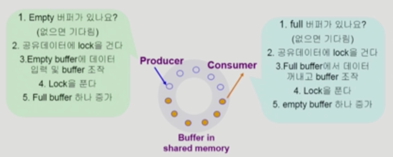
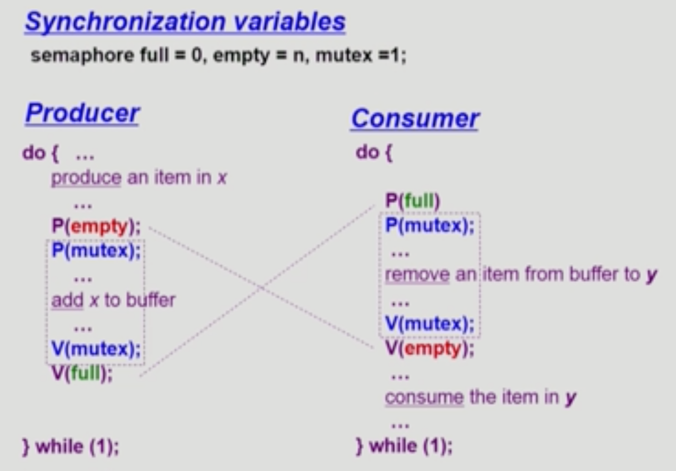
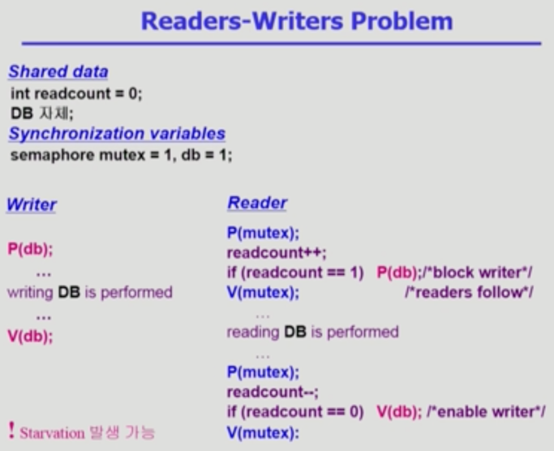
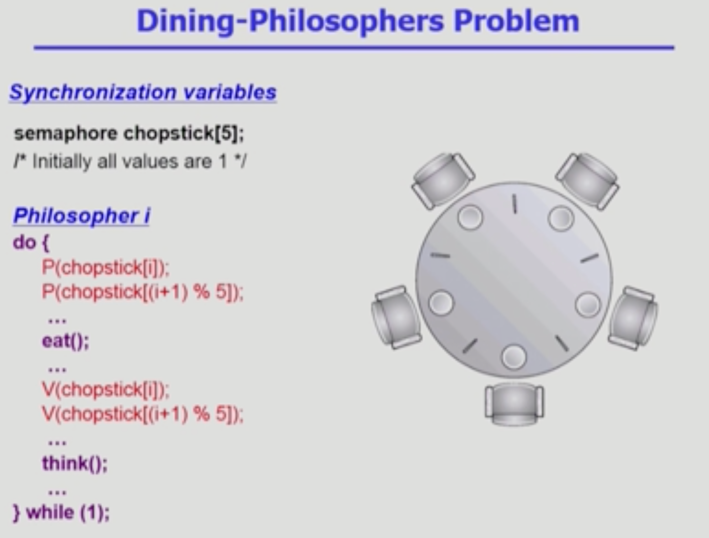
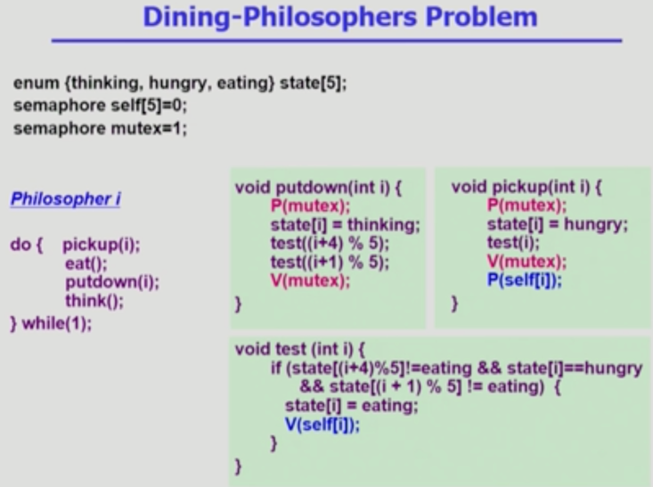
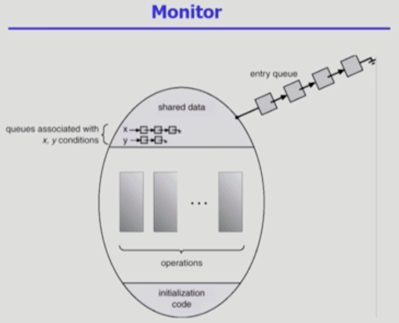
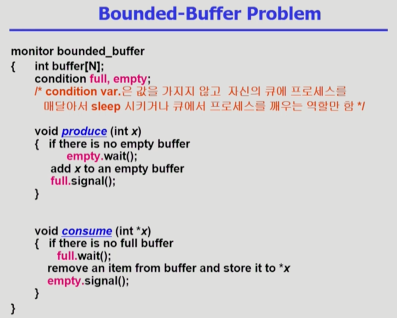
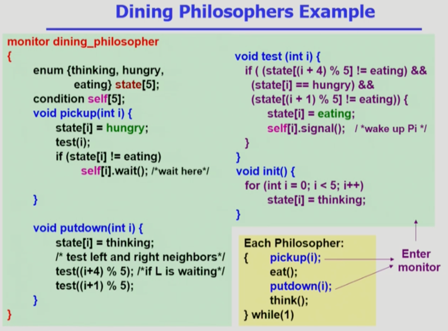

# Chapter 6. Process Synchronization
- 프로세스 동기화, 병행 제어 (Concurrency control)

### 💡 Classical Problems of Synchronization
1. Bounded-Buffer Problem (Producer-Consumer Problem)
     
2. Readers and Writers Problem
     
3. Dining-Philosophers Problem

<br>

### 💡 Bounded-Buffer Problem (Producer-Consumer Problem)



- 생산자-소비자의 문제
    - 주황색 원은 생산자가 공유 버퍼에 데이터를 넣어 놓은 상태, 흰색 원은 소비자가 버퍼에서 프로세스를 꺼내간 상태.
    - 데이터를 넣을 때 or 꺼낼 때 lock을 걸어 공유 데이터에 다른 프로세스가 접근하지 못하도록 함.
      
    - 버퍼가 다 찬 상태에서 버퍼에 데이터를 넣기 위해 생산자가 도착했다고 가정했을 때, 빈 버퍼가 없어 데이터를 넣을 수 없다는 문제가 생김.
      소비자가 도착해 버퍼에 있는 데이터를 꺼내 가져갈 때까지 버퍼에 데이터를 삽입할 수 없음. 생산자가 무한 대기 해야하는 상황이 발생.
      마찬가지로, 반대 상황 (꺼내갈 데이터가 없어 소비자가 무한 대기하는 현상) 도 발생할 수 있다는 문제점 존재.

- Shared Data
    - buffer 자체 및 buffer 조작 변수 (empty/full buffer의 시작 위치)
    
- Synchronization variables
    - mutual exclusion (상호 배제)
      - Need binary semaphore (shared data의 mutual exclusion을 위해)
    - resource count
      - Need integer semaphore (남은 full/empty buffer의 수 표시)



- `full` (내용이 들어있는 버퍼 개수), `empty` (비어 있는 버퍼 개수), `mutex` (lock 상태 변수)
- P 연산은 자원 획득, V 연산은 자원 반납. 생산자와 소비자의 슈도코드는 반대로 구성되어 있음.


<br>


### 💡 Readers and Writers Problem
- 한 프로세스가 DB(공유 데이터)에 write 중일 때 다른 프로세스가 접근하면 안됨. (lock을 걸어 접근 못하도록 방지)
- read는 동시에 여럿이 해도 문제 없음.
- 해결 방법
    - Writer가 DB에 접근 허가를 아직 얻지 못한 상태에서는 모든 대기중인 Reader들을 다 DB에 접근하게 해준다.
    - Writer는 대기 중인 Reader가 하나도 없을 때 DB 접근이 허용된다.
    - 일단 Writer가 DB에 접근 중이면 Reader들은 접근이 금지된다.
    - Writer가 DB에서 빠져나가야만 Reader의 접근이 허용된다.
    
- shared data
    - DB 자체
    - readcount; (현재 DB에 접근 중인 Reader의 수)
    
- Synchronization variables
    - `mutex` : 공유 변수 readcount를 접근하는 코드 (critical section)의 mutual exclusion 보장을 위해 사용.
    - `db` : reader와 writer가 공유 DB 자체를 올바르게 접근하게 하는 역할



- read일 때도 lock을 걸긴 하지만, 똑같은 read 작업이 들어왔을 경우 작업 허용
- readcount를 증가시킬 때에도 lock이 필요함. 이 과정을 나타내는 변수가 mutex
- reader가 계속 도착하면 reader들을 위해 계속 write는 대기 상태에 빠질 수 있음. 이런 경우 기아 상태 발생 가능.
- 큐에 우선순위를 두어서 지나치게 대기시간이 길지 않도록 하는 해결방법을 통해 기아 상태를 방지할 수 있음. (신호등 비유)

<br>

### 💡 Dining-Philosophers Problem



- 생각하는 일 / 밥먹는 일 두개로 나누어짐.
- 밥을 먹게 되면 왼쪽, 오른쪽 젓가락을 같이 집어 밥을 먹음. 밥을 먹을 때는 옆에 있는 젓가락을 잡아야 먹을 수 있음.
- 젓가락을 공유 자원으로 빗댄 문제. 
- deadlock 문제 발생 가능성 존재.
- 본인이 밥을 먹고 배가 부른 상태여야 젓가락을 놓기 때문에 한 젓가락만 가지고 있는 상태라면 아무도 밥을 먹지 못하고 아무도 젓가락을 놓지 못한 채로 계속 대기할 가능성 존재.
- 해결 방안
    - 4명의 철학자만이 테이블에 동시에 앉을 수 있도록 한다.
    - 젓가락을 두 개 모두 집을 수 있을 때에 젓가락을 집을 수 있게 한다.
    - 비대칭 활용 : 짝수 철학자는 왼쪽만, 홀수 철학자는 오른쪽만 먼저 잡을 수 있도록 한다.



<br>


### 💡 Monitor
- Semaphore의 문제점
    - 코딩하기 힘들다.
    - 정확성(correctness)의 입증이 어렵다.
    - 자발적 협력이 필요하다.
    - 한번의 실수가 모든 시스템에 치명적인 영향을 끼친다.
    
- 예시
  1) V(mutex)   
     Critical Section   
     P(mutex)   
  -> Mutual exclusion 깨짐
      
  2) P(mutex)   
    Critical Section   
     V(mutex)   
  -> Deadlock

- Monitor란?
    - 동시 수행중인 프로세스 사이에서 abstract data type의 안전한 공유를 보장하기 위한 high-level synchronization construct
    - 세마포에 비해 프로그래머의 불안을 확연히 줄여주는 병행 제어 방법
    - active한 프로세스 하나만이 공유 데이터에 접근할 수 있도록 제어해주는 방법
    
  ```shell
  monitor monitor-name
  {
    shared variable declarations
    procedure body P1(..) {
        ...
    }
    procedure body P2(..) {
        ...
    }
    procedure body Pn(..) {
        ...
    }
    {
        initializaion code
    }
  }
    ```
 
 
- 프로시저를 통해서만 shared data에 접근할 수 있도록 하는 것.
- lock을 걸 필요가 없음. monitor에 있는 프로시저들이 차례대로 공유 데이터에 접근하기 때문에.
- 모니터 내에서는 한번에 하나의 프로세스만이 활동 가능
- 프로그래머가 동기화 제약 조건을 명시적으로 코딩할 필요가 없음
- 프로세스가 모니터 안에서 기다릴 수 있도록 하기 위해 condition variable 사용 `condition x,y;`
- 모니터 밖에서 기다리는 프로세스들은 모니터 안에 있는 active process의 개수가 0이 될 때 monitor 안에 접근해서 active한 프로세스가 되는 것.
- Condition Variable은 wait와 signal 연산에 의해서만 접근 가능 
  `x.wait()`
    - `x.wait()` 을 invoke한 프로세스는 다른 프로세스가 `x.signal()`을 invoke하기 전까지 suspend 된다.
      
  `x.signal()`
    - `x.signal()`은 정확하게 하나의 suspend된 프로세스를 resume한다.
    - suspend된 프로세스가 없으면 아무 일도 일어나지 않는다.

<br>

### 💡 Monitor를 통해 개선한 Synchronization problem


- full (full인 상태에서 잠들어 있는 프로세스 큐)
- empty (empty인 상태에서 잠들어 있는 프로세스 큐)


- pickup(i), putdown(i)가 모니터에 들어간 active process가 되었을 때 실행되는 함수

