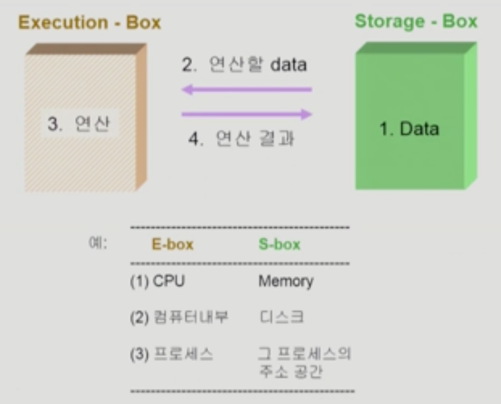
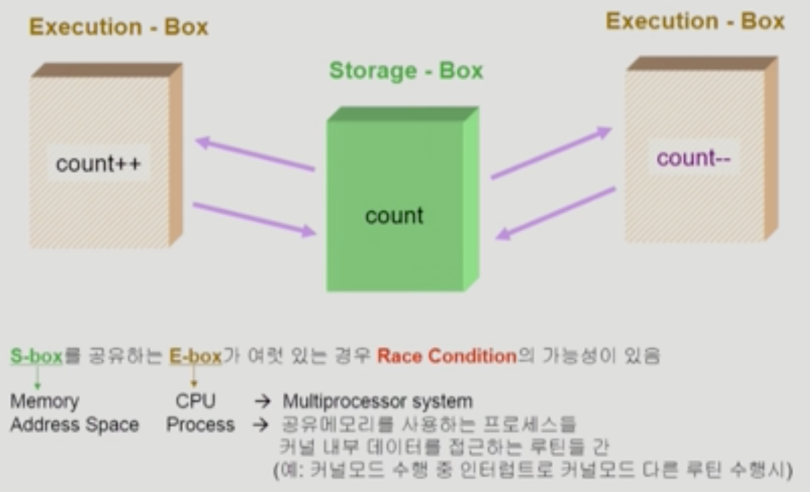
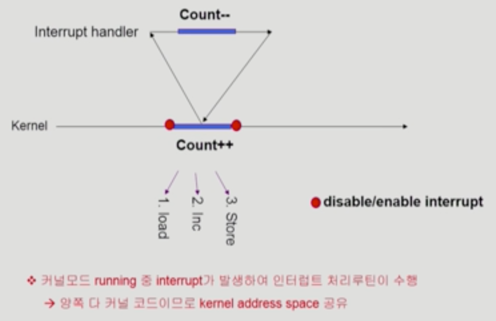
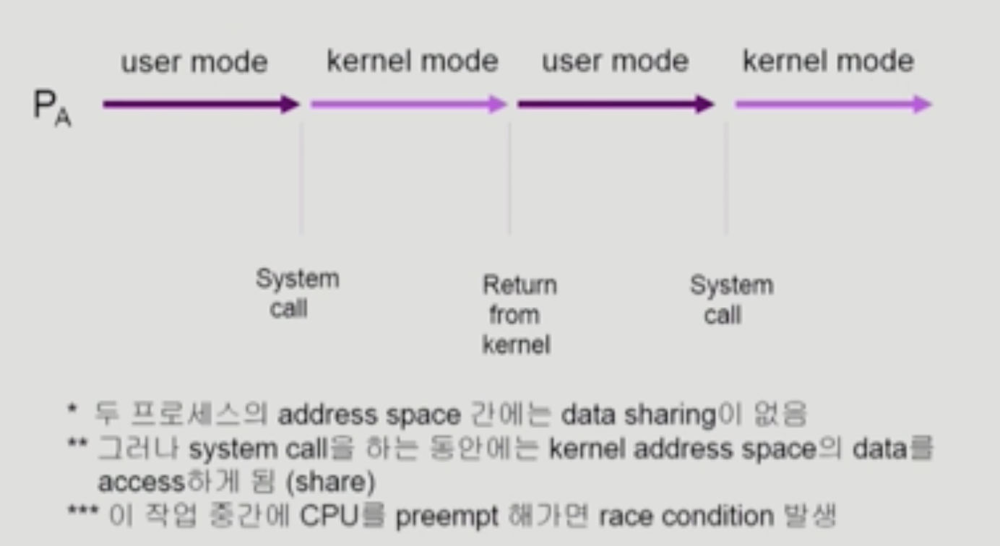
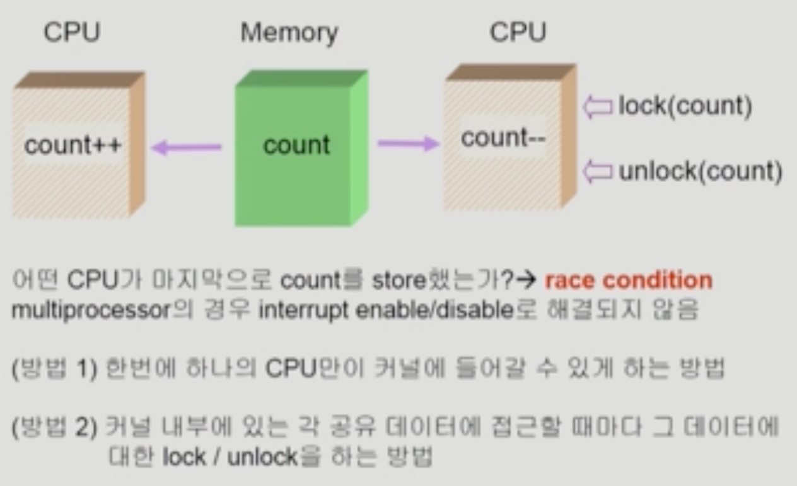

# Chapter 6. Process Synchronization

### 💡 데이터의 접근

 

### 💡 Race Condition (경쟁 상태)

- 중복 접근이 발생하는 경우 결과 값에 문제가 발생해 원치 않은 결과를 얻게 될 수 있음.
  
 

#### OS 에서 Race Condition이 발생하는 경우
1. Kernel 수행 중 인터럽트 발생 (interrupt handler vs kernel)
   
     
    
   
   
     
   
    - 중요한 변수값을 kernel이 처리하는 경우 interrupt 처리를 disable 시켜서 kernel이 수행하는 프로세스가 종료된 후 interrupt를 처리하는 방식으로  문제를 주로 해결함.
    
   
2. Process가 System Call을 발생시켜 Kernel mode로 수행 중인데 문맥교환(Context Switch)이 발생하는 경우

     
   
    
    
     

    - 해결책 : 커널 모드에서 수행 중일 때는 CPU를 preempt하지 않음. 커널 모드에서 사용자 모드로 돌아갈 때 preempt
    

3. Multiprocessor에서 shared memory 내의 kernel data

     

   

     

   - lock을 걸어서 다른 어느 누구도 현재 사용하고 있는 data에 접근하지 못하도록 하는 해결법.
   - 프로세스가 끝난 후에는 lock을 해제하여 다른 프로세스도 사용할 수 있도록 처리함.

 

### 💡 Process Synchronization 문제
- 공유 데이터(shared data)의 동시 접근(concurrent access)은 데이터의 불일치 문제(inconsistency)를 발생시킬 수 있다.
- 일관성(Consistency) 유지를 위해서는 협력 프로세스(cooperating procee)간의 실행 순서(orderly execution)를 정의해주는 메커니즘이 필요하다.
- Race Condition
   - 여러 프로세스들이 동시에 공유 데이터를 접근하는 상황
   - 데이터의 최종 연산 결과는 마지막에 그 데이터를 다룬 프로세스에 따라 달라짐.
- race condition을 막기 위해서는 공존하 프로세스(concurrent process)가 동기화(Synchronize)되어야 한다.

 

### 💡 The Critical-Section Problem
- n개의 프로세스가 공유 데이터를 동시에 사용하기를 원하는 경우
- 각 프로세스의 code segment에는 공유 데이터를 접근하는 코드인 critical section이 존재
- problem
   - 하나의 프로세스가 critical section에 있을 때 다른 모든 프로세스는 critical section에 들어갈 수 없어야 한다.