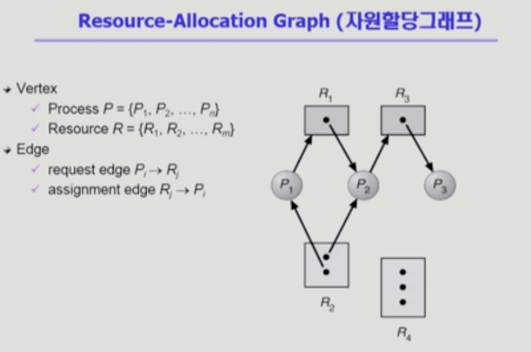
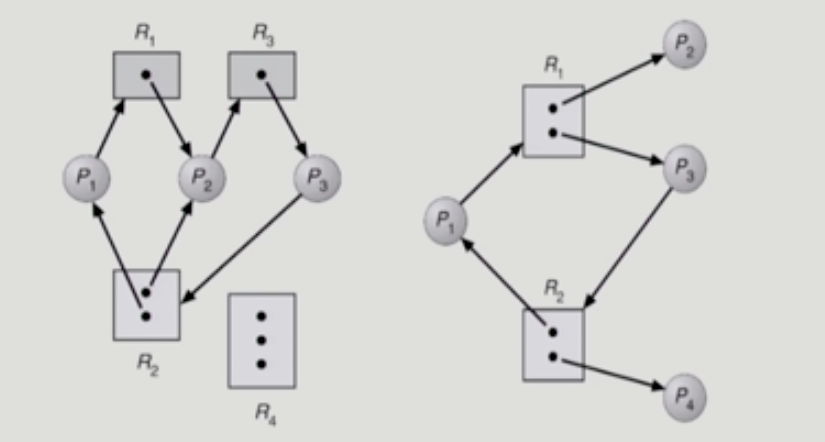
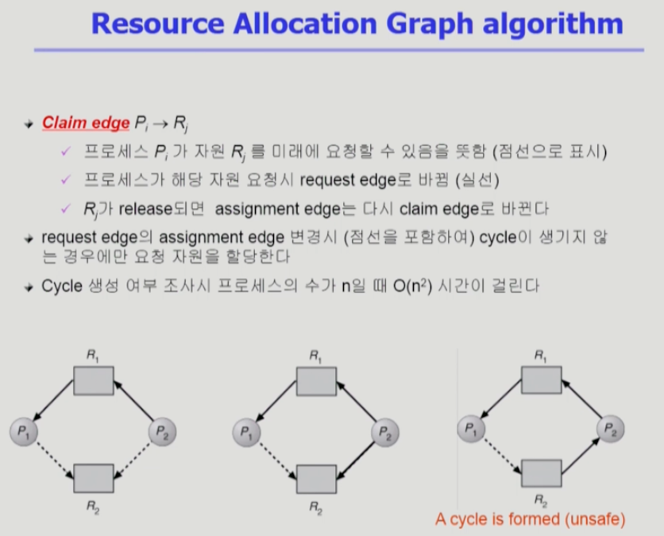
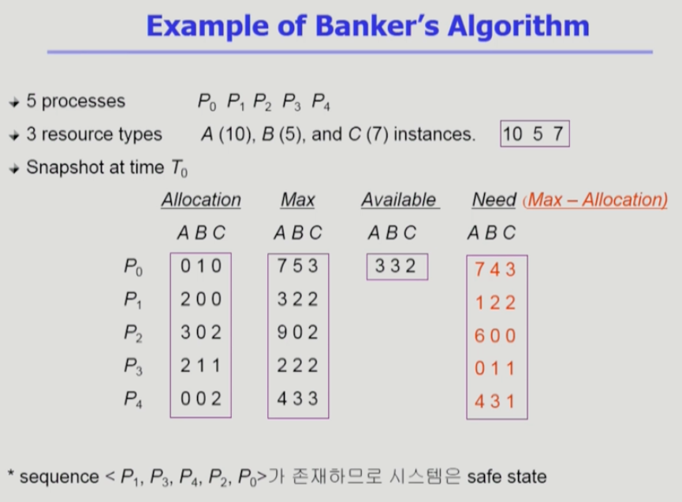
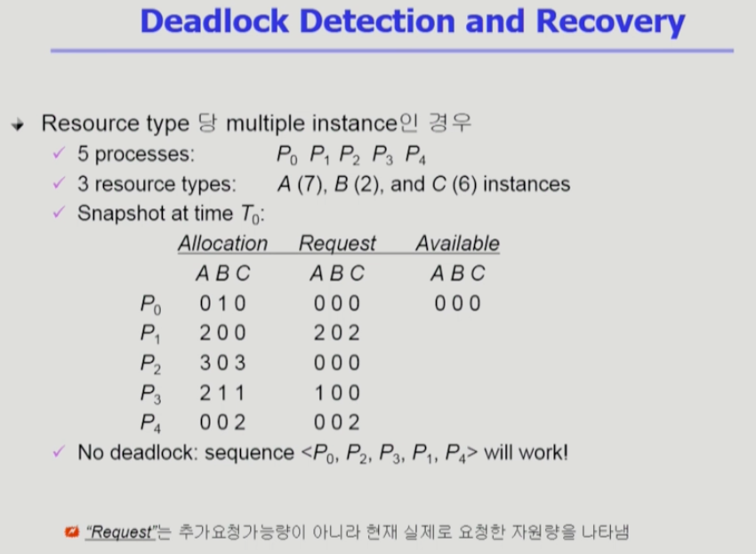

# Chapter 7. Deadlock (교착상태)

### 💡 The Deadlock Problem
- Deadlock : 일련의 프로세스들이 서로가 가진 자원을 기다리며 block된 상태
    - Example 1.
        - 시스템에 2개의 tape drive가 있다.
        - 프로세스 P1, P2 각각이 하나의 tape drive를 보유한 채 다른 하나를 기다리고 있다.
    - Example 2.
        - Binary Semaphores A and B   
          |   P1  	|   P2   |
          |:---:    |:---:   |
          | P(A); 	| P(B);  |
          | P(B); 	| P(A);  |
          
- Resource 
    - 하드웨어, 소프트웨어 등을 포함하는 개념   
    ex) I/O device, CPU cycle, Memory space, semaphore 등
    - 프로세스가 자원을 사용하는 절차
        - Request --> Allocate --> Use --> Release

 

### 💡 Deadlock 발생의 4가지 조건
- 이 조건들을 충족하지 않으면 교착상태는 발생하지 않음.

1. Mutual Exclusion (상호 배제)
   - 매 순간 하나의 프로세스만이 자원을 사용할 수 있음.
    
2. No preemption (비선점)
   - 프로세스는 자원을 스스로 내어놓을 뿐 강제로 빼앗기지 않음
    
3. Hold and Wait (보유 대기)
   - 자원을 가진 프로세스가 다른 자원을 기다릴 때 보유 자원을 놓지 않고 계속 가지고 있음.
    
4. Circular wait (순환 대기)
   - 자원을 기다리는 프로세스 간에 사이클이 형성되어야 함.
   - 프로세스 P0...Pn이 존재한다는 가정에서   
        P0은 P1이 가진 자원을 기다림   
        P1은 P2이 가진 자원을 기다림   
        Pn-1은 Pn이 가진 자원을 기다림   
        Pn은 P0이 가진 자원을 기다림   

 

### 💡 Resource-Allocation Graph (자원 할당 그래프)

- 작은 점들은 인스턴스, P1 -> R2 (Request)
- 그래프 안에 cycle이 없으면 deadlock이 아니다.
- 그래프에 cycle이 있고, 인스턴스가 한개밖에 없으면 교착상태. 인스턴스가 여러개일 경우 교착상태일수도, 아닐 수도 있음.
- 두번째 그림은 인스턴스가 여러개지만, cycle이 2개고 요청한 프로세스가 다 대기상태이므로 교착상태임. (남는 자원이나 반납할 수 있는 자원 존재 X)
- 세번째 그림은 인스턴스가 두개씩이고, p2 or p4 프로세스가 cycle을 가지고 있지 않아 반납할 경우 대기하고 있는 프로세스에 할당이 가능하기 때문에 교착상태가 아님.

 

### 💡 Deadlock의 처리 방법

#### < Deadlock을 방지하는 방법 >
1. Deadlock Prevention
   - 자원 할당 시 Deadlock의 4가지 필요 조건 중 어느 하나가 만족되지 않도록 하는 것
   - 가장 강력한 교착 상태 방지 방법
   - Deadlock 가능성이 아예 없을때만 자원을 할당함.
    
    1. Mutual Exclusion (상호 배제)
       - 공유해서는 안되는 자원의 경우 반드시 성립해야 함.
        
    2. Hold and Wait (보유 대기)
       - 프로세스가 자원을 요청할 때 다른 어떤 자원도 가지고 있지 않아야 함.
       - 방법 1 ) 프로세스 시작 시 모든 필요한 자원을 할당받게 하는 방법.
       - 방법 2 ) 자원이 필요할 경우 보유 자원을 모두 놓고 다시 요청 (자진 반납)
       
    3. No Preemption (비선점)
       - process가 어떤 자원을 기다려야 하는 경우 이미 보유한 자원이 선점됨
       - 모든 필요한 자원을 얻을 수 있을 때 그 프로세스는 다시 시작됨.
       - State를 쉽게 save하고 restore할 수 있는 자원에서 주로 사용 (CPU, memory)
       
    4. Circular Wait (순환 대기)
       - 모든 자원 유형에 할당 순서를 정하여 정해진 순서대로만 자원 할당
       - 예를 들어 순서가 3인 자원 Ri를 보유 중인 프로세스가 순서가 1인 자원 Rj를 할당받기 위해서는 우선 Ri를 release해야 한다.
    
    ===> Utilization 저하, throughput 감소, starvation 문제
    
2. Deadlock Avoidance
   - 자원 요청에 대한 부가적인 정보를 이용해서 deadlock의 가능성이 없는 경우에만 자원을 할당    
     자원 할당이 deadlock으로부터 안전(safe)한지를 동적으로 조사해서 안전한 경우에만 할당. (항상 safe 상태 유지)
   - 시스템 state가 원래 state로 돌아올 수 있는 경우에만 자원 할당
   - 가장 단순하고 일반적인 모델은 프로세스들이 필요로 하는 각 자원별 최대 사용량을 미리 선언하도록 하는 방법임.
    
    1. Safe state
       - 시스템 내의 프로세스들에 대한 safe sequence가 존재하는 상태
       - 시스템이 safe state에 있으면 교착상태가 발생하지 않으며, 시스템이 unsafe state에 있으면 교착상태 발생 가능성이 존재함.
       - 그러므로 Deadlock Avoidance는 시스템이 unsafe state에 들어가지 않는 것을 보장
        
    2. Safe Sequence
       - 프로세스의 sequence <p1, p2, p3 ... pn>이 safe하려면 Pi(1 <= i <= n)의 자원 요청이 * 가용 자원 + 모든 Pj(j < i)의 보유 자원 * 에 의해 충족되어야 함.
       - 조건을 만족하면 다음 방법으로 모든 프로세스의 수행을 보장
            - Pi의 자원 요청이 즉시 충족될 수 없으면 모든 Pj(j < i) 가 종료될 때까지 기다린다.
            - Pi-1이 종료되면 Pi의 자원 요청을 만족시켜 수행한다.
       
    3. Avoidance Algorithm
        1. Resource Allocation Graph Algorithm (자원 할당 그래프)
            - 리소스 당 하나의 인스턴스일 때 회피 방법 
            
            
           
            - 최악의 상황을 가정하기 때문에 교착상태의 가능성이 있는 요청은 받아들이지 않고 그냥 놔둠.
            - available한 자원이 있다고 해서 모두 할당하는 것이 아니라 교착상태의 발생 가능성을 판별한 후 할당함.
            
        2. Banker's Algorithm (은행가 알고리즘)
            - 리소스 당 여러 개의 인스턴스일 때 회피 방법
            
            
              
            - 맨 끝은 추가 요청 가능량.
            - 가용 자원 만으로도 추가 요청 가능량을 모두 충족할 수 있을 때 프로세스 점유 요청을 승낙함.   
              (무조건 최악의 경우를 가정하기 때문에 가용 자원이 추가 요청 가능량을 충족하지 못할 경우 점유 요청 거절. 
              현재 반환되지 않은 프로세스들이 반환되면 추후 점유 가능할 수 있기 때문에 그때까지 계속 대기)
            - 보수적인 알고리즘. 교착 상태가 절대 발생하지 않도록 회피하는 알고리즘.
    
#### < Deadlock 발생을 허용하는 처리 방법 >
3. Deadlock Detection and Recovery
   - Deadlock 발생은 허용하되 그에 대한 detection 루틴을 두어 deadlock 발견 시 recover
   - Resource type 당 single instance일 경우
        - 자원 할당 그래프에서의 cycle이 곧 deadlock을 의미
    
   - Resource type 당 multiple instance인 경우
        - Banker's algorithm과 유사한 방법 활용
    
   - Wait-for graph 알고리즘
        - Resource type 당 single instance인 경우
          
          
          
        - Wait-for graph
            - 자원 할당 그래프의 변헝
            - 프로세스만으로 node 구성
            - Pj가 가지고 있는 자원을 Pk가 기다리는 경우 Pk -> Pj
    
        - Algorithm
            - Wait-for graph에 cycle이 존재하는지를 주기적으로 조사
            - O(n2) -> n의 제곱의 효율성을 가지는 알고리즘.

    - Recovery
        - Process termination
            - 모든 교착상태 프로세스 kill
        - Resource Preemption
            - 비용을 최소화할 resource(victim)의 선정
            - safe state로 rollback하여 process를 restart
            - starvation 문제 발생 우려
                - 동일한 프로세스가 계속해서 victim으로 선정되는 경우
                - cost factor에 rollback 횟수도 같이 고려하면 문제 발생 확률 낮아짐.
    
4. Deadlock Ignorance
   - Deadlock을 시스템이 책임지지 않음. Deadlock이 일어나지 않는다고 가정하고 아무런 조치도 취하지 않음.
   - Deadlock이 매우 드물게 발생하므로 Deadlock에 대한 조치 자체가 더 큰 overhead일 수 있음.
   - 만약, 시스템에 deadlock이 발생한 경우 시스템이 비정상적으로 작동하는 것을 사람이 느낀 후 직접 프로세스를 죽이는 등의 방법으로 대처.
   - UNIX, windows를 포함한 대부분의 OS가 채택