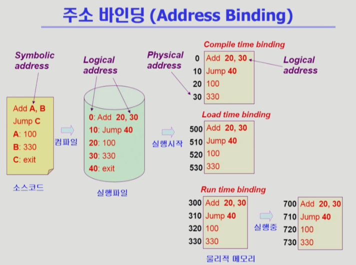
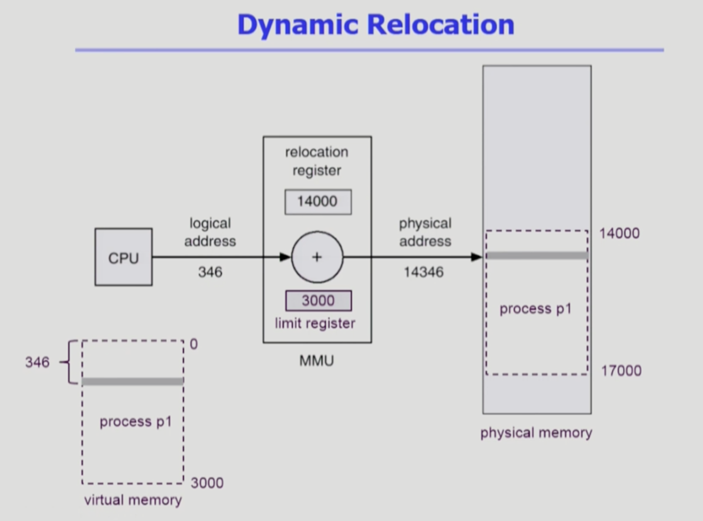
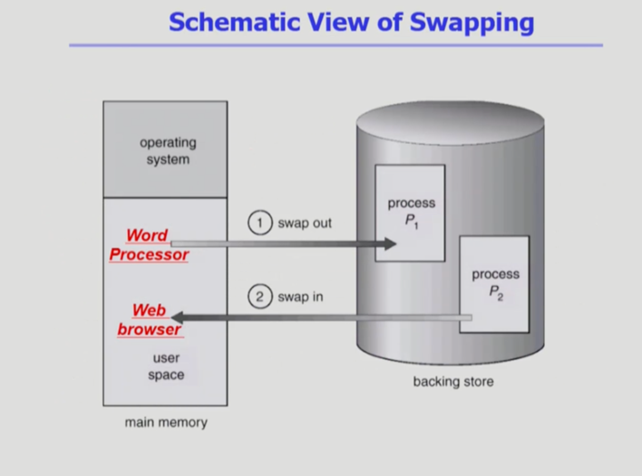
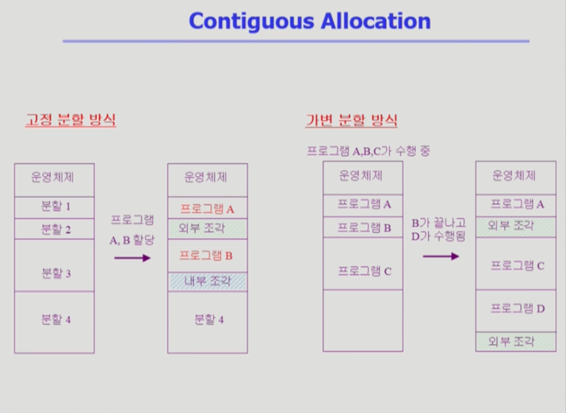
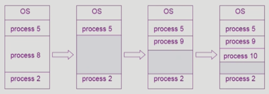

# Chapter 8. Memory Management (메모리 관리)

### 💡 Logical vs Physical Address
1. Logical Address (= virtual address, 가상 주소)
    - 프로세스마다 독립적으로 가지는 주소 공간
    - 각 프로세스마다 0번지부터 시작
    - CPU가 보는 주소는 logical address
    
2. Physical Address 
    - 메모리에 실제 올라가는 위치
    - 물리적인 메모리 아래에는 OS가 올라가 있고, 그 위에 프로세스들이 올라가는 형태
    
 

### 💡 주소 바인딩 (Address binding)
- 물리적인 메모리에 저장되는 위치, 즉 주소를 결정하는 것
- Symbolic Address --> Logical Address --> Physical Address
- Symbolic Address
    - 숫자보다는 Symbol로 되어 있는 Address를 사용하기 때문에 개발자가 보기 편하도록 사용하는 주소
    - Symbolic Address에서 Logical, Physical Address로 컴파일 되는 것.
- 주소 바인딩의 종류
    1. Compile time binding
        - 물리적 메모리 주소(physical address)가 컴파일 시 알려짐
        - 시작 위치 변경시 재컴파일
        - 컴파일러는 절대 코드(absolute code) 생성
    2. Load time binding
        - Loader의 책임하에 물리적 메모리 주소 부여
        - 실행 시작시 비어있는 메모리 주소를 찾아 부여함
        - 컴파일러가 재배치가능코드(relocatable code)를 생성한 경우 가능
    3. Execution time binding (= Run time binding)
        - 수행이 시작된 이후에도 프로세스의 메모리 상 위치를 옮길 수 있음.
        - 바인딩이 됐다가 실행 중에 프로세스의 메모리 위치가 변경되기도 하는 것.
        - CPU가 주소를 참조할 때마다 binding을 점검 (address mapping table)
        - 하드웨어적인 지원이 필요 (ex) base and limit registers, MMU
            - MMU가 메모리 위치를 변경(주소 변환)해주는 역할을 함.
    
    
    - 현재는 Run time binding을 사용함.
    - CPU가 바라보는 주소는 Logical Address.
    
 

### 💡 Memory Management Unit (MMU)
- 주소 변환을 도와주는 하드웨어 장치
- Logical Address를 Physical Address로 매핑해 주는 Hardware Device
- MMU Scheme
    - 사용자 프로세스가 CPU에서 수행되며 생성해내는 모든 주소값에 대해 base register (= relocation register)의 값을 더한다.
    - relocation register, limit register 이렇게 두개의 레지스터로 주소 변환을 도와준다.

    
  
    - 논리 주소 + 시작 위치를 더해서 실제 위치를 파악함.
    - limit register는 프로그램의 크기를 담고 있는 레지스터.
      logical address가 범위 밖을 벗어나게 되는 경우 다른 프로그램의 위치를 요청하게 되기 때문에 이러한 악의적인 요청을 방어해야 함.
      맨 처음 limit register가 범위 안에 존재하는 logical address인지 판별하고, 범위를 벗어나는 경우 트랩을 발생시켜 OS가 해당 요청을 파악하도록 함.

- user program
    - logical address만을 다룬다.
    - 실제 physical address를 볼 수 없으며 알 필요가 없다.
    - physical address는 MMU를 거쳐서 접근 가능함.
    
 

### 💡 Dynamic Loading
- 프로세스 전체를 메모리에 미리 다 올리는 것이 아니라 해당 루틴이 불려질 때(동적으로, 필요할 때마다) 메모리에 Load 하는 것.
- memory utilization의 향상
- 가끔씩 사용되는 많은 양의 코드의 경우 유용 ex) 오류 처리 루틴
- 운영체제의 특별한 지원 없이 프로그램 자체에서 구현 가능 (OS는 라이브러리를 통해 지원 가능)
- 지금 시스템에서 OS가 페이징 기법을 통해 메모리를 관리하고 있지만, Dynamic loading은 프로그래머가 구현하는 영역.
  (페이징 기법과 Dynamic Loading은 다른 부분이 있지만, 같은 용어로 사용하기도 함.)
- Loading : 메모리로 올리는 것.

 

### 💡 Overlay
- 메모리에 프로세스의 부분 중 실제 필요한 정보만을 올림 (Dynamic Loading과 비슷)
- 프로세스의 크기가 메모리보다 클 때 유용
- 운영체제의 지원 없이 사용자에 의해 구현
- 작은 공간의 메모리를 사용하던 초창기 시스템에서 수작업으로 프로그래머가 구현
    - Manual Overlay (프로그래밍이 매우 복잡함. 어렵고 불편했음.)

 

### 💡 Swapping
- 프로세스를 일시적으로 메모리에서 backing store로 쫒아내는 것
- Backing Store (= Swap area)
    - 디스크 : 많은 사용자의 프로세스 이미지를 담을 만큼 충분히 빠르고 큰 저장 공간
- Swap in / Swap out
    - 일반적으로 중기 스케줄러 (swapper)에 의해 swap out 시킬 프로세스 선정
    - priority-based CPU scheduling algorithm
        - priority가 낮은 프로세스를 swapped out 시킴
        - priority가 높은 프로세스를 메모리에 올려 놓음
    - Compile time 혹은 load time binding에서는 원래 메모리 위치로 swap in 해야 함.
    - Execution time binding(= Run time binding)에서는 추후 빈 메모리 영역 아무 곳에나 올릴 수 있음. 더 효율적임.
    - swap time은 대부분 transfer time (swap 되는 양에 비례하는 시간)임. transfer time은 원래 미미한 수준이지만 swap에서는 중요.

    

 

### 💡 Dynamic Linking
- Linking을 실행 시간 (execution time)까지 미루는 기법
- **Static Linking**
    - 라이브러리가 프로그램의 실행 파일 코드에 포함됨.
    - 실행 파일의 크기가 커짐
    - 동일한 라이브러리를 각각의 프로세스가 메모리에 올리므로 메모리 낭비    
      ex) printf 함수의 라이브러리 코드
        - static linking : 라이브러리 복제 (printf가 있는 프로세스 100개면 라이브러리도 100개 존재할 것)
        - dynamic linking : 라이브러리 링킹 (해당 주소만 복사, 라이브러리는 1개만 존재)
- **Dynamic Linking**
    - 라이브러리가 실행시 연결(Link)됨.
    - 실행 파일에는 라이브러리가 별도로 존재하고, 라이브러리 자체는 포함시키지 않고 Link만 두는 것.
    - 라이브러리 호출 부분에 라이브러리 루틴의 위치를 찾기 위한 stub이라는 작은 코드를 둠
    - 라이브러리가 이미 메모리에 있으면, 그 루틴의 주소로 가고 없으면 디스크에서 읽어옴
    - 운영체제의 도움이 필요.

 

### 💡 Allocation of Physical Memory
- 메모리는 일반적으로 두 영역으로 나뉘어 사용
    1. OS 상주 영역
        - interrupt vector와 함께 낮은 주소 영역 사용
    2. 사용자 프로세스 영역
        - 높은 주소 영역 사용

- 사용자 프로세스 영역의 할당 방법
    1. Contiguous Allocation (연속 할당)
        - 각각의 프로세스가 메모리의 연속적인 공간에 적재되도록 하는 것 (통째로 올라가는 것)
        - Fixed partition allocation
        - variable partition allocation
    2. Noncontiguous Allocation (불연속 할당)
        - 하나의 프로세스가 메모리의 여러 영역에 분산되어 올라갈 수 있음 (잘게 쪼개서 여러곳에 올라가는 것)
        - Paging
        - Segmentation
        - Paged Segmentation
    
 

## 💡 Contiguous Allocation 

### 1. Fixed partition allocation (고정 분할 방식)
- 물리적인 메모리를 몇 개의 영구적 분할 (partition)으로 나눔
- 분할의 크기가 모두 동일한 방식과 서로 다른 방식이 존재
- 분할 당 하나의 프로그램 적재
- 융통성이 없음
    - 동시에 메모리에 Load되는 프로그램의 수가 고정됨.
    - 최대 수행 가능 프로그램 크기 제한
- **외부 조각 (External Fragmentation)**
    - 분할된 부분이 작아서 생기는 문제
- **내부 조각 (Internal Fragmentation)**
    - 분할된 부분이 커서 남는 부분이 발생해서 생기는 문제
    
### 2. variable partition allocation (가변 분할 방식)
- 프로그램의 크기를 고려해 할당하는 방식
- 분할의 크기, 개수가 동적으로 변형
- 기술적 관리 기법 필요
- 외부 조각 (External Fragmentation) 이 발생할 수 있음.
    
### 3. Hole
- 가용 메모리 공간
- 다양한 크기의 hole들이 메모리 여러 곳에 흩어져 있음.
- 프로세스가 도착하면 수용 가능한 hole을 할당
- 운영체제는 할당 공간(사용중인 공간), 가용 공간(hole) 정보를 유지함.

### 4. Dynamic Storage Allocation Problem
- 가변 분할 방식에서 size n인 요청을 만족하는 가장 적절한 hole을 찾는 문제
1. First-fit
   - size가 n 이상인 것 중 최초로 찾아지는 hole에 할당
2. Best-fit
   - Size가 n 이상인 가장 작은 hole을 찾아서 할당 (프로그램의 크기와 가장 비슷한 Hole 탐색)
   - Hole들의 리스트가 크기순으로 정렬되지 않은 경우 모든 hole의 리스트를 탐색해야 함.
   - 많은 수의 아주 작은 hole들이 생성됨.
3, Worst-fit
   - 가장 큰 hole에 할당.
   - 역시 모든 리스트를 탐색해야 함.
   - 상대적으로 아주 큰 hole들이 생성됨.
- First-fit과 Best-fit이 Worst-fit보다 속도와 공간 이용률 측면에서 더 효과적인 것으로 알려짐. (실험적인 결과, 약간 당연하기도 함)

### 5. Compaction
- External Fragmentation(외부 조각) 문제를 해결하는 한 가지 방법
- 사용 중인 메모리 영역을 한군데로 몰고 hole들을 다른 한 곳으로 몰아 큰 block을 만드는 것
- 매우 비용이 많이 드는 방법임
- 최소한의 메모리 이동으로 compaction하는 방법 (매우 복잡한 문제)
- Compaction은 프로세스의 주소가 실행 시간에 동적으로 재배치 가능한 경우에만 수행될 수 있다.

 

## 💡 Noncontiguous Allocation
- 주소 변환을 페이징 별로 해야하기 때문에 바인딩이 어려워짐.

### 1. Paging (페이징 기법)
- Process의 Virtual Memory를 **동일한 사이즈**의 Page 단위로 나눔
- Virtual Memory의 내용이 page 단위로 noncontiguous하게 저장됨.
- 일부는 backing storage에, 일부는 physical memory에 저장됨.
- Basic Method
    - Physical memory를 동일한 크기의 frame으로 나눔.
    - Logical memory를 동일 크기의 page로 나눔 (frame과 같은 크기)
    - 모든 가용 frame들을 관리
    - page table(각각의 페이지의 주소공간을 관리하는 배열)을 사용하여 logical address를 physical address로 변환
    - External fragmentation 발생 안함 (같은 크기로 분할하기 때문)
    - Internal Fragmentation 발생 가능    
      (마지막에 페이지 하나보다 남는 공간이 생길 수 있음. memory 공간이 페이지 개수만큼 할당되지는 않기 때문에.)

- 주소변환을 위해 paging table(배열)이 사용됨.
- page가 들어갈 수 있는 공간을 paging frame이라고 함.

- 앞부분이 논리적인 페이지 번호(p) / 뒤부분은 논리적인 주소(d)
 
> Implementation of Page Table
- Page table은 main memory에 상주
- Page-table base register(PTBR)가 page table을 가리킴
- Page-table length register(PTLR)가 테이블 크기를 보관
- 모든 메모리 접근 연산에는 2번의 memory access 필요
- page table 접근 1번, 실제 data/instruction 접근 1번
- 속도 향상을 위해 associative register or translation look-aside buffer(TLB)라 불리는 고속의 lookup hardware cache 사용
  (별도의 하드웨어를 사용하여 속도 향상을 도모함)
  

- 메모리 주소 변환을 위해 별도의 cache memory를 두는 것을 TLB라고 보면 됨.
- 페이지 테이블에 대한 일부 데이터를 caching함.
- TLB를 주소 변환 전에 먼저 검색하여 데이터를 체크하고, 존재한다면 바로 주소변환이 발생함.
- 정보 전체를 담고 있는 것이 아니라 빈번이 참고되는 일부 데이터만을 담고 있기 때문에 물리적/논리적 페이지의 쌍을 가지고 있음.
- TLB는 전체를 search해야 하기 때문에 Associative registers를 추가로 사용하여 병행 검색(parallel search)이 가능하도록 구현함.
- Address Translation (주소 변환)
    - page table 중 일부가 associative register에 보관되어 있음.
    - 만약 해당 page #(number)가 associative register에 있는 경우 곧바로 frame #를 얻음.
    - 그렇지 않은 경우 main memory에 있는 page table로부터 frame #를 얻음
    - TLB는 context switch 때 flush (remove old entries)
                       
> Effective Access Time 

- TLB로부터 주소변환이 되는 비율이 굉장히 높기 때문에 입실론(e)의 비율은 굉장이 적다.
     
> Two-Level Page Table

- Outer-page table / Inner-page table(page of page table) 이렇게 두가지 테이블 사용        
- 속도는 줄어들지 않지만, 메모리 사용량이 줄어들기 때문에 사용함.
- 현대의 컴퓨터는 address space가 매우 큰 프로그램을 지원함.
    - 32bit address 사용 시 : 2의 32승 Byte (4GB)의 주소 공간
        - page size가 4K일 시 1M개의 Page table entry 필요.
        - 각 page entry가 4Byte일 시 프로세스 당 4M의 page table 필요.
        - 그러나, 대부분의 프로그램은 4G의 주소 공간 중 지극히 일부분만을 사용하므로 page table 공간이 심하게 낭비됨.
    - page table 자체를 page로 구성하면 사용되지 않는 주소 공간에 대한 outer page table의 엔트리 값은 null
      (대응하는 inner page table이 없음, 그러므로 메모리 공간을 아낄 수 있음.)
- 페이지 테이블도 영역을 나누어 관리하는 것
- Logical address (on 32-bit machine with 4K page size)의 구성
    - 20 bit의 page number
    - 12 bit의 page offset
- page table 자체가 page로 구성되기 때문에 page number는 다음과 같이 나뉘게 된다.
    - 10-bit page number
    - 10-bit page offset
- 따라서, logical address는 page number (p1 - 10bit, p2 - 10bit)와 page offset (d - 12bit)로 구성되어 있게 된다.

- 여기서 p1은 outer page table의 index이고, p2는 outer page table의 page에서의 변위 (displacement)가 된다.
- 

  
### 2. Segmentation (세그먼테이션 기법)
   - 의미 있는 크기, 공간별로 자름. 크기가 균일하지 않음.
   - 코드 세그먼트 / 데이터 세그먼트 / 스택 세그먼트 등으로 자름. 함수 별로도 자를 수 있음.
    
### 3. Paged Segmentation

 

### 💡

 