# Chapter 8. Memory Management (메모리 관리)

 

## 💡 Noncontiguous Allocation
- 주소 변환을 페이징 별로 해야하기 때문에 바인딩이 어려워짐.

### 1. Paging (페이징 기법)
- Process의 Virtual Memory를 **동일한 사이즈**의 Page 단위로 나눔
- Virtual Memory의 내용이 page 단위로 noncontiguous하게 저장됨.
- 일부는 backing storage에, 일부는 physical memory에 저장됨.
- Basic Method
    - Physical memory를 동일한 크기의 frame으로 나눔.
    - Logical memory를 동일 크기의 page로 나눔 (frame과 같은 크기)
    - 모든 가용 frame들을 관리
    - page table(각각의 페이지의 주소공간을 관리하는 배열)을 사용하여 logical address를 physical address로 변환
    - External fragmentation 발생 안함 (같은 크기로 분할하기 때문)
    - Internal Fragmentation 발생 가능    
      (마지막에 페이지 하나보다 남는 공간이 생길 수 있음. memory 공간이 페이지 개수만큼 할당되지는 않기 때문에.)

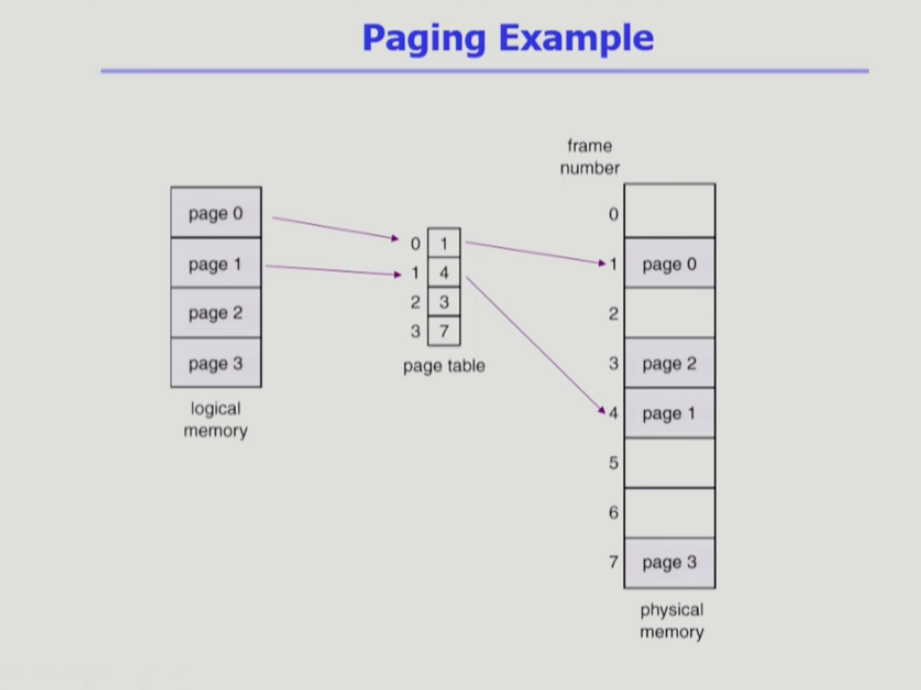
- 주소변환을 위해 paging table(배열)이 사용됨.
- page가 들어갈 수 있는 공간을 paging frame이라고 함.

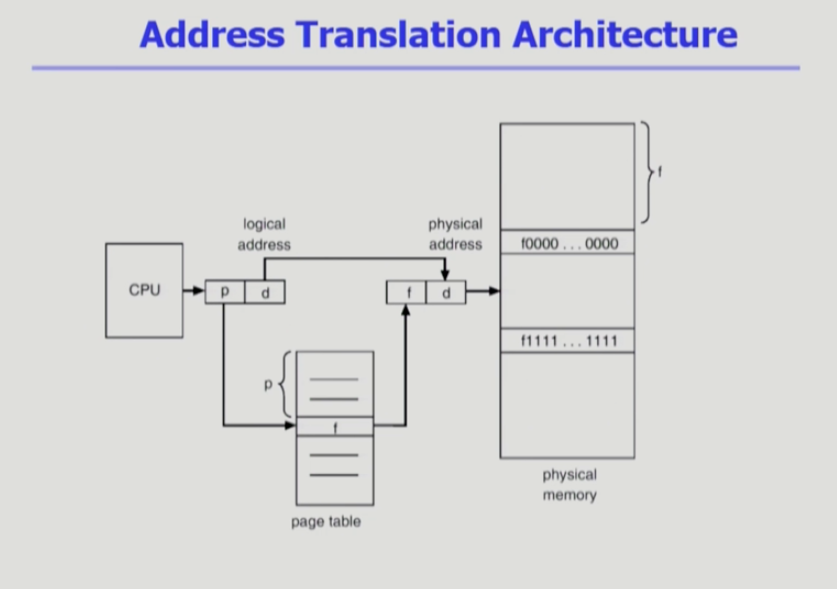
- 앞부분이 논리적인 페이지 번호(p) / 뒤부분은 논리적인 주소(d)

> Implementation of Page Table
- Page table은 main memory에 상주
- Page-table base register(PTBR)가 page table을 가리킴
- Page-table length register(PTLR)가 테이블 크기를 보관
- 모든 메모리 접근 연산에는 2번의 memory access 필요
- page table 접근 1번, 실제 data/instruction 접근 1번
- 속도 향상을 위해 associative register or translation look-aside buffer(TLB)라 불리는 고속의 lookup hardware cache 사용
  (별도의 하드웨어를 사용하여 속도 향상을 도모함)

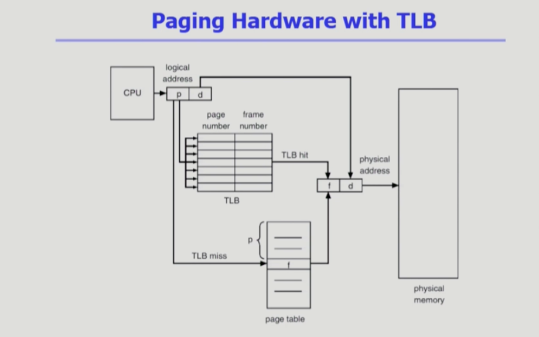

- 메모리 주소 변환을 위해 별도의 cache memory를 두는 것을 TLB라고 보면 됨.
- 페이지 테이블에 대한 일부 데이터를 caching함.
- TLB를 주소 변환 전에 먼저 검색하여 데이터를 체크하고, 존재한다면 바로 주소변환이 발생함.
- 정보 전체를 담고 있는 것이 아니라 빈번이 참고되는 일부 데이터만을 담고 있기 때문에 물리적/논리적 페이지의 쌍을 가지고 있음.
- TLB는 전체를 search해야 하기 때문에 Associative registers를 추가로 사용하여 병행 검색(parallel search)이 가능하도록 구현함.
- Address Translation (주소 변환)
    - page table 중 일부가 associative register에 보관되어 있음.
    - 만약 해당 page #(number)가 associative register에 있는 경우 곧바로 frame #를 얻음.
    - 그렇지 않은 경우 main memory에 있는 page table로부터 frame #를 얻음
    - TLB는 context switch 때 flush (remove old entries)

> Effective Access Time

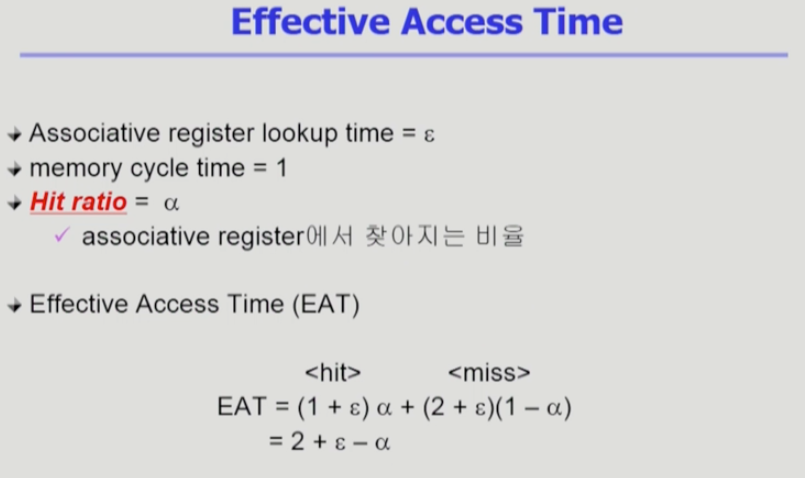
- TLB로부터 주소변환이 되는 비율이 굉장히 높기 때문에 입실론(e)의 비율은 굉장이 적다.

> Two-Level Page Table

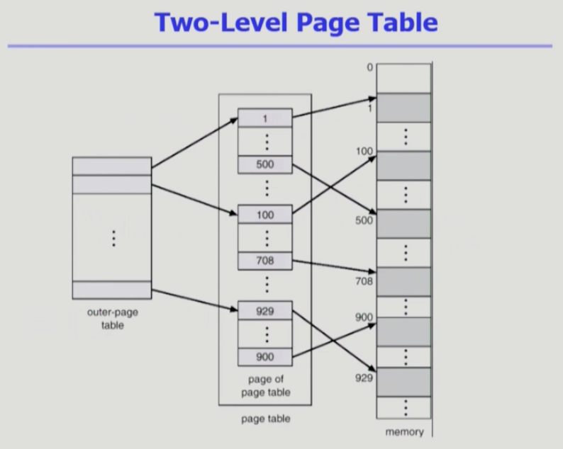

- Outer-page table / Inner-page table(page of page table) 이렇게 두가지 테이블 사용
- 속도는 줄어들지 않지만, 메모리 사용량이 줄어들기 때문에 사용함.
- 현대의 컴퓨터는 address space가 매우 큰 프로그램을 지원함.
    - 32bit address 사용 시 : 2의 32승 Byte (4GB)의 주소 공간
        - page size가 4K일 시 1M개의 Page table entry 필요.
        - 각 page entry가 4Byte일 시 프로세스 당 4M의 page table 필요.
        - 그러나, 대부분의 프로그램은 4G의 주소 공간 중 지극히 일부분만을 사용하므로 page table 공간이 심하게 낭비됨.
    - page table 자체를 page로 구성하면 사용되지 않는 주소 공간에 대한 outer page table의 엔트리 값은 null
      (대응하는 inner page table이 없음, 그러므로 메모리 공간을 아낄 수 있음.)
- 페이지 테이블도 영역을 나누어 관리하는 것
- Logical address (on 32-bit machine with 4K page size)의 구성
    - 20 bit의 page number
    - 12 bit의 page offset
- page table 자체가 page로 구성되기 때문에 page number는 다음과 같이 나뉘게 된다.
    - 10-bit page number
    - 10-bit page offset
- 따라서, logical address는 page number (p1 - 10bit, p2 - 10bit)와 page offset (d - 12bit)로 구성되어 있게 된다.

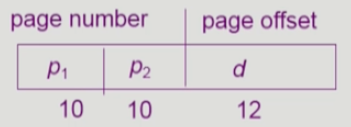

- 여기서 p1은 outer page table의 index이고, p2는 outer page table의 page에서의 변위 (displacement)가 된다.

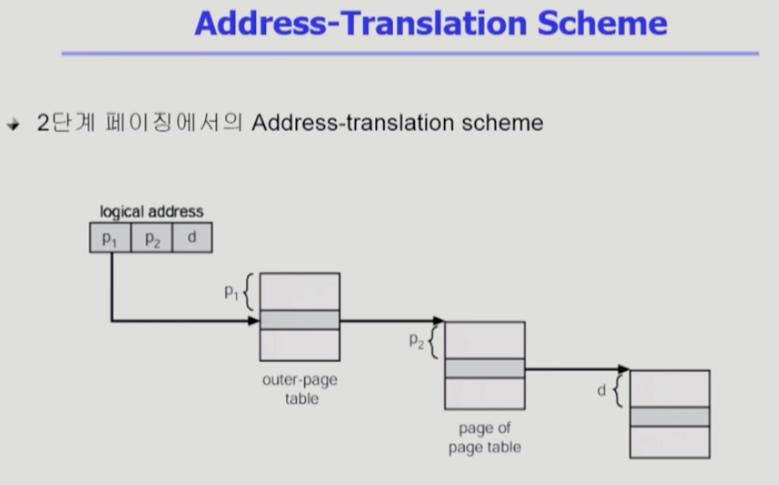

> Multilevel Paging and Performance
- Address space가 더 커지면 다단계 페이지 테이블 필요 (2단계 페이지 테이블만 있는게 아니라 더 많은 단계의 페이지 테이블 사용 가능)
  
- 페이지 테이블이 여러개 있을 수 있지만 그만큼 여러 단계를 거쳐야 하고, 주소 변환을 위해 각 단계에 접근하기 때문에
- 각 단계의 페이지 테이블이 메모리에 존재하므로 logical address의 physical address 변환에 더 많은 메모리 접근 필요
- TLB를 통해 메모리 접근 시간을 줄일 수 있음   
  (다단계 페이지 테이블을 사용하더라도 TLB를 접근하는 방법을 통해 주소 변환을 하므로 그렇게 접근 시간에서의 오버헤드가 발생하지 않음.)
- 4단계 페이지 테이블을 사용하는 경우
    - 메모리 접근 시간이 100ns, TLB(주소 변환을 용이하게 해주는 캐시 메모리) 접근 시간이 20ns이고
    - TLB hit ratio가 98%인 경우
        effective memory access time = 0.98 * 120 + 0.02 * 520 = 128 nanoseconds.
    - 결과적으로 주소 변환을 위해 28ns만 소요됨. (메모리 접근 시간이 100ns이기 때문에)

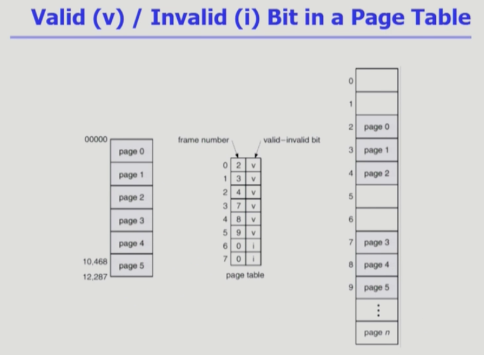

- 젤 왼쪽 테이블이 Logical memory, Logical Memory의 개수 만큼 가운데에 있는 페이지 테이블에 엔트리가 존재함.
- 논리적인 메모리가 최종적으로 물리적인 페이지 어디에 적재되어 있는지에 대해서도 페이지 테이블에 저장해둠.
- 주소 변환 정보만 들어있는 것이 아니라 vaild-invaild bit이 같이 들어있음.
- Logical memory의 최대 개수만큼 페이지 테이블 엔트리가 존재하기 때문에, 현재 사용하고 있지 않는 영역이더라도 엔트리가 존재함.
사진 속 6,7 페이지가 없지만 페이지 테이블은 존재하는 것도 이와 같음. 이로 인해 vaild-invaild bit를 통해 이미 물리적으로 적재된 페이지인지 판별 가능.
- 항상 메모리에 올라와있지 않거나, 물리적으로 적재되어 있지 않은 경우 invaild bit를 표기하여 파악 가능.

 

### 💡 Memory Protection
- page table의 각 entry마다 아래의 bit를 둔다.
    1. Protection bit
        - page에 대한 접근 권한 (read/write/read-only)
        - 
    2. Valid-Invaild bit
        - "valid"는 해당 주소의 frame에 그 프로세스를 구성하는 유효한 내용이 있음을 뜻함 (접근 허용)
        - "invalid"는 해당 주소의 frame에 유효한 내용이 없음을 뜻함. (접근 불허)
            - 이 때, 유효한 내용이 없다는 의미는 프로세스가 그 주소 부분을 사용하지 않고 있거나,   
              해당 페이지가 메모리에 올라와 있지 않고 swap area(backing store)에 임시 저장되어 있는 경우를 뜻함.

### 💡 Inverted Page Table
- page table이 매우 큰 이유
    - 모든 process 별로 그 logical address에 대응하는 모든 page에 대해 page table entry가 존재. (page table 자체가 메모리를 많이 차지)
    - 대응하는 page가 메모리에 있든 아니든 간에 page table에는 entry로 존재
    - 공간 오버헤드가 큰 편.
    
- Inverted page table
    - page frame 하나 당 page table에 하나의 entry를 둔 것 (system-wide)
    - 각 page table entry는 각각의 물리적 메모리의 page frame이 담고 있는 내용 표시 (process-id, process의 logical address)
    - 단점 : 테이블 전체를 탐색해야 함 (시간적인 오버헤드 존재)
    - 조치 : associative register 사용 (expensive) -> 별도의 하드웨어를 사용하여 시간적인 오버헤드를 줄이는 방법
      (여기서 page table을 하나의 하나의 연산으로(순차적으로) 처리하면 시간이 너무 오래 걸리기 때문에, 
      associative register라는 별도의 하드웨어에 page table을 저장해서 병렬 연산을 통해 logical address의 주소를 찾음)

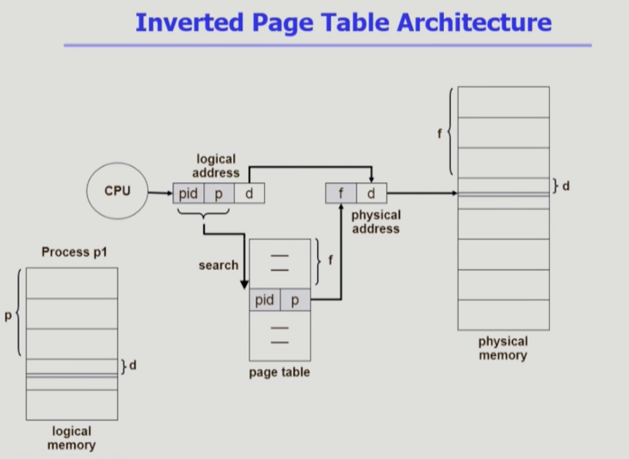

- 실제 물리적 메모리의 프레임 개수만큼 페이지 테이블에 엔트리가 존재.
- 페이지 테이블의 첫 번째 엔트리에는 물리적 메모리의 첫 번째 프레임에 들어가는 논리적 메모리의 첫 번째 프레임의 주소가 있고,
- 페이지 테이블의 두 번째 엔트리에는 물리적 메모리의 두 번째 프레임에 들어가는 논리적 메모리의 두 번째 프레임의 주소가 있음.
- 페이지 주소 변환이란, 1) 논리적 메모리의 주소를 참조해서 2) 물리적 메모리를 찾아가는 과정.
- 하지만 Inverted Page Table은 이와 완전히 반대되는 개념. 논리적 페이지의 페이지 번호 p가 물리적 메모리의 몇 번째 프레임에 위치했는지 찾기 위해서는, 
  페이지 테이블을 모두 뒤져서 p가 자리한 엔트리를 찾은 뒤 물리적 메모리의 어디에 위치해있는지 알 수 있음. (엔트리를 전부 검색해야 함)
  목적에는 부합하지 않으나 그럼에도 이걸 사용하는 건 페이지 테이블이 메모리에서 차지하는 공간을 줄이기 위한 것. 하지만 시간적인 오버헤드 존재.
  뿐만 아니라 p가 어느 프로세스의 p인지 파악하기 위해 프로세스를 구분하는 pid 역시 저장해야 함.

1) CPU가 logical address를 줌
2) 1번에서 받은 주소를 가지고 page entry를 뒤져서 p가 위치하는 물리적 메모리의 frame 위치를 파악
3) p가 여러 개 존재할 수 있기 때문에 현재 CPU를 점유하고 있는 프로세스의 PID를 동시에 줘서 그 PID를 가진 P가 물리적 메모리의 어떤 위치에 존재하는지 찾음.
4) 찾아진 위치가 page table에서 몇 번째 떨어진 위치인지(여기서는 f만큼 떨어진 엔트리) 파악해서 물리적 메모리에 가서 f번째 떨어진 엔트리를 찾음으로써 주소 변환을 완료.

 

### 💡 Shared Page

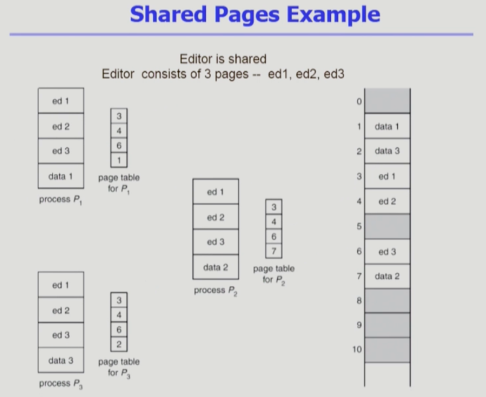

- Shared code (Re-entrant Code, 재진입 가능 코드, Pure code)
    - *read-only*로 하여 프로세스 간에 하나의 code만 메모리에 올림 (코드 공유). e.g. text editors, compilers, window systems
    - shared code는 모든 프로세스의 logical address space에서 동일한 위치에 있어야 함.
      (동일한 logical address를 가져야 함. 물리적 메모리 뿐만 아니라, 논리적 주소도 동일해야 함.)
    - 공유할 수 있는 코드를 하나만 올려서 여러 프로세스와 매핑. Read-only로만 세팅해서 물리적 메모리에 하나의 code만 올림.

- Private code and data
    - 각 프로세스들은 독자적으로 메모리에 올림 (각각의 다른 프레임에 매핑되도록 설정)
    - Private data는 logical address space의 아무 곳에 와도 무방
    - 만약 하나의 워드 프로그램을 3개 사용한다고 하면, 같은 프로그램을 사용하기 때문에 프로그램 코드는 share가 가능함. 
      이렇게 share가 가능한 코드들에 대해서는 물리적 메모리에 하나의 코드만 올려서 이걸 공유함. 각각의 프로세스마다 다른 데이터 코드만 메모리에 별도로 올려서 사용.

 

### 2. Segmentation (세그먼테이션 기법)
- 의미 있는 크기, 공간별로 자름. 크기가 균일하지 않음.
    - 작게는 프로세스를 구성하는 주소 공간(함수) 하나하나를 의미 단위로 잘라 세그먼트로 정의
    - 크게는 프로그램 전체를 하나의 세그먼트로 정의 가능.
- 코드 세그먼트 / 데이터 세그먼트 / 스택 세그먼트 등으로 자름. 함수 별로도 자를 수 있음.
- logical unit 예제
    - main(), function, global variables, stack, symbol table, arrays

### 💡 Segmentation Architecture
- Logical address는 다음의 두 가지로 구성됨.
    < Segment-number, offset >
  
- Segment table (주소변환이 필요하므로 테이블 존재)
    - each table entry has base (starting physical address of segment, 물리 주소), limit (length of the segment, 세그먼트의 개수)
    
- STBR(Segment-table base register)
    - 물리적 메모리에서의 segment table의 위치
    - table이 어느 위치에 저장되어 있는지
- STLR(Segent-table length register)
    - 프로그램이 사용하는 segment의 수
        - segment number s가 STLR보다 작으면 오류 발생 !!
    
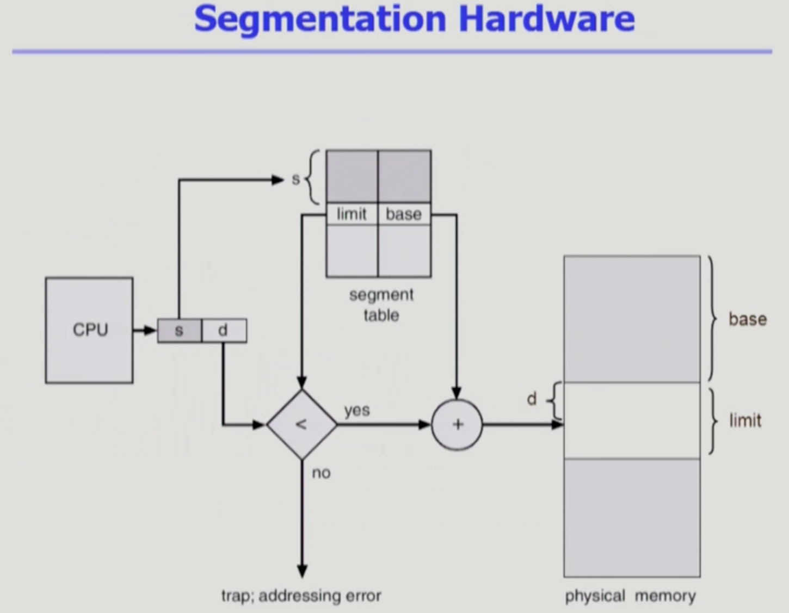

- 프레임의 크기가 일괄적인 페이징 기법과 달리, 세그먼트 기법은 unit별로 크기가 다르기 때문에 물리적 메모리에서 세그먼트가 시작하는 위치인 base와 함께 세그먼트의 크기인 limit 값도 가지고 있음.
- 페이징에서는 프레임 크기가 모두 동일하기 때문에 프레임 번호만으로도 주소를 찾아갈 수 있음
- 주소 변환 시 확인해야할 것은 세그먼트 번호가 STLR보다 작아야 하고,
  세그먼트의 크기 limit보다, 세그먼트가 위치하는 곳을 나타내는 offset의 크기 d의 값이 더 크면 역시 scope error이기 때문에 오류 발생.
- 이러한 오류가 발생하지 않을 때 비로소 세그먼트가 시작하는 위치 base에서 offset의 크기 d를 더한 주소로 이동해 주소 변환을 진행함.

1. Protection
    - 각 세그먼트 별로 protection bit가 있음
    - Each entry
        - Vaild bit = 0 => illegal segment
        - Read/Write/Execution 권한 bit
2. Sharing
    - shared segment (같은 논리 주소 보유)
    - same segment number
    - segment는 의미 단위이기 때문에 공유와 보안에 있어서 paging보다 훨씬 효과적이다. (장점)
    
3. Allocation
    - first fit / best fit
    - external fragmentation 발생
    - segment의 길이가 동일하지 않으므로 가변 분할 방식에서와 동일한 문제점들이 발생함. (단점)

#### 정리 
- 단점: segmentation의 크기가 동일하지 않기 때문에 hole 문제가 발생 가능
  (중간중간 사용하지 않는 메모리 공간 발생 가능)
- 장점: 의미단위로 일을 처리할 때에는 매우 효과적. 의미 단위로 세그먼트를 나누기 때문에 Read/ Write 등등을 구분하는 게 자연스러움

 

### 💡 Sharing of Segments

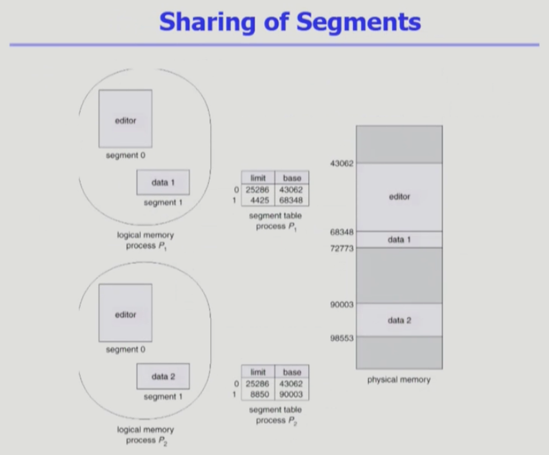

- 세그먼트는 운영해보면 개수가 몇개 안됨.
- 그러므로 테이블에 의한 메모리 낭비는 페이징이 더 심함. 세그먼트는 좀 더 적음.

 

### 💡 Segmentation with paging

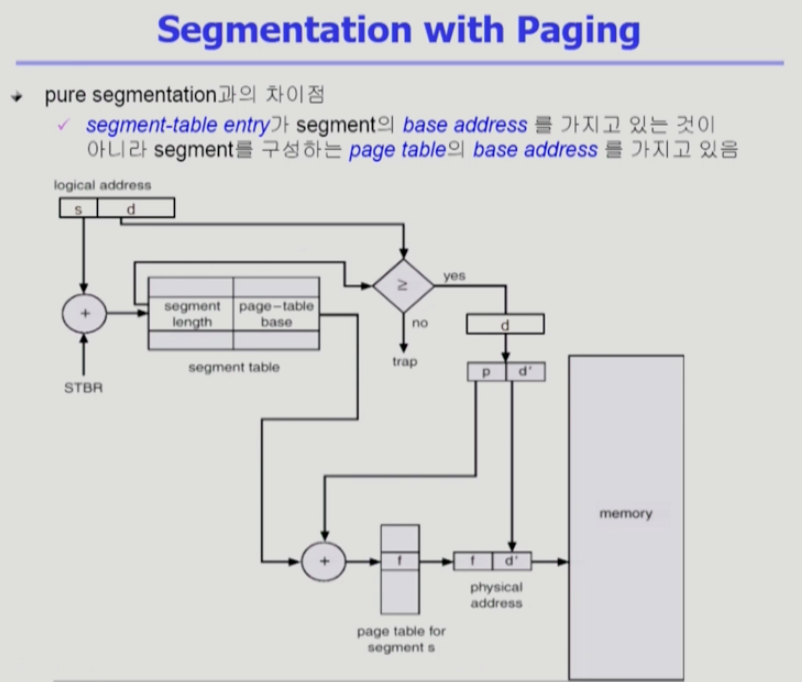

- segment 하나가 여러 개의 page로 구성. 때문에 메모리에 올라갈 때 page 단위로 잘려서 올라감. segment table entry가 물리적 메모리에서 
  segment가 어디서 시작하는지 나타내는 base address가 아니라 segment를 구성하는 page의 위치를 나타내는 page table의 base address를 가지고 있음. 
  이를 통해 segment의 크기가 각각 달라 hole이 발생하는 문제를 해결.
- 어떤 segment를 read-only로 설정할 것인지 등등의 의미단위 작업은 segment table에서 미리 설정.

1. logical address에서 s를 통해 setment table 내의 몇 번째 segment entry를 나타내는지 확인
2. 그렇게 알게 된 segment table의 s에서 segment 내부의 page의 시작 위치인 page-table base를 확인
3. 한편, 물리적 메모리에서 해당 segment가 어디에서 시작하는지 나타내는 offset값 d와 s를 비교하여 error를 검출
4. 3번에서 이상이 없다면 offset값 d를 나눠서 page의 page-table에서 몇 번째 page entry인지 나타내는 p값과 page의 어디에서 시작되는지 나타내는 offset 값 d'를 확인
5. 1~4번에서 얻은 값을 통해 최종적으로 논리적 주소를 물리적 메모리 주소로 변환

- 이 모든 작업은 MMU라는 하드웨어와 CPU가 해줘야 하는 일. 여기서 운영체제가 하는 일은 없음. 운영체제는 IO Device에 접근할 때. 하지만 메모리 접근 시에는 하드웨어가 작업.
