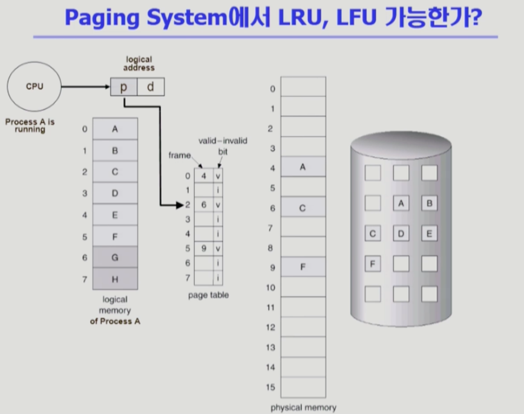
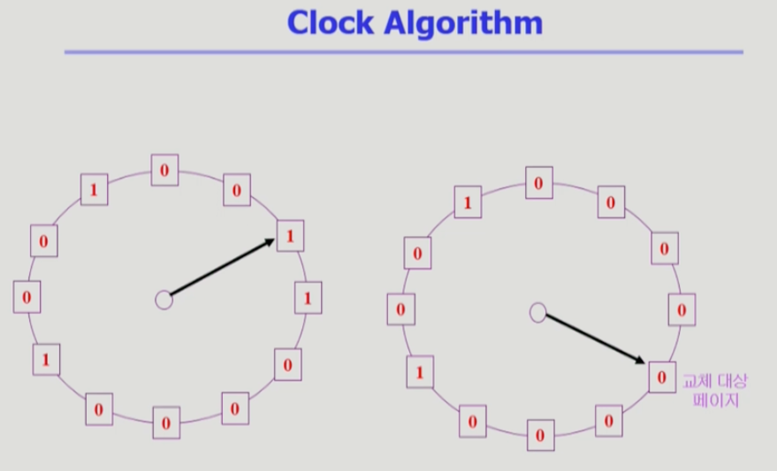
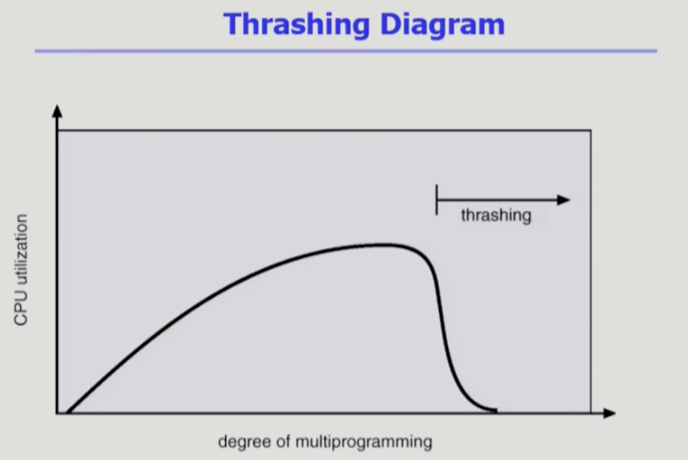
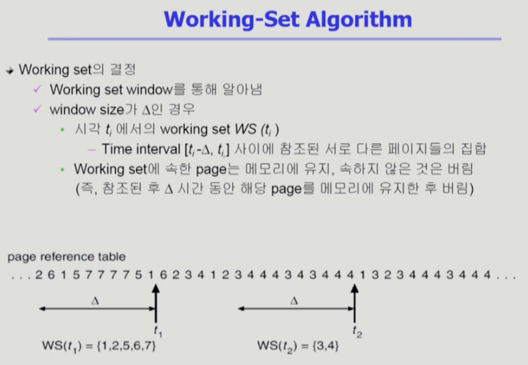

# Chapter 9. Virtual Memory

 

## 💡  다양한 캐싱 환경
- 캐싱 기법
    - 한정된 빠른 공간(캐시)에 요청된 데이터를 저장해 두었다가 또 똑같은 요청이 들어오면 느린 저장장치에 접근하지 않고 빠른 캐시로부터 직접 서비스하는 방식
    - 가상 메모리 페이징 시스템에서는 한정된 빠른공간(= 물리메모리, RAM), 느린 저장장치(= 하드디스크, 백킹 스토어)
    - paging system 외에도 cache memory, buffer caching(파일 시스템에 대한 read/write 요청을 메모리에서 빠르게 처리하는 방식),
      web caching(멀리있는 컴퓨터에 요청해서 이미 읽어온 웹페이지를 내 컴퓨터에 저장했다가 또 다시 요청했을 때 빠르게 응답해줄 수 있음)등 다양한 분야에서 사용.
- 캐시 운영의 시간 제약
    - 교체 알고리즘에서 삭제할 항목을 결정하는 일에 지나치게 많은 시간이 걸리는 경우 실제 시스템에서 사용할 수 없음.
    - Buffer Caching이나 Web Caching의 경우
        - O(1)에서 O(log n)정도까지만 허용한다. O(n)은 오버헤드가 크다고 판단함.
    - Paging system인 경우
        - Page fault인 경우에만 OS가 관여함.
        - 페이지가 이미 메모리에 존재하는 경우 참조시각 등의 정보를 OS가 알 수 없음. (CPU의 제어권은 페이지폴트가 날때만 OS에게 넘어가기 때문)
        - O(1)인 LRU의 list 조작조차 불가능.

 

## 💡 Paging System 에서 LRU, LFU 가능한가?

- 프로세스 A가 CPU를 잡고 running 중인 경우, 프로세스 A의 논리 메모리에서 매 순간 instruction을 읽어와서 수행할 것.
- 이때 논리주소를 페이지 테이블을 통해서 물리메모리 주소로 변환을 해서, 물리메모리에 있는 내용을 CPU로 읽어와야 될 겁니다.
- 만약, 주소변환을 했는데 해당하는 페이지가 이미 물리메모리에 올라와 있다면 물리 메모리에서 직접 읽어서 가져올 것.
- 이 과정에서 OS는 관여를 하지 않으며 모든 주소변환 작업은 하드웨어가 담당함.
- CPU는 프로세스 A가 가지고 있으면서, 주소 변환해서 값 가져오는것임.
- 근데 만약, invalid라서 백킹스토어에 있다면(페이지 폴트가 발생했다면) 디스크 접근을 필요로 하게 됨. 
  (즉 I/O를 필요로 해 프로세스 A가 직접 행할 수 없으므로 trap이 발생하여 CPU의 제어권이 프로세스 A 에서 OS 로 넘어감)
- OS가 디스크의 페이지 폴트가 났던 페이지를 물리 메모리로 올리고, 그 과정에서 물리 메모리 위에서 하나를 쫓아내는 Replace 작업을 하게 됨.
- 쫒아낼 때, 과연 LRU 알고리즘을 쓴다면, 가장 오래 전에 썼던 페이지를 찾을 수 있을까?
- 또한, LFU 알고리즘을 쓴다면 가장 적게 쓴 페이지를 찾을 수 있을까? 답은 알 수 없음.
- 프로세스가 요청한 페이지가 메모리에 이미 올라와있는 경우엔, CPU가 OS한테 안 넘어가고, 하드웨어적으로 주소 변환해서 그냥 값을 CPU로 읽어옴. 그러면 page 접근 시간을 OS는 모름.
- 반면, 페이지 폴트가 나면 CPU 제어권이 OS로 넘어가니까 디스크로부터 메모리로 페이지가 넘어오는 시간을 알 수 있다. 그래서 사실, 페이지 폴트가 날때만 페이지에 접근하는 정보를 OS가 알 수 있는것임.
- 그러므로 Paging System에서는 LRU, LFU를 사용할 수 없으며, 버퍼 캐싱, 웹캐싱에서 사용됨.

 

## 💡  Clock Algorithm
- 페이징 시스템에서 쓸 수 있는 알고리즘
- LRU의 근사 알고리즘.
- 다양한 명칭으로 불림
  - `Clock Algorithm` : 시계바늘이 이동하면서 알고리즘이 동작하는 방식이라서 이렇게 부름.
  - `Second chance Algorithm` : 기회를 한번 더 준다. 
  - `NUR(Not Used Recently) or NRU Algorithm(Not Recently Used)` : 최근에 사용되지 않은 페이지를 쫓아낸다.
- reference bit 이라는 것을 사용해서 교체 대상 페이지를 선정하며, reference bit가 0인 것을 찾을 때까지 포인터를 하나씩 앞으로 이동하여 1인 bit값을 모두 0으로 변경함.
  Reference bit가 0인 페이지를 찾으면 페이지를 교체, 이미 메모리에 존재하는 페이지가 참조되면 1로 표시한다. (이건 운영체제가 안하고 하드웨어가 수행함)
- 그러면 페이지 폴트가 나서 쫓아내야 하는데, reference bit을 봤는데 1이면 적어도 한번은 참조가 됐구나 알고 쫓아내지 않고 비트만 0으로 바꾸고 다음껄 확인한다.
- Clock algorithm의 개선
    - Reference bit과 modified bit(dirty bit)을 함께 사용
    - Reference bit = 1 : 최근에 참조된 페이지
    - Modified bit = 1 : 최근에 변경된 페이지 (I/O를 동반하는 페이지)
      => modified bit이 1이면 디스크에 쫓겨나는 페이지의 수정된 내용을 백킹스토어에 적용해야 하기 때문에 성능이 저하되므로 쫓아내지 말자.

  
- 각 사각형이 page frame (물리메모리 안에있는 페이지들)
- 페이지에 대해서 어떤 페이지가 참조되서 CPU가 그 페이지를 사용하게 되면 그 페이지에 reference bit이 붙게 된다.
- reference bit은 주소변환을 해주는 하드웨어가 어떤 페이지에 대해 접근해서 valid라 페이지를 읽으면 reference bit를 1로 셋팅해준다. (페이지가 참조됬다는 것을 표시해줌)
    -> 이건 운영체제가 수행하는 것이 아니라 하드웨어가 수행함.
- 운영체제는 reference bit이 이미 1이면, 쫓아내지 않고 다시 0으로 셋팅하고 다음꺼를 검사한다. 그래서 1인거는 최근에 참조됬다는것을 나타냄.
- reference bit가 0이라는건 시계바늘 한바퀴를 도는 동안에, 참조가 없었다.
- reference bit가 1이라는건 시계바늘 한바퀴를 도는 동안에, 적어도 1번의 참조가 있었다.
- 하드웨어가 reference bit을 1로 해놓는 역할을 하고, 운영체제가 하드웨어가 셋팅한 bit를 보고 어떤걸 쫓아낼까 서큘러링크드리스트를 쭉 돌면서 1인걸 0으로 바꾸고, 0인걸 쫓아내는 알고리즘이다!!!
- reference bit가 0인 페이지를 교체하는 것의 의미
  - 한바퀴 도는 동안 오랫동안 참조하지 않은 페이지를 교체함. (어느 정도 LRU와 비슷하게는 구현한 것)
- reference bit말고도 modified bit이라는걸 하나 더 사용함. (dirty bit 라고도 함)
- modified bit은 어떤 페이지가 쫓겨날 때, 이 페이지의 modified bit이 0이면 백킹스토어에서 물리메모리로 올라온 이후로 수정이 되지 않았다는 의미로, 그냥 지워도 된다.
- 1이면 적어도 한번은 내용을 수정한 페이지. 그래서 교체될 때 백킹 스토어에 수정된 내용을 반영한 후에 지워야 한다는 의미임.

 

## 💡  Page Frame의 Allocation
- Allocation problem : 각 프로세스에 얼마 만큼의 페이지 프레임을 할당할 것인가?
- Allocation의 필요성
    - 메모리 참조 명령어 수행 시 명령어, 데이터 등 여러 페이지 동시 참조.
        - 명령어 수행을 위해 최소한 할당되어야 하는 frame 수가 있음.
    - Loop를 구성하는 page들은 한꺼번에 allocate되는 것이 유리함.
        - 최소한의 allocation이 없으면 매 Loop마다 page fault 발생.
  - 예를 들어, for문을 구성하는 페이지가 3개라면 for 문을 백만번 반복하는 동안 페이지폴트가 발생하지 않음.
    - 근데 3개의 페이지로 구성된 for문에게 페이지를 2개만 준다면 페이지 폴트가 계속 발생하게 됨.
      -> 페이지폴트가 잘 안나는 일련의 페이지 갯수가 정해져 있는 경우가 많음.
    - 프로그램별로 페이지 allocation을 해주지 않으면, 메모리에서 특정 페이지가 장악하는 일이 발생하게 됨.
      그래서 각각의 프로그램에게 어느정도의 페이지를 할당해줘야 하는 것.
- Allocation 방법
    - `Equal allocation` : 모든 프로세스에게 똑같은 갯수를 할당.
    - `Proportional allocation` : 프로세스 크기에 비례하여 할당.
    - `Priority allocation` : CPU 우선 순위가 높은 프로세스에게 할당. (프로세스의 priority에 따라 다르게 할당.)

## 💡  Global vs Local Replacement
1. Global replacement
- Replace시 다른 Process에 할당된 frame을 빼앗아 올 수 있음.
- Process별 할당량을 조절하는 또 다른 방법
- FIFO, LRU, LFU등의 알고리즘을 Global replacement로 사용 시 해당함.
- Working Set, PFF 알고리즘 사용
- 다른 프로그램의 페이지를 내쫓을 수 있는 방법.
   
2. Local replacement
- 자신한테 할당된 frame 내에서만 페이지를 쫓아내는(Replacement) 방법.
- FIFO, LFU, LRU 등의 알고리즘을 process별로 운영 시 사용할 수 있는 방법.

## 💡  Thrashing (쓰레싱)
- 페이지 폴트가 지나치게 자주 일어나는 상황.
- 프로세스의 원활한 수행에 필요한 최소한의 page frame 수를 할당받지 못한 경우 발생
- Page fault rate가 매우 높아지고, CPU Utilization이 낮아짐.
- 이 경우, OS는 MPD (Multiprogramming degree)를 높여야 한다고 판단하기 때문에 또 다른 프로세스가 시스템에 추가됨. (higher MPD)
- 프로세스 당 할당된 frame의 수가 더욱 감소하고, 프로세스는 page의 swap in/swap out으로 매우 바빠짐.
- 이렇게 되면 CPU의 비효율성이 매우 높아지게 됨 (low throughput, 처리율이 낮아짐)
- 해결을 위해서는 동시에 실행되는 프로세스의 수, 즉 MPD를 조절해 각 프로세스의 메모리 사용률을 어느정도 확보해주어야 함.

- x축은 지금 메모리에 올라와있는 프로그램의 갯수. / y축은 CPU 사용률.
- 메모리에 동시에 올라오는 프로그램의 숫자에 따라서 CPU 이용률이 어떤지 볼 수 있는 그래프.
- 계속 멀티 프로그램의 개수가 높게 되면, Page fault rate 가 매우 높아지고, CPU utilization이 낮아짐.
  (프로세스의 원활한 수행에 필요한 최소한의 page frame 수를 할당 받지 못한 경우가 빈번해지기 때문에 비효율적)

## 💡  Working-set Algorithm
- Locality of reference
    - 프로세스는 특정 시간, 특정 장소만을 집중적으로 참조한다는 특징 존재.
    - 집중적으로 참조되는 해당 page들의 집합을 locality set이라고 함.
- Working-set Model
    - Locality(지역성)에 기반해서 프로세스가 일정 시간동안 원활하게 수행되기 위해 한꺼번에 메모리에 올라와 있어야 하는 page들의 집합을 Working Set이라고 한다.
    - Working set 모델에서는 process의 working set 전체가 메모리에 올라와 있어야 수행되고 그렇지 않을 경우 모든 frame을 반납한 후 swap out(suspend)됨.
        - 만약, 워킹셋이 5개인데 페이지 프레임을 3개밖에 줄 수 없다면??? 모든 페이지를 반납해버린다. 5개 받을 때까지 페이지 교체 진행 X
        - working set model은 한꺼번에 메모리에 올라가는게 보장이 안되면 메모리를 모두 빼앗아 swap out시켜서 쓰레싱을 방지하는 알고리즘.
    - Thrashing을 방지함.
    - Multiprogramming degree를 결정함.
    - working set window를 과거를 통해 추정한다.
        - 과거 델타 시간동안 참조된 페이지들을 워킹셋으로 간주해서, 메모리에서 쫓아내지 않는다. 델타 시간을 window라고 한다. 그래서 현재 시점부터 과거 window 사이즈 만큼 참조된 페이지는 메모리에 올려놔야 한다. (= 참조된 후 델타 시간동안 page를 메모리에 유지한 후에 버린다. )
          working-set의 크기는 그때그때 바뀐다. 어느 시점에서의 window는 5이고, 어느 시점에서의 window는 2고 ... 그러면 할당해줘야 하는 frame수가 다르다.

## 💡  PFF (Page-Fault Frequency) 알고리즘
직접 페이지폴트 rate를 본다.
페이지폴트를 많이 일으키는 프로세스는 페이지 프레임을 많이 준다.
페이지 폴트 rate가 낮으면, 쓸데없이 메모리를 많이 갖고있을 것이다 라고 생각해서 할당 frame 수를 줄인다.

## 💡 Page Size의 결정
페이징 시스템에서는 동일한 크기의 페이지 크기로 자른다.
페이지 사이즈를 보통 4KB를 쓰고 있다.
메모리 주소체계가 32bit -> 64bit로 바뀌고, 메모리 크기도 점점 커지기 때문에 페이지 사이즈가 너무 작으면 페이지 테이블이 커져서 낭비가 된다...
그래서 메모리 크기가 커지면 거기에 따라서 페이지 크기도 커져야 할 필요가 생긴다.
그래서 최근엔 대용량 페이지 사이즈를 갖는 메모리 시스템이 나오고 있다.
페이지 수를 줄이게 되면 --> 페이지 갯수가 증가하고 --> 페이지 엔트리수가 많아져서 --> 페이지 테이블 메모리 낭비가 커진다.
하지만 내부 단편화가 감소하긴 할거다.
그리고 페이지 크기가 작으면 꼭 필요한 정보만 메모리에 올라오기 때문에, 메모리 이용이 효율적이어 진다.
하지만 locality 측면에서는 페이지 크기가 큰게 좋긴 합니다. 함수를 구성하는 코드가 연달아서 순차적으로 참조가 되기 때문에, 페이지 폴트가 났을때 페이지 하나를 통채로 메모리에 올리면 한번 올린 이후로 페이지 폴트를 내지 않을 것이기 때문이다.
Disk transfer의 효율성은 페이지 크기가 클때 좋습니다. seek를 해야하는데, seek하는 시간이 오래걸린다. 그래서 가능하면 디스크 헤더가 움직여서 많은양의 내용을 한번에 읽어오는게 효율적이긴 하다.
그래서 최근에는 페이지 크기를 키워주고 있는 추세다.

가상메모리 끝 -
11. 가상메모리를 사용하는 이유는 뭘까?
    첫번째 이유는, 메모리에 확장성을 부여해준다.
    물리메모리는 한정적이지만, 가상메모리는 그보다 더 큰공간으로 구성가능하다.
    가상메모리를 사용하면 실제 메인메모리 장치가 아닌 디스크를 부가적인 메모리공간으로 활용할 수 있다.
    두번째 이유는, 모든 프로그램에 동일한 메모리공간을 제공해줄 수 있기 때문이다.
    개발자 입장에서는 물리메모리가 아닌 OS가 제공하는 메모리공간만 신경쓰면 된다.
    운영체제가 동작하는 환경에서는 여러가지 프로그램이 동시에 실행되기 때문에, 메모리 공간에 대한 관리가 필요하다.
    세번째 이유는 메모리 할당과 관리에 효율적이다.
    물리적으로 연속되지 않은 메모리라도 가상으로 연속적인 메모리 공간으로 사용가능하다.
    네번째 가상메모리 사용의 장점중 하나는 메모리 보호기능을 제공한다.
    보안이나 안정성 측면에서 매우 중요한 기능이다. 각각의 프로세스는 별도의 메모리공간을 점유하며, 다른 프로세스의 메모리공간을 참조할 수 없다.

가상메모리는 메모리 사용량이 늘어남에 따라, 디스크의 일부를 마치 확장된 RAM처럼 사용할 수 있게 해주는 기술이다. 커널은 실제 메모리에 올라와 있는 메모리 블록들 중 당장 쓰이지 않는것을 디스크에 저장하는데, 이를 통해 사용가능한 메모리의 영역을 훨씬 늘릴 수 있게 된다. 디스크에 저장되있던 메모리 블록은 다시 필요하면 실제 메모리로 올려지며, 대신 다른 블록이 디스크로 내려가게 된다.
이러한 과정은 사용자에게는 전혀 보이지 않고, 프로그램들에게도 그저 많은양의 메모리가 있는것처럼 보일 뿐이어서, 점유하고 있는 메모리가 디스크에 있는지 실제 메모리에 있는지 전혀 신경쓸 필요가 없게 된다.
그러나, 하드디스크를 읽고쓰는 시간은 RAM보다 훨씬 느리기 때문에 (보통 천배), 프로그램의 실행은 그만큼 더디다. 이렇듯 가상메모리로 쓰이는 하드디스크의 영역을 스왑영역(=백킹스토어)라고 한다.
메모리 스와핑은 두가지 면에서 중요하다고 할 수 있다.
첫째, 시스템에서 특정 어플리케이션이나 프로세스가 현재 가용한 물리메모리보다 많은 양의 메모리를 요청할 경우 커널은 적은 빈도율로 사용되는 메모리 페이지를 스왑아웃 해서 가용 메모리 공간을 확보한 뒤 이를 해당 프로세스에게 할당해줌으로써 프로세스 실행이 가능하게 된다.
둘째, 어플리케이션이 실행되기 시작할 때 초기화를 위해서만 필요하고 이후에는 사용되지 않는 메모리 페이지들은 시스템에 의해 스왑아웃되며 이로 인해 가용해진 메모리 공간은 다른 어플리케이션이나 디스크캐시 용도로 활용된다.