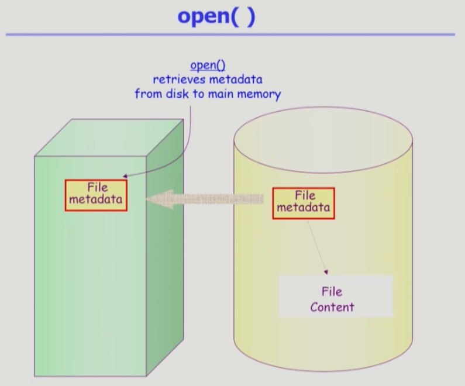
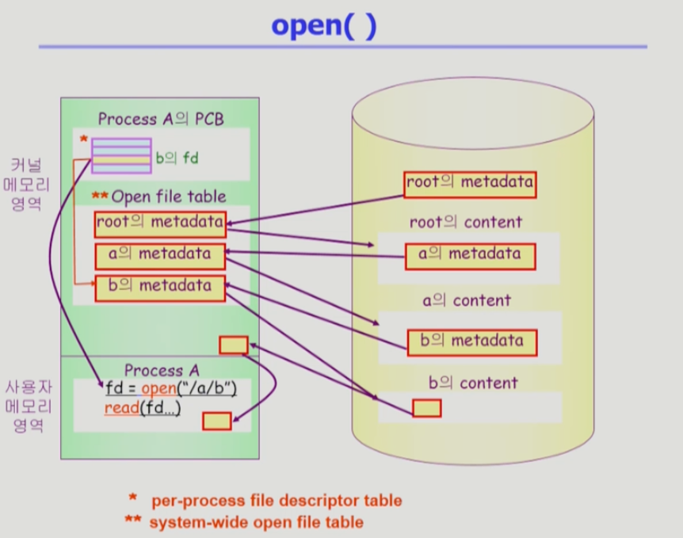

# Chapter 10. File Systems

 

## 💡 File and File System
1. File
    - " A named collection of related information "
    - 일반적으로 비휘발성의 보조기억장치(e.g. hard disk) 에 저장
    - 운영체제는 다양한 저장장치를 file이라는 동일한 논리적 단위로 볼 수 있게 해줌.
    - `Operation` : create, read, write, reposition(lseek), delete, open, close 등
    
2. File Attribute (or File metadata)
    - 파일 자체의 내용이 아니라 파일을 관리하기 위한 각종 정보들
        - 파일 이름, 유형, 저장된 위치, 파일 사이즈
        - 접근 권한 (읽기/쓰기/실행), 시간 (생성/변경/사용), 소유자 등
    
3. File System
    - 운영체제에서 파일을 관리하는 부분
    - 파일 및 파일의 메타데이터, 디렉토리 정보 등을 관리
    - 파일의 저장 방법 결정
    - 파일 보호 등
    
 

## 💡 Directory and Logical Disk
1. Directory
    - 파일의 메타데이터 중 일부를 보관하고 있는 일종의 특별한 파일
    - 그 디렉토리에 속한 파일 이름 및 파일 attribute들
        - Operation
            - Search for a file, create a file, delete a file
            - list a directory, rename a file, traverse the file system
        
2. Partition (= Logical disk)
    - 하나의 (물리적) 디스크 안에 여러 파티션을 두는 것이 일반적
    - 여러 개의 물리적인 디스크를 하나의 파티션으로 구성하기도 함
    - (물리적) 디스크를 파티션으로 구성한 뒤 각각의 파티션에 file system을 깔거나 swapping등 다른 용도로 사용할 수 있음.

 

## 💡 open()

- open("/a/b/c")
    - 디스크로부터 파일 c의 메타데이터를 메모리로 가지고 옴
    - 이를 위하여 directory path를 search
        - 루트 디렉토리 "/"를 open하고 그 안에서 파일 "a"의 위치 획득
        - 파일 "a"를 open한 후 read하여 그 안에서 파일 "b"의 위치 획득
        - 파일 "b"를 open한 후 read하여 그 안에서 파일 "c"의 위치 획득
        - 파일 "c"를 open한다.
    - Directory path의 search에 너무 많은 시간이 소요됨.
        - Open을 read/write와 별도로 두는 이유
        - 한번 open한 파일은 read/write시 directory search 불필요
    - Open file table
        - 현재 open된 파일들의 메타데이터 보관소 (in memory)
        - 디스크의 메타데이터보다 몇 가지 정보가 추가
            - Open한 프로세스의 수
            - File offset : 파일 어느 위치 접근 중인지 표시 (별도 테이블 필요)
    - File descriptor (file handle, file control block)
        - Open file table에 대한 위치 정보 (프로세스 별)
  
