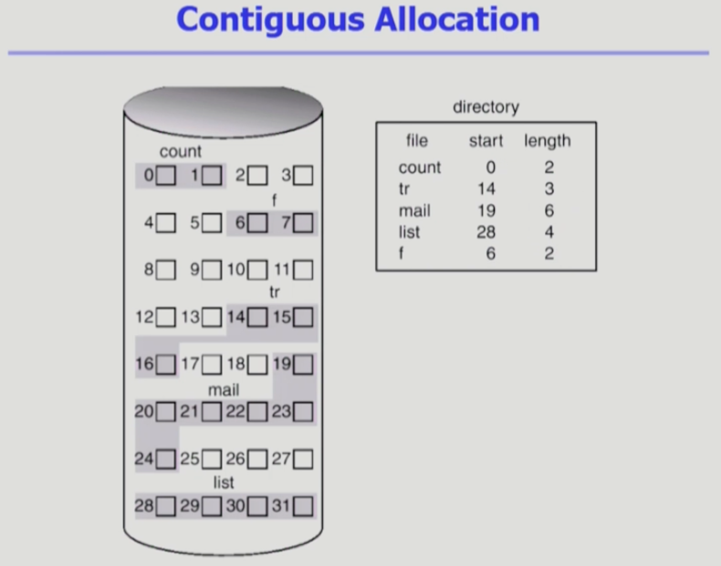
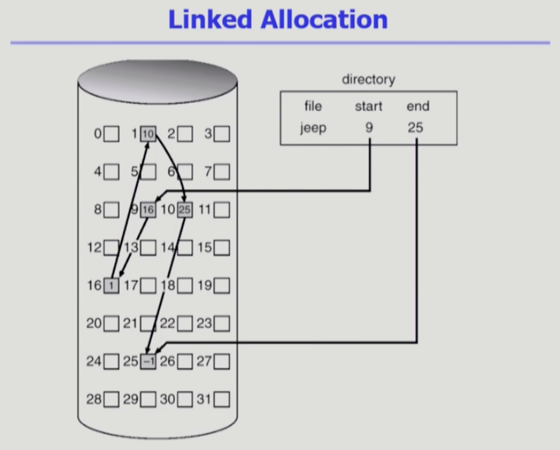
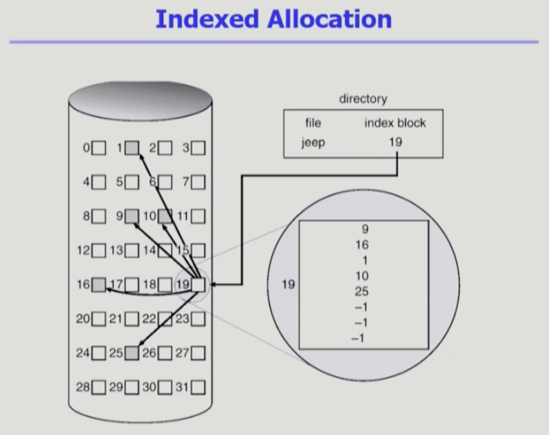
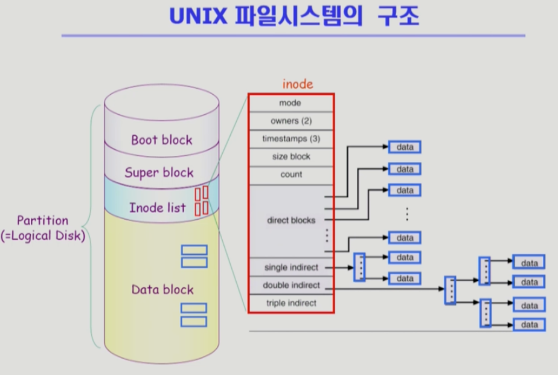
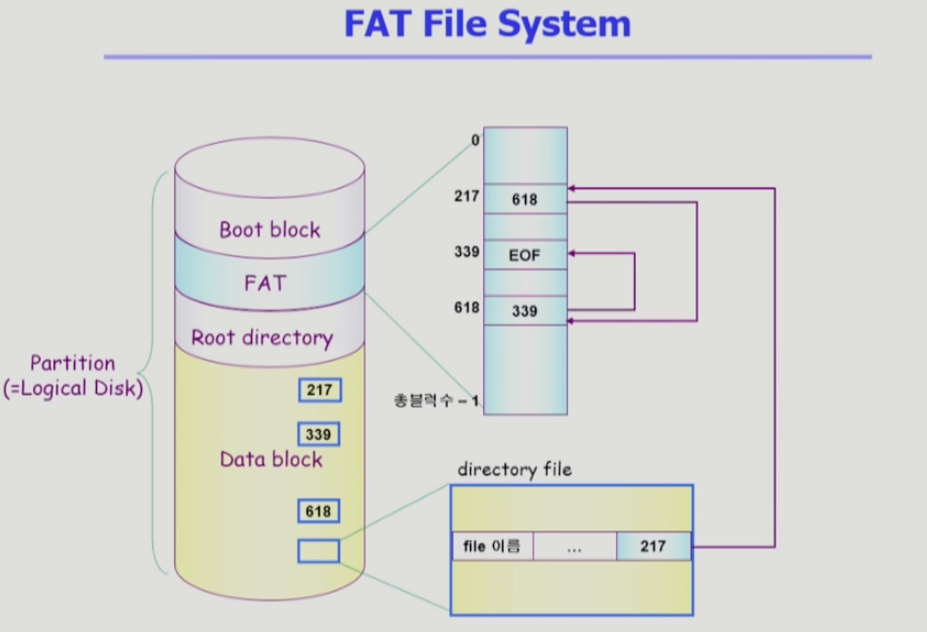
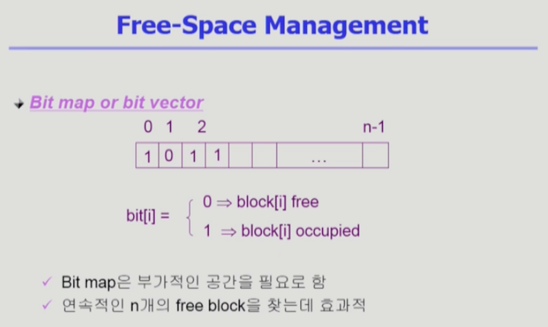
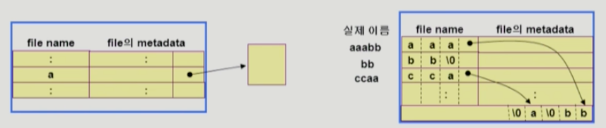
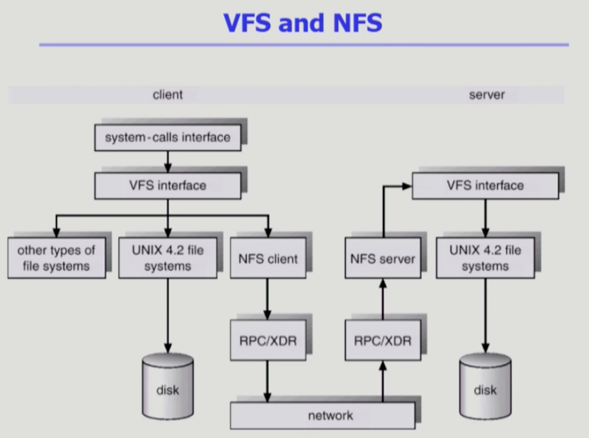
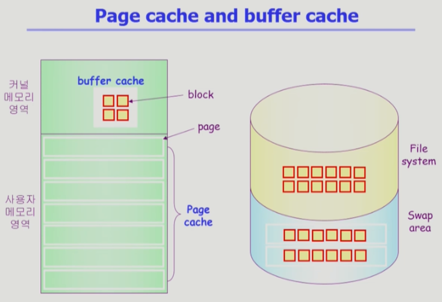
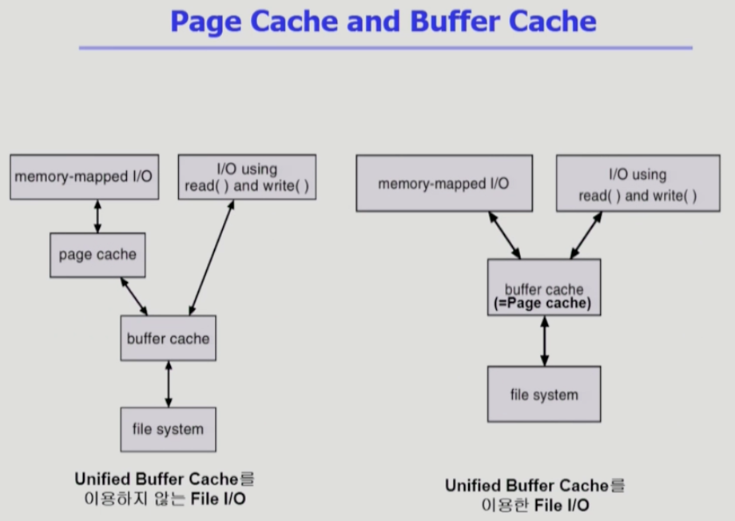

# Chapter 11. File System Implementations

 

## 💡 Allocation of File Data in Disk
1. Contiguous Allocation
2. Linked Allocation
3. Indexed Allocation

 

## 💡 Contiguous Allocation

- 연속해서 할당되는 방법
- 단점
    - External fragmentation 발생 가능
    - File grow가 어려움
        - file 생성 시 얼마나 큰 hole을 배당할 것인가? (미리 빈공간을 할당하는 방법)
        - grow 가능 vs 낭비 (Internal fragmentation)
- 장점
    - Fast I/O
        - 한번의 seek/rotation으로 많은 바이트 transfer
        - Realtime file용으로, 또는 이미 run 중이던 process의 swapping용
    - Direct access(=random access)가능

 

## 💡 Linked Allocation

- 빈 자리가 있으면 아무 곳이나 할당함.
- 블록의 마지막 부분에 다음 블록이 어디에 위치해 있는지 저장해 두는 것 (연결해 두는 것)
- 파일의 시작 위치만을 디렉토리가 가지고 있게 되는 것.
- 장점
    - External Fragmentation이 발생되지 않음.
- 단점
    - Direct Access (Random Access) 불가능. 첫번째 위치만 저장해 두기 때문에 순차 접근만 가능하게 됨.
    - Reliability 문제
        - 한 Sector가 고장나 pointer가 유실되면 많은 부분을 잃을 위험이 있음.
    - Pointer를 위한 공간이 block의 일부가 되어 공간 효율성을 떨어뜨림.
        - 512 bytes/sector, 4bytes/pointer
- 변형
    - File-allocation table(FAT) 파일 시스템
        - 포인터를 별도의 위치에 보관하여 reliability와 공간 효율성 문제 해결

 

## 💡 Indexed Allocation

- 장점
    - External Fragmentation이 발생하지 않음
    - Direct Access (= Random Access) 가능
    
- 단점
    - Small file의 경우 공간 낭비 (실제로 많은 file들이 small)
    - Too Large File의 경우 하나의 block으로 Index를 저장하기에 부족
        - 해결 방안
            1. linked scheme
            2. multi-level index
    
 

## 💡 UNIX File System Structure

- 유닉스 파일 시스템의 중요 개념
    1. Boot Block
       - 부팅에 필요한 정보 (bootstrap loader)
    2. Super Block
       - 파일 시스템에 관한 총체적인 정보를 담고 있다.
    3. Inode
       - 파일 이름을 제외한 파일의 모든 메타 데이터를 저장
    4. Data Block
       - 파일의 실제 내용을 보관
       - Directory file에는 각 file 이름과 inode 번호가 저장되어 있음.
       - 나머지 정보들은 inode에 저장되어 있지만 file name은 directory에 저장됨.

- index allocation을 변형하여 사용하는 파일 시스템 구조
- Direct blocks/single indirect/double indirect/triple indirect 로 나누어 inode를 구성함.

 

## 💡 FAT file System

- file의 metadata 정보를 FAT에 저장함
- 나머지 정보는 directory가 가지고 있음. 파일의 이름, 접근 권한, 소유주 등등.
- FAT 파일 테이블은 여러번 copy되어 저장하고 있기 때문에 reliability 문제는 해결 가능함.
  
 
 
## 💡 Free-Space Management

1. Linked List
    - 모든 free block들을 링크로 연결 (free list)
    - 연속적인 가용 공간을 찾는 것은 쉽지 않다.
    - 공간의 낭비가 없다.
    - 실제로 사용하기는 쉽지 않은 방법
    
2. Grouping
    - Linked list 방법의 변형
    - 첫번째 free block이 n개의 pointer를 가짐
    - n-1 pointer는 free data block을 가리킴
    - 마지막 pointer가 가리키는 block은 또 다시 n pointer를 가짐 
    
3. Counting
    - 프로그램들이 종종 여러 개의 연속적인 block을 할당하고 반납한다는 성질에 착안한 방법
    - First free block, # of contiguous free blocks를 유지

 

## 💡 Directory Implementation
1. Linear List
- <file name, file의 metadata> 의 list
- 구현이 간단
- 디렉토리 내에 파일이 있는지 찾기 위해서는 linear search 필요 (time-consuming)
- Hash Table
    - Linear List + hashing
    - Hash table은 file name을 이 파일의 linear list의 위치로 바꾸어줌.
    - search time을 없앰
    - Collision 발생 가능

 

## 💡 VFS and NFS

- Virtual File System (VFS)
    - 서로 다른 다양한 file system에 대해 동일한 시스템 콜 인터페이스 (API)를 통해 접근할 수 있게 해주는 OS의 Layer
    
- Network File System (NFS)
    - 분산 시스템에서는 네트워크를 통해 파일이 공유될 수 있음
    - NFS는 분산 환경에서의 대표적인 파일 공유 방법임.

 

## 💡 Page cache and Buffer Cache
1. Page cache
    - Virtual Memory의 Paging System에서 사용하는 page frame을 caching의 관점에서 설명하는 용어
    - Memory-Mapped I/O를 쓰는 경우 file의 I/O에서도 page cache 사용
2. Memory-Mapped I/O
    - File의 일부를 virtual memory에 mapping 시킴
    - 매핑시킨 영역에 대한 메모리 접근 연산은 파일의 입출력을 수행하게 함.
3. Buffer Cache
    - 파일 시스템을 통한 I/O 연산은 메모리의 특정 영역인 buffer cache 사용
    - File 사용의 locality 활용
        - 한번 읽어온 block에 대한 후속 요청 시 buffer cache에서 즉시 전달
    - 모든 프로세스가 공용으로 사용
    - Replacement algorithm 필요 (LRU, LFU 등)
3. Unified Buffer Cache
    - 최근의 OS에서는 기존의 buffer cache가 page cache에 통합됨.
    

- 페이지 프레임에는 당장 사용하는 데이터를 올려놓고, 나머지는 디스크에 저장해두는 것.
- 디스크에서 읽어온 내용을 자신의 buffer cache에 올려놓고, 그것을 copy해 사용자에게 전달.
- 보통 4kbyte 단위의 page 사용 / Disk I/O 단위는 512Byte
- Unified Buffer Cache 를 사용하게 되면 단위가 통합되어 4Kbyte 단위의 buffer cache, page cache 사용
- 별도의 공간 구분을 하지 않고 똑같이 page 단위로 사용하면서 필요할 때마다 buffer cache/page cache로 사용하는 것 (필요시마다 할당)

