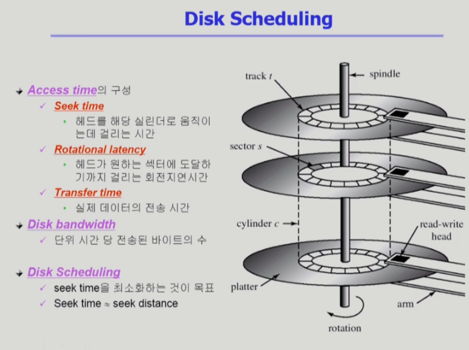
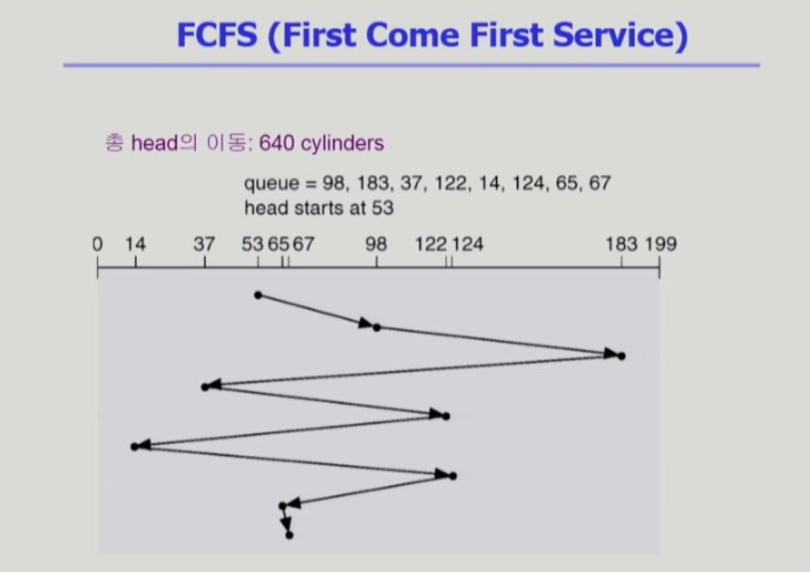
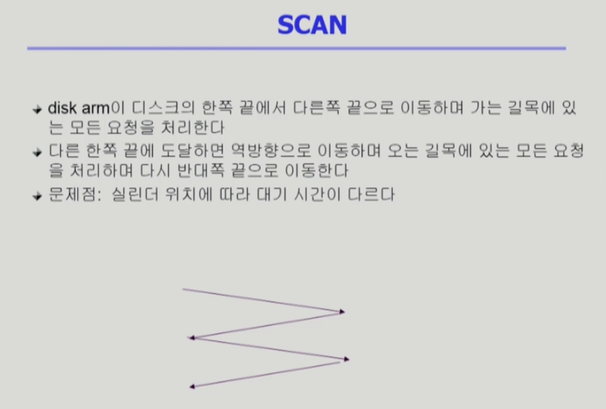
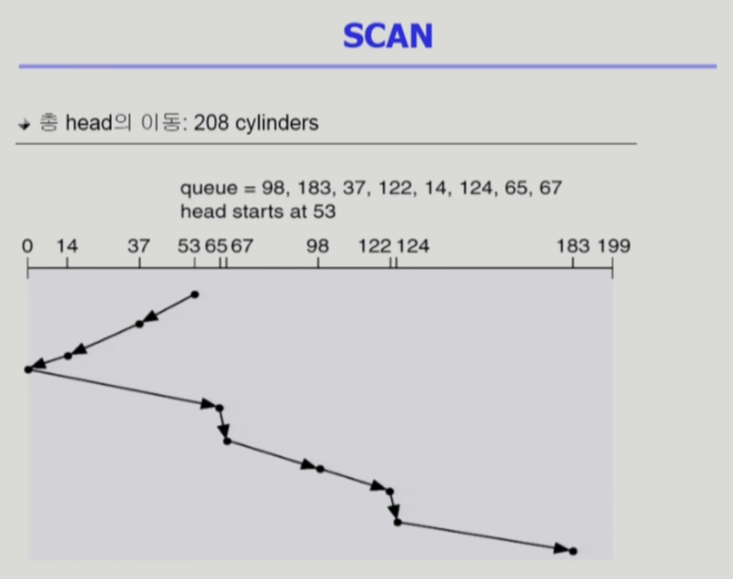
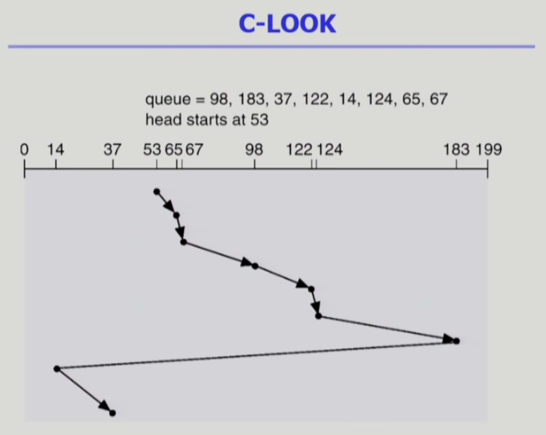

# Chapter 11. File System Implementations

 

## 💡 Disk Structure
- Logical block
  - 디스크의 외부에서 보는 디스크의 단위 정보 저장 공간들
  - 주소를 가진 1차원 배열처럼 취급
  - 정보를 전송하는 최소 단위

- Sector
  - Logical block이 물리적인 디스크에 매핑된 위치
  - Sector 0은 최외곽 실린더의 첫 트랙에 있는 첫 번째 섹터이다.
  - Logical Block과 Sector는 매핑되어 있음. 0번 섹터는 무조건 부팅과 관련된 데이터 저장.

 

## 💡 Disk Management
- Physical Formatting (low-level formatting)
  - 디스크를 컨트롤러가 읽고 쓸 수 있도록 섹터들로 나누는 과정
  - 각 섹터는 header + data(512bytes) + trailer로 구성
  - header와 trailer는 sector number, ECC(Error-Correcting Code) 등의 정보가 저장되며 controller가 직접 접근 및 운영.
  
- Partitioning
  - 디스크를 하나 이상의 실린더 그룹으로 나누는 과정
  - OS는 이것을 독립적인 disk로 취급함 (logical disk)

- Logical Formatting
  - 파일 시스템을 만드는 것
  - FAT, inode, free space등의 구조 포함

- Booting
  - ROM에 있는 "small bootstrap loader"의 실행 (CPU의 instruction 형태로 실행됨.)
  - sector 0(boot block)을 memory에 load하여 실행
  - sector 0은 "full Bootstrap loader program"
  - OS를 디스크에서 load하여 실행

 

## 💡 Disk Scheduling

- Access time의 구성
  1. Seek time
     - 같은 트랙에 위치하는 것을 실린더라고 하는데, 해당 실린더로 헤드를 움직이는 데 걸리는 시간을 의미한다.
  2. Rotational latency
     - seek time보다 1/10정도의 적은 시간 소요
  3. Transfer time
     - 실제 데이터의 전송 시간. 매우 작은 시간 소요
- Disk bandwidth
  - 단위 시간 당 전송된 바이트의 수
- Disk Scheduling
  - seek time을 최소화하는 것이 목표 (디스크 접근 시간이 거의 seek time에 따라 좌우되기 때문에)
  - seek time = seek distance

 

## 💡 Disk Scheduling Algorithm
> 큐에 다음과 같은 실린더 위치의 요청이 존재하는 경우 디스크 헤드 53번에서 시작한 각 알고리즘의 수행 결과는? (실린더 위치는 0-199)
>           98, 183, 37, 122, 14, 124, 65, 67

### 1. FCFS

- 처음부터 순서대로 진행
- 디스크가 상당히 많이 이동하는 것을 볼 수 있음.
- 비효율적

### 2. SSTF (Shortest Seek Time First)
- head의 위치에서 가장 가까운 요청부터 처리. (seek time이 가장 적기 때문에)
- 디스크 헤드의 이동거리는 줄어들지만 starvation 문제 발생 가능성 높음.

### 3. SCAN (= elevator scheduling)

- disk arm이 디스크의 한쪽 끝에서 다른쪽 끝으로 이동하며 가는 골목에 있는 모든 요청을 처리한다.
- 다른 한쪽의 끝에 도달하면 역방향으로 이동하며 오는 길목에 있는 모든 요청을 처리하며 다시 반대쪽 끝으로 이동한다.
- 문제점 : 실린더 위치에 따라 대기 시간이 다르다.
- 엘레베이터 작동 원리에 비유함.

### 4. C-SCAN (circular scan)
- 헤드가 한쪽 끝에서 다른쪽 끝으로 이동하며 가는 길목에 있는 모든 요청을 처리
- 다른쪽 끝에 도달했으면 요청을 처리하지 않고 곧바로 출발점으로 다시 이동
- SCAN보다 균일한 대기 시간을 제공한다.

### 5. N-SCAN
- SCAN의 변형 알고리즘
- 일단 arm이 한 방향으로 움직이기 시작하면 그 시점 이후에 도착한 job은 되돌아올 때 service

### 6. LOOK, C-LOOK
- SCAN이나 C-SCAN은 헤드가 디스크 끝에서 끝으로 이동
- LOOK과 C-LOOK은 헤드가 진행 중이다가 그 방향에 더 이상 기다리는 요청이 없으면 헤드의 이동방향을 즉시 반대로 이동한다.

 

## 💡 Disk Scheduling Algorithm의 결정
- SCAN, C-SCAN 및 그 응용 알고리즘은 LOOK, C-LOOK 등이 일반적으로 디스크 입출력이 많은 시스템에서 효율적인 것으로 알려져 있음.
- file의 할당 방법에 따라 디스크 요청이 영향을 받음.
- 디스크 스케쥴링 알고리즘은 필요할 경우 다른 알고리즘으로 쉽게 교체할 수 있도록 OS와 별도의 모듈로 작성되는 것이 바람직하다.

 

## 💡 Swap-Space Management

- 메모리가 휘발성인 특성을 가지고 있기 때문에 비휘발성인 디스크를 사용하는 것
- 메모리의 공간이 부족하기 때문에 메모리의 연장 공간으로 SWAP Space를 할당하여 사용함.
- Swap-space
  - 물리적인 디스크를 파티셔닝하여 논리적인 디스크를 만든 후 그 논리적인 디스크 하나를 swap으로 할당하는 것.
  - 보통 큰 단위의 데이터를 올리고 내리면서 짧은 시간에 빠르게 서비스를 사용함. (512K)

 

## 💡 RAID
- RAID (Redundant Array of Independent Disks)
  - 여러 개의 디스크를 묶어서 사용
- RAID의 사용 목적
  - 디스크 처리 속도 향상
    - 여러 디스크에 block의 내용을 분산 저장
    - 병렬적으로 읽어 옴 (interleaving, striping)
  - 신뢰성 (reliability) 향상
    - 동일 정보를 여러 디스크에 중복 저장
    - 하나의 디스크가 고장(failure) 시 다른 디스크에서 읽어옴(Mirroring, shadowing)
    - 단순한 중복 저장이 아니라 일부 디스크에 parity를 저장하여 공간의 효율성을 높일 수 있다.
 
 