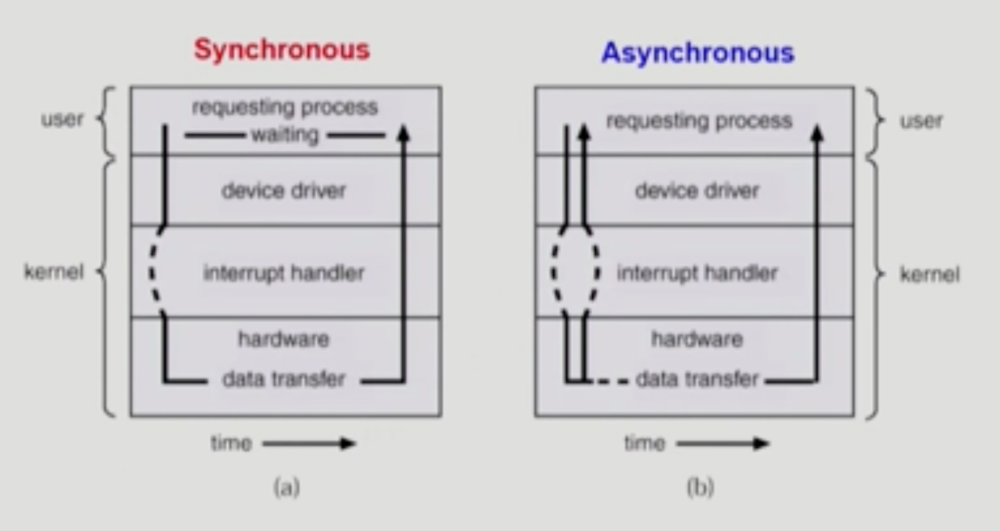

# Chapter 3. Process 

### 💡 동기식 입출력과 비동기식 입출력 부연설명

- 입출력을 요청한 프로세스가 입출력이 끝날 때까지 대기상태일 경우 동기식 입출력.
- 입출력을 요청한 프로세스가 종료시까지 대기하지 않고 CPU가 새로운 instruction를 실행할 경우 비동기식 입출력.

## 💡 Thread
- A thread is a basic unit of CPU utilization
- lightweight process라고도 부름
- CPU를 수행하는 단위라고 할 수 있음.

- data, code 부분은 thread들이 공유를 하고 각각 stack부분만 thread가 고유 공간을 가지고 있음.
- PCB에서도 Thread 각각이 독립적으로 구성하고 있는 것은 PC(Program counter), Register이며 나머지 공간은 Thread끼리 서로 공유.

### 💡 Thread의 구성
- Program Counter
- register set   
- stack space

### 💡 Thread가 동료 Thread와 굥유하는 부분 (=task)
- code section
- data section   
- OS Resources (각종 OS 자원들)
    
=> 전통적인 개념의 heavyweight process는 하나의 thread를 가지고 있는 task로 볼 수 있다.

### 💡 Single and Multithreaded Processes

### 💡 Thread의 장점

- 다중 스레드로 구성된 task 구조에서는 하나의 서버 스레드가 blocked(waiting) 상태인 동안에도
    동일한 테스크 내의 다른 스레드가 실행(Running)되어 빠른 처리를 할 수 있다.
- 동일한 일을 수행하는 다중 스레드가 협력하여 높은 처리율(throughput)과 성능 향상을 얻을 수 있다.
- 스레드를 사용하면 병렬성을 높일 수 있다. 각 thread들이 여러 개의 CPU에서 동시 실행되게 되면 빠르게 작업을 수행할 수 있음 .
- Responsiveness (응답성)   
      : 여러개의 쓰레드를 사용하게 되면, 여러 프로세스의 작업을 동시에 수행할 수 있기 때문에 응답이 빨라진다.
- Resource Sharing (자원 공유)   
      : 쓰레드는 하나의 프로세스로 그 안의 CPU의 수행 단위만을 여러개 두는 차원이므로 자원을 공유하면서 더 많은 작업을 수행할 수 있다는 장점이 있다.
- Economy   
      : 쓰레드간의 switching은 오버헤드 없이 빠르게 동작이 가능하기 때문에 훨씬 경제적이다.   
      : 프로세스를 creating or switching 하는 것보다 훨씬 오버헤드가 적음 (Solaris의 경우 각각 30배, 5배의 오버헤드 차이가 발생함)
- Utilization of Multi Process Architectures   
      : 멀티 프로세서 환경에서 여러개의 쓰레드를 병렬적으로 수행할 수 있으므로 훨씬 효율적임.

### 💡 Implementation of Threads
1. Kernel Threads
   - 커널이 Thread를 관리. 시스템 스케쥴러가 커널 스레드를 관리한다.
   - Windows
   - Solaris
   - Digital UNIX, Mach
   
2. Library 지원 (User Threads)
   - OS는 Thread에 대해 모르고, Libary(사용자) 차원에서 thread 관리하는 방식이므로 구현에 제약이 있음.
   - POSIX Pthreads
   - Mach C-Threads
   - Solaris Threads
   
3. Real-time Threads
