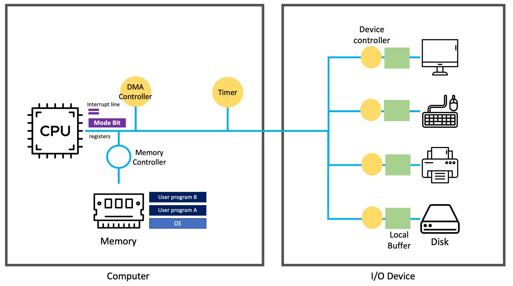
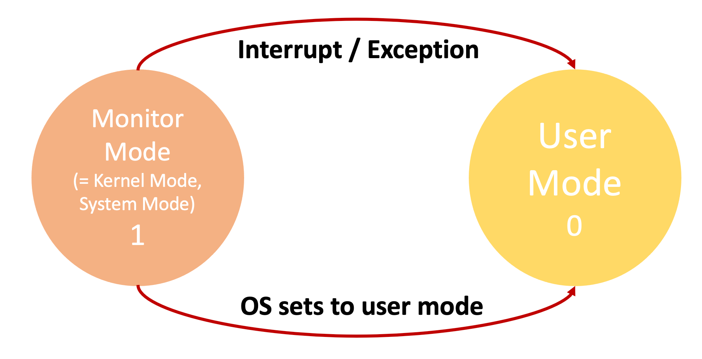
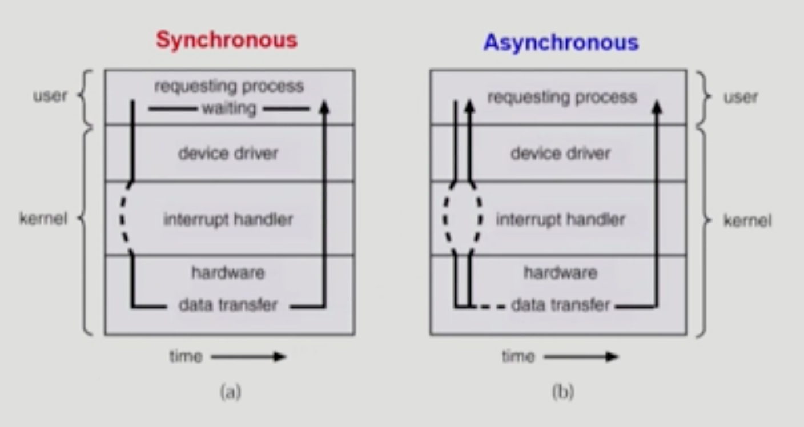
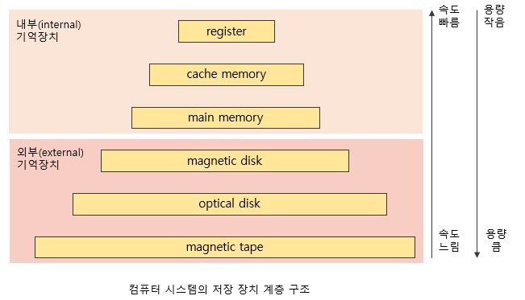
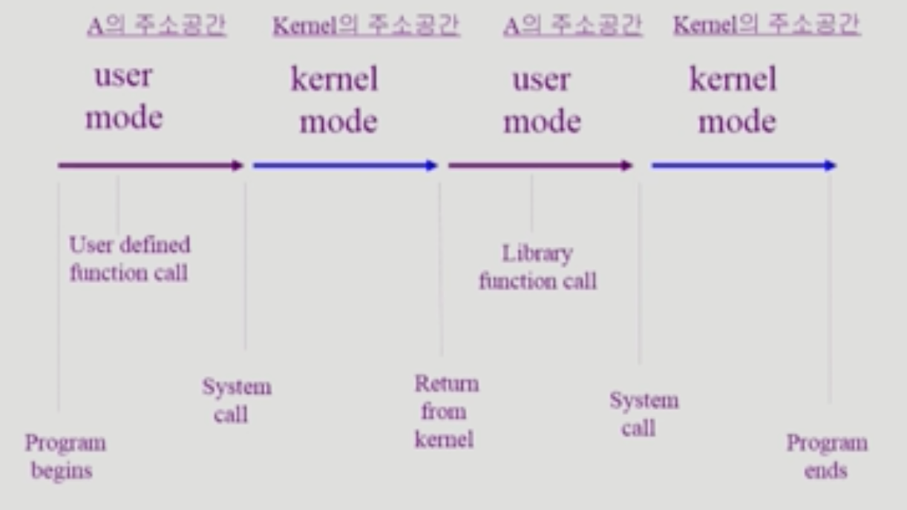

# Chapter 2. System Structure & Program Execution

## 💡 컴퓨터 시스템 구조 (1)

 

- 하드 디스크는 input device/output device 둘 다의 역할을 한다.  
  – cpu안에는 memory보다 빠른 저장 공간이 있음. 이를 register라고 함.
- Interrupt line은 항상 프로그램이 memory 영역만을 사용해서 작동하기는 어렵기 때문에, I/O device 접근을 위해 프로그램 실행 중 interrupt를 걸어 해당 device에서 데이터를 읽거나 쓴다.

### Mode Bit

- 사용자 프로그램의 잘못된 수행으로 다른 프로그램 및 운영체제에 피해가 가지 않도록 하기 위한 보호 장치 필요.
- cpu는 항상 interrupt line을 체크해 프로그램 실행 중 interrupt가 발생했는지를 확인함.
- Mode bit을 통해 하드웨어적으로 두 가지 모드의 operation 지원

  - 1 (User mode) : 사용자 프로그램 수행
    - 운영체제가 CPU에서 실행중. 모든지 실행을 할 수 있음.
  - 0 (Monitor mode, kernel mode, system mode) : OS Code 수행
    - 사용자 프로그램이 CPU를 제어하고 있을때는, 제한된 instruction만 CPU에서 실행 가능함.
  - Interrupt가 들어오면 자동으로 다시 CPU가 Os로 넘어오기 때문에 mode bit이 0으로 변경됨.
     

  

     

- 보안을 해칠 수 있는 중요한 명령어는 모니터 모드에서만 수행 가능한 특권 명령으로 규정
- interrupt나 exception 발생 시 하드웨어가 mode bit을 0으로 바꿈
- 사용자 프로그램에게 CPU를 넘기기 전에 mode bit을 1로 세팅
- Interrupt line은 항상 프로그램이 memory 영역만을 사용해서 작동하기는 어렵기 때문에, I/O device 접근을 위해 프로그램 실행 중 interrupt를 걸어 해당 device에서 데이터를 읽거나 쓴다.

### Timer

- 정해진 시간이 흐른 뒤(초기에 정해진 시간을 할당함) 운영체제에게 제어권이 넘어가도록 인터럽트를 발생시킴
- - Timer는 특정 프로그램이 cpu를 독점하는 것을 막기 위한 역할을 수행함. Timer에 값을 세팅한 후 프로그램을 cpu에 전달함. 세팅한 시간이 지나면 interrupt를 걸어 프로그램이 멈추도록 함.
- 타이머는 매 클럭 틱 때마다 1씩 감소
- 타이머 값이 0이 되면 타이머 인터럽트 발생
- CPU를 특정 프로그램이 독점하는 것으로부터 보호

- 타이머는 time sharing을 구현하기 위해 널리 이용됨.
- 타이머는 현재 시간을 계산하기 위해서도 사용됨.

### I/O Device Controller

- 해당 I/O 장치 유형을 관리하고 제어하는 일종의 작은 CPU
  – cpu보다 device가 처리 속도가 느리기 때문에 이러한 처리를 관리해주는 역할을 device controller가 수행함.
- 제어 정보를 위해 control register, status register를 가짐
  (CPU의 지시를 위한 register)
  – cpu안에는 memory보다 빠른 저장 공간이 있음. 이를 register라고 함.
- local buffer를 가짐 (일종의 data register), local buffer는 일종의 각 디바이스 별 작업 공간. 여기에 데이터를 저장하게 됨.
- I/O는 실제 Device와 Local Buffer 사이에서 일어남.
- Device Controller는 I/O 가 끝났을 경우 interrupt로 CPU에 그 사실을 알림

- device driver (장치 구동기)
  : OS Code 중 각 장치별 처리 루틴을 의미함 -> Software 영역
- device Controller (장치 제어기)
  : 각 장치를 통제하는 일종의 작은 CPU -> Hardware

### 입출력(I/O)의 수행

- 모든 입출력 명령은 특권 명령
- 사용자 프로그램은 어떻게 입출력을 하는가?
  - system call (시스템 콜)
    - 사용자 프로그램은 운영체제에게 I/O 요청
  - trap을 사용하여 인터럽트 벡터의 특정 위치로 이동
  - 제어권이 인터럽트 벡터가 가리키는 인터럽트 서비스 루틴으로 이동
  - 올바른 I/O 요청인지 확인 후 I/O 수행
  - I/O 완료 시 제어권을 시스템 콜 다음 명령으로 옮김

### 인터럽트 (Interrupt)

- 인터럽트 당한 시점의 레지스터와 program counter를 save 한 후 CPU의 제어를 인터럽트 처리 루틴에 넘긴다.
- Interrupt(넓은 의미)

  - interrupt (하드웨어 인터럽트) : 하드웨어가 발생시킨 인터럽트. 일반적인 의미의 interrupt.
  - trap (소프트웨어 인터럽트)
    - Exception : 프로그램이 오류를 범한 경우
    - System Call : 프로그램이 커널 함수를 호출하는 경우
      (사용자 프로그램이 필요에 의해 서비스를 해달라고 요청하는 경우)

- 인터럽트 관련 용어
  - 인터럽트 벡터
    - 해당 인터럽트의 처리 루틴 주소를 가지고 있음.
    - 인터럽트 번호와 주소의 쌍을 가지고 있는 것을 인터럽트 벡터라고 한다.
  - 인터럽트 처리 루틴
    ( = Interrupt Service Routine, 인터럽트 핸들러)
    - 해당 인터럽트를 처리하는 커널 함수

---

## 💡 컴퓨터 시스템 구조 (2)

 

### Program Counter

- CPU 안에 있는 Register 중의 하나로서, 다음에 실행할 instruction의 주소를 가지고 있어 실행할 기계어 코드의 위치를 지정한다.
- 다른 말로는 명령어 포인터 (instruction pointer)라고도 불린다.
- 일반적으로 Program counter는 명령을 마칠때마다 주소값이 1씩 증가하게 된다.

 

### 동기식 입출력과 비동기식 입출력

1. 동기식 입출력 (Synchronous I/O)
   - I/O 요청 후 입출력 작업이 완료된 후에야 제어가 사용자 프로그램에 넘어가며, 다음 작업을 수행할 수 있음.
   - 구현 방법 1
     - I/O가 끝날 때까지 CPU를 낭비시킴
     - 매 시점 하나의 I/O만 일어날 수 있음.
   - 구현 방법 2
     - I/O가 완료될 때까지 해당 프로그램에게서 CPU를 빼앗음
     - I/O 처리를 기다리는 줄에 그 프로그램을 줄 세움.
     - 다른 프로그램에게 CPU를 줌.
2. 비동기식 입출력 (Asynchronous I/O)
   - I/O가 시작된 후 입출력 작업이 끝나기를 기다리지 않고 제어가 사용자 프로그램에 즉시 넘어가 다음 작업을 수행할 수 있음.

--> 두 경우 모두 I/O의 완료는 인터럽트로 알려줌.

 

### DMA Controller

- I/O의 과도한 interrupt를 방지하기 위한 Controller
- 빠른 입출력 장치를 메모리에 가까운 속도로 처리하기 위해 사용.
- CPU의 중재 없이 device controller가 device의 buffer storage의 내용을 메모리에 block 단위로 직접 전송.
- 바이트 단위가 아니라 block 단위로 인터럽트를 발생시키며, 이로 인해 CPU를 좀 더 효율적으로 사용할 수 있도록 도와줌.

 

### 서로 다른 입출력 명령어

- I/O를 수행하는 special instruction에 의해
- Memory Mapped I/O에 의해

 

### 저장장치 계층 구조

- internal 기억장치들은 주로 휘발성 기억장치들, external 기억장치들은 주로 비휘발성 기억장치로 구성된다.
- CPU가 직접 접근 가능한 primary 저장장치들은 register, cache memory, main memory 이렇게 세가지 이다.
- 용량이 적을수록 속도도 빠르고 가격이 비싸며, 용량이 클수록 속도도 느리고 가격이 저렴하다.
- register와 main memory간의 속도 차이를 줄이기 위해 cache memory 를 사용한다.

 

### 프로그램의 실행 (Memory Load)

- 각 프로그램마다 독자적인 주소 공간이 생기며, 그 안에는 stack, data, code로 영역이 나누어져 있다.
- `stack` : 함수를 호출하거나 리턴할때 데이터를 임시 보관하는 영역
  - 사용자 프로그램마다 커널 스택을 따로 사용함.
- `data` : 변수, 전역 변수 저장. 프로그램이 사용하는 자료구조 영역.
  - 프로세스를 관리하기 위한 자료구조(PCB) 저장
  - CPU, Memory, Disk를 관리하기 위한 자료구조 저장.
- `code` : 프로그램의 기계어 코드를 저장하는 영역. 커널 코드
  - 시스템 콜, 인터럽트 처리 코드
  - 자원 관리를 위한 코드
  - 편리한 서비스 제공을 위한 코드

### 사용자 프로그램이 사용하는 함수

- 함수 (function)
  1. 사용자 정의 함수
     - 자신의 프로그램에서 정의한 함수
  2. 라이브러리 함수
     - 자신의 프로그램에서 정의하지 않고 갖다 쓴 함수
     - 자신의 프로그램의 실행 파일에 포함되어 있다.
  3. 커널 함수
     - 운영체제 프로그램의 함수
     - 커널 함수의 호출 = 시스템 콜

 

### 프로그램의 실행

