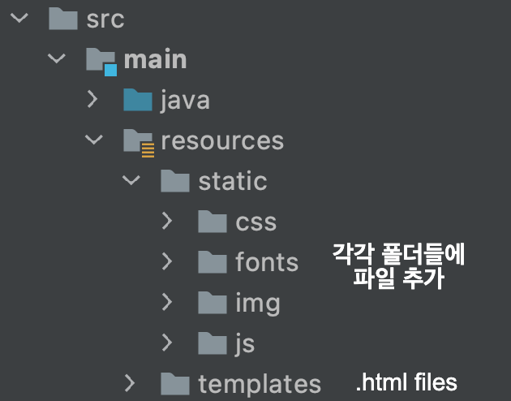
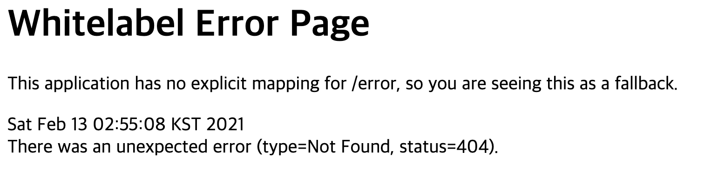
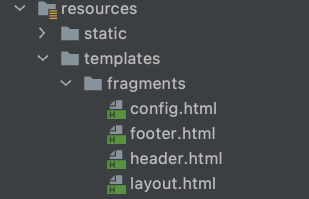

## 📌 thymeleaf 사용하기

<br>

### Thymeleaf 란?
- spring 기반 웹 애플리케이션의 view에서 html, xml, javascript, css, text 처리 후 웹 브라우저에 표시할 때 이용되는 템플릿 엔진의 일종.
- JSP보다 빠르다는 장점이 있으며, spring boot와 같이 많이 사용함.


<br>


### (1) thymeleaf 기초 설정하기 - build.gradle

```java
dependencies {
    implementation 'org.springframework.boot:spring-boot-starter-thymeleaf'
    implementation 'org.springframework.boot:spring-boot-starter-web'
}
```


<br>


### (2) src/main/resources/templates 에 html 파일 추가


- src/main/resources/static 에 html 파일 관련 css/js/img 파일 추가


<br>


### (3) src/main/java/프로젝트 패키지/config/MvcConfiguration 생성


- 처음엔 MvcConfiguration 설정 없이 그냥 실행했는데, 페이지 연결이 안되고 위의 화면과 같은 에러 페이지(Whitelabel Error Page) 만 떠서 어떤 부분이 문제인지 찾아보니 기존에는 static 파일들에서만 정적 파일(html)들을 불러오기 때문에 MvcConfiguration 클래스를 생성해 templates 파일에서도 불러올 수 있도록 관련 설정을 변경 해주어야 한다는 것을 알게되었다.
- MvcConfiguration Example Code

    ```java
    import org.springframework.context.annotation.Configuration;
    import org.springframework.http.CacheControl;
    import org.springframework.web.servlet.config.annotation.ResourceHandlerRegistry;
    import org.springframework.web.servlet.config.annotation.WebMvcConfigurer;
    
    import java.util.concurrent.TimeUnit;
    
    @Configuration
    public class MvcConfiguration implements WebMvcConfigurer {
    
        @Override
        public void addResourceHandlers(final ResourceHandlerRegistry registry) {
            registry.addResourceHandler("/**")
                    .addResourceLocations("classpath:/templates/", "classpath:/static/")
                    .setCacheControl(CacheControl.maxAge(10, TimeUnit.MINUTES));
        }
    }
    
    ```


<br>

### (4) html 태그에 thymeleaf 설정 (view로 사용할 html 파일에 전부 설정해주어야 함)
```html
<html xmlns:th="http://www.thymeleaf.org">
```


<br>


### (5) 사용할 static 파일들을 thymeleaf 태그를 이용해 연결
```html
<link th:href="@{/css/style.css}" rel="stylesheet">
```


<br>


### (6) Controller class 생성 및 View Mapping

```java
import org.springframework.stereotype.Controller;
import org.springframework.web.bind.annotation.GetMapping;

@Controller
public class IndexController {
    @GetMapping("/index")
    public String index() {
        return "index";
    }
}
```

- index.html을 mapping한 예시 class

<br>


### (7) 실행


<br><br><br>


## 📌 Thymeleaf로 Layout 중복 관리하기


<br>


### ✔ Layout 중복 코드를 분리하는게 편리한 이유?
1. 코드의 불필요한 중복 제거로 딱 핵심 코드만 확인할 수 있음.
2. 유지보수에 용이 -> 분리된 코드만 수정하면 모든 페이지에 적용됨.


<br>


### Thymeleaf 템플릿 엔진을 사용한 레이아웃 세팅하기 

<br>

### 1. build.gradle에 dependency 코드 추가

```java
dependencies {
        // https://mvnrepository.com/artifact/nz.net.ultraq.thymeleaf/thymeleaf-layout-dialect
        implementation group: 'nz.net.ultraq.thymeleaf', name: 'thymeleaf-layout-dialect', version: '2.5.2'
}
```

- [url 참고](mvnrepository.com/artifact/nz.net.ultraq.thymeleaf/thymeleaf-layout-dialect/2.5.2)


<br>


### 2. 공통 부분 layout 템플릿 만들기 (src/main/resources/templates/fragments)





<br>


### 2-1. header.html (header 부분만을 작성한 코드 파일)

```html
<!DOCTYPE html>
<html lang="ko" xmlns:th="http://www.thymeleaf.org">

    <div th:fragment="headerFragment" class="header navbar-fixed-top">
		 <!--header 부분 code -->        
    </div>

</html>
```


<br>


### 2-2. footer.html (footer 부분만을 작성한 코드 파일)

```html
<!DOCTYPE html>
<html lang="ko" xmlns:th="http://www.thymeleaf.org">

    <div th:fragment="footerFragment" class="header navbar-fixed-top">
		 <!--footer 부분 code -->        
    </div>

</html>
```

<br>


### 2-3. config.html (공통으로 사용할 css, js 파일 등의 선언 코드를 모은 파일)

```html
<!DOCTYPE html>
<html lang="ko" xmlns:th="http://www.thymeleaf.org">
    <!-- configFragment -->
    <th:block th:fragment="configFragment">
        <!-- Style 예시 -->
        <link th:href="@{/css/style.css}" rel="stylesheet">

        <!-- Javascript file 예시 -->
        <script th:src="@{/js/file.js}"></script>
    </th:block>
</html>
```

<br>


### 2-4. layout.html (전체적인 틀을 작성한 코드 파일)

```html
<!DOCTYPE html>
 <!-- layout 관련 namespace 추가 선언 -->
    <html lang="ko"
      xmlns:th="http://www.thymeleaf.org"
      xmlns:layout="http://www.ultraq.net.nz/thymeleaf/layout">
    <head>
        <meta charset="utf-8">

        <!-- config.html -->
        <th:block th:replace="fragments/config::configFragment" ></th:block>
    </head>
	
    	<!-- header.html -->
    <header th:replace="fragments/header::headerFragment"></header>

	<!-- 공통적이지 않은 부분이 들어가는 부분 -->
    <body layout:fragment="content"></body>

	<!-- footer.html -->
    <footer th:replace="fragments/footer::footerFragment"></footer>
</html>
```

<br>


### 3. 레이아웃 적용 ( 개별 파일에 2번에 생성한 템플릿 적용하기 ) ex) index.html

```html
<!DOCTYPE html>
<!-- 관련 Namespace 선언 및 layout:decorate 추가 -->
<html lang="en"
      xmlns:th="http://www.thymeleaf.org"
      xmlns:layout="http://www.ultraq.net.nz/thymeleaf/layout"
      layout:decorate="~{fragments/layout}">
    <head>
        <!-- layout.html 에 들어간 head 부분을 제외하고 개별 파일에만 적용되는 head 부분 추가 -->
        <title>Page Title</title>

        <!-- 필요하다면 개별 파일에 사용될 css/js 선언  -->
    </head>

    <!-- layout.html에 정의한 main page 부분 -->
    <body layout:fragment="content">
        <!-- code -->
    </body>
</html>
```


<br><br>


## ✨ Reference ✨

[bottom-to-top.tistory.com/38](bottom-to-top.tistory.com/38)
[blog.jiniworld.me/44](blog.jiniworld.me/44)
[bamdule.tistory.com/33](bamdule.tistory.com/33)