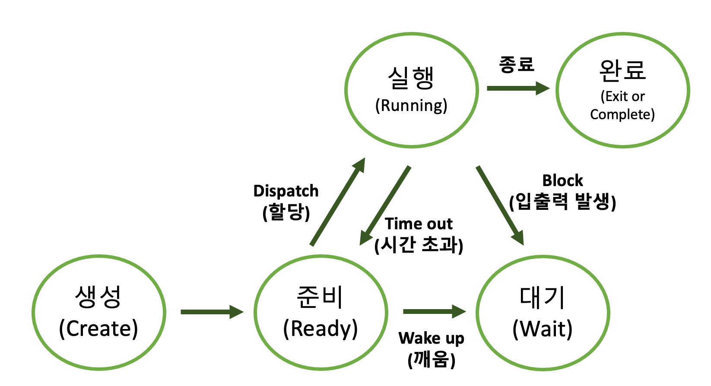

## 01. 운영체제의 특징

### 운영체제

1. 운영체제의 개념
    - 컴퓨터 시스템이 제공하는 모든 하드웨어, 소프트웨어를 사용할 수 있도록 해주고, 컴퓨터 사용자와 컴퓨터 하드웨어 간의 인터페이스를 담당하는 프로그램이다.
    - 사용자가 컴퓨터를 좀 더 쉽게 사용하기 위해 지원하는 소프트웨어이다.
    - 운영체제는 한정된 시스템 자원을 효과적으로 사용할 수 있도록 관리 및 운영함으로써 사용자에게 편리성을 제공한다.
       

2. 운영체제의 특징
    - 사용자 편리성 제공 : 한정된 시스템 자원을 효과적으로 사용할 수 있도록 관리 및 운영함.
    - 인터페이스 기능 담당 : 컴퓨터 시스템과 사용자를 연결함.
    - 스케줄링 담당 : 다중 사용자와 다중 응용 프로그램 환경하에서 자원의 현재 상태를 파악하고 자원 분배를 위한 스케줄링을 담당함.
    - 자원 관리 : CPU, 메모리 공간, 기억 장치 , 입출력 장치 등의 자원을 관리함
    - 제어 기능 : 입출력 장치와 사용자 프로그램을 제어
       

3. 운영체제의 종류
      
   > 💡 쉘 (Shell)
   > - 운영체제의 가장 바깥 부분에 위치해서 사용자 명령에 대한 처리 역할을 담당.
   > - 운영체제 기능과 서비스 구현을 위해 인터페이스를 제공하는 프로그램.
   > - 사용자의 명령어를 입력 받아 기계어의 형태로 변환하여 커널에 전달하는 명령어 해석기.
   
   > 💡 커널 (Kernel)
   > - 하드웨어와 관련된 내부적인 역할을 담당한다.
   > - 운영체제의 핵심이 되는 기능들이 모여 있는 컴퓨터 프로그램.
   > - 프로세스 관리, 기억장치 관리, 주변 장치 관리, 파일 관리, 자원 관리, 보안 등을 담당한다.
   > - 커널의 종류 : 모놀리틱 커널(코어+서비스), 마이크로 커널(코어)
   
    => 운영체제 = shell + kernel

 

  ### Windows
  - MS-DOS의 멀티태스킹 기능과 GUI 환경을 제공하는 응용 프로그램으로서, 마이크로소프트사가 개발한 운영체제이다.
  - 특징
    1) 그래픽 사용자 인터페이스 (GUI) 제공
    2) 선점형 멀티태스킹 방식 제공 
    3) 자동 감지 기능 제공 (Plug & Play)
    4) OLE(Object Linking and Embedding) 방식 사용

  ### Unix
  - 교육 및 연구 기관에서 사용되는 범용 다중 사용자 방식의 시분할 운영체제
  - 처음부터 다양한 시스템에 서로 이식할 수 있고, 멀티 태스킹과 다중 사용자를 지원하도록 설계됨.
  - 특징
    1) 대회식 운영체제 기능 제공
    2) 다중 작업 기능 제공
    3) 다중 사용자 기능 제공
    4) 이식성 제공
    5) 계층적 트리 구조 파일 시스템 제공
    
  ### Linux
  - 유닉스 기반 개발(유닉스의 호환 커널). 리누스 토발즈가 개발한 오픈소스 프로젝트.
  - 데비안, 레드헷, Fedora, Ubuntu, CentOS와 같이 다양하게 출시됨.
  - GUI 제공, 파일 시스템 지원, BASH 셀 사용.

  ### Mac
  - 유닉스 기반 개발된 그래픽 사용자 인터페이스 기반의 운영체제

  ### Android
  - 휴대전화를 비롯한 휴대용 장치를 위한 운영체제와 미들웨어, 사용자 인터페이스 그리고 표준 응용 프로그램을 포함하고 있는 운영체제이다.
  - 특징
    1) 리눅스 기반 (리눅스 커널 위에서 동작함)
    2) 자바와 코틀린 언어 사용 가능
    3) 런타임 라이브러리
    4) 안드로이드 소프트웨어 개발 키트 (SDK) 제공

### 메모리 관리 기법 (반배할교)

1. 반입 기법
    - 주기억장치에 적재할 다음 프로세스의 반입 시기를 결정하는 기법
    - 메모리로 적재 시기 결정 (When)
       

2. 배치 기법
    - 디스크에 있는 프로세스를 주기억장치의 어느 위치에 저장할 것인지 결정하는 기법
    - 메모리 적재 위치 결정(Where)
    - 유형 (초 적 악)
        - 최초 적합 (First Fit) : 가용 공간 중에서 첫 번째 분할에 할당하는 방식
        - 최적 적합 (Best Fit)  : 가용 공간 중에서 크기가 비슷한 공간을 선택하여 프로세스를 적재하는 방식 (공백 최소화 가능)
        - 최악 적합 (Worst Fit) : 가용 공간 중에서 크기가 제일 큰 공간을 선택하여 할당하는 방식
       

3. 할당 기법
    - 실행해야 할 프로세스를 주기억장치에 어떤 방법으로 할당할 것인지 결정하는 기법
    - 메모리 적재 방법 결정 (How)
    - 할당 기법의 종류
        1. 연속 할당 기법 (연단다)
            - 단일 분할 할당 기법
            - 다중 분할 할당 기법
        2. 분산 할당 기법 (분페세)
            - 페이징 기법
              > 💡 페이징 기법의 문제점
              > - 스레싱 (Thrashing) : 계속적으로 페이지 부재가 발생하여 프로세스의 실제 처리 시간보다 페이지 교체 시간이 더 많아지는 현상.
              
              > 💡 페이징 기법의 해결방안
              > - 워킹 세트(Working Set) : 많이 참조하는 페이지들의 집합을 주기억장치 공간에 계속 상주하게 하여 빈번한 페이지 교체 현상을 줄이고자 하는 기법.
              > - 페이지 부재 빈도(PFF: Page-Fault Frequency) : 페이지 부재율의 상한과 하한을 정해서 직접적으로 페이지 부재율을 예측하고 조절하는 기법.
              
              - 세그먼테이션 기법
            - 페이징-세그먼테이션 기법
       
   > 💡 주소 사상 기법
   > - 가상 주소로부터 물리 주소를 찾아내는 기법 
       

4. 교체 기법
    - 재배치 기법으로 주기억장치에 있는 프로세스 중 어떤 프로세스를 제거할 것인지를 결정하는 기법
    - 메모리 교체 대상 결정(Who)
    - 유형
        1. FIFO (First In First Out)
           - 각 페이지가 주기억장치에 적재될 때마다 그때의 시간을 기억시켜 가장 먼저 들어와서 가장 오래 있던 페이지를 교체하는 기법
        2. LRU (Least Recently Used)
           - 가장 오랫동안 사용되지 않은 페이지를 선택하여 교체하는 기법
        3. LFU (Least Frequency Used)
           - 사용된 횟수를 확인하여 참조 횟수가 가장 적은 페이지를 선택하여 교체하는 기법
           - 동일할 경우에는 LRU 방식을 사용함.
        4. OPT(OPTimal Replacement)
           - 앞으로 가장 오랫동안 사용하지 않을 페이지를 교체하는 방법
           - 가장 이상적이지만, 실현 가능성이 적음.
        5. NUR(Not Used Recently)
           - LRU와 비슷. 최근의 사용 여부를 확인하기 위해서 페이지마다 참조 비트와 변형 비트를 사용.
        6. SCR(Second Chance Replacement)
           - FIFO 기법의 단점을 보완하는 기법
           - 가장 오랫동안 주기억장치에 있던 페이지 중 자주 사용되는 페이지의 교체 방지.
   
   > 💡 내부 단편화
   > - 분할된 공간에 프로세스를 적재한 후 남은 공간
   > - 고정 분할 할당 방식 또는 페이징 기법 사용시 발생하는 메모리 단편화
   > - 해결 방안 : Slab Allocator, 통합, 압축
      
   > 💡 외부 단편화
   > - 할당된 크기가 프로세스 크기보다 작아서 사용하지 못하는 공간
   > - 가변 분할 할당 방식 또는 세그먼테이션 기법 사용 시 발생하는 메모리 단편화
   > - 해결 방안 : 버디 메모리 할당, 통합, 압축
   

### 지역성(Locality)
- 지역성은 프로세스가 실행되는 동안 주기억장치를 참조할 때 일부 페이지만 집중적으로 참조하는 특성.
- 프로세스가 집중적으로 사용하는 페이지를 알아내는 방법의 하나로, 가상기억장치 관리의 이론적인 증거.

### MMU(Memory Management Unit)

- CPU가 메모리에 접근하는 것을 관리하는 컴퓨터 하드웨어 부품으로 가상 메모리 주소를 실제 메모리 주소로 변환하는 장치를 말한다.

### 문맥교환 (Context Switching)

- CPU가 현재 실행하고 있는 프로세스의 문맥 상태를 프로세스 제어블록(PCB)에 저장하고, 다음 프로세스의 PCB로부터 문맥을 복원하는 작업을 문맥 교환이라고 한다.

### 시분할 시스템 (Time Sharing System)

- CPU 스케줄링과 다중 프로그래밍을 이용해서 각 사용자들에게 컴퓨터 자원을 시간적으로 분할하여 사용할 수있게 해주는 대화식 시스템이다.

### 프로세스 (Process)

- 운영체제가 관리하는 실행단위로 프로세서에 의해 처리되는 PCB를 가진 시스템 프로그램.
- CPU에 의해 처리되는 사용자 프로그램, 시스템 프로그램, 즉 실행 중인 프로그램을 의미하며, 작업(Job) 또는 테스크(Task)라고 함.

  > 💡 PCB (Process Control Block)
  >  - 프로세스 제어 블록(Process Control Block, 줄여서 PCB)은 특정한 프로세스를 관리할 필요가 있는 정보를 포함하는, 운영체제 커널의 자료구조다. 작업 제어 블록(Task Control Block, 줄여서 TCB) 또는 작업 구조라고도 한다.  PCB는 운영 체제가 프로세스를 표현한 것이라 할 수 있다.
  >  - 운영체제가 프로세스 스케줄링을 위해 프로세스에 관한 모든 정보를 가지고 있는 데이터베이스를 PCB라 한다.
  >  - 운영체제에서 프로세스는 PCB로 나타내어지며, PCB는 프로세스에 대한 중요한 정보를 가지고 있는 자료다. 각 프로세스가 생성될 때마다 고유의 PCB가 생성되고, 프로세스가 완료되면 PCB는 제거된다.

- 프로세스 상태 (생준실대완)

  

  - Dispatch(디스패치) : 준비 상태에 있는 여러 프로세스 중 실행될 프로세스를 선정(Scheduling)하여 CPU를 할당함(Dispatching)
    
  - Time Out(할당 시간 초과) : CPU를 할당받은 프로세스는 지정된 시간이 초과되면 스케줄러에 의해 PCB 저장, CPU 반납 후 다시 준비 상태로 전이됨.
    타임 슬라이스(Time Slice) 만료, 선점(Premption)시 타임아웃 발생.   
    
  - Block(입출력 발생) : 실행 상태에 있는 프로세스가 지정된 할당 시간을 초과하기 전에 입출력이나 기타 사건이 발생하면 CPU를 스스로 반납하고 입출력이 완료될 때까지 대기 상태로 전이됨.   
    
  - Wake Up(깨움) : 어느 순간에 입출력이 종료되면 대기 상태의 프로세스에게 입출력 종료 사실을 wait & signal등에 의해 알려주고, 준비 상태로 전이됨.

### 스레드 (Thread)
- 프로세스보다 가벼운, 독립적으로 수행되는 순차적인 제어의 흐름, 실행 단위.
- 프로세스의 실행부분을 담당하는 실행의 기본단위(프로세스에서 실행 개념만 분리)
- 한 개의 프로세스는 여러 개의 스레드를 가질 수 있음.

### 프로세스 스케줄링

- 선점형 스케줄링 (SMMR)
    - 하나의 프로세스가 CPU를 차지하고 있을 때, 우선순위가 높은 다른 프로세스가 현재 프로세스를 중단시키고 CPU를 점유하는 스케줄링 방식.
    - 장점 : 비교적 빠른 응답. 대화식 시분할 시스템에 적합
    - 단점 : 높은 우선순위 프로세스들이 들어오는 경우 오버헤드 초래
    - 실시간 응답 환경이 필요한 곳에서 활용.
    1. **라운드 로빈 (Round Robin)**
        - 프로세스는 같은 크기의 CPU 시간을 할당(시간 할당량), 프로세스가 할당된 시간 내에 처리 완료를 못하면 준비 큐 리스트의 가장 뒤로 보내지고, CPU는 대기 중인 다음 프로세스로 넘어감
        - 균등한 CPU 점유시간. 시분할 시스템을 사용
    2. **SRT (Shortest Remaining Time First)**
        - 가장 짧은 시간이 소요되는 프로세스를 먼저 수행하고, 남은 처리 시간이 더 짧다고 판단되는 프로세스가 준비 큐에 생기면 언제라도 프로세스가 선점됨.
        - 짧은 수행시간 프로세스 우선 수행한다는 특성을 가지고 있음.
    3. **다단계 큐 (Multi Level Queue)**
        - 작업들을 여러 종류 그룹으로 분할, 여러 개의 큐를 이용하여 상위 단계 작업에 의한 하위 단계 작업이 선점 당함.
        - 각 큐는 자신만의 독자적인 스케줄링을 가짐.
        - 독립된 스케줄링 큐를 가지고 있다는 특성이 있음
    4. **다단계 피드백 큐 (Multi Level Feedback Queue)**
        - 입출력 위주와 CPU 위주인 프로세스 특성에 따라 큐마다 서로 다른 CPU 시간 할당량을 부여함
        - FCFS(FIFO)와 라운드 로빈 스케줄링 기법을 혼합한 것으로, 새로운 프로세스는 높은 우선순위, 프로세스의 실행 시간이 길어질수록 점점 낮은 우선순위 큐로 이동하고 마지막 단계는 라운드 로빈 방식을 적용
        - 큐마다 다른 시간 할당량을 가지고 있으며, 마지막 단계는 라운드 로빈 방식으로 처리한다는 특성.

- 비선점형 스케줄링 (우기HFS)
    - 한 프로세스가 CPU를 할당 받으면 작업 종료 후 CPU 반환 시까지 다른 프로세스는 CPU 점유가 불가능한 스케줄링 방식
    - 장점 : 응답 시간 예상이 용이. 모든 프로세스에 대한 요구를 공정하게 처리
    - 단점 : 짧은 작업을 수행하는 프로세스가 긴 작업 종료 시까지 대기해야 함.
    - 처리 시간 편차가 적은 특정 프로세스 환경에서 활용됨.   
    
    1. 우선순위 (Priority)
        - 프로세스 별로 우선순위가 주어지고, 우선순위에 따라 CPU를 할당함.
        - 동일 순위는 FCFS로 처리.
        - 주요/긴급 프로세스에 대한 우선 처리.
        - 설정, 자원 상황 등에 따른 우선순위 설정
    2. 기한부 (DeadLine)
        - 작업들이 명시된 시간이나 기한 내에 완료되도록 계획
        - 요청에 명시된 시간 내 처리를 보장
    3. FCFS (First Come First Service, FIFO)
        - 프로세스가 대기 큐에 도착한 순서에 따라 CPU를 할당함.
        - 도착한 순서대로 프로세스를 처리함.
    4. SJF (Shortest Job First)
        - 프로세스가 도착하는 시점에 따라 그 당시 가장 작은 서비스 시간을 갖는 프로세스가 종료 시까지 자원 점유 준비 큐 작업 중 가장 짧은 작업부터 수행. 평균 대기시간 최소.
        - CPU 요구 시간이 긴 작업과 짧은 작업 간의 불평등이 심하여, CPU 요구 시간이 긴 프로세스는 **기아** **현상** 발생
    5. HRN (Highest Response Ratio Next)
        - 대기 중인 프로세스 중 현재 응답률(Response Ratio)이 가장 높은 것을 선택
        - SJF의 약점인 기아 현싱을 보완한 기법으로 긴 작업과 짧은 작업간의 불평등 완화
        - HRN의 우선순위 = (대기 시간 + 서비스 시간) / 서비스 시간
        - 기아 현상을 최소화 하기 위한 기법
   
  > 💡 SRT vs SJF
  >  -  SRT에 비해 SJF는 평균 대기 시간과 반환 시간이 길다.
  >  -  시분할 시스템 활용 시 SRT를 활용하는게 유용하고, SJF는 일괄처리 환경에서의 구현이 용이함.

  ### 반종도 대반서

  **  반환시간 = 종료시간 - 도착시간
  **  대기시간 = 반환시간 - 서비스시간

### 기아 현상 (Starvation)

- 시스템 부하가 많아서 준비 큐에 있는 낮은 등급의 프로세스가 무한정 기다리는 현상이다.
- 기아 현상을 해결하기 위해서 오랫동안 기다린 프로세스에게 우선순위를 높여주도록 처리하는 기법인 에이징(Aging)을 활용한다.

### 교착 상태(DeadLock)
- 다중 프로세싱 환경에서 두 개 이상의 프로세스가 특정 자원 할당을 무한정 대기하는 상태

1. 교착상태 발생 조건 (상점비환)
    - 상호 배제
    - 점유와 대기
    - 비선점
    - 환형 대기
    
2. 교착 상태 해결 방법 (예회발복)
    - 예방(Prevention)    
      : 상호 배제를 제외한 나머지 교착상태 발생 조건을 위배하는 방안. 점유 자원 해제 후 새 자원 요청
    - 회피(Avoidance)    
      : 안전한 상태를 유지할 수 있는 요구만 수락. 은행가 알고리즘
    - 발견(Detection)    
      : 시스템의 상태를 감시 알고리즘을 통해 교착 상태 검사. 자원 할당 그래프.
    - 복구(Recovery)    
      : DeadLock이 없어질 때까지 프로세스를 순차적으로 kill 하여 제거, 희생자 선택해야 하고 기아 상태 발생. 자원 선점.

    > 💡 은행가 알고리즘
    > - 사전에 자기 작업에 필요한 자원의 수를 제시하고 운영체제가 자원의 상태를 감시, 안정 상태일때만 자원을 할당하는 교착상태 회피 기법.
      

### 가상화

- 물리적인 리소스들을 사용자에게 하나로 보이게 하거나, 하나의 물리적인 리소스를 여러 개로 보이게 하는 기술.
- 대부분의 서버는 용량의 20% 정도만을 사용하지만, 가상화를 통해 서버의 가동률을 60~70% 이상으로 올릴 수 있다.
- 가상화 기술요소
    1. 컴퓨팅 가상화
        - 물리적으로 컴퓨터 리소스를 가상화하여 논리적 단위로 리소스를 활용할 수 있도록 하는 기술
        - 서버 가상화를 통해 하나의 시스템에서 1개 이상의 운영체제를 동시에 가동시킬 수 있으므로, 서버 이용률이 크게 향상

            ex) **하이퍼바이저**   
   
       > 💡 하이퍼바이저(Hypervisor)
       > - 물리적으로 컴퓨터 리소스를 가상화하여 논리적 단위로 리소스를 활용할 수 있도록 하는 기술
       > - 서버 이용률이 크게 향상

    2. 스토리지 가상화
        - 스토리지와 서버 사이에 소프트웨어/하드웨어 계층을 추가하여 스토리지를 논리적으로 제어 및 활용할 수 있도록 하는 기술
        - 이기종 스토리지 시스템의 통합을 가능하게 하는 기술

            ex) 분산 파일 시스템

    3. I/O 가상화
        - 서버와 I/O 디바이스 사이에 위치하는 미들웨어 계층으로, 서버의 I/O 자원을 물리적으로 분리하고 케이블과 스위치 구성을 단순화하여 효율적인 연결을 지원하는 기술

            ex) 가상 네트워크 인터페이스 카드

    4. 컨테이너
        - 컨테이너화된 애플리케이션들이 단일 운영체제상에서 실행되도록 해주는 기술.
        - 하이퍼바이저 없이 운영체제가 격리된 프로세스로 동작하기 때문에 오버헤드가 낮음.

          ex) 도커(Docker)
    
    5. 분산 처리 기술(클러스터)
        - 여러 대의 컴퓨터 계산 및 저장 능력을 이용하여 커다란 계산문제나 대용량의 데이터를 처리하고 저장하는 기술.
    
    6. 네트워크 가상화
        - 물리적으로 떨어져 있는 다양한 장비들을 연결하기 위한 수단으로 중계 장치(라우터, 스위치 등)의 가상화를 통한 가상 네트워크를 지원하는 기술
    
          ex) SDN, NFV
       

### 클라우드 컴퓨팅

1. 개념
    - 인터넷을 통해 가상화된 컴퓨터 시스템 리소스(IT 리소스)를 제공하고, 정보를 자신의 컴퓨터가 아닌 클라우드(인터넷)에 연결된 다른 컴퓨터로 처리하는 기술이다.
    - 구성 가능한 컴퓨팅 자원에 대해 어디서나 접근할 수 있다.

2. 클라우드 컴퓨팅 서비스 유형 (인플소)
    - SaaS (Software as a Service) : 클라우드 서비스 모델 중 소프트웨어 및 관련 데이터는 중앙에 호스팅되고 사용자는 웹 브라우저 등의 클라이언트를 통해 접속하는 형태의 소프트웨어 전달 모델
    - PaaS(Platform as a Service) : 애플리케이션을 개발, 실행, 관리할 수 있게 하는 플랫폼을 서비스로 제공하는 모델
    - IaaS(Infrastructure as a Service) : 서버, 네크워크, 스토리지 등을 가상화하여 필요에 따라 인프라 자원을 사용할 수 있게 만드는 서비스 모델.

### ITIL (IT Infrastructure Library)

- ITIL은 영국 정부기관인 CCTA에서 공공기관 사용자들을 위해 개발한 IT관리에 대한 지침서로 IT서비스 관리 업계의 모범사례를 집대성한 IT 서비스관리 프레임워크이다.

### RAID (Redundant Array of Independent)

- 여러개의 하드디스크에 일부 중복된 데이터를 나눠서 저장하는 기술.

### OLAP(On-Line Analytical Processing)

- 다차원 분석 시스템. 사용자가 정보에 대해 직접 접근해 대화식으로 정보를 분석하고 의사결정에 활용하는 과정.
- 의사결정 지원 시스템, 사용자가 동일한 데이터를 여러 기준을 이용하는 다양한 방식으로 바라보면서 다차원 데이터 분석을 할 수 있도록 도와주는 기술.

### OLTP (On-Line Transaction Processing)

- 트랜젝션을 수집하고 분류, 저장, 유지보수, 갱신, 검색하는 기능을 수행하는 실시간 거래 처리 시스템

 

## 03. 네트워크 기초 활용하기

### 프로토콜 (Protocol)

1. 개념
    - 서로 다른 시스템이나 기기들 간의 데이터 교환을 원활히 하기 위한 표준화된 통신 규약.
    - 통신을 위해 프로토콜이 가져야 하는 일반적인 기능에는 데이터 처리 기능, 제어 기능, 관리적 기능이 있다.

2. 기본 요소 **(구의타)**
    - 구문 (Syntax) : 데이터 형식, 코딩, 신호 레벨 등의 규정
    - 의미 (Semantic) : 제어 정보로 조정과 에러 처리를 위한 규정
    - 타이밍 (Timing) : 속도 조절과 순서 관리 규정

### TCP(Transmission Control Protocol)

1. 개념
    - 전송 계층에 위치하면서 근거리 통신망이나 인트라넷, 인터넷에 연결된 컴퓨터에서 실행되는 프로그램 간에 일련의 옥텟을 안정적으로, 순서대로, 에러 없이 교환할 수 있게 해주는 프로토콜.
2. 특징 **(신연흐흔)**
    - 신뢰성 보장
    - 연결 지향적 특징
    - 흐름 제어
    - 혼잡 제어

### UDP (User Datagram Protocol)

1. 개념
    - 비연결성이고, 신뢰성이 없으며, 순서화되지 않은 데이터그램 서비스를 제공하는 전송계층의 통신 프로토콜
2. 특징
    - 비신뢰성
    - 순서화되지 않은 데이터그램 서비스 제공
    - 실시간 응용 및 멀티캐스팅 가능
    - 단순 헤더

### IPv4

1. 개념
    - 인터넷에서 사용되는 패킷 교환 네트워크상에서 데이터를 교환하기 위한 32bit 주소체계를 갖는 네트워크 계층의 프로토콜
2. 전송방식
    - 멀티캐스트, 유니캐스트, 브로드캐스트

### IPv6

1. 개념
    - 네트워크 계층의 프로토콜로서 버전5인 인터넷 프로토콜로 제정된 차세대 인터넷 프로토콜을 말한다.
    - 현재 IPv4가 가지고 있는 주소고갈, 보안성, 이동성 지원 등의 문제점을 해결하기 위해서 개발된 128bit 주소 체계를 갖는 차세대 인터넷 프로토콜이다.
2. 전송방식
    - 멀티캐스트, 유니캐스트, 애니캐스트

멀티캐스트 (Multicast)
- 하나 이상의 송신자들이 특정한 하나 이상의 수신자들에게 데이터를 전송하는 방식으로 인터넷 화상 회의 등의 응용에서 사용한다.

유니캐스트 (Unicast)
- 고유 주소로 식별된 하나의 네트워크 목적지에 1:1로 트래픽 또는 메세지를 전송하는 전송기술.

브로드캐스트 (Broadcast)
- 하나의 송신자가 같은 서브 네트워크 상의 모든 수신자에게 데이터를 전송하는 전송 기술.

애니캐스트 (Anycast)
- 단일 송신자로부터의 데이터그램들을 토폴로지 상의 잠재적인 수신자 그룹 안에서 가장 가까운 노드로 연결시키는 전송 기술

### 네트워크 전달 방식

1. 패킷 스위칭
    - 컴퓨터 네트워크와 통신의 방식 중 하나로 작은 블록의 패킷으로 데이터를 전송하며 데이터를 전송하는동안만 네트워크 자원을 사용하도록 하는 통신 방식.
    - WAN을 통해 데이터를 원격지로 송부하기 위해 X.25, 프레임 릴레이 및 ATM과 같은 다양한 기술들을 사용한다.

   ATM (Asynchronous Transfer Mode)
    - 비동기 전송모드라고 하는 광대역 전송에쓰이는 스위칭 기법
    - 동기화를 맞추지 않아 보낼 데이터가 없는 사용자의 슬롯은 다른 사람이 사용할 수 있게 하여 네트워크상의 효율성을 높인다.

2. 서킷 스위칭
    - 네트워크 리소스를 특정 사용층이 독점하도록 하는 통신 방식

### 패킷 스위칭 vs 서킷 스위칭

- 서킷 스위칭은 경로 설정을 먼저 한 후 데이터를 송수신하고, 회선이 독점되어 있다는 특징이 있다. 전송 제어 절차와 형식에 제약을 받지 않으며 영상, 비디오 등에 활용된다.
- 패킷 스위칭은 데이터를 패킷 단위로 보내는 방식이다. 비동기 전송이 가능하고 회선 효율이 우수하지만 네트워크 지연이 발생될 우려가 있다. 주로 이메일이나 메시지 등에 활용된다.

### 라우팅 알고리즘

- 데이터를 송신측에서부터 수신측까지 전송하기 위해 최적 경로를 산출하기 위한 법칙.
1. 거리 벡터 알고리즘 (Distance Vector Algorithm)
    - 인접 라우터의 정보를 공유하여 목적지까지의 거리와 방향을 결정하는 라우팅 프로토콜 알고리즘.
    - 벨만-포드 알고리즘을 사용
    - 각 라우터가 업데이트 될 경우마다 전체 라우팅 테이블을 보내라고 요청하지만 수신된 경로 비용 정보는 이웃 라우터에게만 보내진다.

2. 링크 상태 알고리즘 (Link State Algorithm)
    - 링크 상태 정보를 모든 라우터에 전달하여 최단 경로 트리를 구성하는 라우팅 프로토콜 알고리즘.
    - 다익스트라 알고리즘을 사용함
    - 링크 상태 알고리즘을 사용하면 네트워크를 일관성 있게 파악할 수 있으나, 거리 벡터 알고리즘에 비하여 계산이 더 복잡하고 트래픽을 광범위한 범위까지 전달해야 한다.

### 라우팅 프로토콜의 종류

1. RIP
    - 최초의 라우팅 프로토콜
    - 거리 벡터 알고리즘 활용
    - 30초 주기로 전체 라우팅의 정보를 갱신
    - 변화 업데이트 시 많은 시간이 소요
    - 라우팅 루프 발생 가능
2. IGRP
    - RIP의 문제점 개선을 위해 시스코에서 개발
    - 네트워크 상태를 고려하여 라우팅(대역폭, 속도 등)
3. OSPF
    - 링크 상태 알고리즘을 사용
    - 발생한 변경 정보에 대해 RIP보다 빠른 업데이트
    - 토폴로지에 대한 정보가 전체 라우터에 동일하게 유지
4. BGP
    - 규모가 큰 네트워크의 상호 연결
    - 대형 사업자(ISP) 간의 상호 라우팅

 

## 04. 기본 개발환경 구축하기

### 개발환경 인프라 구성 방식

1. On-Pramise
    - 외부 인터넷망이 차단된 상태에서 인트라넷망만을 활용하여 개발환경을 구축하는 방식
    - 데이터와 정보의 외부 유출이 민감할 경우 해당 장비를 자체 구매하고 특정 공간에 개발환경을 구축

2. Cloud
    - 아마존, 구글, 마이크로소프트 등 클라우드 공급 서비스를 하는 회사들의 서비스를 임대하여 개발 환경을 구축하는 방식
    - 해당 장비를 초기에 구매하지 않기 때문에 개발환경 투자비용이 적고 구축 시간이 빠름

3. Hybrid
    - 온프레미스와 클라우드 방식을 혼용하는 방식

### CDN (Contents Delivery Network)

- 콘텐츠를 효율적으로 전달하기 위해 여러 노드를 가진 네트워크에 데이터를 저장하여 제공하는 시스템.